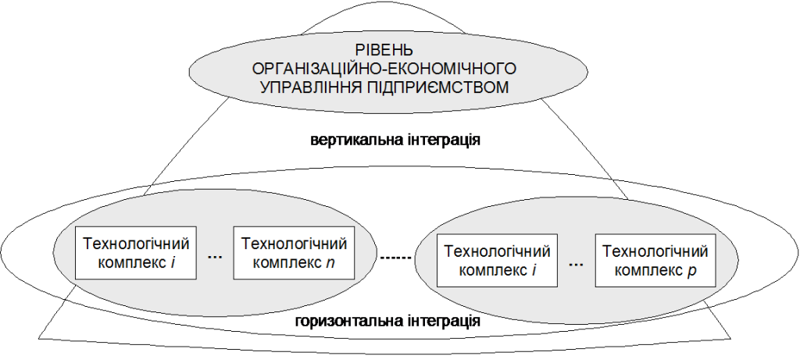
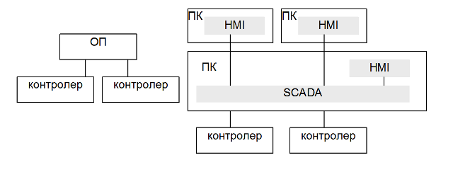
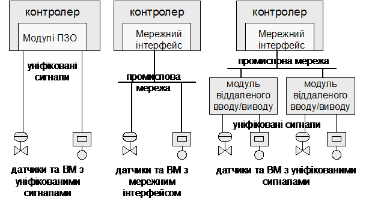
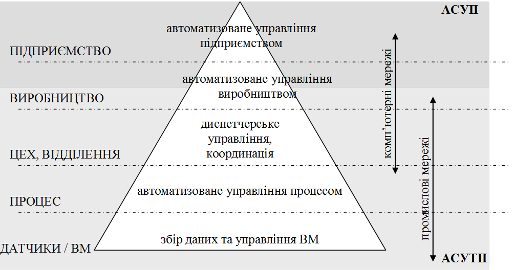

[Промислові мережі та інтеграційні технології в автоматизованих системах](README.md).

# 1. МІСЦЕ ТА РОЛЬ МЕРЕЖНИХ ТЕХНОЛОГІЙ В ІНТЕГРОВАНИХ АВТОМАТИЗОВАНИХ СИСТЕМАХ УПРАВЛІННЯ 

## 1.1. Інтегровані автоматизовані системи управління

Інтеграція – це процес організації окремих компонентів в єдину систему, який забезпечує узгоджену та цілеспрямовану їх взаємодію для досягнення заданої мети. Результатом даного процесу являється інтегрована система. 

В залежності від компонентів та кінцевого функціонального призначення, в області промислової автоматизації розрізняють декілька видів інтегрованої системи. Інтегрована автоматизована система (ІАС) – сукупність двох або більше взаємопов’язаних автоматизованих систем (АС), в якій функціонування однієї з них залежать від результатів функціонування іншої (інших) так, що цю сукупність можна розглядати як єдину автоматизовану систему. Інтегрована автоматизована система управління (ІАСУ) - автоматизована система, в якій комбінуються функції управління технологічними процесами і організаційного управління виробничим підприємством. Тобто ІАСУ – це результат інтеграції АСУТП (автоматизована система управління технологічним процесом) та АСУП (автоматизована система управління підприємством), або модифікації останніх у вигляді корпоративної системи управління бізнес-процесами (КСУБП). Можлива також інтеграція АСУП та АСУЯ (автоматизовані системи управління якістю), АСУП та САПР (системи автоматизованого проектування),  а також інших систем. Інтегрованими також називають КСУБП, маючи на увазі об'єднання матеріальних і фінансових потоків або кількох пакетів програмного забезпечення в один інтегрований пакет прикладних програм для бухгалтерії, кадрових служб, збуту та постачання а також виробництва з центральним фінансовим компонентом. З появою в системах керування комп’ютерів, як основного технічного засобу, з’являється також термін комп'ютерно-інтегровані системи управління (КІСУ). КІСУ – ієрархічно розподілена система, що інтегрує функції управління технологічними та організаційно-економічними процесами підприємства і складається з робочих станцій, об’єднаних у локально-обчислювальні мережі. У зарубіжній літературі аналогічно терміну КІСУ є два терміни CIM (Computer Integrated Manufacturing – комп’ютерно-інтегроване виробництво) та CIP (Computer Integrated Processing – комп’ютерно-інтегрований процес).

Вибір переважного спрямування інтеграції АСУ потребує оцінки ефективності сумісного та узгодженого функціонування локальних автоматизованих систем, а також витрат на забезпечення їх інтеграції. Розрізнюють «горизонтальну» інтеграцію, що потрібна для прийняття рішень на певному рівні управління і «вертикальну», що пов’язана з інтеграцією функцій управління між різними рівнями ієрархії управління. 

Однією з основних функцій горизонтальної інтеграції (рис.1.1.) є забезпечення інформаційної взаємодії між існуючими підсистемами одного рівня. На рівні АСУТП горизонтальна інтеграція передбачає об’єднання між собою АС управління технологічних і виробничих процесів, а також адміністративних відділень виробництва у єдину систему. Це забезпечує необхідний обмін даними у реальному масштабі часу між всіма підрозділами основного і додаткового виробництва. З виробничої точки зору, це означає облік кожного кроку виробничого процесу від прибуття сировини до отримання готової продукції. Це дає змогу вирішити задачу координації роботи окремих технологічних ділянок з метою поліпшення ритмічності виробництва, зменшення втрат, підвищення якості готової продукції та зменшення собівартості. На рівні АСУП горизонтальна інтеграція призначена для об’єднання робочих станцій організаційно-економічного та планового рівня управління підприємством. Це дає змогу координувати дії по постачанню сировиною і необхідними матеріалами основного виробництва, задачі планування збуту, задачі рівномірного завантаження різних ділянок виробництва, задачі планування проведення поточного ремонту і т. ін.

Вертикальна інтеграція призначена для інтеграції систем різного рівня ієрархії управління, наприклад АСУП та АСУТП. Враховуючи, що дані системи працюють для досягнення єдиної мети, наприклад отримання прибутку, їх об’єднання повинно покращити цей процес. 

 Рис.1.1. Напрями інтеграції в автоматизованих системах управління 

Інтегрована АСУ, як і будь-яка автоматизована система характеризується такими основними видами забезпечення: організаційне, інформаційне, математичне,  програмне, алгоритмічне і технічне. Створення ІАСУ передбачає роботи по об’єднанню окремих АС у контексті цих видів забезпечень. Відповідно до видів забезпечення, відносно яких проводиться інтеграція, розрізняють організаційну, функціональну, інформаційну, програмну і технічну інтеграції.

Організаційна інтеграція – раціональне поєднання управлінської діяльності персоналу по всім рівням інтегрованої АСУ і в різних локальних її підсистемах, яке визначає узгодженість управлінських рішень.

Функціональна інтеграція забезпечує єдність локальних цілей функціонування, узгодженість функцій та критеріїв ефективності всіх компонентів. Функціональна інтеграція полягає у розробці загальної функціональної структури всієї системи, декомпозиції системи на функціональні підсистеми. При цьому для всієї системи визначаються загальносистемні функції (задачі), проводиться їх декомпозиція на підфункції (підзадачі) у межах кожної функціональної підсистеми, визначається їх функціональний та інформаційний зв’язки. Процес функціональної інтеграції проводиться з використанням як методів декомпозиції так і агрегатування. Для вирішення загальносистемних функцій, підфункції, що з’являються в результаті декомпозиції поєднуються між собою інформаційними зв’язками. 

Інформаційна інтеграція полягає у створенні умов, за яких можливий доступ до всіх необхідних даних для реалізації функцій системи. Ці дані як правило проходять декілька стадій обробки, в яких приймають участь технічні та програмні засоби. Враховуючи можливість багатокомпонентного складу програмного та технічного забезпечення виникає необхідність в їх інтеграції. Здача інформаційної інтеграції також полягає в узгодженості форматів даних, їх структурування, найменування (ідентифікації) та уніфікації представлення.   

Програмна інтеграція полягає у забезпеченні сумісного функціонування окремих складових програмного забезпечення з метою їх взаємодії. 

Технічна інтеграція полягає у поєднанні технічних засобів для забезпечення збору, передачі та циркуляції технологічної, техніко-економічної та командної інформації між необхідними складовими системи. В ІАСУ технічна інтеграція базується на обчислювальних мережах, які об’єднують програмно-технічні засоби в єдину розподілену обчислювальну систему.  

Основною задачею ІАСУ є реалізація узгоджених рішень на різних рівнях управління для чого необхідно визначити комплекс задач управління, як задач оптимізації за деяким загальним для системи критерієм ефективності функціонування з використанням економіко-математичних моделей управління. Створення принципів та алгоритмів управління є найбільш складною і клопіткою задачею і залежить від типу, специфіки виробництва та підприємства. Тому першим кроком при побудові ІАСУ є процес функціональної інтеграції. 

## 1.2. Функціональна інтеграція

Функціональна інтеграція приводить до створення функціональної структури, визначення загальносистемних функцій (задач), їх декомпозицію на підфункції (підзадачі) у межах функціональних підсистем, синтез існуючих функцій в єдину цільову функцію. Функція автоматизованої системи - сукупність дій АС, спрямованих на досягнення певної мети. Задача автоматизованої системи - функція чи частина функції АС, що є формалізованою сукупністю автоматичних дій, виконання яких приводить до результату заданого виду. 

Результатом функціональної інтеграції мають бути алгоритми оптимального управління підприємством в цілому, однак велика розмірність та складність цієї задачі роблять неможливим її розв’язання без застосування декомпозиційних методів. В той же час, розглядаючи складну задачу як сукупність більш простих декомпозиційних компонентів, в подальшому необхідно інтегрувати ці компоненти в єдиний комплекс. Таким чином методи декомпозиції і інтеграції в ІАСУ застосовують одночасно. 

При створенні ІАСУ розроблюють не тільки моделі і алгоритми вирішення функціональних задач, але і алгоритми зв’язку і узгодження локальних задач. Зв’язки між задачами реалізуються за допомогою зовнішніх обмежень, узгодження локальних критеріїв і моделей локальних задач.

У результаті декомпозиції отримують багаторівневу ієрархічну функціональну структуру, в якій кожна задача верхнього рівня має пріоритет відносно до задач нижнього рівня, а завданнями для задач нижнього рівня є результати розв’язання задачі більш високого рівня. Використання принципів багаторівневої ієрархії приводить до виділення в ІАСУ наступних функціональних рівнів управління. 

1. Рівень управління підприємством (ЕRP – Enterprise Recourse Planning) розглядає задачі перспективного та поточного планування, у розв’язанні яких визначаються інтегральні показники оптимальної виробничої програми і розраховуються календарні плани на квартал, місяць, тиждень. 

2. Рівень управління виробництвом (MES – Manufacturing Execution Systems) відповідає  задачам оперативного календарного планування, у розв’язанні яких спочатку коригуються тижневі календарні плани з урахуванням фактичного виконання виробничої програми, а потім визначаються оперативні завдання на поточну добу з урахуванням різних збурень; 

3. Рівень управління процесом (рівень SCADA), відповідає задачам оперативного керування виробничими комплексами, розв’язання яких забезпечує оптимальну координацію роботи відділень, цехів;

4. Рівень локального управління забезпечує вирішення задач управління технологічним процесом окремої ділянки або відділення, які забезпечують збір і обробку первинної інформації, контроль і регулювання технологічним процесом. 

Нижні рівні (локального управління, управління процесом та частково MES) можна віднести до систем АСУТП, верхні (частково MES, управління підприємством) – до АСУП. 

## 1.3. Інформаційна інтеграція

Виділені в результаті функціональної декомпозиції функції (задачі), поєднуються між собою інформаційними зв’язками. Задача інформаційної інтеграції є забезпечення доступу до необхідних даних для реалізації цих функцій. Таким чином можна сказати, що функції (задачі) поєднуються між собою інформаційними потоками, які забезпечують передачу даних. В інтегрованих автоматизованих системах управління, дані циркулюють по обчислювальним мережам. Тобто функції, реалізовані на різних вузлах об’єднані між собою мережними інформаційними потоками. 

В ідеалі доступ до необхідних даних повинен бути прозорим. Дані можуть використовуватись в декількох функціях, що приводить до необхідності в поєднанні їх в бази даних (БД), що є сукупністю логічно пов’язаних інформаційних елементів, які зберігаються в запам’ятовуючих пристроях. Ввід даних у БД, їх пошук, оновлення та реорганізацію виконує система управління базою даних (СУБД). У той же час інтеграція всіх даних в одну БД, враховуючи їх різний характер, веде до зниження ефективності процедур обробки даних. Тому більш ефективним є створення центральної (для задач керування бізнес-процесами) та локальних (для задач керування технологічними процесами) баз даних, при цьому повинна бути забезпечена сумісність цих БД та доступ до них з необхідних вузлів системи. В деяких системах доцільним є використання розподілених баз даних, де дані зберігаються на декількох вузлах, як локальні копії оригінальних даних. Після оновлення даних в джерелі, інформація копіюється на декілька вузлів системи.  

Особливі вимоги ставляться до складу і кількості інформації та часу її обробки, які є критичними факторами при створенні системи. З одного боку, тільки своєчасне подання необхідної інформації може забезпечити якісне прийняття рішень, а з другого – інформаційні потоки мають бути обмеженими за об’ємом, щоб запобігти перевантаженню їх другорядними надто деталізованими даними. 

Для вирішення задач функціональної та інформаційної інтеграції можна використати різноманітні механізми. В 15-му розділі пропонується два підходи: використання графової та блочної моделі інформаційних потоків, які показують інформаційні взаємозв’язки між функціями, що дає змогу з одного боку графічно продемонструвати інформаційну інтеграцію, а з іншого визначити проблеми інформаційного характеру. 

## 1.4. Технічна та програмна інтеграція

Визначення задач та функцій, які повинна реалізувати автоматизована система є важливим етапом при її створенні. Процес декомпозиції повинен враховувати особливості реалізації кінцевих функцій, тобто особливості вибраної структури системи. Тому процедура декомпозиції поставлених задач на систему на окремі підзадачі носить ітераційний характер. Технічна та програмна інтеграція проводиться з урахуванням специфіки використовуваних засобів та технологій, на яких базується їх робота. Програмно-технічні засоби (ПТЗ), які використовуються в інтегрованих автоматизованих системах управління можна розділити на два класи: ПТЗ рівня АСУТП та ПТЗ рівня АСУП. 

ПТЗ рівня АСУТП, можна класифікувати по функціональному призначенню на:

- засоби людино-машинного інтерфейсу;

- контролери;

- периферійні пристрої;

- програматори/конфігуратори.

З технічної точки зору ПТЗ рівня АСУП є комп’ютери (ПК, сервери) з офісним та спеціалізованим програмним забезпеченням 

Необхідність їх інтеграції в єдину систему диктується функціональними а відповідно і інформаційними зв’язками. Розглянемо це для кожного конкретного типу засобу. 

### 1.4.1. Засоби людино-машинного інтерфейсу

Основним завданням цих засобів є збирання, зберігання, попередня обробка, передача і відображення технологічної інформації (даних процесу) для забезпечення ефективної взаємодії системи управління і оператора.

Технічно вони можуть бути реалізовані як (рис.1.2):

-     термінали та операторські панелі (ОП);

-     автоматизовані робочі місця (АРМ) оператора виконані на базі промислового чи офісного персонального комп’ютера з встановленим спеціалізованим програмним забезпеченням - SCADA/HMI.

Рис. 1.2. Реалізація засобів людино-машинного інтерфейсу в ІАСУ

Термінали та операторські панелі – це мікропроцесорні засоби людино-машинного інтерфейсу (HMI/MMI - Humain/Man Machine Interface), в яких обов’язково присутній хоча б один інтерфейс підключення до цифрової мережі, за допомогою якого відбувається обмін даними з контролерами. На сьогоднішній день функціонально операторські панелі наближаються до ПК зі SCADA/HMI. 

АРМ на базі ПК з виконавчою системою HMI забезпечує відображення та зміну даних, що розміщені на серверах SCADA. Виконавчі системи SCADA (Supervisory Control And Data Acquisition - диспетчерське керування й збір даних) відіграють роль програм-серверів, які забезпечують збір, попередню обробку даних, опосередковану їх зміну та контроль значень (тривоги), ведення архіву та доступ до архівних даних. Таким чином HMI системи повинні мати доступ до даних реального часу, які акумулюються в серверах SCADA. Останні, в свою чергу, доступаються до даних контролерів, периферійних засобів, до інших SCADA, або до інших програмно-технічних засобів. Практично всі сучасні програмні пакети для побудови систем SCADA призначені також для побудови АРМ з функціями HMI, тому вони мають назву SCADA/HMI. Крім того виконавчі системи SCADA та HMI в автоматизованих системах середньої складності як правило виконуються на одному ПК.

Незалежно від типу наведених вище засобів, їх вхідні дані процесу як правило повинні відновлюватись циклічно або періодично, з заданим інтервалом часу. Це обумовлено необхідністю з боку оператора контролю за процесом. У деяких випадках необхідно налаштувати надходження вхідних даних процесу в SCADA тільки при певній події, яка буде визначатись в контролері. Те саме стосується надходження даних з контролерів або з серверів SCADA в HMI. Більшість засобів SCADA/HMI передбачають можливість опитувати дані процесу з різною частотою. Передача даних в зворотному напрямку (SCADA->контролер, HMI->SCADA, ОП->контролер) відбувається, як правило, при зміні їх значень. 

Слід зазначити, що в автоматизованих інтегрованих системах управління може виникнути необхідність в обміні даними між ОП, системами SCADA/HMI у різній їх комбінації.  Тобто програмна та технічна інтеграція для наведених засобів передбачає об’єднання їх з контролерами або периферійними засобами та між собою. В свою чергу SCADA/HMI системи можуть обмінюватися даними з ПТЗ рівня АСУП.

Так як ОП та засоби SCADA/HMI призначені для контролю за даними процесу з боку оператора - це виключає необхідність забезпечення передачі інформації в жорсткому реальному часі. В більшості автоматизованих систем запізнення даних (невчасне їх оновлення) не є аварійно-небезпечним, але сигналізується засобами аварійно-попереджувальної сигналізації (АПС). Таким чином для засобів людино-машинного інтерфейсу виділимо наступні характеристики зв’язку:

- періодичне зчитування даних процесу з контролерів/периферійних засобів;

- запис значень даних процесу при їх зміні;

- м’який реальний час; 

### 1.4.2. Контролери

Пристрої з функціями управління в даному посібнику будемо називати контролерами. Саме в них реалізуються алгоритми управління. До цих пристроїв можна віднести:

- ПЛК - програмовані логічні контролери (PLC - Programming Logical Controller);

- IBM РС-сумісні (PC-base) контролери;

- ОПЛК – ПЛК з вбудованою операторською панелю ОП (ОPLC);

- контролери-регулятори з мережним інтерфейсом.

У якості ПЛК у системах контролю й управління різними технологічними процесами у цей час застосовуються контролери як вітчизняних, так і закордонних виробників. У наведеному переліку до ПЛК також будемо відносити програмовані реле. До IBM РС-сумісних контролерів будемо відносити промислові IBM РС-сумісні ПК, які використовуються для задач автоматичного управління. ПЛК з вбудованими функціями ОП та регулятори з наявним мережним інтерфейсом також будемо відносити до даних засобів.  

Особливістю апаратно-програмних засобів «контролерного» рівня управління заключаються у пред'явленні жорстких вимог до часу їх реакції на зміну даних процесу які поступають від датчиків та видачі управляючих дій на виконавчі механізми. Тобто вони повинні функціонувати в реальному для процесу часі.  

У системах управління контролери повинні обмінюватись даними процесу з периферійними пристроями вводу/виводу, іншими контролерами, програматорами, засобами людино-машинного інтерфейсу, а в деяких випадках і з ПТЗ рівня АСУП. 

Вимоги до реального часу обміну даними процесу між контролерами і датчиками та виконавчими механізмами, які мають цифровий інтерфейс підключення, а також віддаленими модулями вводу/виводу (Remote I/O або Distributed I/O) такі самі як до локальних засобів вводу/виводу. Для цього типу зв’язку характерні такі особливості:

- циклічне (періодичне) відновлення даних на читання та запис;

- забезпечення реального часу;

- можливість прив’язки циклу мережі до циклу контролеру;

- можливість гарячого підключення засобів;  

Цикл мережі, тобто повний цикл опитування та відновлення інформації всіх засобів вводу/виводу, може проходити незалежно від циклу контролера, оскільки обмін даними між мережею і програмою контролера як правило проводиться через буфер обміну. Такий підхід максимально продуктивний, однак не завжди задовольняє вимогам процесу. Для деяких задач необхідна чітка синхронізація робочих циклів мережі і контролера. Тобто на початку циклу мережі опитуються всі засоби вводу, а в кінці відновлюються дані всіх засобів виводу.

Для багатьох процесів управління принциповою є можливість заміни або підключення нових віддалених засобів вводу/виводу в період функціонування мережі, так звана «гаряча заміна».     

При координації роботи декількох контролерів (горизонтальна інтеграція), необхідно побудувати канал зв’язку між ними з такими особливостями комунікаційного обміну:

-     наявність загальної бази даних процесу, яка циклічно (періодично) оновлюється;

-     обмін даними процесу та повідомленнями по запиту;

-     наявність реального часу;

Наявність загальної бази даних процесу або мережних змінних процесу необхідна у випадку коли одні і ті ж дані використовуються багатьма контролерами. Тобто дані процесу, які є джерелом інформації для одного контролера потрібні багатьом іншим контролерам цієї системи. У випадку коли дані необхідно відіслати тільки одному вузлу і тільки при певних подіях, є доцільним організовувати обмін даними по запиту. 

В організації обміну інформацією між контролерами окремо слід виділити системи з «гарячим» резервуванням. В цьому випадку окремий фізичний канал мережі може виділятися для обміну контекстом задачі між основним і резервним процесорними модулями. Інший, спільний для обох процесорів канал, використовується для зв’язку з віддаленими I/O.

Взагалі, для обміну контролерів з іншими засобами можна виділити два типи даних: дані процесу (інформація про значення та стан змінних процесу) та параметричні дані (конфігураційні параметри).   

### 1.4.3. Периферійні засоби: перетворювачі та виконавчі механізми

До цих засобів можна віднести різного роду інтелектуальні (intelligent) датчики та виконавчі механізми, які мають цифровий інтерфейс зв’язку, або засоби розподіленого/віддаленого вводу/виводу (Distributed I/O, Remote I/O). Останні забезпечують перетворення сигналів пристроїв зв’язку з об’єктом (ПЗО) в цифровий вигляд та навпаки та обмінюються даними процесу з процесорним вузлом (контролером). У зв’язку з подорожчанням кабельної продукції, здешевленням мікропроцесорної техніки, гнучкістю та зручністю експлуатації, живучості кінцевої системи – пристрої розподіленого вводу/виводу набувають великої популярності. На рис. 1.3 наведені різні методи підключення периферійних пристроїв до контролерів.

Рис.1.3. Різні методи підключення периферійних пристроїв до ПЛК

На сьогоднішній день існує велика гама пристроїв віддаленого вводу/виводу. Порівняно з технологією передачі уніфікованого сигналу (0-10В, 4-20 мА) цифровий зв’язок дає наступні переваги:

-     менш чутливий до зовнішніх перешкод;

-     дає можливість розширеної діагностики пристрою;

-     дає можливість змінювати конфігурацію у реальному часі без зупинки роботи управляючої програми;

-     дає можливість будувати системи з мережею без виділеного ведучого вузла.

Конфігурування польових периферійних пристроїв може проводитись за допомогою спеціальних засобів – конфігураторів, або безпосередньо самим контролером. 

Слід зазначити, що мережі з реалізацією обміну між польовими вузлами без виділеного ведучого виключають наявність контролера шини в комунікаційному процесі, а отже - підвищують надійність системи. Однак така можливість доступна тільки для деяких промислових мереж. Слід зазначити, що на відміну від автоматизованих систем управління технологічними процесами (АСУТП) в системах управління інтелектуальними будівлями та будинками (системи SMART HOUSE та BMS – Building Management Systems) використання інтелектуальних датчиків та приводів є скоріше правилом ніж виключенням. 

Окремо необхідно виділити засоби управління приводами (POWER DRIVE SYSTEMS – PDS). До них відносяться частотні перетворювачі, сервоприводи та приводи з позиціонованням. Ці засоби, крім своїх основних функцій – управління двигунами, нерідко включають також функції контролера, людино-машинного інтерфейсу та функції вводу/виводу. Все що стосується особливостей обміну даними для вище наведених типів периферійних засобів, може бути актуальними і для PDS. З’єднання по цифровому зв’язку з PDS дає такі переваги:

- отримання всієї інформацію про стан привода та двигуна;

- повне управління приводом та двигуном;

- віддалене та швидке конфігурування системи приводу;

- менша витрата інформаційного кабелю порівняно зі зв’язком за уніфікованим сигналом 4-20мА/24В; 

- віддалена діагностика привода;

- можливість безпосереднього обміну між приводами. 

Особливості обміну даними периферійних засобів з контролерами, засобами людино-машинного інтерфейсу наведені вище, з конфігураторами – розглянуті в пункті 1.4.4. Взагалі, дані для обміну з периферійними засобами умовно можна поділити на два типи: дані процесу (інформація про значення та стан каналів вводу/виводу) та параметричні дані (конфігураційні параметри).   

### 1.4.4. Програматори/конфігуратори

В якості програматорів/конфігураторів можуть використовуватись або комп’ютери з встановленим спеціальним програмним забезпеченням або спеціалізовані пристрої. Незалежно від технічної реалізації засобів цього типу, вони необхідні лише для налаштування роботи інших ПТЗ в системі та їх діагностики. Програматори мають інтерфейс для підключення до мережі, який використовується тільки при необхідності перепрограмування або переконфігурування. Виділимо такі характеристики зв’язку:

-     підключення до системи тільки при необхідності;

-     спеціально виділений логічний канал зв’язку;

-     наявність команд на запис конфігурації, діагностики, зупинки, рестарту і інше.;

-     низька пріоритетність повідомлень;

-     можливість гарячого переконфігурування системи зв’язку;  

В зв’язку з особливістю використання даних засобів, для них є доцільним резервувати окремий логічний канал, який при будь якій дійсній конфігурації системи буде вільним. Інакше можливе виникнення ситуації неможливості переконфігурування пристрою, внаслідок задіяння всіх можливих каналів, що є неприпустимим. Крім того, протокол мережі повинен бути забезпечений функціями запису конфігурації, діагностики, управлінням станом пристрою, тощо. 

Процес конфігурації одного вузла мережі, не повинен заважати її нормальному функціонуванню. Можливість гарячої заміни програми, або її частини, без зупинки роботи системи є одним із основних показників ефективності програмно-технічного комплексу. Низька пріоритетність повідомлень дає можливість не заважати реальному часу обміну між іншими вузлами на тій самій мережі.

Програматори/конфігуратори в основному оперують конфігураційними або іншими словами параметричними даними. Винятком є режим відладки, коли наладчику необхідно спостерігати та змінювати дані процесу. Слід зазначити, що параметричні дані на засоби вводу/виводу як правило пустапають не безпосередньо з конфігураторів, а через ведучий вузол мережі –контролер.    

### 1.4.5. Програмно-технічні засоби рівня АСУП

Як вже зазначалося програмно-технічними засобами рівня АСУП є комп’ютери. На сьогоднішній день для програмного забезпечення цього рівня в області ІАСУ найбільш популярною апаратною платформою є IBM-PC сумісні комп’ютери з ОС WINDOWS. 

Програмне забезпечення інтегрованих автоматизованих систем управління на рівні АСУП можна умовно віднести до однієї з наступних груп:

-     універсальні та спеціалізовані СУБД;

-     системи рівня MES

-     системи рівня ERP;

-     офісне програмне забезпечення.

Під універсальними СУБД будемо розуміти сучасні програмні пакети для роботи з базами даних, призначених для широкого застосування. Спеціалізованими СУБД будемо вважати ті програмні пакети, які призначені для збору та обробки даних в області АСУТП. Спеціалізовані СУБД мають жорсткіші вимоги до реального часу і до надійності. 

Всі програмні пакети, які призначені для роботи на організаційно економічному рівні підприємства, за винятком стандартних офісних програм, будемо називати системами рівня ERP. 

Обмін даними між засобами АСУП, а також засобів АСУП з АСУТП можна охарактеризувати такими характеристиками:

- відновлення даних по запиту;

- відсутність реального часу;

- необхідність в обміні великими обсягами різнорідної інформації; 

- великий обсяг даних для загального доступу;

Для підведення підсумку по інформаційній взаємодії між вузлами ІАСУ, зведемо загальні характеристики такого обміну в таблицю (таб1.1). На перетині рядків та колонок вказуються характеристики інформаційного обміну між ПТЗ вказаному в найменуванні рядків та колонок. Для компактності введені скорочення. 

Таблиця 1. Наявність та характеристика інформаційного зв’язку між ПТЗ в ІАСУ

|           | SCADA/HMI                                                    | контролери  (PLC)                                            | периферійні засоби (RIO)                                     | програма тори/ конфігуратори (PG)                            | ПТЗ рівня АСУП (АСУП)                                        |
| --------- | ------------------------------------------------------------ | ------------------------------------------------------------ | ------------------------------------------------------------ | ------------------------------------------------------------ | ------------------------------------------------------------ |
| SCADA/HMI | періодичне зчи-тування даних процесу  SCAD/HMI<-SCADA;  запис значень процесу SCADA/НMI  ->SCADA по запиту;  м’який реальний час; | періодичне зчиту-вання даних процесу  SCAD/HMI<-PLC;   запис  значень процесу SCADA/НMI -> PLC по  запиту;  м’який  реальний час; | циклічне (періодичне) зчитування даних процесу SCAD/HMI<-RIO;   запис значень процесу   SCADA/НMI  -> RIO по запиту;    м’який  реальний час | підключення  до SCADA тільки при необхідності за-ливки файлів вико-нання (параметричних  даних); наявність команд діагнос-тики, зупинки, ре-старту виконавчої системи; | доступ даних SCADA  по запиту;  відсутність реаль-ного часу;  необхідність в агрегуванні та накопиченні інформації  SCADA; |
| PLC       |                                                              | наявність загальної бази даних процесу, яка циклічно (періодично)  оновлюється; обмін даними  процесу та повідомленнями по запиту;  наявність реального часу; | циклічне (періодичне) відновлення даних процесу на  читання та запис;  забезпечення реального часу; можливість  прив’язки  циклу мережі до циклу контролеру; мож-ливість  гарячого підключення засобів; | підключення до  ПЛК тільки при необхідності;  наявність спеціально виділеного каналу зв’язку;  наявність команд на запис конфігурації (параметричні  дані), діагности-ки, зупинки, рестарту і інше.;   низька пріори-тетність повідом-лень (парметричних  даних); можливість гарячого переконфігурування системи зв’язку; | як правило не  використовується                              |
| RIO       |                                                              |                                                              | можливе тільки при наявності інтелекту в RIO з  можливістю програмування | аналогічно  RIO<->PLC                                        | як правило не використовується                               |
| PG        |                                                              |                                                              |                                                              | може  використовуватись для проектування з декількома розробниками | спеціалізоване  ПО для розробки може підключатися до АСУП тільки при необхідності заливки  файлів виконання; |
| АСУП      |                                                              |                                                              |                                                              |                                                              | відновлення даних по запиту;  відсутність реального часу;  необхідність в обміні великими обсягами різнорідної  інформації;   великий  обсяг даних для загального доступу; |

## 1.5. Обчислювальні мережі в ієрархії ІАСУ

Як видно з попередніх підрозділів, необхідність інтеграції різнорідного обладнання приводить до великої кількості даних (процесу та параметричних), що циркулюють між засобами, їх багаторазової обробки, перетворення та зберігання для подальшого аналізу. На сьогоднішній день технології інформаційної, технічної та програмної інтеграції базуються на цифрових технологіях з використанням обчислювальних мереж. Тобто інтегроване виробництво сьогодні – це єдина система, що являє собою об’єднання різнотипних мікропроцесорних вузлів з використанням обчислювальних мереж. Розглянемо один із варіантів ієрархічної моделі ІАСУ підприємства, який наведений на рис.1.4.

Рис. 1.4. Обчислювальні мережі в інтегрованих автоматизованих системах управління.

 Для об’єднання вузлів на вищих 3-х рівнях використовуються обчислювальні мережі, які об’єднують ПК та РС-сумісні станції. Такі комунікації базуються на комп’ютерних мережах. На нижніх рівнях управління (цех, відділення, процес, датчики та ВМ) використовуються цифрові комунікації, які об’єднують засоби управління АСУТП. У зв’язку з функціональними та технічними особливостями призначення даних комунікацій, вони базуються на інших типах мереж, які прийнято називати промисловими мережами.

У даному навчальному посібнику розглядаються технології інформаційної, технічної та програмної інтеграції, які використовуються в інтегрованих автоматизованих системах управління: промислові мережі (розділи 2-11) та технології міжпрограмного зв’язку (розділи 12-14).  

<-- [ВСТУП](vstup.md) 

--> 2. [ЗАГАЛЬНА ХАРАКТЕРИСТИКА ПРОМИСЛОВИХ МЕРЕЖ](2.md)

## Контрольні запитання до розділу 1.

1.   Посніть необхідність інтеграції автоматизованих систем.

2.   Назвіть основні види інтегрованих автоматизованих систем. З яких підсистем вони складаються і для чого проводиться інтеграція?

3.   Яке призначення горизонтальної інтеграції на рівнях АСУП та АСУТП?

4.   Яке призначення вертикальної інтеграції в ІАСУ?

5.   В контексті яких видів забезпечення проводиться інтеграція? У чому заключається їх інтеграція?

6.   В чому полягає процес функціональної інтеграції?

7.   В чому полягає процес інформаційної інтеграції?

8.   В чому полягає процес програмної та технічної інтеграції?

9.   Перерахуйте основні програмно-технічні засоби ІАСУ та поясніть необхідність в їх інформаційному обміні. Яке призначення та основні відмінності між даними процесу та параметричними даними?

10.            Прокоментуйте особливості інформаційного зв’язку між різними ПТЗ в ІАСУ.

11.            Яким чином організовується зв’язок між програмно-технічними засобами на різних рівнях управління ІАСУ?  

