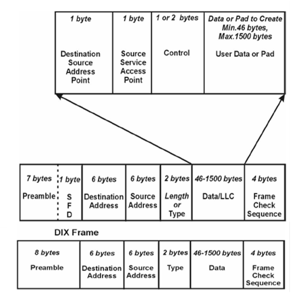

[Промислові мережі та інтеграційні технології в автоматизованих системах](README.md). 10. [ПРОМИСЛОВИЙ ETHERNET](10.md)

## 10.1. Мережі Ethernet

### 10.1.1. Загальні поняття

#### 10.1.1.1. Походження. 

Технологія і перші стандарти Ethernet були розроблені компанією Xerox Corporation. Пізніше група компаній DEC, Intel і Xerox сумісно розробили стандарт під назвою DIX, який явився другою версією свого попередника (Ethernet ІІ). Ще через деякий час подібний стандарт був розроблений інститутом IEEE (Інститут інженерів з електротехніки і радіоелектроніки), який є законодавцем в області стандартів на локальні комп’ютерні мережі. Цей стандарт називається IEEE 802.3 і має деякі відмінності у формуванні кадру порівняно з форматом Ethernet ІІ. На сьогоднішній день мережними картами Ethernet як правило підтримуються обидва стандарти. В якості доступу до шини використовується метод CSMA/CD, який розглянутий в другому розділі. Для адресації вузлів в мережі використовується 48-бітний (6 байт) ідентифікатор, який називається МАС-адресою. 

IEEE використовує відмінну від ISO OSI ієрархічну мережну модель. Тому канальний рівень OSI представлений підрівнями LLC та MAC. MAC-рівень описаний в IEEE 802.3, а LLC в IEEE 802.2. Архітектура Ethernet показана на рис.10.1. 

 

Рис.10.1. Стандарти нижніх рівнів мереж Ethernet

#### 10.1.1.2. Фізичний рівень. 

На фізичному рівні Ethernet дозволяє використовувати різноманітні середовища передачі даних для кожної з яких є стандартна назва виду XBaseY, де X - бітова швидкість в Мбіт/с (10,100,1000...), Base – ключове слово (позначає немодульовану передачу), Y – умовне позначення середовища передачі і дальності зв’язку. Раніше як правило використовувався коаксіальний кабель та шинна топологія, однак в сучасних реалізаціях Ethernet частіше зустрічається кабель типу "вита пара" або оптоволоконний і топологія типу "зірка", інколи використовується з’єднання типу точка-точка. У центрі зірки може бути концентратор (хаб – hub) або комутатор (switch). В табл.10.1 показані стандарти мереж Ethernet на фізичному рівні.

Таблиця 10.1 Стандарти мережі Ethernet

#### 10.1.1.3. Використання витої пари. 

При використання витої пари пристрої підключають через роз’єми типу RJ-45. На пристроях використовують вилки, а на кабелях – розетки. Призначення контактів роз’єму мережного адаптеру (порт типу MDI) показане в табл. 10.2. Під’єднання в мережу вузлів проводиться за допомогою спеціальних пристроїв – концентраторів та комутаторів. 

Рис.10.2. Призначення контактів роз’єму RJ-45.

Порти  концентраторів  мають тип MDIX, в яких сигнали Rx та Tx поміняні місцями. Таким чином, при підключені пристрою з MDI (мережна карта) до MDIX (концентратор/комутатор) використовується "прямий кабель" (рис.10.3.а), а при безпосередньому підключенні двох MDI – "перехресний кабель" (рис.10.3б).

 Рис.10.3. Схеми підключень пристроїв мережі Ethernet

Схема "прямого" та "перехресного" кабелю показана на рис.10.4 (a – пряме, б – перехресне).  

   

В телекомунікаційних пристроях (комутаторах та концентраторах) один з портів може використовуватись з перемикачем MDI-MDIX або може існувати додатковий роз’єм для підключення його до концентратора/комутатора верхнього рівня (up-link). На сьогоднішній день комутатори як правило підтримують автоматичне визначення типу підключеного кабелю (Auto-MDI/MDI-X) і тому не потребують додаткового порту up-link.

#### 10.1.1.4. Концентратори (hub). 

У найпростішій схемі мережі 10BaseT центральний елемент зірки представляє собою активний елемент, який називається хабом (hub) або концентратором. Кожна станція з’єднується з ним двома витими парами – для прийому і для передачі. Він також має функції повторювача. Хоч фізично така схема представляє собою зірку, логічно вона являється шиною, адже передача кожної станції приймається усіма іншими станціями, що може призводити до колізій при одночасній передачі. Концентратори можуть об’єднуватись в ієрархічну структуру із головного та проміжних хабів. Концентратори в комп’ютерних мережах на базі Ethernet практично вже не використовуються, однак в промислових мережах вони знайшли своє застосування (наприклад CC-Link IE Field).

#### 10.1.1.5. Комутатори 2-го рівня (switch L2).

Комутатори 2-го рівня (layer 2 switch) працюють по іншому принципу. Кадр, який приходить на комутатор по одному порту, направляється тільки в той порт до якого підключений вузол-приймач. Тобто комутатори 2-го рівня аналізують кадр, та по МАС-адресі приймача визначають куди необхідно його направити. Відбувається комутація між портами, тобто створюється канал, який не заважає створювати такі самі канали між іншими портами. Це в свою чергу виключає можливість колізії, тому немає необхідності в використанні алгоритму CSMA/CD. Поява таких комутаторів дала можливість працювати в дуплексному режимі, що значно збільшило ефективність роботи Ethernet. В дуплексному режимі використовується такий же формат кадру МАС-стандарту.

За способом передачі кадрів комутатори діляться на:

-  store-and-forward (з проміжним збереженням)– комутатор отримує з вхідного каналу весь кадр, аналізує його на наявність помилок і у випадку їх відсутності відправляє кадр на вихідний канал отримувача;

-  cut-through (сквозний) – комутатор починає відправляти дані у вихідний порт призначення відразу, як тільки визначить МАС адресу отримувача, тобто без очікування кінця передачі та аналізу цілісності отриманого кадру; 

Вибір того, чи іншого комутатора залежить від протоколів верхніх рівнів, що базуються на Ethernet. Перший тип комутаторів працює більш повільно, однак відкидає пошкоджені кадри вже в момент їх отримання. 

Сучасні комутатори 2-го рівня можуть надавати ряд додаткових сервісів. Наприклад це комутатори з підтримкою технології VLAN, виділення пріоритетних портів, додаткова MAC фільтрація, IGMP snooping (потребує додаткової обробки на мережному рівні). Такий тип комутаторів потребує конфігурування, тому отримали назву керовані комутатори (managed switches). Для конфігурування та керування керованими комутаторами можуть надаватися різні типи сервісів, наприклад WEB, SNMP.  

#### 10.1.1.6. Auto-negotiation. 

На сьогоднішній день більшість телекомунікаційних пристроїв підтримують технологію Auto-negotiation (авто-переговори), що дозволяє автоматично налаштувати оптимальний зв’язок між пристроями. В момент ініціалізації зв’язку (при включенні або підключенні пристрою в мережі), по спеціальному протоколу пристрої домовляються про швидкість передачі та тип з’єднання (дуплекс/напівдуплекс). Авто-переговори дають можливість відмовитись від ручного налаштування мережних карт. Однак слід зазначити, що для використання технології авто-переговорів, всі вузли які зв’язуються, повинні її підтримувати, інакше можлива втрата кадрів або взагалі відсутність обміну.

#### 10.1.1.7. Структуровані кабельні системи (СКС). 

Повсякмісне використання Ethernet в офісних будівлях, призвело до необхідності організації робочих місць розетками для підключення комп’ютерів до мережі. Таким чином при проектуванні виникала потреба в правильному плануванні кабельної системи будівлі, що включала в себе всі телекомунікаційні ланцюги (комп’ютерна мережа, телефон, аудіо, відео тощо). В результаті сумісної роботи комітетів ISO та IEC виник стандарт ISO/IEC 11801 на організацію універсальних структурованих кабельних системи (СКС) в офісних приміщеннях. 

### 10.1.2. Структура кадру

#### 10.1.2.1. DIX Ethernet ІІ та IEEE 802.3. 

Нагадаємо, що на сьогоднішній день існує два формати кадрів Ethernet. Це пов’язано з тим, що в той час, коли організація IEEE розвивала стандарти для локальних мереж, DIX Ethernet вже широко використовувався. Мета IEEE полягала у тому, щоб розвинути стандарти та правила, які були б базовими для всіх типів обчислювальних мереж так, щоб обмін даними був можливий між різними типами мереж (Ethernet та Token Ring). Оскільки це було потенційно небезпечним для існуючих впроваджень Ethernet, правила обробки для "нового" і "старого" формату були різними. С тих пір існує відмінність між кадрами DIX Ethernet та IEEE 802.3, хоч обидва називаються –  Ethernet. 

Кадри DIX та IEEE 802.3 ідентичні по кількості та довжини полів (рис.10.5) . Єдина відмінність заключається в змісті полів та їх інтерпретації станціями, які відправляють та отримують кадри. Враховуючи це, будь яка станція може відправити будь який з цих кадрів. 

Проаналізуємо структуру кадрів. З рис. 10.5 видно що відрізняється структура преамбули, однак наповнення та інтерпретація цієї частини буде однаковою. Поля адреси призначення та адреси відправника однакові і призначені для адресації за допомогою МАС-адреси. 

Призначення поля – довжина/тип (які також називаються EtherType) дещо відрізняються в стандартах. Для DIX це поле описує тип PDU вищого рівня (мережного), який переноситься даним кадром. Наприклад 80016 вказує, що кадр використовується для пакету IP. В кадрі IEEE 802.3 дане поле використовується як для вказівки типу PDU, так і для опису довжини кадру. Якщо значення цього поля < 60016, воно вказує на довжину поля даних, а в іншому випадку на тип протоколу даних. 

 

Рис.10.5. Структура кадрів IEEE 802.3 та DIX

Оскільки канальний рівень в стандартах IEEE включає підрівень LLC, поле даних в IEEE 802.3 включає частину, яка відноситься до IEEE 802.2. 

####  10.1.2.2. IEEE 802.1Q та VLAN. 

Для підтримки керованих мостів та комутаторів IEEE випустила додатковий стандарт 802.1Q. Стандарт IEEE 802.1Q – забезпечує незалежний від виробника спосіб реалізації віртуальних мереж VLAN (Virtual bridged Local Area Network) за рахунок виділення частини портів комутатора в незалежні групи перемикання. Це дозволяє менеджеру мережі призначити окремі групи портів незалежним віртуальним мережам. Розділення між віртуальними мережами проходить по виділеним для цього полям кадру (рис.10.6). На відміну від стандартного кадру IEEE 802.3, після адреси відправника вставляються додаткові 4 байти: 2 байти TPID та два байти TCI.  

Поле TPID – це ідентифікатор протоколу. Призначення цього поля заключається в ідентифікації даного кадру, як особливого (тегового). Зустрічаючи такий кадр комутатори або мости, які підтримують додаткові можливості 802.1Q почнуть обробляти його по особливому алгоритму. Для Ethernet значення цього поля 810016. Поле  TCI – вміщує інформацію для управління теговим кадром. Перші три біти вміщують інформацію про пріоритетність кадру, яка базується на 8-ми рівнях CoS (Class of Service, 0-7, 7-й – самий пріоритетний) описаних в IEEE 802.1p. Останні 12 біт ідентифікують віртуальну мережу VLAN (0-4095) для якої призначений даний кадр. 

Рис.10.6. Структура кадрів IEEE 802.3 з розширенням IEEE 802.1Q

Кадри VLAN можуть одночасно функціонувати з стандартними кадрами IEEE 802.3 та DIX. Використання VLAN потребує керованих елементів мережної інфраструктури - керовані мости, керовані комутатори, тощо.  

<-- 10. [ПРОМИСЛОВИЙ ETHERNET](10.md)

--> 10.2. [Протоколи рівня ІР](10_2.md)  
