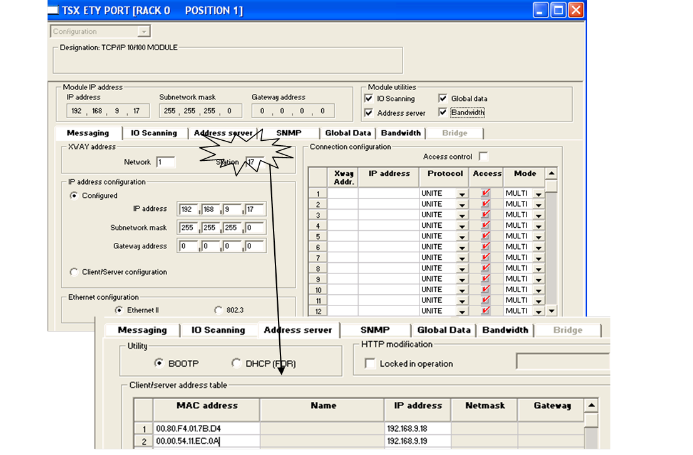

[Промислові мережі та інтеграційні технології в автоматизованих системах](README.md). 10. [ПРОМИСЛОВИЙ ETHERNET](10.md)

## 10.2. Протоколи рівня ІР

### 10.2.1. Протокол ІР

ІР (Internet Protocol) – протокол мережного рівня, який в основному служить для маршрутизації пакетів між мережами. Принципи маршрутизації наведені в другому розділі. Коротко розглянемо його функціонування та супутні протоколи.

На сьогоднішній день існує дві версії протоколу ІР: IPv4 та IPv6. Хоч остання версія більш перспективна, поки що як правило користуються IPv4, тому надалі буде розглядатися тільки цей протокол. Для адресації пристроїв відправників та отримувачів використовуються унікальні 32-бітні (4-байтові) ІР-адреси. На сьогоднішній день використовують безкласову адресацію: для завдання адреси використовується пара IP-адреса + 32-бітна маска. По масці сутність рівня ІР виділяє підмережі. Наприклад: 192.168.1.2 – адреса вузла, а 255.255.255.0 – маска. У цьому випадку 192.168.1 – підмережа, а 2 – адреса вузла в цій підмережі. 

Однак IP-дейтаграма упаковується в кадр канального рівня, тому канальний рівень на вузлі отримувача не зможе визначити, що кадр призначений саме йому. Якщо, скажімо, на нижніх рівнях використовується Ethernet, а на мережному ІР, то мережна карта в кадрі буде розпізнавати МАС-адресу, а не ІР-адресу отримувача, адже остання призначена для адресації в інтермережах. Тому для ідентифікації вузла-отримувача МАС адресою по його ІР-адресі використовуються спеціальні алгоритми, наприклад ARP.  

Слід зазначити, що IP-заголовок, який добавляється на мережному рівні, крім адрес відправника та отримувача, вміщує додаткову інформацію. Так, для управління пріоритетами IP-пакетів служить поле ToS (Type of service), яке може бути використане в промислових мережах. 

### 10.2.2. Протокол ARP

Коли ІР-сутність мережного рівня отримує завдання від верхніх рівнів на пересилку певних даних, вона аналізує задану адресу ІР вузла отримувача. Якщо вузол отримувача знаходиться в тій самій підмережі що і даний вузол, необхідно визначити Ethernet МАС-адресу отримувача по його ІР-адресі. Одне з рішень – зберігати в системі файл з таблицею відповідності. Однак при збільшенні кількості вузлів у системі такі таблиці збільшуються, що призводить до необхідності дописування записів у ці таблиці. Крім того зміна мережної карти або ІР-адреси вузла теж приводить до зміни таблиці. 

Для автоматичного визначення МАС-адреси по ІР-адресі існує ARP-протокол (Address Resolution Protocol). Його функціонування розглянемо на прикладі. Коли вузлу-відправнику (вузол1) необхідно реалізувати поставлену вище задачу він у широкомовному режимі відправляє пакет з запитом ідентифікації MAC-адреси вузла по його ІР. Цей пакет буде отриманий усіма вузлами, а вузол з запитуваним ІР (вузол2) підтвердить запит зі своєю МАС-адресою. Знаючи МАС-адресу, вузол1 вказує отриману адресу в кадрі Ethernet як адресу отримувача. 

Для зменшення навантаження на шину, вузол може зберігати адреси у вигляді таблиці відповідності в ARP-кеші, записи якого старіють через декілька хвилин після відновлення і вилучаються. Крім того при завантаженні вузла він відправляє свій ІР+МАС іншим машинам, а ті записують його в свій ARP-кеш. Для перегляду власної ARP таблиці можна в командному рядку Windows вказати: >> ARP - а  

### 10.2.3. Протоколи BOOTP та DHCP.

Інколи виникає задача при завантаженні вузла отримати його ІР-адресу і конфігураційні настройки автоматично з іншого вузла-серверу, який зберігає ці настройки (автоматичне налаштування IP). Особливо це актуально для систем розподіленого вводу/виводу з використанням Ethernet TCP/IP. На сьогоднішній день для цього використовуються технології BOOTP та DHCP. 

У протоколі BOOTP (Bootstrap Protocol) клієнт (якому необхідний ІР) відсилає широкомовне UDP-повідомлення з запитом на отримання ІР-адреси по своїй МАС-адресі. На BOOTP-сервері повинна бути налаштована таблиця відповідності МАС-ІР, тому отримавши такий пакет, сервер відішле даному вузлу-клієнту пакет, в якому вкаже його ІР, маску підмережі та ІР-адресу вузла, де знаходиться образ пам’яті вузла-клієнта. 

Недоліком протоколу BOOTP є необхідність обов’язково конфігурування на BOOTP-сервері таблиці відповідності. Тому альтернативою до нього став протокол DHCP (Dynamic Host Configuration Protocol – протокол динамічної настройки хостів), який дозволяє настроювати таблиці адрес як вручну так і автоматично. Принципи функціонування подібні до BOOTP-протоколу, однак DHCP-сервер може і не знати про існування вузла з конкретною МАС-адресою. У цьому випадку, при запиті DHCP-клієнта на отримання ІР адреси, DHCP-сервер виділяє цю адресу з пула адрес (виділеного діапазону) і надає клієнту на певний час (час аренди). Через певні проміжки часу (приблизно половина часу аренди), клієнт надсилає запит на продовження використання виділеного ІР, тим самим продовжуючи час аренди. 

Приклад 10.1. Промисловий Ethernet. Налаштування Ethernet в системах Schneider Electric. 

Завдання. Створити конфігурацію для комунікацій Ethernet пристроїв, показаних на схемі рис.10.7, якщо:

-     PLC1 має статичну ІР адресу;

-     PLC2 (МАС=00.80.F4.01.7B.D4) отримує ІР адресу з  PLC1 по протоколу BOOTP;

-     RIO1 (MAC=00.00.54.11.EC.0A) отримує ІР адресу з PLC1 по протоколу BOOTP;

Рис.10.7. Структурна схема системи до прикладу 10.1. 

Рішення. Інтегрований порт PLC1 налаштовується в процесі конфігурування ПЛК у програмному середовищі PL7 або Unity PRO (рис.10.8). Оскільки адреса ІР є статичною, вказуємо її у відповідному полі вкладки Messaging. Маску підмережі вказуємо як 255.255.255.0. Шлюз вказувати немає необхідності, так як використовується тільки локальне з’єднання. Тип Ethernet (DIX Ethernet II або IEEE 802.3) вибирається в залежності від комунікаційного обладнання, наприклад комутатора. Конфігурація BOOTP-сервера виконується шляхом завдання таблиці відповідності МАС-адрес та ІР-адрес згідно поставленій задачі (рис.10.8).

 Рис.10.8. Настройка порту Ethernet в ПЛК Premium

Для ПЛК2, на вкладці Messaging виставляється опція Client/Server configuration, що вказує на необхідність для ПЛК2 отримання ІР адреси з BOOTP-серверу. Після переконфігування ПЛК2, він отримає свою ІР-адресу у відповідності до своєї МАС.

Для комунікаційного модуля RIO1 - STB NIP 2212 – необхідність в отриманні ІР адреси по МАС виставляється поворотним перемикачем на модулі (позиція BOOTP).

### 10.2.4. Протокол IGMP та IGMP-snooping

IGMP – це протокол управління груповою передачею даних в мережах, що базуються на протоколі ІРv4. Він використовується маршрутизаторами та ІР вузлами для об’єднання мережних пристроїв в групи. Для цього ІР-адреси для багатоадресної розсилки зарезервовані і призначаються з діапазону адресів з 224.0.0.0 по 239.255.255.255. Кожній групі багатоадресної розсилки відповідає одна ІР-адреса з цього діапазону. Тобто вузли, що будуть входити в цю групу, будуть отримувати дані по єдиній груповій адресі. Для функціонування IGMP необхідно, щоб маршрутизатор та вузли підтримували цей протокол. Про членство вузлів в групах повідомляють самі вузли, а стан членства періодично перевіряється маршрутизаторами, які підтримують багатоадресну розсилку. 

Для запобігання широкомовної ретрансляції комутаторами 2-го рівня багатоадресного трафіку, створеного сервісами IGMP, ряд з них підтримують функцію IGMP snooping. Ця функція заключається в тому, що отримавши запит про підключення/відключення вузла до IGMP-групи, комутатор включає/виключає його порт в/з список членів цієї групи. Як бачимо, комутатори з такою функціональністю забезпечують маршрутизацію не тільки на канальному рівні а і на мережному.  

### 10.2.5. Методика NAT-трансляції

 Коли корпоративний клієнт хоче підключитися до Internet, то кожному вузлу в даній корпорації необхідно виділити унікальну в мережі Internet адресу. Однак ІР адреса – це дефіцитний ресурс, тому виділити великий діапазон адрес доволі проблематично. Для вирішення цієї проблеми використовують метод трансляції мережної адреси NAT (Network Address Translation). Сервіси NAT доступні вузлу або програмі, яку називають NAT-проксі (може бути суміщений з іншими типами прокі-серверів). Всередині корпорації кожному вузлу виділяється довільна ІР-адреса із діапазону так званих приватних або локальних ІР-адрес. Наведемо три діапазони зарезервованих ІР-адрес:

   10.0.0.0 – 10.255.255.255; 

   172.16.0.0 – 172.31.255.255;

   192.168.0.0 – 192.168.255.255.

Коли пакет з вузла-відправника поступає в Інтернет через NAT-проксі, останній замість його ІР адреси вставляє єдину ІР адресу для всієї корпорації. Таким чином, коли вузол-отримувач в Інтернеті відправить відповідь, його пакет надійде саме до NAT-проксі. Тобто всі вузли в межах NAT-проксі з точки зору Інтернет будуть мати одну адресу – адресу NAT-проксі. Для того, щоб той зміг перенаправити пакети потрібному вузлу в корпорації, він веде таблицю, в якій зберігає допоміжну інформацію про відправлені пакети. Дана методика базується на використання портів TCP та UDP, які будуть описані нижче.

Приведемо спрощену схему функціонування NAT.

Наприклад вузол відправник (вузол1) в межах корпорації має ІР 192.168.2.4. Прикладна програма Internet Explorer надсилає пакет на WEB сервер вузла в Інтернеті (вузол2) з ІР адресою 194.24.24.24. При цьому, Internet Explorer на рівні ТСР формує клієнтський порт TSAP=2265, а звертається відповідно до 80 порту (WEB сервер). Пакет буде з параметрами:

ІРвідправника=192.168.2.4,  ІРотримувача=192.24.24.24,  TSAPвідправника=2265, 

​                    TSAPотримувача=80.

NAT-блок (ІР=194.24.1.1) створює запис з номером 4567 (вибраний довільно), в який записує:

Запис=4567,     ІРвідправника=192.168.1.1,     TSAPвідправника=2265.

Після цього в пакеті замість номера порту відправника записується номер запису в таблиці TSAP=4567, а ІР відправника змінюється на ІР NAT-проксі ІР=194.24.1.1. Таким чином в Інтернет відправиться пакет з параметрами:

ІРвідправника=192.24.1.1,   ІРотримувача=192.24.24.24,  TSAPвідправника=4567,  

 TSAPотримувача=80.

Вузол2 (ІР=192.24.24.24) сформує відповідь у вигляді:

ІРвідправника=192.24.24.24, ІРотримувача=192.24.1.1, TSAPвідправника=80, 

TSAPотримувача=4567.

Отримавши такий пакет NAT-блок знаходить в своїй таблиці запис з номером, який дорівнює TSAPотримувача=4567, вилучає всі поля і формує запит до вузла1:

ІРвідправника=192.24.24.24, ІРотримувача=192.168.2.4, TSAPвідправника=80, 

TSAPотримувача=2265.

Для вузла1 і вузла2 ця операція проходить прозоро. Однак такий метод економії ресурсів ІР адрес має свої недоліки, зокрема:

-    така схема працює тільки для протоколів ТСР та UDP, для інших необхідно пропонувати інші рішення;

-    деякі прикладні програми вставляють свої ІР в поле даних, що приводить до їх невірної роботи (FTP, H.323 – ІР-телефонія).

<-- 10.1. [Мережі Ethernet](10_1.md)  

--> 10.3. [Протоколи транспортного рівня ](10_3.md)  
