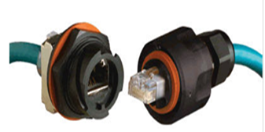
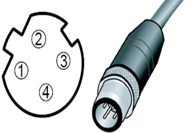
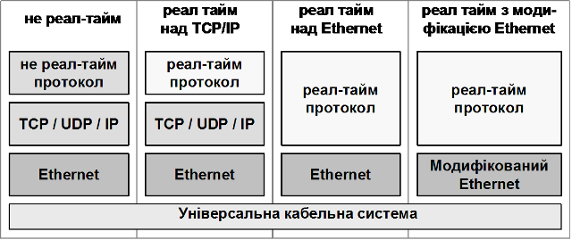
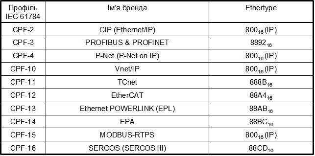
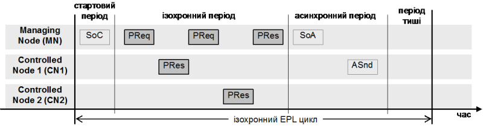
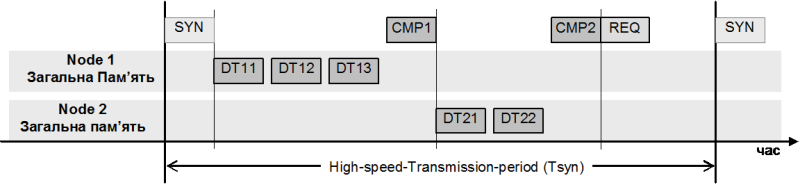
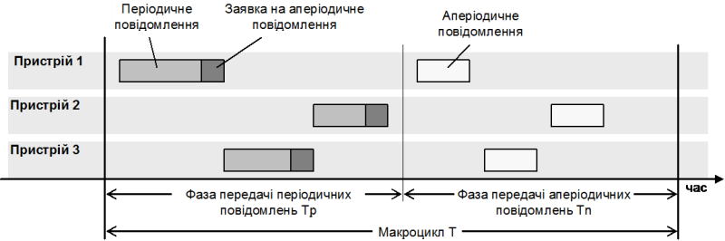
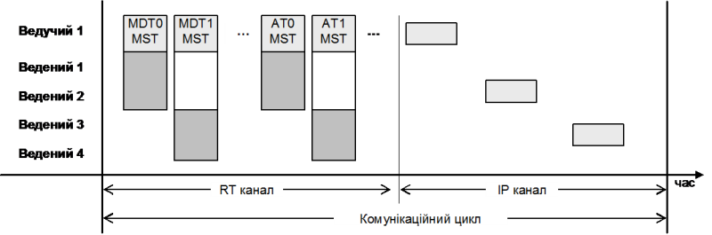
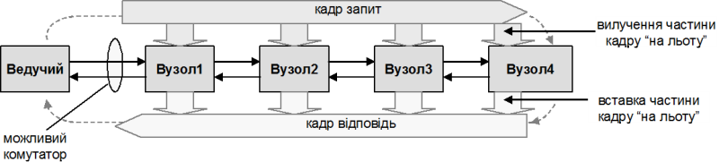
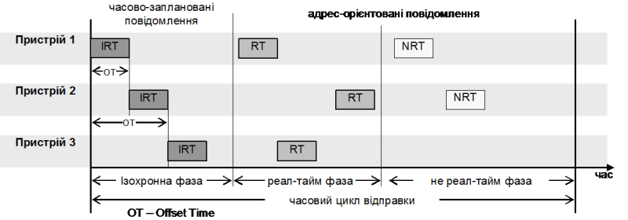

[Промислові мережі та інтеграційні технології в автоматизованих системах](README.md). 10. [ПРОМИСЛОВИЙ ETHERNET](10.md)

## 10.4. Промисловий Ethernet

### 10.4.1. Кабельні системи промислового виконання

#### 10.4.1.1. Необхідність промислового виконання.  

Використання Ethernet у промисловій автоматизації привело до необхідності прокладки кабелів та розміщення мережного обладнання (концентратори, комутатори, мости, тощо) в промислових умовах експлуатації. Різні організації пропонували свої рішення в цьому напрямку під загальною назвою Industrial Ethernet. Ці рішення базуються на використанні особливих матеріалів та конструкції мережних елементів, а також кабельної структури. 

#### 10.4.1.2. З’єднувачі промислового виконання. 

З Серед найбільш вразливих місць кабельної структури звичайного Ethernet в промислових умовах експлуатації є використання з’єднання на базі RJ-45, що не підходить для промислового виконання, оскільки не задовольняє вимогам до умов експлуатації. Деякими організаціями в якості варіанту для кабельних систем промислового Ethernet пропонується використання модифікованого RJ-45, де з’єднання захищається герметичними ізолюючим корпусом (рис.10.5). Ще одним рішенням є заміна RJ-45 іншими типами з’єднувачів. В промисловості найкраще себе зарекомендували з’єднувачі типу М12, які мають ступінь захисту ІР67, а також стійкі до вібрацій та можуть працювати в широких температурних діапазонах. Для промислового Ethernet використовується 4-піновий варіант з’єднувача М12 з D-кодуванням (рис.10.6). Слід зазначити, що використовується тільки 2 виті пари замість 4-х. 

Рис.10.9. Модифіковані RJ-45 з’єднувачі

Рис.10.10. 4-піновий М-12 з’єднувач 

#### 10.4.1.3. Стандарти побудови СКС промислового виконання. 

Для інтеграції систем управління виробництвом у загальну систему управління підприємством необхідно щоб кабельні системи промислового Ethernet входили у структуровані кабельні системи (СКС) підприємства. Загальні підходи до побудови СКС промислових будівель залишаються такими ж, однак відмінність умов експлуатації та специфіки побудови промислових систем автоматизації привела до появи стандарту ISO/IEC 24702. Стандарт розроблений з урахуванням наступних особливостей:

-        великі розміри території обслуговування поряд з дуже низькою (по офісним міркам) густиною розміщення розеток для підключення кінцевого активного обладнання;

-        складна електромагнітна обстановка;

-        жорсткі умови навколишнього середовища (кліматичні показники, механічні і хімічні впливи);

-        відсутність технічної необхідності у масовому застосуванні мережних пристроїв зі швидкостями передачі інформації вище 100 Мбіт/с;

-        потреба в підключенні до інформаційної системи контролерів, комутаторів, перетворювачів частоти та інших активних пристроїв, розміщених на різних рухомих механізмах;

-        висока ймовірність застосування активного обладнання для побудови різнорідних промислових мереж;

Таким чином  стандарти ISO/IEC 11801 та ISO/IEC 24702 описують можливі структури та мінімальну конфігурацію для прокладки СКС, вимоги до реалізації, продуктивності кабельних ліній, відповідності та процедур верифікації. Вимоги до планування кабельних ліній та їх монтаж визначаються стандартом ISO/IEC TR 14763-2 (Створення та експлуатація кабельних систем приміщень замовників. Частина 2. Планування та монтаж). 

Згідно ISO/IEC 11801 та ISO/IEC 24702 для СКС промислового виконання дозволяється використовувати конектори IEC 60603-7-x, IEC 61076-3-106 (варіанти 1 та 6) , 61076-3-117 (варіант 14) та IEC 61076-2-101 (4-х піновий М12 з D-кодуванням). В якості середовища передачі замість звичайних UTP кабелів рекомендують використовувати екрановані.

### 10.4.2. Real Time Ethernet

#### 10.4.2.1. Умови для роботи Ethernet на рівні промислових мереж.  

Для функціонування Ethernet як промислової мережі, не є достатнім тільки промислове виконання мережних компонентів. До промислового Ethernet рівня датчиків та рівня контролерів висуваються такі саме вимоги та функції, як для інших промислових мереж (див. розділ 2), а саме:

Функції:

1. Обмін даними процесу в реальному часі.

2. Програмування та конфігурація вузлів.

3. Діагностика вузлів.

4. Управління станом вузла.

5. Функції резервного переключення між вузлами мережі.

Вимоги:

1. Властивість детермінованості.

2. Завадостійкість та промислові умови експлуатації.

3. Надійність та живучість.

4. Простота, зручність інсталяції та обслуговування.

5. Можливість подачі живлення по кабельній системі мережі.

6. Вільна топологія.

#### 10.4.2.2. Забезпечення реального часу – рішення RTE в стандартах МЕК. 

Серед найбільш суттєвих недоліків класичного Ethernet є використання методу CSMA/CD, який виключає можливість повної детермінованості. З появою комутованого Ethernet, метод CSMA/CD вже не використовується для мереж, інфраструктура яких включає комутатори. Однак звичайні комутатори не забезпечують виділення реал-тайм повідомлень як високо пріоритетних і не можуть гарантувати своєчасну доставку даних. Крім того, при великому обсязі даних для передачі, вхідні буфери комутаторів можуть переповнятися, що може привести до втрати даних, що не припустимо. 

На сьогоднішній день є ряд рішень використання Ethernet в якості промислової мережі, в яких наведені вище проблеми та ряд інших вирішуються різними шляхами. Ці рішення доповнилися і модифікувалися організацією МЕК та увійшли до стандарту IEC 61784-2 під загальною назвою Ethernet реального часу - Real Time Ethernet (RTE). При розробці стандарту враховували щоб нові рішення, крім вимог до реального часу, одночасно б підтримували найбільш популярні протоколи, такі як TCP/IP, HTTP та FTP для легкої інтеграції польових засобів в єдину систему управління підприємством. Іншими словами мережі RTE, які визначені IEC 61784-2, повністю сумісні з існуючими системами на базі Ethernet TCP/IP і можуть функціонувати на одній і тій самій кабельній структурі. 

#### 10.4.2.3. Показники робочих характеристик RTE. 

Кожне з RTE рішень, що увійшло в IEC 61784-2, має переваги перед іншим в тій чи іншій області використання. Для можливості вибору кінцевим користувачем тієї чи іншої технології, кожна з них характеризується фіксованим набором показників робочих характеристик (Performance Indicators RTE). Цими показниками характеризуються як можливості самої мережі, так і можливості вузлів та прикладних Процесів на RTE. Перші визначені стандартом, а останні виробниками обладнання. Слід зазначити, що більшість із показників робочих характеристик є взаємозалежними. Перерахуємо основні характеристики.

1. Час доставки (Delivery time) – максимальний час, який необхідний для доставки даних від одного прикладного Процесу до іншого, включаючи всі затримки в мережі. Вказуються дві величини: максимальний час доставки при відсутності помилок, та при одній помилці з повторенням передачі.   

2. Кількість RTE вузлів (Number of RTE end-stations) – максимальна кількість вузлів на мережі. 

3. Базова мережна топологія (Basic network topology) – одна, або комбінація із топологій: ієрархічна зірка, кільце, лінійна.  

4. Кількість комутаторів між кінцевими станціями (Number of switches between RTE end-stations) – максимально можлива кількість комутаторів між кінцевими станціями.  

5. Пропускна здатність для RTE (Throughput RTE) – загальна сума APDU даних в октетах/секунду (байт/секунду) , що може бути передана на один зв’язок.   

6. Ширина не-RTE смуги (Non-RTE bandwidth) – ширина смуги пропускання, яка може бути виділена під не-RTE обмін (для обміну типами сервісів, які не відносяться до даного рішення RTE, наприклад WEB, FTP, тощо.) Додатково визначається загальна ширина смуги пропускання. Показники Throughput RTE та Non-RTE bandwidth взаємозалежні.

7. Точність часової синхронізації (Time synchronization accuracy) – максимальне відхилення між годинниками двох будь-яких вузлів.

8. Точність не часово-базової синхронізації (Non-time-based synchronization accuracy) -  максимальний час тимчасового відхилення в мережі періодичного синхроімпульсу, на якому базуються періодичні операції.  

9. Час резервного відновлення (Redundancy recovery time) – максимальний час, який потрібний для повного відновлення операційного режиму після одиночного збою системи.  

####  10.4.2.4. Класи RTE мереж.  

Для полегшення вибору RTE системи, всі рішення в залежності від вимог до реального часу умовно поділяються на три класи:

1. Низький клас швидкості, для систем людино-машинного інтерфейсу. Характеризується порівняно низькою періодичністю обміну даними (порядку 100 мс), що задовольняє вимогам процесів відображення та супервізорного управління. Така швидкість може бути досягнута використовуючи стандартні протоколи TCP/IP.

2. Середній клас швидкості, для систем управління технологічним процесом (рівень ПЛК). Детермінований час обміну порядку 10 мс. Такі вимоги можуть бути досягнуті шляхом використання спеціальних протоколів та високошвидкісного надійного обладнання.

3. Високий клас швидкості, для управління рухом (системи позиціювання): для синхронізації декількох осей по мережі з часовим циклом менше 1мс необхідно щоб джиттер (час нарощування біту) не перевищував 1 мкс. Це може бути досягнуто тільки на мережах з бітовою швидкістю>100 Мбіт/с, модифікацією мережного обладнання та протоколом доступу до середовища.       

На рис.10.11 показані структури стеків протоколів для різних рішень. Загальне для всіх рішень – це використання спільної кабельної інфраструктури. Для побудови реал-тайм рішень використовуються три різні підходи. У першому підході (над TCP/IP) використовується прикладний протокол реального часу, який використовує протоколи TCP/UDP/IP. Другий підхід (над Ethernet) передбачає використання поряд з протоколами TCP/IP протоколів реального часу, які доступаються безпосередньо до Ethernet. Третій підхід (модифікація Ethernet) передбачає заміну комунікаційного обладнання Ethernet для забезпечення взаємодії деяких вузлів в мережі між собою в реальному часі. Слід нагадати, що всі підходи передбачають нормальне функціонування всіх інших (не реал-тайм) вузлів системи та їх протоколів на тій самій кабельній інфраструктурі.

 

Рис.10.11. Стеки протоколів різних рішень Industrial Ethernet

### 10.4.3. Рішення RTE над TCP/IP

#### 10.4.3.1. Modbus RTPS. 

Одне з реал-тайм рішень поверх TCP/IP – це вдосконалений Modbus TCP/IP. Протокол прикладного рівня Modbus а також його реалізація з використанням TCP/IP описана в розділі 6. Його можна віднести до самого низького по швидкості класу, який як правило задовольняє вимогам функціональності для ЛМІ а також низькошвидкісний клас задач обміну між ПЛК та польовими засобами рівня датчиків. В стандартах IEC 61784-2 та IEC 61158 додатково до даного протоколу добавлені нові реал-тайм розширення, які описані в протоколі Real-Time Publisher Subscriber (RTPS). RTPS протокол забезпечує дві основні комунікаційні моделі: модель Видавець-Підписувач обміну ідентифікованими даними; Composite State Transfer (CST) protocol, передача інформації про стан змінної від записувача до зчитувача. 

Нагадаємо, що передача даних процесу від Видавця до одного або декількох Підписувачів називається публікацією. Властивості публікованих об’єктів описують зміст, тип і якість (наприклад часовий інтервал) виданого потоку в мережу. Підписувач визначає мінімальний час між послідовністю видань. Це впливає на максимальну швидкість, при якій підписувач готовий отримувати видання. Протокол RTPS розроблений для функціонування поверх ненадійного транспортного протоколу UDP, для якого корисне повідомлення вміщується в межах однієї дейтаграми UDP/IP. На відміну від стандартного протоколу MODBUS, протокол RTPS не знайшов широкого застосування. Навіть серед засобів Schneider Electric, для яких MODBUS є рідним протоколом,  RTPS розширення використовується тільки в TSX Premium, Quantum та M340 для обміну між ПЛК (Сервіс Global Data). Слід зазначити, що розширення RTPS дають можливість виконання роботи середнього класу швидкості.

#### 10.4.3.2. ETHERNET/IP. 

EtherNet/IP який визначений Rockwell і підтримується Open DeviceNet Vendor Association (ODVA - [www.odva.org](http://www.odva.org/)) та ControlNet International ([www.controlnet.org](http://www.controlnet.org/)), використовує Common Interface Protocol (CIP), який є загальним для мереж EtherNet/IP, ControlNet, DeviceNet та CompoNET. Комунікаційна технологія EtherNet/IP забезпечує реал-тайм з’єднання на основі  ISO/IEC 8802-3 та IEEE 802.1Q. В дуплексному Ethernet (на базі комутаторів) немає затримок із-за колізій. Однак в пристрої комутації різні Ethernet кадри можуть бути затримані, якщо вихідний порт вже зайнятий для передачі іншого кадру. Це може привести до недетермінованих затримок, які неприпустимі в реал-тайм Ethernet. 

Для розділення реал-тайм від не реал-тайм з’єднаннь у EtherNet/IP застосовується концепція віртуальних мереж VLAN, яка визначена стандартом IEEE 802.1Q. Для реал-тайм кадрів у полі Priority (рис.10.7) виставляється найвищий пріоритет, що дозволяє керованим комутаторам передати їх перед не реал-тайм повідомленнями. Детальніше з EtherNet/IP та іншими CIP мережами можна ознайомитись в розділі 2. 

#### 10.4.3.3. P-NET on IP. 

Ця специфікація запропонована датським національним комітетом та призначена для використання в IP-орієнтованих мережах. Вона дозволяє використовувати реал-тайм зв’язок P-NET інкапсульований в UDP/IP-пакети. Ідея функціонування даної мережі заключається в прозорості маршрутизації пакетів в будь якому напрямку як через IP мережі так і через інші типи P-NET мереж. Кожний P-NET кадр має два P-NET-route елемента, побудованих як таблиця із адреси відправника та отримувача. В простому випадку мережі – це адреси вузлів мережі. Для можливості передачі по IP, ці таблиці розширені для включення IP-адреси. Для вузлів P-NET, IP-адреси – це звичайні адреси, тільки в іншому форматі. Це означає, що будь який P-NET клієнт може доступитися до сервера на IP мережі, не інтерпретуючи формат IP адреси. Функціонування самої мережі Ethernet залишається без змін, оскільки P-NET взаємодіє через протокол UDP.  

#### 10.4.3.4. VNET/IP. 

Vnet/IP розроблений Yokogawa для систем DCS середніх та великих масштабів, з можливістю передачі великих обсягів даних з періодичністю порядку 100 мс, при умові використання гігабітного Ethernet. Дане рішення дозволяє одночасно функціонувати на Ethernet реал-тайм та не реал-тайм трафіку за рахунок застосування 3-х прийомів: планування передачі, управління пріоритетами та високошвидкісна відповідь.  

Планування передачі запобігає одночасну відправку даних декількома станціям одночасно, що б привело до переповнення буферів комутаторів. Для цього весь час ділиться на макроцикли тривалістю 100 мс, в межах якого всі станції гарантовано відправлять свої дані з дискретністю виділеного для них тайм-слоту (1 мс). Для управління пріоритетністю повідомлень даних процесу перед не реал-тайм даними, в ІР-пакеті використовується поле ToS з 4-ма рівнями привілеїв (розглянуте вище), яке підтримується буферами станцій на мережі, а також може бути підтримане комутаторами.  Для передачі даних процесу використовується стек протоколів UDP/IP, що дозволяє значно зменшити час передачі порівняно з TCP. Обмін даними процесу функціонують на базі моделі Видавець-Підписувач. 

### 10.4.4. Рішення RTE поверх Ethernet

#### 10.4.4.1. Загальні концепції функціонування RTE поверх Ethernet. 

Ідея використання реалізацій даного типу заключається в безпосередньому використанні Ethernet та визначені в кадрі Ethernet спеціального типу протоколу (поле EtherType). Нагадаємо, що стандартний тип протоколу для ІР – це Ethertype = 800h. Дані RTE протоколи поряд зі стеком протоколів TCP/IP використовують свої стеки, ідентифіковані з їх власним типом протоколу. Таблиця 10.3 вказує перелік значень Ethertype для різних протоколів. 

Таблиця10.3 Значення Ethertype для різних протоколів

#### 10.4.4.2. ETHERNET POWERLINK. 

Ethernet Powerlink (EPL) був визначений Bernecker+Rainer (B&R), і тепер підтримується Ethernet Powerlink Standardisation Group (EPSG -  [www.ethernetpowerlink.org](http://www.ethernetpowerlink.org/) ). 

Мережа базується на використанні системи планування на загальному сегменті Ethernet, яка називається Slot Communication Network Management (SCNM). Одному з вузлів мережі дають права Керуючого Вузла – Managing Node (MN), який слідкує за розподілом часу між вузлами. Він гарантує доступ у режимі реал-тайм до циклічних даних і резервує часові слоти для не реал-тайм кадрів (TCP/IP). Всім іншим вузлам, які називаються Керовані Вузли - Controlled Nodes (CN), відправляти і отримувати запити дозволяється тільки з дозволу Керуючого.

Загальний час обміну складається з ізохронних комунікаційних циклів, які поділені на періоди. На початку циклу Керуючий Вузол в широкомовному режимі відправляє групові Start-of-Cycle (SoC) кадри (рис.10.8). Час відправки і отримання цього кадру є базовим для загальної синхронізації всіх вузлів. Далі, у межах цього часу циклу функціонують періоди: Стартовий, Ізохронний (Isochronous – через однакові інтервали часу), Асинхронний (Asynchronous – не прив’язаний до синхросигналу) та додатковий період простою (Idle). Довжина індивідуальних періодів може змінюватися в межах заданого періоду циклу EPL. 

В Ізохронний період циклу, в режимі точка-точка, кожному зконфігурованому і активному вузлу відправляється спеціальний кадр-запит Poll-Request (PReq). Вузол, до якого звертаються, відповідає широкомовним кадром – відповіддю Poll-Response (Pres). За рахунок чітко визначених інтервалів часу запиту в мережі забезпечується ізохронний режим відновлення необхідних даних. 

Рис.10.12. Організація циклу EPL

В Асинхронний період циклу, доступ до EPL сегменту мережі може бути наданий одному CN або MN для передачі єдиного асинхронного повідомлення. Привілейованими для асинхронних повідомлень є протоколи UDP/IP. Кадр типу Start-of-Asynchronous (SoA) – перший кадр в асинхронний період. Цей кадр є сигналом для всіх CNs про те, що всі ізохронні дані були передані. 

Так побудована організація обміну на базі мережі Ethernet виключає можливість одночасної передачі ізохронних та асинхронних повідомлень, що регламентує повну детермінованість. Для правильного функціонування Ethernet Powerlink, необхідно виділити окремий "захищений" сегмент, в якому будуть присутні тільки EPL вузли. Інакше сторонній вузол зруйнує SCNM-механізм доступу. Для зв’язку з "незахищеними" сегментами в Керуючі Вузли включають функції маршрутизації.

Прикладний рівень EPL базується на стандартах CANopen. Інтеграція EPL з CANopen дозволяє використовувати профілі, забезпечити високошвидкісний обмін даними та відкритий і прозорий зв’язок з TCP/UDP/IP протоколами. Профілі пристроїв визначають об’єкти PDO та SDO, які передаються по ізохронному EPL зв’язку, а SDO – по UDP/IP протоколу. Таким чином на EPL мережі використовуються базові CANopen профілі пристроїв, номенклатура яких на сьогоднішній день дуже велика.  

#### 10.4.4.3. TCnet. 

TCnet (Time-critical Control Network) – пропозиція від Toshiba. Подібно Ethernet Powerlink, мережний час, який називається High-speed-Transmission період, складається з реал-тайм (Timecritical) циклічного сервісу/обслуговування даних і спонтанного (Sporadic) сервісу відправки  повідомлення. Реал-тайм циклічний сервіс функціонує на одному сегменті мережі, і може бути описаний моделлю обміну ідентифікованими даними Видавець-Підписувач. 

На початку періоду High-speed-Transmission всім RTE-TCnet вузлам у широкомовному режимі відправляється спеціальне синхронізуюче повідомлення SYN. Після отримання SYN-кадру, вузол з номером 1 починає відправляти кадр даних, який запланований у процесі конфігурування системи. Після завершення передачі цих кадрів, вузол 1 у широкомовному режимі відправляє кадри типу Completed Message (дивись CMP1 на рис 10.13). Після цього свої кадри передає вузол 2, і т.д. Кожний вузол може тримати право передачі протягом заданого часу і повинен віддати це право наступному вузлу в межах цього часу. Таким чином в межах періоду High-speed-Transmission відбувається маркерний метод доступу до шини Ethernet.

Вузол, що отримав маркер може відіслати як циклічні так ациклічні повідомлення. Циклічна передача даних розділена на High, Medium та Low-Speed циклічну передачу. При отриманні права передачі кожний вузол встигає принаймні передати Highspeed циклічні дані. Якщо термін дозволеного часу не вичерпався, відправляються Medium та Low-Speed повідомлення. Таким чином, час відновлення для High-speed повідомлень рівний часу SYN, а Medium-speed або Low-speed повідомлення передаються через декілька SYN-кадрів. 

Рис.10.13. Організація циклу Tsyn

Сервіси прикладного рівня RTE-TCnet базуються на моделі Видавець-Підписувач з загальною пам’яттю (Common Memory). Загальна мережна пам’ять є віртуальною загальнодоступною пам’яттю розподіленою між прикладними процесами вузлів TCnet окремими блоками різної величини. Для кожного блоку даних один з вузлів являється Видавцем, який публікує їх в період циклічного обміну. Кожен вузол отримує блок даних як Підписувач і відновлює свою локальну копію загальної пам’яті. Це значить, що кожний контролер може швидко отримати доступ до даних один одного, звертаючись до своєї локальної копії.

#### 10.4.4.4. EPA. 

EPA протокол (Ethernet for Plant Automation) є пропозицією Китайських виробників і належить торговій марці ZHEJIANG SUPCON CO. LTD.

В EPA загальний мережний час складається з макроциклів, які позначаються літерою T (рис.10.14). Кожний макроцикл розділений на дві частини: фаза передачі періодичного повідомлення (Tp) і фаза передачі неперіодичних повідомлень (Tn). Остання частина періодичного повідомлення кожного пристрою може вміщувати заявку на передачу неперіодичного повідомлення, яка реалізується на фазі передачі неперіодичних повідомлень. 

 Рис.10.14. Організація макроциклу EPA

В EPA системах є два види прикладних Процесів, які можуть виконуватися паралельно в одній системі: реал-тайм EPA прикладні функціональні блоки і не реал-тайм TCP/IP прикладні Процеси. Обмін даними між функціональними блоками проводиться шляхом поєднання їх вхідних/вихідних параметрів, використовуючи EPA прикладні сервіси. 

#### 10.4.4.5. PROFINET CBA. 

PROFINET визначений декількома виробниками  (включаючи Siemens) та підтримується міжнародною організацією PNO. На сьогоднішній день визначені два типи RTE рішень для PROFINET: PROFINET CBA для мереж рівня контролерів та PROFINET IO для мереж рівня датчиків. Тут розглянемо функціонування CBA.

Для PROFINET CBA доступні два типи сервісів: передача не-реал тайм (NRT) та реал-тайм (RT) повідомлень. NRT повідомлення призначені для обміну параметричними та іншими даними прикладних Процесів, що базуються на TCP/IP.  Час передачі NRT повідомлень порядку 100 мс. 

Для передачі реал-тайм даних процесу використовуються сервіси RT. RT протокол базується на спеціальному типі Ethertype і використовує пріоритетні повідомлення VLAN аналогічно EtherNet/IP. При обміні даними в одній мережі, APDU безпосередньо передаються кадром Ethernet без використання транспортного та мережного протоколів, що значно зменшує витрати на передачу (менше 10 мс). При обміні даними між вузлами різних мереж та при мультиадресній передачі, додатково використовується стек UDP/IP.   

### 10.4.5. Рішення RTE з модифікацією Ethernet

#### 10.4.5.1. Загальні концепції функціонування RTE з модифікацією  Ethernet. 

Типова кабельна топологія Ethernet – це зірка, при якій всі пристрої підключаються до центрального комутуючого пристрою. Для промислових мереж найбільш популярними стала шинна топологія, що зменшує вартість кабельних ліній. Таким чином Real-Time Ethernet рішення повинні врахувати шинну або кільцеву топологію зі зменшенням витрат прокладки кабелю. 

У промислових мережах набуло популярності з’єднання типу daisy-chain – "ланцюжок", коли всі пристрої поєднуються в шину або кільце шляхом послідовного підключення мережних пристроїв (видима лінійна топологія або кільце). Щоб організувати таке з’єднання  з комутованим (дуплексним) варіантом Ethernet, необхідно вбудувати комутатори в усі пристрої. Більшість рішень, які забезпечують жорсткі реал-тайм сервіси базуються на певних модифікаціях в апаратних засобах мережної інфраструктури (комутатори, концентратори або мости). Модифікації обов’язкові для всіх пристроїв в межах сегменту RTE, однак дозволяють не реал-тайм кадрам передаватись без модифікацій.

#### 10.4.5.2. SERCOS. 

Промислова мережа SERCOS (SEriell Real time COmmunication System Interface, [www.sercos.org](http://www.sercos.org/)) описана в стандарті IEC 61491 і більш відома як інтерфейс CNC (Computer(ized) Numerical(ly) Control(led)). Пізніше цей стандарт був приєднаний до стандарту IEC 61158/IEC 61784 (SERCOS I, SERCOS II), а також до рішень на базі Ethernet, як SERCOS III. 

В системі SERCOS III виділяється одна станція з правами Ведучого та до 254 станцій з правами Ведених. Кожен вузол має по два порти Ethernet, за допомогою яких організовується лінійна топологія або кільце. Жодний вузол у фізичній структурі, окрім останнього, не може бути зв’язаний з загальними комутаторами. Зв’язок між сусідніми станціями може проходити тільки безпосередньо. Останній вузол в ланцюжку може бути під’єднаний до комутатора для зв’язку з пристроями через TCP/IP або UDP/ІР.

В SERCOS III комунікаційний обмін складається з логічних каналів зв’язку: канал реал-тайм (RT) та не реал-тайм (IP). Цикл зв’язку ініціюється Ведучим і вміщує до 4-х Master Data Telegrams (MDT) та 4-х Device Telegrams (AT acknowledge ) як у каналі RT так і в IP.  

Телеграми MDT передаються Ведучим і отримуються кожним Веденим (рис.10.15). Вони містять інформацію про синхронізацію, записи даних про  інформацію управління, сервісні дані каналу та значення команди, які відсилаються кожному Веденому.  

Телеграми AT передаються Ведучим як пустий кадр з наперед визначеними полями, але без інформації. Кожний Ведений вставляє свої дані в асигновані для нього поля цього кадру. В межах своїх полів Ведені передають інформацію статусу, сервісні дані, фактичні значення каналу як Ведучому так і іншим Веденим. Кількість та довжина телеграм даних MDT та AT встановлені відповідно до конфігурації, яка також визначена протягом ініціалізації. 

Рис.10.15. Організація циклу в SERCOS

IP телеграми є стандартними не реал-тайм повідомленнями, які можуть використовуватися для будь-якої цілі і навіть можуть бути опущені. Тривалість ІР каналу має встановлене значення і визначає максимальну кількість IP телеграм, які можна відправити протягом цього часу. 

Ця послідовність передачі RT та IP телеграм повторюються на кожному комунікаційному циклі. Тривалість кожного циклу вибирається з ряду: 31,25; 62,5; 125; 250; n250 (до 65000) мкс. Часові інтервали для каналів RT, IP та часу передачі АТ передані протягом ініціації, і тому відомі кожному Веденому. У кожному пристрої та спеціалізованому ПЗ на мережі необхідне розділення каналів RT від IP. 

Система SERCOS складається з контролера та одного або декількох приводів (PDS), які циклічно обмінюються даними. Цей обмін включає передачу статусу та фактичні значення від приводу до контролера та  передачу команди і заданого значення від контролеру до приводу. Функціональні можливості PDS визначаються способом зміни різноманітних параметрів у моделі. 

#### 10.4.5.3. ETHERCAT. 

EtherCAT визначений Beckhoff і підтримується EtherCat Technology Group (ETG see also [www.ethercat.org](http://www.ethercat.org/)). Дана технологія використовує Ethernet кадри та відправляє їх по спеціальній кільцевій топології.

Для управління доступом до середовища передачі використовується технологія Ведучий/Ведений, де Ведучий вузол (наприклад контролер) відправляє кадри Ethernet Веденим вузлам, які вилучають дані з кадрів та вставляють свої дані в ці кадри.

В EtherCAT всі вузли об’єднуються в кільце (рис.10.16). Ведучий зв’язаний з одним із відкритих кінців, або безпосередньо з пристроєм, або через комутатор Ethernet. Тобто кадри передаються від Ведучого до першого Веденого, потім до наступного і так далі, поки кадр не дійде до останнього Веденого. Той повертає кадр зворотнім шляхом.  

З точки зору Ethernet, сегмент EtherCAT – єдиний пристрій Ethernet, який приймає та відправляє стандартні ISO/IEC 8802-3 Ethernet кадри. Однак це може бути і багато Ведених пристроїв, які обробляють кадри, що поступають до них з боку вхідних каналів, вилучаючи призначені їм дані та вставляючи в кадр свої дані. Таким чином останній пристрій в ланцюзі сегменту відправляє назад повністю оброблений кадр. Цей кадр, досягнувши першого Веденого, відправиться Ведучому як кадр відповіді. 

Рис.10.16. Організація циклу ETHERCAT

Щоб досягати максимальної продуктивності, кадри Ethernet повинні бути оброблені "на льоту". Це значить, що вузол обробляє та ретранслює повідомлення наступному вузлу на лінії, як тільки повідомлення починає прийматися. Це значить, що вузли ретранслюють кадри ще до їх повного отримання. 

Для реалізації таких вузлів необхідний спеціальний чіп ASIC для доступу до середовища, який інтегрує двопортовий комутатор у фактичний пристрій. 

Вузли мають адресовану пам’ять, яка може бути доступна для послуг читання чи запису для кожного вузла послідовно, чи до декількох вузлів одночасно. Декілька телеграм EtherCAT можуть бути вкладені в межах кадру Ethernet. Кожна телеграма звертається до секції даних як до набору змінних пам’яті (наприклад входи чи виходи). 

Телеграми EtherCAT транспортуються безпосередньо в області даних кадру Ethernet або в межах секції блоку даних протоколу UDP, який транспортується через IP. Перший варіант обмежений одною підмережею Ethernet, так як зв’язані кадри не передаються маршрутизаторами. Для управління вузлами це як правило не є обмеженням. Декілька сегментів EtherCAT можуть бути зв’язані з одним або декількома комутаторами. Для передачі даних між іншими сегментами використовується MAC адреси першого Веденого в сегменті EtherCAT. Другий варіант призначений для менш критичних за часом застосувань, в якому кадри можуть бути маршрутизовані. 

Якщо використовується тільки реал-тайм трафік, час циклу може тривати 30 мкс. Максимальна одиниця передачі Maximum Transmission Unit (MTU) в Ethernet кадрі з 1514 байтами на бітовій швидкості 100Мбіт/с в не реал-тайм часі міг би збільшити цикл до 200-250 мкс. Однак в EtherCAT телеграми Ethernet поділені на частини і повторно збираються у вузлі призначення перш ніж ретранслюватися на пристрій, пов’язаний з вузлом. Ця процедура не обмежує досяжний час циклу, так як розмір фрагментів може бути оптимізований згідно доступної ширини смуги. Таким чином EtherCAT при передачі не-реал тайм повідомлення використовує свій спосіб фрагментації, який відмінний від фрагментації ІР. Цей метод дозволяє будь-якому пристрою EtherCAT приймати участь в нормальному трафіку Ethernet та все ще мати час циклу для RTE менше ніж 100 мкс.

Подібно до EthernetPowerLink, EtherCAT на прикладному рівні використовує модель  CANopen. PDO відображаються на вхідних та вихідних буферах пристроїв. Однак для обміну SDO, EtherCAT використовує механізми почтового ящика (в EPL використовується IP). 

#### 10.4.5.4. PROFINET IO. 

Мережа PROFINET IO призначена для рівня датчиків та виконавчих механізмів. Обмін даними між пристроями може проходити в різних класах сервісів зв’язку таких як Ізохронний реал-тайм (IRT),  реал-тайм (RT) та не реал-тайм (NRT). 

Зв’язок по Ethernet поділений на часові цикли відправки (send clock cycles), кожний з яких має різні часові фази як представлено на рис.10.17. У першій часовій фазі, яка називається Ізохронна Фаза, передаються всі IRT кадри. Ці кадри проходять через спеціалізований комутатор без будь-якої адресної інформації в кадрі Ethernet. Спеціалізовані комутатори встановлені згідно наперед визначеному та сформованому розкладу: на кожному часовому зміщенні (offset time) запланований кадр відправляють від одного порту до іншого без інтерпретації адреси. 

Рис.10.17. Організація циклу EPL

У наступній часовій фазі, яка називається Реал-тайм Фаза, спеціалізовані комутатори перестроюються на зв’язок який базується на адресі, та ведуть себе як стандартні комутатори Ethernet. В цій стадії передаються RT та NRT кадри, які описані при розгляді PROFINET СВА. Всі PROFINET комутатори синхронізовані і використовують механізми IEEE 1588 з штамповкою "на льоту" для надання їм розкладу циклів IRT з похибкою в одну мікросекунду. 

PROFINET CBA та IO не потребують ніякого спеціального обладнання для RT зв’язку. Для гарантування надійної роботи, PROFINET IO потребує 100 Мбіт/с та комутуючий повнодуплексний Ethernet. Для IRT необхідний спеціальний PROFINET-Ethernet комутатор, який може бути інтегрований в мережні пристрої для можливості побудови всіх можливих топологій.  

<-- 10.3. [Протоколи транспортного рівня ](10_3.md) 

--> 11. [КОМУНІКАЦІЙНА АРХІТЕКТУРА ДЛЯ ЕЛЕКТРОПРИВОДІВ](11.md)

## Контрольні запитання до розділу 10

1. Що стало передумовою та з чим пов’язані трудності використання ТСР/ІР та Ethernet в області промислових мереж? 

2. Які стандарти кадрів Ethernet на сьогоднішній день підтримуються виробникам мережних карт? Як вони описані в контексті моделі OSI?

3. Перерахуйте основні характеристики Ethernet з різними фізичними середовищами: тип фізичного середовища, топологія, метод доступу до шини, бітова швидкість, інтерфейси конекторів, використання комутаторів/концентраторів.

4. Поясніть призначення контактів RJ-45 для Ethernet. Поясніть призначення прямого та перехресних кабелів. Що визначає властивість Auto-MDI/MDI-X для комутаторів/концентраторів?

5. В чому відмінність роботи концентраторів та комутаторів 2-го рівня? Як відрізняються комутатори за способом передачі кадрів? Чим відрізняються керовані від звичайних комутаторів.

6. Що визначає властивість комунікаційного обладнання Auto-negotiation і які правила її використання?

7. Поясніть що таке СКС. 

8. Поясніть основні відмінності структури кадрів Ethernet II DIX та IEEE 802.3. 

9. Як функціонує методика фільтрації кадрів, виділення віртуальних мереж та визначення пріоритетності кадрів на рівні керованих мостів, що працюють на базі стандарту 802.1Q?

10. Поясніть основні принципи ІР адресації. Які версії протоколу ІР використовуються на сьогоднішній день? 

11. Яким чином функціонує ІР-адресація вузлів на мережах Ethernet, як відбувається прив’язка ІР-адрес до МАС-адрес? Що таке ARP-кеш?

12. Які Ви знаєте протоколи для автоматичного розподілу ІР-адрес між мережними вузлами? Поясніть що таке пул адрес та час аренди в контексті DHCP?

13. Призначення протоколу IGMP. Що таке IGMP-snooping, в яких мережних засобах і в якому випадку її необхідно використовувати? 

14. Розкажіть про призначення та функціонування методики NAT-трансляції.

15. Які основні призначення транспортного протоколу? Як функціонує протокол UDP?

16. Поясніть як функціонує протокол ТСР на базі примітивів сокетів? Порівняйте його з протоколом UDP. 

17. Яке призначення в TCP/UDP портів? Які зарезервовані номери портів Ви знаєте? Які номери назначаються клієнтським портам?

18. Наведіть основні відмінності "промислового" Ethernet від "офісного" Ethernet. 

19. Які особливості враховують стандарти на побудову СКС в промислових будівлях? Які кабелі та роз’єми рекомендуються для промислового Ethernet?

20. Які основні недоліки використання звичайного та комутованого Ethernet в якості реал-тайм рішення? 

21. Що таке RTE? Якими показниками характеризують мережі RTE в IEC 61784-2?

22. На які класи можна поділити RTE мережі, в залежності від вимог до реального часу? Яке призначення кожного класу та які їх основні характеристики?  

23. Основи функціонування Modbus RTPS, EtherNet/IP, P-NET on ІР та Vnet/IP.

24. Основи функціонування Ethernet Powerlink, TCnet, EPA.

25. Основи функціонування SERCOS та EtherCAT.

26. Основи функціонування та відмінності PROFINET CBA та PROFINET IO.  

 

 