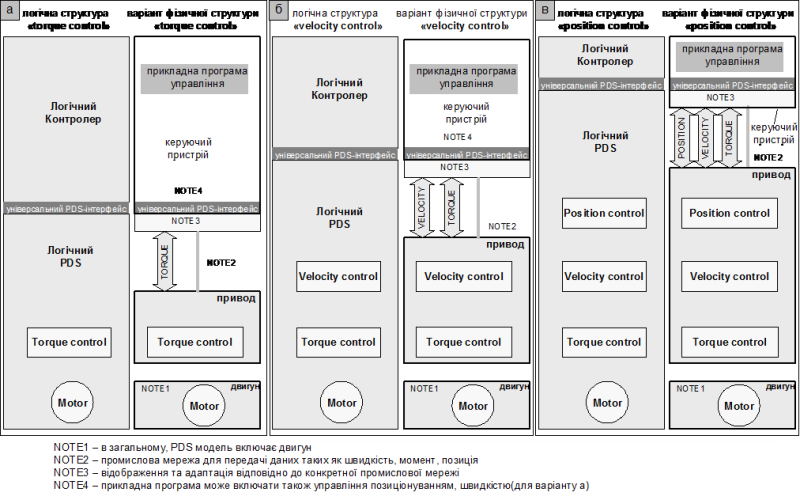
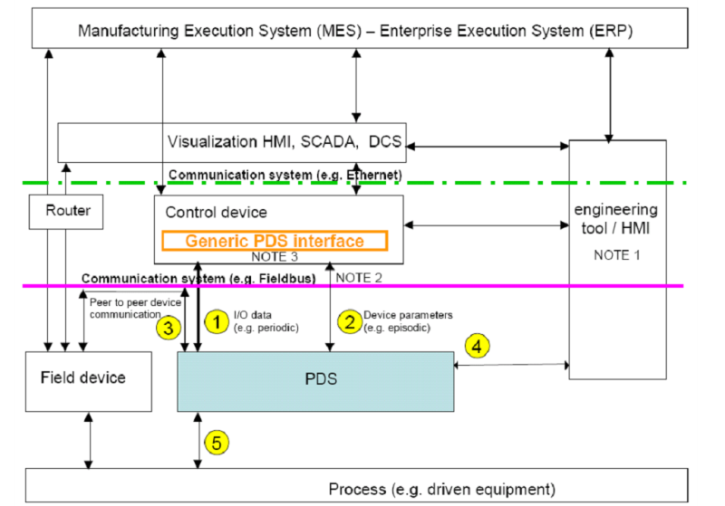
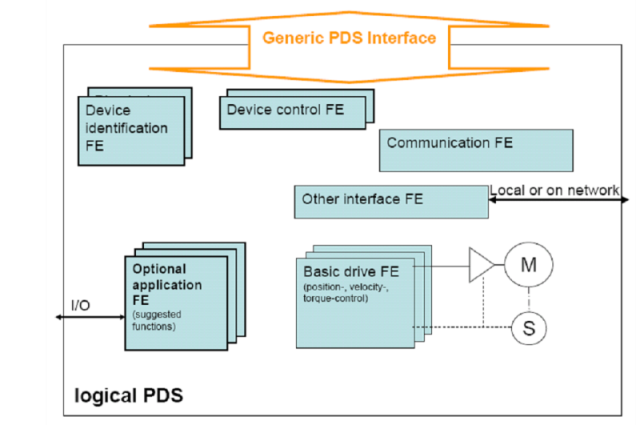
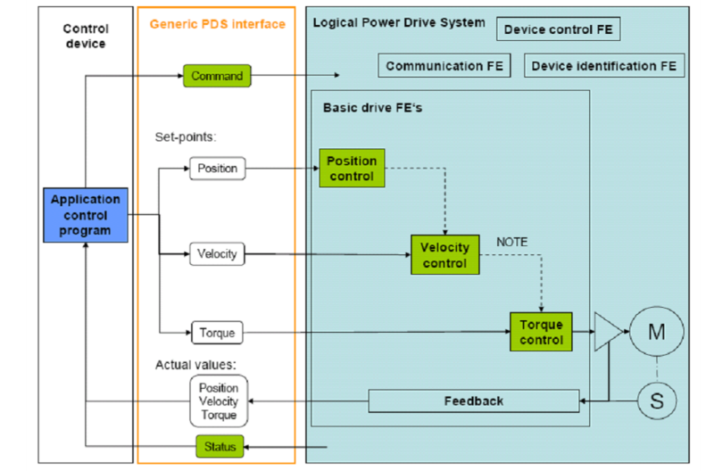
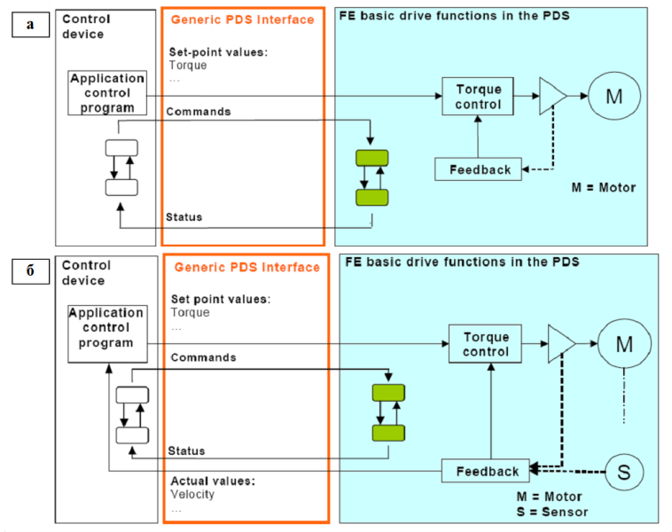
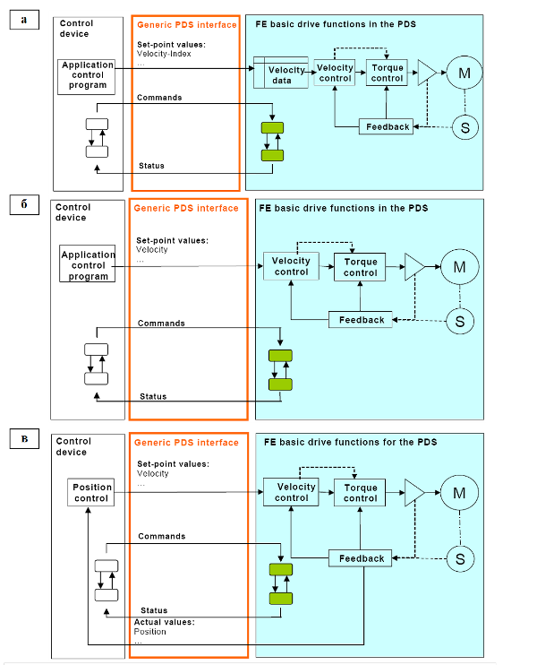
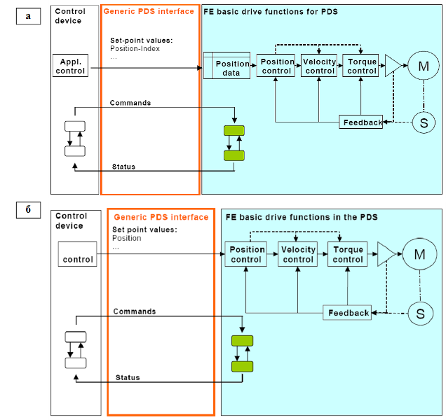
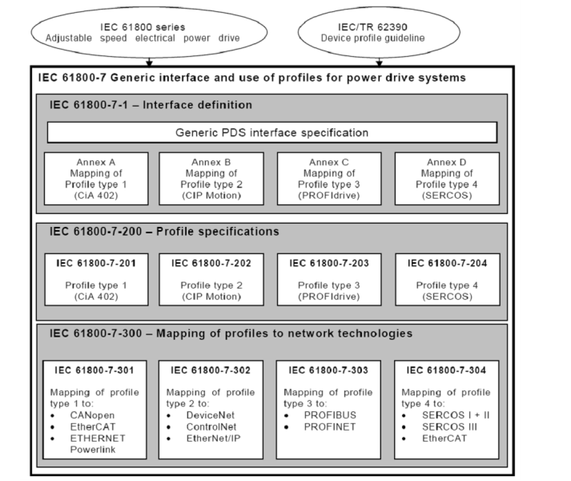

[Промислові мережі та інтеграційні технології в автоматизованих системах](README.md). 11. [КОМУНІКАЦІЙНА АРХІТЕКТУРА ДЛЯ ЕЛЕКТРОПРИВОДІВ](11.md)

## 11.2. Стандарт на універсальний інтерфейс PDS 

### 11.2.1. Загальні підходи до стандартизації інтерфейсу PDS

#### 11.2.1.1. Ідея створення та призначення стандарту. 

Ідеєю створення стандартів для цифрових комунікацій електроприводів було об’єднання декількох промислових рішень, шляхом виділення загальних елементів, структури для створення універсального інтерфейсу та профілів для PDS. Враховуючи, що для PDS систем вже функціонувало декілька стандартів в загальній серії IEC 61800 "Adjustable speed electrical power drive systems", а також відсутність на той момент функціонуючих стандартів МЕК на промислові мережі, нові стандарти на інтерфейс електроприводів увійшли до групи 61800, як частина 7. Таким чином стандарти 61800-7 описують універсальний інтерфейс між системою автоматизації та PDS. 

#### 11.2.1.2. Місце Універсального Інтерфейсу в логічній структурі системи управління PDS. 

Згідно концепції 61800-7, модель системи PDS представляє собою поєднання приводу, тобто безпосередньо модуля PDS, двигуна та комунікаційного інтерфейсу приводу. Таку модель будемо називати Логічним PDS (Logical Power Drive System) або просто Логічним Приводом. Функції управління Логічним Приводом реалізовуються в одному або більше Логічних Контролерах, та виконуються у відповідності з прикладною програмою управління. Таким чином структура автоматизованої системи являє собою поєднання Логічного приводу разом з Логічним контролером. Перший стандарт 61800-7-1 є базовим і визначає Універсальний Інтерфейс (Generic Interface) доступу до Логічного Приводу з боку Логічного Контролера.  

#### 11.2.1.3. Функціональні можливості Логічного Приводу. 

Функціональні можливості Логічного Приводу можуть бути розділені на: управління позиціонуванням (position-control), управління швидкістю (velocity-control) та управління моментом (torque-control). В залежності від реалізованих функцій Логічного Приводу, їх фізична структура згідно стандарту 61800-7-1 буде відрізнятися. На рис.11.1(а) показана структура автоматизованої системи управління, в якій Логічний Привод повинен управляти моментом двигуна. В цьому випадку прикладна програма через промислові мережі видає значення заданого моменту. Універсальний PDS інтерфейс забезпечує однаковий, з точки зори прикладної програми, спосіб зміни заданого моменту, незалежно від виробника приводу. Аналогічно на рис.11.1(б) та рис.11.1(в) показані структури систем відповідно управлінням швидкістю та управління позиціюванням, де прикладна програма керуючого пристрою задає необхідні швидкість та позицію. Функції, які відсутні в структурі пристрою PDS, можуть бути реалізовані в керуючому пристрої (контролері).

 

Рис.11.1. Фізична структура різних типів систем PDS

Слід звернути увагу на місце розміщення універсального інтерфейсу PDS. Це логічний а не фізичний інтерфейс. Якщо стандарти промислових мереж визначають правила спряження між пристроями, то стандарти IEC 61800-7 визначають правила роботи з об’єктами Логічного Приводу, доступ до яких буде проводитись через конкретні промислові мережі. Це значить, що одні і ті ж профілі IEC 61800-7 можуть функціонувати на різних типах промислових мереж. 

#### 11.2.1.4. Місце PDS в типовій структурі автоматизованої системи. 

З точки зору типової структури управління, PDS є польовим пристроєм. На рис.11.2 показане місце пристрою PDS в типовій структурі автоматизованої системи та його зв’язки з іншими засобами. 

 

Рис.11.2. Місце PDS в типовій структурі автоматизованої системи 

Фізично модуль PDS може з’єднуватись для передачі різних типів даних: 

1. Дані вводу/виводу (IO Data). Цей інтерфейс є частиною інтерфейсу PDS, який забезпечує управління та контроль приводу. 

2. Параметри пристрою (Device Parameters). Цей інтерфейс забезпечує доступ до параметрів пристрою для віддаленого конфігурування, моніторингу, діагностики. Параметри пристрою доступні через універсальний PDS інтерфейс.

3. З’єднання між польовими пристроями (peer to peer device). Цей інтерфейс забезпечує безпосереднє з’єднання між польовими пристроями. Він залежить від особливостей промислової мережі і не входить до універсального інтерфейсу PDS;

4. Параметри пристрою (інший або місцевий інтерфейс). Забезпечує доступ інженерних утиліт до параметрів пристрою через унікальний інтерфейс, який не входить до універсального інтерфейсу PDS.

5. Інтерфейс до процесу. Зв’язок з техноЛогічним процесом (датчики, виконавчі механізми) не охоплюється універсальним інтерфейсом PDS.

### 11.2.2. Функціональні елементи Логічного Приводу

#### 11.2.2.1. Призначення Функціональних Елементів в Логічному PDS. 

Логічний Привод складається з Функціональних Елементів (FE), які включають параметри та алгоритми для опису його поведінки. Для Логічного PDS доступні наступні FE (рис.11.3):

1. Функціональні Елементи ідентифікації пристрою (Device identification FE), які вміщують параметри для ідентифікації фізичних пристроїв: 

-     Profile ID (профіль);

-     Manufacturer ID (виробник);

-     Product ID (тип та модель пристрою);

-     Serial number (серійний номер);

-     Hardware revision (версія апаратного забезпечення);

-     Software revision (версія ПЗ);

-     Tag (поле користувача);

-     Location (мітка користувача);

-     Profile defined (додаткові параметри профілю).

2. Функціональні Елементи управління пристроєм (Device control FE), які включають автомат станів для управління станом приводу в залежності від тривог та попереджень. 

3. Комунікаційний Функціональний Елемент Логічного приводу (Communication FE), який складається з визначених комунікаційних параметрів мережі між керуючим пристроєм та приводу; а також включає автомат станів підключення пристроїв.

4. Базові Функціональні Елементи приводу (Basic drive FE), які вклю-чають базові функції управління позиціонуванням, швидкістю та моментом. 

5. Опціональні прикладні Функціональні Елементи (Optional application FE), які включають додаткові опціональні функції управління операцій з використанням вбудованих входів/виходів (енкодери, кінцеві вимикачі); не описуються стандартом; 

6. Функціональні Елементи іншого або місцевого інтерфейсу (Other interface FE). Комунікаційні можливості для Логічних Приводів, які не входять до стандарту IEC 61800-7.  

Рис.11.3. Функціональні Елементи в Логічному PDS

#### 11.2.2.2. Основи використання FE для управління PDS.  

Нагадаємо, що універсальний PDS інтерфейс використовується для двох різних призначень: для налаштування роботи та обслуговування приводу за допомогою інженерних утиліт і для управління приводом з прикладної програми (див. рис.11.2). У першому випадку використовуються такі типи операцій як ідентифікація, конфігурування, запис та зчитування параметричних даних, а управління Логічним Приводом з боку Логічного Контролеру (обмін даними процесу) в основному зводиться до управління та контролю трьох функціональних елементів: Device Control, Communication та Basic drive, а саме (див. рис.11.4):

-     відправка команди від прикладної програми до PDS (COMMAND);

-     відправка заданих значень від прикладної програми до PDS (Set Point);

-     відправка статусу від PDS до прикладної програми (STATUS);

-     відправка дійсних значень від PDS до прикладної програми (Actual Values).

#### 11.2.2.3. Контроль та управління автоматом станів FE (COMMAND та STATUS). 

Кожен з наведених вище Функціональний Елементів управляється автоматом станів. Тобто, в кожний момент часу Функціональний Елемент знаходиться у певному стані, який визначає його поведінку в даній ситуації. Визначити плинний стан Функціональних Елементів можна за допомогою змінної статусу (STATUS), а управляти станом – за допомогою команди (COMMAND). Перехід від стану до стану Функціональних Елементів проходить у момент отримання конкретної команди, або виникнення певної події у приводі. 

Рис.11.4. Використання універсального інтерфейсу для управління PDS

#### 11.2.2.4. Device Control FE. 

В універсальному інтерфейсі PDS закладений єдиний автомат станів для управління обробками помилок та стану PDS. Вона закладена в функціональному елементі Device Control. Якщо PDS не може забезпечити правильну роботу, то він переходить у стан помилки (Faulted State). Для переходу його у нормальний стан (No Faulted) необхідна команда скидання помилки (Reset Fault) з керуючого пристрою або локально, по місцю. 

Перед виникненням помилки, PDS може подати сигнал попередження (Warning). Враховуючи відсутність необхідності підтвердження попереджувального сигналу, він не входить до автомату станів. 

Таким чином автомат станів даного Функціонального Елементу включає всього два рівня: помилка і нормальний стан. Однак в залежності від профілю пристрою, кількість станів може бути розширена. Стани Device Control відображаються одним бітом змінної статусу, а для управління машиною станів використовується біт-команда на скидання помилки (Reset Fault). В залежності від профілю PDS додатково можуть бути використані і інші команди.

Через параметри Функціонального Елементу можна доступитись до буферу останніх помилок та попереджень, дізнатись про їх кількість, час виникнення тощо. 

#### 11.2.2.5. Communication FE. 

Комунікаційний Функціональний Елемент вміщує всі автомати станів та параметри для доступних промислових мереж PDS. Якщо профіль підтримує декілька мереж, для PDS доступно декілька екземплярів комунікаційного FE. 

Функціональний Елемент може бути в двох станах: обмеженому комунікаційному (Limited communication) та нормальному комунікаційному (Normal communication) стані. В обмеженому комунікаційному стані PDS може тільки контролюватися але не управлятися з боку Універсального Інтерфейсу. Тобто управління доступне тільки через Other interface FE. В нормальному режимі для Універсального Інтерфейсу доступні функції управління. Доступ до певних параметрів приводу у нормальному режимі може бути обмежений через додаткові настройки та під-стани, визначені профілем. 

Комунікаційний стан відображається в змінній статусу у вигляді біту Normal Communication. При включенні живлення PDS, він переводиться у обмежений комунікаційний режим Для переводу в нормальний режим використовується біт-команда Run communication. Для профілів PDS, які підтримують синхронний режим додатково визначений біт статусу Synchronized та біт-команда Synchronize/Do not Synchronize.

Параметри Комунікаційного Функціонального Елементу визначають тип та настройки промислової мережі, та визначаються профілем.

#### 11.2.2.6. Basic Drive FE. 

Ці Функціональні Елементи включають автомати станів та параметри для управління базовими функціями PDS. В Універсальному Інтерфейсі PDS для автомату станів визначені такі стани:

-    operating –  PDS через локальний чи віддалений інтерфейс реагує на команди та задані значення, а також видає значення статусу та необхідні дійсні значення;

-    not operating – PDS через локальний чи віддалений інтерфейс не реагує на зміну заданого значення, однак приймає та реагує на команди;

Опціонально можуть бути визначені наступні стани:

-    local control – PDS приймає команди та задані значення через локальний інтерфейс;

-    remote control – PDS приймає команди та задані значення через віддалений інтерфейс.

В залежності від режиму роботи, профілем можуть бути визначені додаткові стани. 

Значення режимів контролюються через змінну відповідних бітів статусу Operating та Remote Control. 

При подачі живлення на PDS, він стартує у режимі not operating та  local control. Команда Operate переключає автомат станів між режимами operating та not operating. Біт-команди Local/Remote переводять привод у відповідний режим. 

В параметрах Basic Drive FE визначаються:

-     режим роботи PDS (application mode);

-     уставки даних вводу/виводу;

-     поведінка функціонального елементу PDS в залежності від режиму його роботи.

### 11.2.3. Прикладні режими PDS

####  11.2.3.1. Загальні положення. 

У залежності від доступних функцій апаратного та програмного забезпечення PDS, Логічний Привод може бути у декількох прикладних режимах:

- управління позиціонуванням (position-control),

- управління швидкістю (velocity-control);

- управління моментом (torque-control). 

В таб.11.1 наведене призначення обов’язкової уставки в залежності від вибраного режиму роботи. Можуть бути доступні також опціональні уставки. 

Таблиця 11.1. Призначення уставок в залежності від режиму роботи

| Прикладний Режим   (Application Mode)   | Уставка  Set-Point | Функції в PDS                                                | Рис.    |
| --------------------------------------- | ------------------ | ------------------------------------------------------------ | ------- |
| Torque Preset                           | індекс моменту     | розв’язане управління моментом                               | 11.5(а) |
| Torque Control                          | значення моменту   | розв’язане управління моментом                               | 11.5(а) |
| Torque Control with velocity feedback   | значення моменту   | управління моментом зі зворотнім зв’язком по швидкості       | 11.5(б) |
| Velocity Preset                         | індекс швидкості   | переключення на фіксовані швидкості з контролем моменту та швидкості | 11.6(а) |
| Velocity Control                        | значення швидкості | розв’язане управління моментом та швидкістю                  | 11.6(б) |
| Velocity Control with position feedback | значення швидкості | управління моментом та швидкістю зі зворотнім зв’язком по позиції | 11.6(в) |
| Position Preset                         | індекс позиції     | перехід приводу на фіксовані позиції по зворотному зв’язку   | 11.7(а) |
| Position Control                        | значення позиції   | управління позицією, швидкістю або  моментом                 | 11.7(б) |

#### 11.2.3.2. Режим управління моментом. 

В режимі управління моментом (див. рис. 11.5(а)) прикладна програма керуючого пристрою задає необхідний момент, який регулюється пристроєм PDS з використанням зворотного зв’язку (канал вимірювання) або з використанням розрахованого значення. Може бути використаний зворотній зв’язок по швидкості (див. рис. 11.5(б)).

 Рис.11.5. Режим управління моментом без (а) та з (б) зворотнім зв’язком по швидкості

#### 11.2.3.3. Режим управління швидкістю. 

Можливі три випадки режимів управління швидкістю:

1. Режим з наперед встановленими швидкостями (рис.11.6(а)), коли задані значення швидкостей виставляються в момент конфігурування PDS, а в момент операційного функціонування проводиться їх вибір по індексу.

2. Режим регулювання швидкості(рис.11.6(б)), де задане значення швидкості  задається в уставці; опціонально можна також задавати момент; опціонально підтримується передача дійсного значення моменту та швидкості.

3. Режим регулювання швидкості зі зворотнім зв’язком по позиції, який анаЛогічний попередньому, однак зі зворотнім зв’язком по датчику положення.  

#### 11.2.3.4. Режим управління позиціонуванням. 

В режимі з наперед встановленими позиціями (рис.11.7(а)), в момент операційної роботи уставкою вибирається необхідна точка контролю позиції. Опціонально можливо вказати траєкторію між двома сусідніми точками. 

 Рис.11.6. Режими управління швидкістю: а – з наперед встановленими швидкостями; б – з регулюванням швидкості; в – зі зворотним зв’язком по позиції

В режимі управління позиціонуванням  (рис.11.7(б)) в уставці задається задана позиція. Опціонально можна задати необхідну швидкість та момент. Досягнення необхідної позиції сигналізується змінною стану. PDS може передавати прикладній програмі дійсні значення позиції, швидкості та моменту.  

Рис.11.7. Режими управління позиціонуванням: а – з наперед встановленими позиціями; б – з регулюванням позиції

### 11.2.4. Структура стандартів IEC 61800-7

####  11.2.4.1. Типи профілів PDS.  

Крім базового стандарту на універсальний інтерфейс IEC 61800-7-1, в якому даються основні і загальні для всіх профілів концепції зв’язку та управління PDS, група стандартів також включає специфікації на профілі IEC 61800-7-200 (201-204) та їх відображення на промислові мережі IEC 61800-7-300 (301-304). На рис.11.8 показана структура всіє серії стандартів IEC 61800-7. Як видно з рисунку у стандартах визначені 4-ри типи профілів PDS:

1. CiA 402 (CAN in Automation);

2. CIP Motion (ODVA);

3. PROFIDrive (PROFIBUS International);

4. SERCOS (SERCOS International).    

#### 11.2.4.2. Відображення профілів PDS на мережні технології. 

Ці профілі конкретизують і доповнюють універсальний інтерфейс PDS і  потрібні для правильного написання прикладної програми, яка управляє Логічним приводом. Однак профіль приводу не визначає механізм взаємодії через мережні технології. Припустимо, відомо яка команда повинна бути надіслана для зупинки двигуна, однак невідомо в якій мережній змінні вона знаходиться. Для визначення конкретної реалізації профілю PDS, він відображається на конкретну промислову мережу. В групі стандартів IEC 61800-7-300 профілі приводів описуються в контексті конкретної мережної технології.  

 Рис.11.8. Структура стандартів IEC 61800-7

 

В перших робочих редакціях стандартів IEC 61800-7 було визначено 5 профілів для PDS. У діючу офіційну редакцію не увійшов один із популярних нині профілів DRIVECOM (INTERBUS), який на сьогоднішній день використовуються у багатьох частотних перетворювачах. В наступних главах будуть розглянуті 2 профілі приводів та їх відображення на мережі: PROFIDRIVE та CiA402. 

<-- 11.1. [Способи інтеграції PDS в автоматизовані системи управління](11_1.md) 

--> 11.3. [Профіль PROFIDRIVE](11_3.md)  

