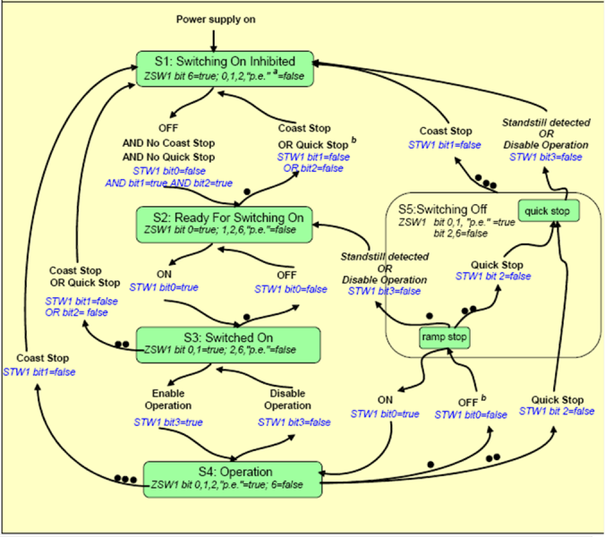

[Промислові мережі та інтеграційні технології в автоматизованих системах](README.md). 11. [КОМУНІКАЦІЙНА АРХІТЕКТУРА ДЛЯ ЕЛЕКТРОПРИВОДІВ](11.md)

## 11.3. Профіль PROFIDRIVE

PROFIdrive (Profile Drive Technology) – стандарт профілю для PDS, який запропонований організацією PROFIBUS & PROFINET International для використання його сумісно з мережами PROFIBUS та PROFINET. В даній главі PROFIdrive розглядається тільки в контексті PROFIBUS DP. Слід зазначити, що використання частотних перетворювачів в мережі PROFIBUS не обов’язково передбачає використання профілю PROFIDRIVE.

Для налаштування роботи приводу використовуються ациклічні сервіси. В режимі функціонування використовуються циклічні сервіси.

### 11.3.1. Функціональні елементи PROFIdrive

####  11.3.1.1. Слова управління та статусу (STW та ZSW) 

Автомати станів функціональних елементів  управляється за допомогою керуючих слів Control (Control Words - STW), через які передається команда, а контролюються через слова статусу Status (Status Words - ZSW). 

Дані входів/виходів включають один або декілька сигналів уставок та дійсних значень для управління та контролю за приводом. Можливі комбінації сигналів складені в наперед визначених стандартних телеграмах.   

#### 11.3.1.2. Device Control FE.

Автомат станів може перебувати в режимі No Fault (ZSW1.3=0) або Fault Present (ZSW1.3=1). Додатково визначені стани Warning Present (ZSW1.7=1) та No Warning (ZSW1.7=0). Підтвердження аварії проводиться командою Fault Acknowledge (STW1.7=1). Поведінка приводу в кожному стані визначається у самому пристрої, наприклад при конфігуруванні.    

#### 11.3.1.3. Communication FE. 

Для базової моделі PROFIdrive визначені наступні стани, які відносяться до комунікаційного Функціонального Елементу (рис.11.9):

1. Offline: відсутній зв’язок по мережі.

2. Preparation (Limited Communication): у цьому режимі працюють сервіси Acyclic Data Exchange та Alarm Mechanism; обмін даними I/O не підтримується; можливе конфігурування та діагностика пристрою.

3. Synchronisation (Not Synchronized): в цей час активуються сервіси циклічного обміну та проходить синхронізація.

4. Operation (Normal Operation, Synchronised): всі сервіси доступні.

Перехід від стану до стану проводиться комунікаційними сервісами PROFIBUS, або самим приводом в результаті виникнення помилки. 

Рис.11.9. Відображення станів комунікаційного функціонального елементу

#### 11.3.1.4. Basic Drive FE.

В стандарті 61800-7-1 автомат станів складається з двох станів: operating та not operating. В технології PROFIdrive автомат станів більш комплексний і охоплює додаткові стани та команди. Розглянемо більш детально загальний автомат станів для приводів PROFIdrive, а також для прикладних режимів управління моментом та швидкістю.

### 11.3.2. Загальний автомат станів для приводів PROFIdrive

Загальний автомат станів PROFIdrive показаний на рис.11.10. Кожен стан нумерується S1-S5. Стан Operation (S4) співпадає з визначеним в стандарті і відповідає за операційний режим роботи приводу. Даний стан  сигналізується 2-им бітом у першому cлові статусу (Operation Enabled - ZSW1.2=1). Стан-дартний стан Not Operating в PROFIdrive ділиться на декілька підрежимів: Switching On Inhibited, Ready for Switching On, Switched On а також Switching OFF.

Логічний контролер може управляти автоматом станів тільки у випадку якщо:

-     комунікаційний функціональний елемент находиться в стані Operation;

-     виставлений режим віддаленого управління Control Requested (ZSW1.9=1);

-     контролер відправляє команду Control By PLC (STW1.10=1), повідомляючи, що він готовий до управління і його значення даних є вірними;

-     контролер відправляє команду ON (STW1.0=1), включаючи PDS;

-     PDS сигналізує про готовність до операційного режиму сигналом Ready To Operate (ZSW1.1=1).

На рис.11.10 в прямокутниках показані стани загального автомату та біти статусу, якими вони сигналізуються. Стрілками показані події та команди, які приводять до переводу автомату з одного стану в інший. Подія Standstill detected сигналізує про виявлення зупинки двигуна. Можливе аварійне переведення приводу в стан S1 (на діаграмі позначено індексом b) .

 Рис.11.10. Загальний автомат станів PROFIDrive для базового функціонального елементу

### 11.3.3. Операційна робота приводів PROFIdrive в  режимі управління швидкістю

У PROFIdrive прикладні режими роботи приводів виділяються у шість прикладних класів (Application Class, AC). Всі режими управління моментом та розімкнене управління швидкістю відносяться до АС1 "Standard Drive". На рис.11.11 показана функціональна діаграма операційного режиму приводу SatndardDrive. 

 Рис.11.11. Загальний автомат станів PROFIDrive для приводу SatndardDrive

В таблиці 11.2 зведені всі команди PROFIdrive в яких  біти 4,5,6,8,9 тільки для режиму управління SatndardDrive. 

Таблиця 11.2 Команди PROFIdrive

| Назва Command  IEC 61800-7 | Назва  PROFIdrive                                      | Біт  STW1 | Призначення команди                                          |
| -------------------------- | ------------------------------------------------------ | --------- | ------------------------------------------------------------ |
|                            | 1 - ON  0 – OFF (OFF1)                                 | 0         | Команда на включення/виключення основного вимикача  живлення. При подачі команди OFF1, двигун буде плавно зупинятись до повної зупинки, після чого вимикач  вимкнеться. |
|                            | 1 – No Coast Stop (No OFF2)  0 – Coast Stop (OFF2)     | 1         | Команда  OFF2 негайно знімає напругу з двигуна основним вимикачем  живлення. Двигун зупиняється за рахунок інерції. |
|                            | 1 - No Quick Stop (No OFF3)  0 – Quick Stop (OFF3)     | 2         | Команда  на швидку зупинку двигуна.                          |
| OPERATE                    | 1 – Enable Operation  0 – Disable Operation            | 3         | Команда  на включення/виключення операційного режиму. В операційному режимі всі  уставки функціонують. |
|                            | 1 – Enable Ramp Generator  0 – Reset Ramp Generator    | 4         | Активація  нарощування уставки                               |
|                            | 1 – Unfreeze Ramp Generator  0 – Freeze Ramp Generator | 5         | Фіксація  заданої швидкості                                  |
|                            | 1 – Enable Setpoint  0 – Disable Setpoint              | 6         | Активація  уставки                                           |
| RESET FAULT                | 1 – Fault Acknowledge  0 – No Significance             | 7         | Підтвердження  помилки. Реакція приводу залежить від типу помилки. |
|                            | 1 – JOG1 ON  0 – JOG1 OFF                              | 8         | Активація  фіксованої частоти 1                              |
|                            | 1 – JOG2 ON  0 – JOG2 OFF                              | 9         | Активація  фіксованої частоти 2                              |
| REMOTE  LOCAL              | 1 – Control By PLC  0 – No Control By PLC              | 10        | Команда  на управління приводом з контролеру.                |

В таблиці 11.3 наведені зведені біти статусу PROFIdrive, в яких біти 4,5,6,8,10 тільки для режиму управління SatndardDrive. 

Таблиця 11.3 Зведені біти статусу PROFIdrive

| Назва STATUS  IEC 61800-7 | Назва  PROFIdrive                                            | Біт  ZSW1 | Призначення                                                  |
| ------------------------- | ------------------------------------------------------------ | --------- | ------------------------------------------------------------ |
|                           | 1 – Ready To  Switch On  0 – Not Ready To Switch On          | 0         | Джерело  живлення увімкнено, електроніка ініціалізована      |
|                           | 1 – Ready To  Operate   0 – Not Ready To Operate             | 1         | Повторює  STW1.0                                             |
| Operating                 | 1 - Operation  Enabled   0 – Operation Disabled              | 2         | Привод  в операційному/не операційному режимі                |
| Faulted                   | 1 – Fault Present   0 – No Fault                             | 3         | В  буфері є непідтвердженні помилки. Підтвердження тільки неактивної помилки  може зняти даний біт |
|                           | 1 – Coast Stop  Not Activated (No OFF 2)   0 – Coast Stop  Activated  (OFF 2) | 4         | Зупинка  по відключенню напруги з двигуна активована         |
|                           | 1 – Quick Stop  Not Activated  (No OFF 3)   0 – Quick Stop Activated (OFF 3) | 5         | Швидка  зупинка активована                                   |
|                           | 1 – Switching On  Inhibited   0 – Switching On  Not Inhibit  | 6         | Привод  увімкнений в режимі заборони функціонування          |
| Warning                   | 1 - Warning Present   0 - No Warning                         | 7         | В  буфері є попередження.                                    |
|                           | 1 – Speed Error  Within Tolerance   Range  0 – Speed Error Out Of Tolerance Range | 8         | Якщо  =1 – розузгодження по швидкості (задана-виміряна) в межах норми |
| Remote control            | 1 – Control  Requested   0 – No Control Requested            | 9         | Управління  з контролеру можливе/неможливе. У випадку готовності до управління з  контролеру привод виставляє даний біт в 1 |
|                           | 1 – f Or n  Reached Or Exceeded   0 – f Or n Not Reached     | 10        | Якщо  =1 - частота/швидкість досягнула уставки               |

 Приклад 11.1.  PROFIDrive. Написання програми для організації взаємодії ПЛК S300 з ЧПР Danfoss.  

Завдання. Створити конфігурацію та програму користувача в пакеті STEP7 для управління (задана частота) та контролю (плинна частота, струм двигуна, напруга двигуна, аварії, попередження) частотним перетворювачами  Danfoss типу FC100/200/300 з ПЛК Siemens типу S300 по мережі PROFIbus DP з використанням профілю PROFIDrive. 

Рішення. Частотні перетворювачі Danfoss FC100/200/300 можуть управлятись з використанням профілів FC або PROFIDrive. Тип профілю а також інші комунікакаційні настройки вибираються при кофігуруванні частотного перетворювача. 

Для ПЛК S300 в середовищі STEP7 необхідно створити проект, налаштувати ПЛК на роботу з PROFIBUS DP в якості Ведучого. В якості Веденого добавляється пристрій типу FC100/200/300 як на рис.11.12 (попередньо необхідно встановити потрібні файли .gsd). 

Рис.11.12. Створення конфігурації для приводу FC100/200/300.

Для даного пристрою вибирається кількість змінних обміну та їх консистентність. Для Danfoss 6 вхідних та вихідних слів даних процесу забезпечує 4-тий тип PPO, модульна консистентність забезпечує нерозривність даних для всіх 12 байт (6 слів). На вкладці Parameter Assignment властивостей вибраного ЧПР, вибираються необхідні змінні для його вхідних/вихідних параметрів. Параметри Fieldbus CTW(слово COMMAND), Fieldbus REF (завдання) та Status Word (слово STAUS) – є наперед визначеними і не змінюються. Інші параметри контролю вибираємо відповідно: Frequency (дійсна частота), MotorCurrent (струм двигуна), Motor Voltage(напруга двигуна), VLT Alarm Word (слово аварій), VLT Warning Word(слово попереджень).

Відповідно до виділеної пам’яті образу процесу (рис.11.12) параметри будуть розміщуватися в наступних змінних: FieldbusCTW-QW0; FieldbusREF- QW2; StatusWord-IW0;  Frequency-IW2; MotorCurrent-IW4; MotorVoltage-IW6; VLTAlarmWord-IW8; VLTWarningWord-IW10;

Тобто задану частоту або швидкість (залежить від на лаштування частотного перетворювача) необхідно записувати в QW2, управляти станом PDS через зміну QW0, контролювати стан - IW0. 

Для управління машиною станів створимо функцію FC200 на мові SCL з назвою PDS_CTRL (рис.11.14). Дану функцію можна визвати в блоці ОВ1 (рис.11.13). 

 Рис.11.13.Лістинг програми з викликом функції PDS_CTRL .

В функції PDS_CTRL слід звернути увагу на те, що байти в 16-бітному слові в ПЛК типу S7 розміщуються наступним чином: молодший байт слова – з старшим номером, старший байт – з молодшим номером. Тобто d IW0 старший байт буде в IB0, молодший – в IB1. Тому при використанні змінних статусу та команди як набору бітів tmpSTATUS_AR та tmpCOMMAND_AR необхідно врахувати іншу нумерацію бітів: біти 0-7 знаходяться в масиві з індексами 8-15, 8-15 – з індексами 0-7.   

Рис.11.14. Лістинг функції PDS_CTRL.

<-- 11.2. [Стандарт на універсальний інтерфейс PDS](11_2.md)  

--> 11.4. [Профіль CiA402](11_4.md) 