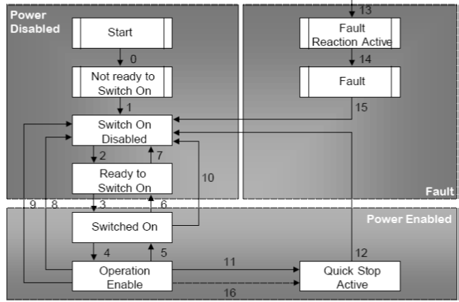
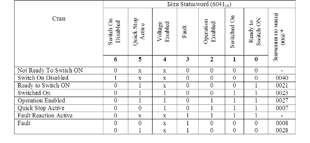
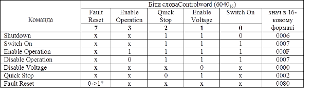
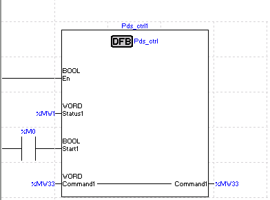
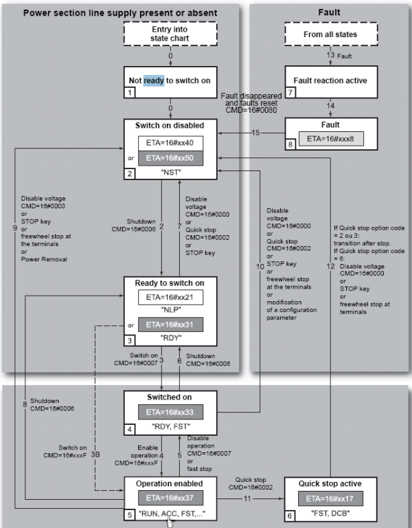
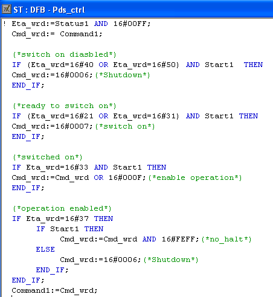

[Промислові мережі та інтеграційні технології в автоматизованих системах](README.md). 11. [КОМУНІКАЦІЙНА АРХІТЕКТУРА ДЛЯ ЕЛЕКТРОПРИВОДІВ](11.md)

## 11.4. Профіль CiA402

Профіль CiA402 розроблений організацією CAN in Automation як профіль пристрою DS-402. Він використовується як базовий прикладний профіль управління PDS в мережах CANOpen, ETHERNET Powerlink  та ETHERCat. Нижче розглянемо функціонування CiA402 тільки стосовно мережі CANOpen. Слід зазначити, що використання частотних перетворювачів в мережі CANOpen не обов’язково передбачає використання профілю CiA402 (DS-402).

### 11.4.1. Функціональні елементи CiA402

#### 11.4.1.1. Слова управління та статусу (Controlword та Statusword). 

Автомати станів функціональних елементів управляється за допомогою керуючих слів Command (Controlword – індекс в словнику 6040h), через які передається команда, а контролюються через слова статусу Status (Statusword - індекс в словнику 6041h ).

Дані входів/виходів включають один або декілька сигналів уставок та дійсних значень для управління та контролю за приводом. Ці дані та параметри прикладних профілів зберігаються у конкретних об’єктах словника. Так наприклад для режиму управління швидкістю без зворотного зв’язку (див. рис.11.6(б)), визначені наступні об’єкти словника:

- Command – Controlword (ID 6040h);

- Status – Statusword (ID 6041h);

- Velocity set point – Target velocity (ID 6042h);

- Actual velocity – velocity actual value (ID 6044h).

#### 11.4.1.2. Device Control FE.  

Автомат станів може перебувати в режимі No Fault (3-й біт Statusword = 1) або No Fault (3-й біт Statusword = 0). Скидання аварії проводиться командою Fault Reset (7-й біт Controlword=1). Поведінка приводу в кожному стані визначається в самому пристрої, наприклад при конфігуруванні. Після скидання аварії, привод переводиться в стан Ready To Switch On.     

#### 11.4.1.3. Communication FE.  

Для CiA402 визначені наступні комунікаційні стани: Operational та Pre-operational або Stopped. Робота автомату станів комунікаційного функціонального елементу залежить від промислової мережі, на якій працює привод з даним профілем. Для CANOpen діаграма станів NMT-веденого наведена в 9-му розділі. 

#### 11.4.1.4. Basic Drive FE. 

Автомат станів профілю CiA402 наведений на рис.11.15. Стан not operating, який визначений стандартом IEC 61800-7-1, в профілі CiA402 складається з декількох під станів.

Рис.11.15. Автомат станів для профілю CiA-402

Автомату доступні такі стани:

-     Not ready to Switch On – стадія ініціалізації привода, комунікації недоступні; 

-     Switch On Disabled – завершення стадії ініціалізації, силова частина приводу неактивна, подача живлення на неї неможлива, на двигун не подається живлення, доступна параметризація через комунікації;

-     Ready to Switch ON – очікування подачі живлення на силову частину приводу, на двигун не подається живлення, доступна параметризація через комунікації; 

-     Switched On – подане живлення на силову секцію приводу, на двигун не подається живлення, доступна параметризація через комунікації;   

-     Operation Enabled – нормальний операційний режим роботи, помилок не виявлено, на двигун подається живлення, доступна параметризація через комунікації за винятком конфігураційних даних силової частини;    

-     Fault Reaction Active – виявлення помилки на приводі та її обробка; функції управління двигуном доступні; 

-     Fault – стан помилки, привод заблокований, на двигун не подається живлення;

-     Quick Stop Active – стан швидкої зупинки двигуна.

Стан приводу визначений Statusword, а переходи між станами можуть відбуватися за внутрішніми подіями, або по команді, визначеній в Controlword. В наступній таблиці 11.4 наведені значення бітів слова статусу у різних станах.

Таблиця 11.4 Значення бітів слова статусу 

x – невизначений стан

 - значення в шістьнадцятковому форматі, наведене по масці 006F  

У таблиці 11.5 наведені команди для переходу між станами та біти слова Controlword, які їм відповідають.

Таблиця 11.5 Команди для переходу між станами

`*` - по передньому фронті сигналу

У таблиці 11.6 наведені події та команди, по яким відбувається перехід між станами. Номер переходу показаний на рис. 11.5

Таблиця 11.6 Події та команди, по яким відбувається перехід між станами

| № пере-  ходу | Зі стану               | На стан                | Подія                                                  | Реакція на подію                                             |
| ------------- | ---------------------- | ---------------------- | ------------------------------------------------------ | ------------------------------------------------------------ |
| 0             | Start                  | Not Ready To Switch ON | Запуск привода                                         | Привод проходить самодіагностику та стартову ініціалізацію   |
| 1             | Not Ready To Switch ON | Switch On Disabled     | позитивний резуль-тат ініціалізації                    | Активація комунікації та відображення процес них даних       |
| 2             | Switch On Disabled     | Ready to Switch  ON    | команда Shutdown                                       | перехід в наступний стан                                     |
| 3             | Ready to Switch  ON    | Switched On            | команда   Switch On                                    | силова секція приводу включається                            |
| 4             | Switched On            | Operation Enabled      | команда  Enable Operation                              | перехід в операційний режим: дос-тупні функції  управління двигуном |
| 5             | Operation Enabled      | Switched On            | команда  Disable Operation                             | операційний режим відключається                              |
| 6             | Switched On            | Ready to Switch  ON    | команда   Shutdown                                     | силова секція приводу відключається                          |
| 7             | Ready to Switch  ON    | Switch On Disabled     | команда  Quick Stop                                    | перехід в наступний стан                                     |
| 8             | Operation Enabled      | Ready to Switch  ON    | команда   Shutdown                                     | негайне відключення силової секції та напруги з двигуна      |
| 9             | Operation Enabled      | Switch On Disabled     | команда   Disable Voltage                              | негайне відключення силової секції та напруги з двигуна      |
| 10            | Switched On            | Switch On Disabled     | команда   Disable Voltage або Quick Stop               | негайне відключення силової секції та напруги з двигуна      |
| 11            | Operation Enabled      | Quick Stop Active      | команда  Quick Stop                                    | виконується швидка зупинка двигуна                           |
| 12            | Quick Stop Active      | Switch On Disabled     | швидка зупинка виконана або  команда   Disable Voltage | силова секція приводу відключається                          |
| 13            | Всі стани              | Fault Reaction Active  | помилка на приводі                                     | виконання дії відповідно до типу помилки                     |
| 14            | Fault Reaction Active  | Fault                  | обробка помилки закінчена                              | функції управління двигуном недоступні, силова секція  може відключитися |
| 15            | Fault                  | Switch On Disabled     | команда  Fault Reset                                   | зняття помилкового стану у випадку відсутності помилок,  біт команди Fault Reset повинен обнулитись з  контролеру |
| 16            | Quick Stop Active      | Operation Enabled      | команда  Enable Operation                              | активуються функції управління двигуном                      |

### 11.4.2. Операційна робота приводів CiA-402 в режимі управління швидкістю

У CiA-402 доступні всі прикладні режими, описані в IEC 61800-7-1. Режим управління швидкістю без зворотного зв’язку має назву Profile Velocity mode. Для цього режиму в операційному режимі запуск двигуна відбувається за допомогою команди No Halt (8-й біт Controlword=0), зупинка – Halt (8-й біт Controlword=1). Задана швидкість обертання задається об’єктом Target velocity (6042h), а контролюється об’єктом – Velocity actual value (6044h). Контроль за роботою двигуна в операційному режимі проводиться також додатковими бітами статусу, які є опціональними:

-     Target Reached (біт 10) – при Halt=1, 0 означає, що двигун зупиняється, 1 – двигун зупинився; при Halt=0, 0 означає, що швидкість не досягнула уставки, 1 – швидкість досягнула уставки; 

-     Speed (біт 12) – якщо 0 – швидкість не дорівнює нулю, 1 – швидкість дорівнює нулю. 

Загальний список бітів слова команди для режиму управління швидкістю наведений у таблиці 11.7

Таблиця 11.7 Біти слова команди для режиму управління швидкістю

| назва Command  IEC 61800-7 | назва  CiA-402   | біт  Controlword | пояснення                                                    |
| -------------------------- | ---------------- | ---------------- | ------------------------------------------------------------ |
|                            | Switch ON        | 0                | =1, включення силової секції приводу                         |
|                            | Enable Voltage   | 1                | =0,  негайне відключення силової секції та напруги з двигуна |
|                            | Quick Stop       | 2                | =1,  швидка зупинка двигуна                                  |
| OPERATE                    | Enable Operation | 3                | =1,  переведення в операційний режим                         |
|                            |                  | 4                | зарезервовані                                                |
|                            |                  | 5                | зарезервовані                                                |
|                            |                  | 6                | зарезервовані                                                |
| RESET FAULT                | Fault Reset      | 7                | скидання  помилок                                            |
|                            | Halt             | 8                | зупинка  двигуна                                             |
|                            |                  | 11-15            | призначення  залежить від виробника                          |

Загальний список бітів слова статусу для режиму управління швидкістю наведені в таблиці 11.8.

Таблиця 11.8 Біти слова статусу для режиму управління швидкістю

| назва STATUS  IEC 61800-7 | назва  CiA-402      | біт  Statusword | пояснення                                                    |
| ------------------------- | ------------------- | --------------- | ------------------------------------------------------------ |
|                           | Ready to Switch  ON | 0               | =1,  готовий до подачі живлення на силову частину приводу    |
|                           | Switched On         | 1               | =1,  силова частина приводу підключена до живлення           |
| Operating                 | Operation Enabled   | 2               | =1,  знаходиться в операційному режимі                       |
| Faulted                   | Fault               | 3               | =1, є  активна помилка                                       |
|                           | Voltage Enabled     | 4               | =1,  активність обробки команди Disable Voltage              |
|                           | Quick Stop Active   | 5               | =0,  відбувається швидка зупинка двигуна                     |
|                           | Switch On Disabled  | 6               | =1, не  готовий до подачі живлення на силову частину приводу |
| Warning                   | Warning             | 7               | =1, є  попереджувальні повідомлення                          |
|                           |                     | 8               | призначення  залежить від виробника                          |
| Remote control            | Remote              | 9               | =1,  доступне управління з CANOpen, =0 – управління з мережі недоступне |
|                           | Target Reached      | 10              | залежить  від HALT:   двигун  зупиняється/зупинився або швидкість рівна/нерівна уставки |
|                           | Speed               | 12              | =1, швидкість дорівнює нулю  =0, швидкість  не дорівнює нулю |

Приклад 11.2. CiA-402. Написання програми для роботи ПЛК TSX Premium з ЧПР ATV71. 

Завдання. Розробити конфігурацію та програму користувача в пакеті PL7 для управління (задана частота) та контролю (плинна частота, струм двигуна, напруга двигуна, аварії, попередження) частотним перетворювачем ATV 71 відповідно до задачі з прикладу 9.7. 

Рішення. Частотні перетворювачі Altivar (Schneider Electric) підтримують профіль CiA-402. Для управління ЧПР створимо функціональний блок на мові ST з назвою PDS_CTRL (рис.11.16). Вхідними параметрами блоку є Status1 – куди передається слово статусу, Start1 – команда на запуск двигуна, Command1 – слово команди (вхід/вихід). 

Рис.11.16. Використання функціонального блоку PDS_CTRL для управління ЧПР 

На рис.11.17 показаний автомат станів для даних частотних перетворювачів Altivar, який не відрізняється від стандартного, що показаний на рис.11.15. Відмінність заключається в позначенні Statusword як ETA, а Commandword як CMD. 

Програма управління частотним перетворювачем з використанням Status1 зображена на рис.11.18. Згідно прикладу 9.7, ControlWord знаходиться в %MW33, StatusWord – в %MW1, задана швидкість обертання TargetVelocity в %MW34, дійсна ControllEffort – в %MW2. Відповідно інші параметри для контролю знаходяться в змінних %MW3-%MW7. Змінна %M0 буде запускати/зупиняти двигун.     

 

 Рис.11.17. Автомат станів для профілю CiA-402 в ЧПР Altivar

 Рис.11.18. Лістинг програми функціонального блоку PDS_CTRL у середовищі PL7

<-- 11.3. [Профіль PROFIDRIVE](11_3.md)  

--> 12. [ВІДКРИТІ ТЕХНОЛОГІЇ ПРОГРАМНОЇ ІНТЕГРАЦІЇ В СЕРЕДОВИЩІ WINDOWS](12.md) 

## Контрольні запитання до розділу 11

1. Навіщо пристрої PDS необхідно підключати до контролерів? Які типи сигналів використовуються при підключенні? 

2. В чому переваги використання мережного зв’язку перед аналоговими, дискретними та імпульсними підключеннями контролера з PDS?

3. Які проблеми виникають при використанні мережного зв’язку з PDS різних виробників? Як ці проблеми вирішуються на рівні стандартизації зв’язку з PDS? 

4. З яких основних складових складається логічна модель системи з PDS? Які функції виконують ці складові? Що визначає Універсальний Інтерфейс в контексті стандарту МЕК 61800-7?

5. Які функціональні можливості може підтримувати Логічний Привод? Як відрізняється фізична структура реалізації Логічного Приводу, в залежності від наявних функцій в PDS? В якій складовій системи можуть бути реалізовані функції, відсутні в PDS? 

6. Поясніть відмінність між Універсальним Інтерфейсом МЕК 61800-7 та промисловою мережею?

7. Які інтерфейси можуть бути доступні для з’єднання з PDS? Поясніть їх призначення. Які з них підтримуються функціями Універсального Інтерфейсу МЕК 61800-7?

8. В яких логічних складових закладені параметри та алгоритми поведінки Логічного Приводу?

9. Перерахуйте Функціональні Елементи Логічного Приводу. Які функції в них закладені? 

10. Які Функціональні Елементи використовуються при конфігуруванні PDS з боку програматорів, а які для управління Логічним Контролером?

11. Розкажіть про принципи функціонування процесу управління Логічним Приводом. За допомогою яких змінних відбувається процес управління та контролю за Логічним Приводом?

12. Які стани визначені для Функціонального Елементу Device Control та як відбувається перехід між ними? Як контролюється та управляється автомат станів Device Control FE?

13. Які стани визначені для Communication FE та як відбувається перехід між ними? Як контролюється та управляється автомат станів Communication FE?

14. Які стани визначені для Basic Drive FE та як відбувається перехід між ними? Як контролюється та управляється автомат станів?

15. В яких прикладних режимах може функціонувати Логічний Привод? 

16. Прокоментуйте схему функціонування режимів управління моментом приводу?

17. Прокоментуйте схему функціонування режимів управління швидкістю приводу?

18. Прокоментуйте схему функціонування режимів управління позиціонуванням приводу?

19. Розкажіть про наявні профілі пристроїв PDS та їх відображення на промислові мережі в стандартах МЕК 61800-7? Який популярний профіль PDS не увійшов до переліку стандартних? 

20. Поясніть відмінність поняття профілю PDS від промислової мережі, що підтримуються даним пристроєм. Чи визначає факт використання конкретної промислової мережі наявність конкретного профілю PDS та навпаки? 

21. Прокоментуйте функціонування профілю PROFIDRIVE в контексті Функціональних Елементів. Які основні відмінності даної реалізації від стандартної МЕК 61800-7-1? 

22. Як реалізуються в PROFIDRIVE змінні COMMAND та STATUS, визначені в МЕК 61800-7-1? З якими мережами використовується даний профіль? 

23. Прокоментуйте схему функціонування автомату станів базових функціональних елементів для профілю PROFIDRIVE.

24. Прокоментуйте схему функціонування операційної роботи приводу в режимі управління швидкістю для профілю PROFIDRIVE.

25. Прокоментуйте функціонування профілю CiA402 в контексті функціональних елементів. Які основні відмінності даної реалізації від стандартної МЕК 61800-7-1? Яка назва профілю CiA402 в CANOpen?

26. Як реалізуються в CiA402 змінні COMMAND та STATUS, визначені в МЕК 61800-7-1? З якими мережами використовується даний профіль?

27. Прокоментуйте схему функціонування автомату станів базових функціональних елементів для профілю CiA402.

28. Прокоментуйте схему функціонування операційної роботи приводу в режимі управління швидкістю для профілю CiA402.  