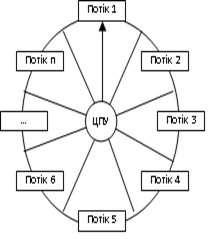

[

[Промислові мережі та інтеграційні технології в автоматизованих системах](README.md). 12. [ВІДКРИТІ ТЕХНОЛОГІЇ ПРОГРАМНОЇ ІНТЕГРАЦІЇ В СЕРЕДОВИЩІ WINDOWS](12.md) 

## 12.2. Функціонування ОС Window

### 12.2.1. Основи функціонування.

#### 12.2.1.1. Багатозадачний режим. 

Для розуміння технологій взаємодії між прикладними програмами, необхідні базові поняття про їх функціонування в контексті конкретної операційної системи. На сьогоднішній день найбільш популярними є операційні системи Windows, тому коротко розглянемо принципи роботи програм на цих платформах. 

Операційні системи Windows функціонують в багатозадачному режимі, тобто в їх середовищі одночасно виконуються декілька прикладних програм. Однак це не значить, що на одному процесорі паралельно виконуються машинні команди цих програм. Операційна система створює такі умови для кожної програми, щоб надати їй всі ресурси комп’ютера в виділений момент часу.

#### 12.2.1.2. Потоки. 

Програмний код, якому необхідно "виділити процесор" в операційній системі Windows називається Потоком (Thread). Щоб одночасно функціонувало декілька Потоків, операційна система виділяє кожному із них певну частину часу, яка називається квантом. Тривалість кванту залежить від конкретної реалізації. Таким чином, вся система працює по принципу каруселі: операційна система почергово, на один квант часу відправляє процесору кожний Потік для його виконання. Після обробки останнього Потоку система знову запускає перший (рис.12.1). 

Перед передачею процесору іншого Потоку, система зберігає для попереднього Потоку стан всіх регістрів процесора. Ця інформація називається контекстом Потоку. Повертаючись до цього Потоку знову, система завантажує його контекст в процесор, для того щоб той продовжив виконувати перерваний минулого разу потік.

Рис.12.1. Принцип роботи процесора в ОС Windows

Описана вище схема функціонування працює для Потоків з однаковими пріоритетами. Кожний Потік має свій пріоритет, який надається йому системою. Чим він вище - тим важливіший Потік, тому операційна система буде обробляти всі Потоки з самим високим пріоритетом до тих пір, поки всі вони не зупиняться (перейдуть в режим очікування). Коли не буде жодного робочого Потоку з найвищим пріоритетом – система перейде на Потоки з нижчим пріоритетом і так далі. Цей принцип розподілу часу між різнопріоритетними Потоками називається багатозадачністю з витісненням. 

Прикладна програма часто складається з одного Потоку, однак деякі з них запускають декілька Потоків. З сказаного вище може скластися враження, що у випадку існування в системі Потоку з найвищим пріоритетом, він не дасть жодного шансу для інших Потоків. Але це не так. Як правило всі Потоки простоюють, тобто перебувають в режимі очікування якоїсь події (переривання), яка буде їм адресована. Подією може бути клік або рух миші, сигнал від системного таймеру і інше. 

#### 12.2.1.3. Віртуальна та фізична пам’ять. 

Кожний Потік потребує ресурсів пам’яті. Для того, щоб прикладні програми (їх Потоки) не ділили єдину оперативну пам’ять між собою, кожному Потоку виділяється спеціально реалізований операційною системою ресурс, який називається віртуальною пам’яттю. Віртуальна пам’ять розміщує дані не тільки в оперативній пам’яті, а і на жорсткому диску. Коли необхідно скористатися ресурсами пам’яті – диспетчер пам’яті системи виділяє частину оперативної пам’яті. Якщо потрібна частина пам’яті була виділена під інший Потік (вірніше Процес), її попередньо вивантажують та зберігають на диску, щоб при активації останнього відновити його на тому ж місці. 

#### 12.2.1.4. Процеси Windows. 

Всі потоки та їх дані розміщуються в конкретному Процесі (Process). З точки зору прикладної програми Процес – це адресний простір, в якому розміщуються код та дані всіх EXE та DLL модулів. Саме в ньому знаходяться області пам’яті, які динамічно розподіляються для стеків потоку та інших потреб. При запуску на виконання EXE-програми система створює для неї Процес, в контексті якого запускає первинний Потік. Цей Потік може запустити на виконання ще дочірні Потоки, які будуть виконуватися паралельно. Коли всі Потоки знищуються, Процес теж знищується. Процес може запустити на виконання ще одну програму, тобто створити ще один Процес (до речі, так робить Провідник Windows). 

#### 12.2.1.5. Об’єкти ядра Windows. 

Процеси та Потоки є ресурсами операційної системи, які також являються її об’єктами ядра, якими можна оперувати. Кожний об’єкт ядра має свій унікальний ідентифікатор в системі. Так об’єкти ядра Процес мають ProcessID (PID), який можна побачити під час виклику "Диспетчера задач" (Ctrl+Alt+Del). Однак в контексті кожного Процесу об’єктами ядра користуються через дескриптори (handle). Таким чином в кожному Процесі один і той самий об’єкт ядра буде мати однаковий ідентифікатор але різні дескриптори.

#### 12.2.1.6. Служби Windows. 

Є спеціальний вид Процесів, які створюють допоміжну функціональність в системі і не залежить від інтерактивних дій користувача. Тобто є прикладні програми, які запускаються до того, як користувач реєструється в системі. Такі програми називаються сервісами або Службами (Services). Для користувача Windows настройку Служб можна провести за допомогою програми "services", яку необхідно попередньо завантажити з консолі управління Microsoft (mmc.exe), або з панелі управління адміністратора ("Администрирование->Службы"). 

#### 12.2.1.7. Вікна та повідомлення Windows. 

Операційна система Windows реалізує інтерфейс з користувачем через вікна. Прикладна програма може створити для себе вікна відповідно до їх класу. Для ідентифікації вікон, при їх створенні система повертає Потоку дескриптор вікна (handle window або hwnd). Вона слідкує за подіями, які пов’язані з клавіатурою, мишею, сенсорною панеллю і відправляє повідомлення (message) конкретному вікну. Кожне вікно виконується в контексті того Потоку, який його створив. Для того, щоб прийняти повідомлення, які направлені вікнам Потоку, у нього є черга повідомлень. Потік витягує повідомлення з черги і направляє його певній віконній процедурі, яка пов’язана з цим вікном. Наприклад, при натисканні кнопки миші система відправить повідомлення "лівий клік миші" Потоку, який створив це вікно (кнопка – це теж вікно). Система, знайшовши повідомлення в черзі повідомлень, викликає відповідну віконну процедуру.

### 12.2.2. Архітектура Windows

#### 12.2.2.1. Рівні привілеїв процесора. 

Розглянемо з яких складових складається операційні системи на базі Windows NT (рис.12.2) з одноядерним мікропроцесором. Мікропроцесори типу Pentium мають чотири рівня привілеїв (privilege levels), відомих також як кільця. Ці привілеї визначають, наприклад, можливість доступу до пам’яті, використання деяких критичних команд процесора (такі команди пов’язані із захистом і ін.). Кожний потік виконується на одному з цих рівнів привілеїв. Кільце 0 – найбільш привілейований рівень, з повним доступом до всіх команд процесора та всієї його пам’яті. Кільце 3 – найменш привілейований рівень. Для забезпечення сумісності з системами на базі процесорів, відмінних від тих, що випускає Intel, Windows підтримує тільки два рівня привілеїв – кільця 0 та 3. Якщо потік виконується в кільці 0, кажуть,  що він виконується в режимі ядра (kernel mode), якщо в 3-му кільці – то в режимі користувача (user mode). 

 

Рис.12.2. Функціональна структура Windows NT

#### 12.2.2.2. Обмеження доступу програми користувача до ресурсів. 

Код операційної системи на низькому рівні працює в режимі ядра, а програми користувача – як правило в режимі користувача. Для виконання деяких задач необхідно перемикання програми користувача в режим ядра. В цьому випадку вона викликає системну функцію (system function) використовуючи інтерфейс Windows API (розглянутий нижче). Таким чином код програми користувача безпосередньо не може працювати в режимі ядра, що захищає систему від збоїв. В режимі ядра також працюють драйвери пристроїв.

#### 12.2.2.3. Системні процеси. 

Процеси, які обслуговують операційну систему називаються системними Процесами (system process):

-    процес idle: складається з одного потоку, який управляє часом простою процесора;

-    процес system: спеціальний процес, який виконується в режимі ядра (всі перераховані інші виконуються в режимі користувача); його потоки звуться системними потоками (system threads);

-    процес Session Manager (SMSS.EXE) – диспетчер сеансів;

-    підсистема Win32 ( CSRSS.EXE);

-    процес реєстрації в системі Win Logon (WINLOGON.EXE).

<-- 12.1. [Проблеми програмної інтеграції в інтегрованих автоматизованих системах](12_1.md) 

-> 12.3. [Інтерфейс програми користувача до ОС Windows](12_3.md)  