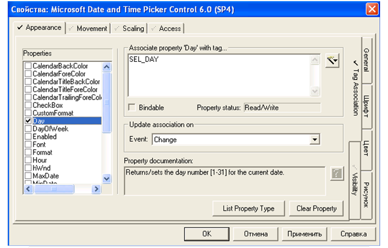
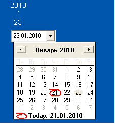

[Промислові мережі та інтеграційні технології в автоматизованих системах](README.md). 12. [ВІДКРИТІ ТЕХНОЛОГІЇ ПРОГРАМНОЇ ІНТЕГРАЦІЇ В СЕРЕДОВИЩІ WINDOWS](12.md) 

## 12.5. Технології СОМ/DCOM

### 12.5.1. Доступ до Процесів через COM. 

#### 12.5.1.1. Загальні поняття. 

СОМ (Component Object Model - компонентна модель об’єктів) – це об’єктно-орієнтована технологія, яка дозволяє одній прикладній програмі користуватися об’єктами іншої прикладної програми або бібліотеки. DCOM (Distributed Object Model – розподілена СОМ) додала можливість прозорого використання цих об’єктів на віддалених вузлах. У чистому вигляді технологія СОМ має практичне використання тільки при програмуванні. Тим не менше розуміння фундаментальних засад дозволяє уникнути проблем при використанні похідних від неї технологій.

#### 12.5.1.2. Технології на базі СОМ. 

Сама по собі модель СОМ реалізована у вигляді бібліотек, які завантажуються з Процесом. Компонент СОМ – це програмний код, який знаходиться в бібліотеці DLL (ОСХ) або у виконавчій програмі (типу ЕХЕ). 

Спочатку технологія розроблялася для підтримки складних документів, наприклад для можливості редагування таблиці Excel в документі Word. Це привело до появи технології OLE (Object Linking and Embedding – зв’язування та вміщення об’єктів), перша версія якого базувалася на DDE. Оскільки DDE не забезпечувала необхідну гнучкість, наступна версія вже базувалася на СОМ. 

Окрім термінів COM та OLE існують також COM+, OLE Automation та ActiveX. COM+ можна вважати як розширений варіант моделі СОМ, який вміщує різноманітні служби, які раніше були корисними доповненнями до СОМ. 

OLE Automation – реалізація COM, що вимагає наявність спеціального типу DISP-інтерфейсу. DISP-інтерфейс дає можливість реалізувати механізм пізнього зв’язування з об’єктами СОМ, що дає можливість використовувати їх в VB, VBA, VB Script, JAVA script та інших системах програмування.

Терміном ActiveX називають все, що відноситься до OLE Automation, плюс деякі допоміжні можливості, зокрема підтримку сценаріїв та використання елементів управління ActiveX. Останні, до речі, дуже широко використовуються у різноманітних програмах із області промислової автоматизації (SCADA-, MES- системи і т.п.). Хоч наведені терміни широко вживаються, на сьогоднішній день немає чіткого визначення терміну ActiveX, тому часто з цим словом пов’язують все, що стосується OLE Automation та ActiveX. 

#### 12.5.1.3. СОМ-інтерфейси. 

Доступ до методів об’єкту СОМ проводиться через СОМ-інтерфейси. Під СОМ-інтерфейсом (надалі інтерфейсом) можна розуміти умовний логічний канал доступу до методів об’єкта. Програма, яка користується цим об’єктом не викликає його методи (методи класу), а викликає методи інтерфейсу. 

Кожний інтерфейс має унікальний 128-бітний ідентифікатор, який зветься ідентифікатором інтерфейсу (IID - Interface Identifier). Кожний інтерфейс абсолютно унікальний, тобто немає двох інтерфейсів з однаковим ідентифікатором. Якщо два об’єкти підтримують інтерфейси з однаковими ідентифікаторами, вони повинні мати одні і ті самі методи інтерфейсів, які призначені для однієї й тієї ж самої дії. Це значить, що внутрішня реалізація об’єктів може бути різною, а інтерфейси та поведінка - співпадати. 

#### 12.5.1.4. СОМ-класи. 

Об’єкти (екземпляри) в СОМ створюються на основі класу об’єкту. Для людей, знайомими з об’єктно-орієнтованим програмуванням, зрозуміло, що об’єкт – це екземпляр класу. СОМ об’єкти, які реалізують один і той самий набір СОМ-інтерфейсів відносяться до одного класу. Кожний клас має унікальний ідентифікатор класу (CLSID – Class Identifier). 

#### 12.5.1.5. Взаємодія між Процесами через СОМ. 

Взаємодія між прикладними Процесами функціонує на базі моделі Клієнт-Сервер. Програми, в яких знаходяться та створюються COM об’єкти називаються СОМ-Серверами а програми які користуються цими об’єктами - COM-Клієнтами. В залежності від того де знаходиться програма СОМ-Сервер по відношенню до СОМ-Клієнта, виділяють такі типи Серверів:

-     Внутрішній Сервер (In-Process Server) – Сервер який знаходиться в середині того самого Процесу, що і Клієнт (наприклад реалізований як бібліотека DLL);

-     Локальний Сервер (Local Server) – Сервер який запускається як окремий Процес (ЕХЕ модуль);

-     Віддалений Сервер (Remote Server) – Сервер, який запускається на віддаленому вузлі в мережі (ЕХЕ модуль, або бібліотека DLL в сурогатному Процесі); 

Всі класи та інтерфейси реєструються в системному реєстрі Windows. Там крім їх ідентифікатора зберігається додаткова інформація, зокрема про імена файлів, в яких реалізований даний клас. Для доступу до них та їх активації використовується спеціальний процес SCM (диспетчер управління службами). 

#### 12.5.1.6. Контроль доступу до об’єктів СОМ. 

Для захисту доступу до об’єктів класів використовується так званий декларативний захист. Механізм активізації і контролю доступу базуються на механізмі ролей. Для кожного зареєстрованого класу записи в реєстрі визначають, які користувачі Windows або групи користувачів мають право створювати екземпляри даного класу, тобто об’єкти. Користувачі визначаються при аутентифікації, тобто при їх перевірці, наприклад вводу паролю при вході в Windows. DCOM підтримує декілька рівнів аутентифікації:

-    без аутентифікації; 

-    при першому з’єднанні з сервером;

-    при кожному зверненні;

-    всіх пакетів даних;

-    пакетів даних з перевіркою їх цілісності;

-    пакетів даних з перевіркою їх цілісності і шифрування пакетів даних. 

Для настройки захисту у Windows є спеціальна утиліта Dcomcnfg.exe, яка запускається з командного рядку. 

Приклад 12.4. Технології програмної інтеграції. Налаштування DCOM коніфігуратору. 

 Завдання. Забезпечити можливість доступу до COM-серверу Schneider-Aut OPC Factory Server з боку інших комп’ютерів в мережі. 

Рішення. 

1. Для роботи в мережі без виникнення проблем, необхідною умовою є відключення програм, які можуть блокувати мережний трафік. Відключення Брандмауерів можна зробити в розділі Администрирование->Службы:

-   брандмауэр Windows/Общий доступ к Интернету (ICS) = отключено;

-   центр обеспечения безопасности = отключено.

2. Для роботи сервісів DСОМ необхідно запустити та перевести в автоматичний запуск наступні служби:

-        запуск серверных процессов DCOM

-        локатор удаленного вызова процедур (RPC)

-        удаленный вызов процедур (RPC)

3. Необхідно правильно задати конфігурацію DCOM. З панелі запуску викликається dcomcnfg,  де налаштовуються  властивості  по  замовченню:  Службы компонентов -> Компьютеры->Мой компьютер-> контекстне меню Свойства. 

Вкладка "Свойтсва по умолчанию":

- разрешить использования DCOM =так;

- уровень проверки подлинности по умолчанию = подключение

- уровень олицетворения по умолчанию = идентификация

Вкладка "Безопасность СОМ".

 Для "Права доступа" та "Разрешение на запуск и активацию" добавити користувача типу "Все" і відкрити доступ до всього (виставити всі опції).

Вкладка "Протоколы по умолчанию".

 Вибираємо "TCP/IP с ориентацией на подключение"->"Свойства", добавляємо діапазон портів "0-65535" для призначення "Диапазон интрасети".В DCOM конфігураторі вибираємо "Настройка DCOM" і для кожного з серверів (Schneider-Aut OPC Factory Server) виставляємо всі настройки рівними "по умолчанию", для інших настройок:

- Расположение = запустить приложение на данном компьютере/запустить приложение на компьютере где находятся данные;

- Удостоверение = текущий пользователь.

На вузлі клієнта і сервера повинен бути зареєстрований користувач з однаковими параметрами. Необхідно відмітити, що у даному прикладі відключаються більшість захисних механізмів, які надає Windows XP.

### 12.5.2. Використання OLE та ActiveX.

Від користувачів технології СОМ часто приховані механізми його функціонування. Так, при створенні мнемосхеми на SCADA можна скористатися елементами ActiveX, розмістивши їх на формі (сторінці, мнемосхемі ...) та прив’язавши їх властивості до певної змінної. Звісно цей механізм повинен підтримуватися даною SCADA-програмою, а потрібні елементи ActiveX – присутні на комп’ютері. За допомогою OLE можна помістити на мнемосхему таблицю Excel, документ типу PDF або інші OLE-об’єкти. 

Якщо у складі програмного пакета (SCADA, офісна програма, CAD) є вбудована VBA, то програма написана на цій мові може працювати з об’єктами основного програмного пакету теж за допомогою ActiveX. Крім того, межі використання програмного пакету можна значно розширити, за рахунок використання додаткових елементів ActiveX.

Розглядаючи  ActiveX треба зазначити, що його поява пов’язана з бурхливим розвитком Інтернет-технологій, де елементи ActiveX можуть використовуватись для оживлення Інтернет-сторінок. Однак в цій технології є ряд недоліків. Так наприклад, заради безпеки вузлів в мережі, брандмауери закривають доступ DCOM пакетам. Це обмежує його використання в мережі Інтернет. Знову ж таки з причин надійності, кращою альтернативою ActiveX елементам в WEB-сторінках можуть бути JAVA-аплети. Адже код, який поставляється в ActiveX навмисно або ненавмисно може пошкодити дані на комп’ютері. Microsoft ввели додатковий механізм захисту під назвою "Цифровий підпис", однак часто навіть "підписані" програми можуть призвести до збоїв в роботі системи. JAVA-аплети ж виконуються на віртуальній машині, тому більш надійні в порівнянні з ActiveX. 

Приклад 12.5. Технології програмної інтеграції. Використання ActiveX компонентів.

Завдання. В SCADA Citect забезпечити можливість вибору оператором необхідної дати в зручному графічному інтерфейсі, для подальшого її використання в перегляді історичних трендів. Для цього використати ActiveX елемент "Microsoft Date AND Time Picker Control". 

Рішення. Спочатку в Citect Editor визначимо три внутрішні змінні типу INT: SEL_DAY, SEL_MONTH, SEL_YEAR. Ці змінні плануються для використання в мові Cicode для визначення початкової дати перегляду трендів. В Graphics Builder на панелі Tools, вибираємо елемент ActiveX, після чого з’явиться список встановлених на ПК елементів ActiveX. Необхідно вибрати елемент "Microsoft Date AND Time Picker Control", і вибравши вкладку "Appearance", закладку  "TagAssociation", у вікні "Propertiies" настроїти наступні властивості:

-        властивість Day, вибрати тег SEL_DAY, в полі "Update association on" вибрати "Change" (рис.12.3);

-        властивість Month, вибрати тег SEL_MONTH, в полі "Update association on" вибрати "Change";

-        властивість Date, вибрати тег SEL_DATE, в полі "Update association on" вибрати "Change";

Рис.12.3. Зовнішній вигляд вікна нсатройки елмента ActiveX в SCADA Citect.

Рис.12.4.Фрагмент мнемосхеми RunTime системи SCADA Citect з демонстрацією роботи ActiveX елемента

Зробимо деякі пояснення. На вкладці "TagAssociation" настроюється зв’язок властивостей ActiveX з значеннями змінних. Запис значень властивостей в змінні проводиться в момент виникнення події, яка задається в полі "Update association on". 

Для відображення внутрішніх змінних на мнемосхемі виведемо 3 елементи Number, і в закладці "Display Value" прив’яжемо їх значення до змінних SEL_DAY, SEL_MONTH, SEL_YEAR 

Результат роботи RunTime системи з елементом ActiveX "Microsoft Date AND Time Picker Control" показаний на рис 12.4. 

<-- 12.4. [Технології DDE та NetDDE](12_4.md)  

--> 12.6. [Web Технології](12_6.md) 