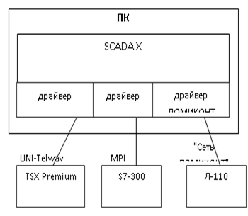
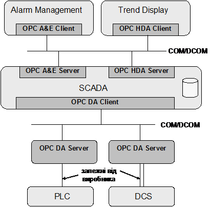
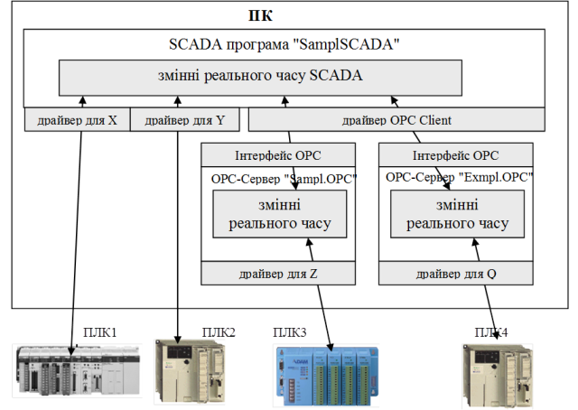
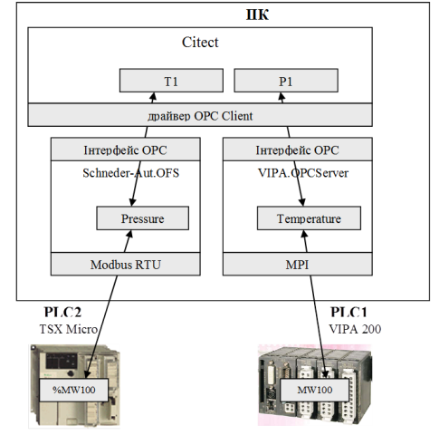
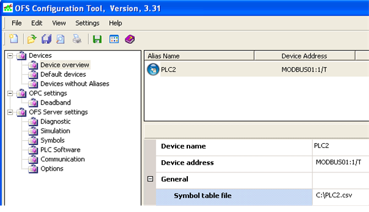
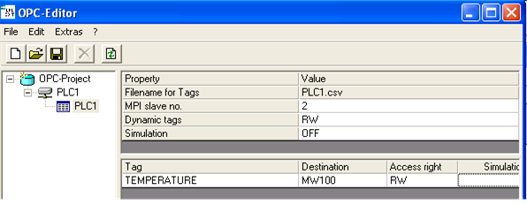
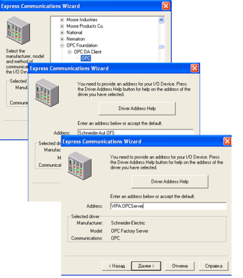
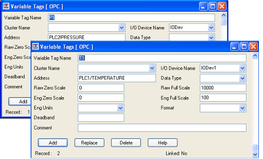

[Промислові мережі та інтеграційні технології в автоматизованих системах](README.md). 13.[Технологія ОРС](13.md)

## 13.1. Загальні концепції

### 13.1.1. Передумови виникнення

#### 13.1.1.1. Вибір SCADA/HMI по набору підтримуваних комунікацій. 

Один з критеріїв вибору SCADA програми – перелік підтримуваних комунікацій. Тобто SCADA з одного боку і технічний засіб (надалі контролер) з іншого, повинні підтримувати однаковий протокол (або протоколи) промислової мережі. Найчастіше вибирають ту мережу, яка вже інтегрована в контролер. В цьому випадку при виборі SCADA враховують наявність даних протоколів в переліку комунікаційних драйверів.

#### 13.1.1.2. Проблеми сумісності SCADA/HMI з контролерами. 

При інтеграції продуктів одного виробника, наявність в SCADA-програмі драйверів зв’язку з необхідними контролерами є очевидною. Найскладнішим є випадок, коли необхідно інтегрувати засоби від декількох виробників, ряд з яких підтримують закриті протоколи. В цій ситуації дуже важко підібрати таку SCADA-програму, яка б підтримувала всі необхідні протоколи промислових мереж. Розглянемо, які можливі варіанти реалізації подібної системи.  

1. Вибір іншої промислової мережі, яка б підтримувалась з боку SCADA та контролеру. Цей варіант не завжди можливо реалізувати. 

2. Написання спеціального драйверу, якого не існує в SCADA, для забезпечення зв’язку з контролером. Цей варіант потребує залучення програміста досить високого рівня підготовки, наявності відкритого програмного інтерфейсу з боку SCADA-програми та відкритого протоколу обміну з контролером.

3. Заміна частини одних контролерів іншими, для яких є драйвери зв’язку. Цей варіант потребує значних капітальних затрат і може бути використаний як виключна міра. 

4. Використання шлюзів для промислових мереж. Варіант також потребує значних капітальних затрат і не завжди реалізується.

Як бачимо, одні способи сильно обмежують реалізацію системи, а інші потребують значних капітальних затрат. Розглянемо приклад.

Приклад 13.1. ОРС.  Вибір SCADA програми. 

Завдання. Система управління технологічним процесом включає три підсистеми, в кожній із яких використовуються різні за типом і виробником контролеру: TSX Premium (Schneider Electric), S7-300 (Siemens), Ломіконт Л-110 (Чебоксари) (рис.13.1.). Необхідно вибрати SCADA-програму серед трьох варіантів (Citect 7, Zenon 6, Trace Mode 6), яка б забезпечувала зв’язок з усіма підсистемами, враховуючи використання вбудованих комунікацій в ПЛК, та без придбання додаткових конвертуючих програмних засобів. 

Рішення. При виборі SCADA-програми необхідно перевірити перелік комунікаційних драйверів зв’язку для підтримки вказаних контролерів. Необхідні три типи драйверів: UNI-Telway (для TSX Premium), S7-MPI (для S7-300) та драйвер Сеть Ломиконт (для Л-110).  

Протоколи для підключення засобів до SCADA-програми реалізовані у вигляді драйверів зв’язку. Зрозуміло, що інтерфейс драйверів з боку SCADA для кожної реалізації різний, тому драйвери для однієї SCADA-програми не підійдуть для іншої. Тому необхідно вибрати ту, яка має всі три драйвери. Citect 7 та Zenon 6 підтримують всі комунікації, крім Ломіконту. ТМ6 – всі комунікації, однак S7-MPI потребує наявність драйверів SIMATIC NET і має певні обмеження у використанні. Таким чином жодна з перерахованих SCADA-програм не задовольняє вказаним в умові задачі критеріям вибору. Необхідне використання додаткових програм-конверторів, розглянути можливість вибору іншої SCADA, мережі або написання драйверу зв’язку.    



Рис.13.1. Підключення декількох контролерів до  SCADA-програми

Наведений вище приклад – це один із багатьох, який обумовлює вирішення проблеми вибору SCADA. Для конкурентноздатності найбільш відомі компанії, які займаються розробкою програмного забезпечення верхнього рівня для систем автоматизованого управління, забезпечили їх великою кількістю драйверів зв’язку для пристроїв найбільш відомих брендів. Однак поставлена задача не завжди може бути вирішена шляхом вибору певної SCADA. Адже пристрій управління може бути розроблений невеликою компанією, яка не є всесвітньо відомим брендом і для якої не розроблявся відповідний драйвер.

#### 13.1.1.3. ОРС – як універсальний драйвер зв’язку. 

Для подолання цієї проблеми, групою великих компаній було вирішено створити стандартний інтерфейс доступу до даних "драйвера" зі сторони програмного забезпечення верхнього рівня. Таким чином, будь який драйвер зі стандартним інтерфейсом може бути використаний будь-якою SCADA-програмою, яка цей інтерфейс підтримує. Технологія отримала назву ОРС.

### 13.1.2. Стандарти ОРС

#### 13.1.2.1. Походження. 

Перша версія стандарту OPC (OPC DA 1.0) розроблена групою компаній, які в 1996 році організували некомерційну організацію OPC Foundation ([www.opcfoundation.org](http://www.opcfoundation.org/)), що займається розвитком та просуненням даної технології на ринку. 

#### 13.1.2.2. Доступні специфікації. 

На сьогоднішній день стандарт існує в наборі специфікацій, основні з яких:

1) OPC DA (Data Access) – специфікація доступу до даних реального часу;

2) OPC AE (Alarms & Events) – для реалізації задач попереджувально-аварійних сигналізацій;

3) OPC HDA (Historical Data Access) – для реалізації задач ведення архіву та доступу до архівних даних;

4) OPC DX (Data eXchange) – для безпосереднього обміну між ОРС-серверами;

5) OPC XML – для обміну даними через інтермережі за допомогою структур XML на базі WEB-сервісів та SOAP;

6) OPC Batсh – для реалізації управління рецептурними задачами.

7) OPC UA (United Architecture) – самий новий платформо-незалежний стандарт, який об’єднує функції всіх наведених вище специфікацій, але функціонує не на базі СОМ а WEB-сервісах . 

Серед наведених вище стандартів найбільшу популярність на сьогоднішній день має OPC DA 2.0, всі інші зустрічаються набагато рідше. Стандарт OPC UA є найновішим стандартом, однак поки що не знайшов широкого вжитку. Планується, що OPC UA в найближчому майбутньому витіснить OPC DA 2.0 та всі супутні йому стандарти..

#### 13.1.2.3. Визначення ОРС. 

Першопочатково технологія OPC розшифровувалась як OLE for Process Control і являлась промисловим стандартом взаємодії між програмними засобами в області промислової автоматизації,  який базується на об’єктній моделі COM/DCOM (OLE). Однак при появі нових специфікацій, зокрема XML та UA, які не базуються на СОМ, слово "OLE" в абревіатурі перестало відповідати дійсному функціональному змісту технології. Тому на сьогоднішній день немає офіційної розшифровки терміну ОРС. 

Тому будемо користуватися таким поняттям ОРС - це відкрита технологія зв’язку (open connectivity) в області промислової автоматизації та управління виробництвом. 

#### 13.1.2.4. Загальна модель. 

В загальному випадку, технологія ОРС забезпечує одній програмі (ОРС-Клієнту) доступ до даних процесу іншої програми (ОРС-Серверу) через стандартний набір інтерфейсів. Розглянемо набір інтерфейсів, які базуються на СОМ-технології, через призму їх використання в системах АСУТП (рис.13.2). Це інтерфейси, які описуються специфікаціями OPC DA, OPC A&E та OPC HDA. 

#### 13.1.2.5. OPC DA (Data Access). 

СОМ-інтерфейси ОРСDА стандартизують доступ ОРСDA-Клієнту до даних процесу ОРСDA-Серверу. В свою чергу програма ОРС-Сервер, як правило здійснює обмін даними з контролерами або розподіленою периферією через специфічний, відмінний від ОРС, інтерфейс. В цьому випадку, ОРСDA-Сервер надає доступ ОРСDA-Клієнту до даних процесу пристроїв, з якими він обмінюється тому служить в якості програми-шлюза. 

Всі перераховані в задачі 13.1 SCADA-програми можуть бути ОРСDA-Клієнтами, оскільки мають в наявності відповідний драйвер. Тому, придбавши ОРСDA-Сервер для Ломіконт, можна зв’язати Zenon та Citect з Л-110, а придбавши ОРСDA-Сервер з підтримкою S7-MPI, можна повноцінно поєднати Trace Mode з S7-300. Таким чином в даному випадку ОРСDA-Сервер можна назвати універсальним (з боку SCADA) драйвером зв’язку. Слід зазначити, що ряд SCADA-програм повністю базуються на ОРС (Genesis, Master SCADA).

#### 13.1.2.6. OPC AE (Alarms & Events). 

ОРСАЕ-Клієнт використовує ОРСАЕ-Сервер для контролю за процесом, тобто за виникненням певних подій. Ці події налаштовуються в межах Серверу. ОРСАЕ-Клієнт з’єднується з ОРСАЕ-Сервером і підписується під отримання повідомлень про виникнення цих подій. При підписці, ОРСАЕ-Клієнт вказує додаткові критерії фільтрації повідомлень. Специфікацією підтримується можливість квітування повідомлень ОРСАЕ-Клієнтом.      



Рис.13.2. Типове використання технології ОРС

#### 13.1.2.7. OPC HDA (Historical Data Access). 

ОРСHDA-Сервер надає доступ ОРСHDA-Клієнту для отримання збережених даних. Даний сервер підтримує два СОМ-Об’єкти: OPCHDAServer – який надає доступ до архівних даних, та OPCHDABrowser, який надає доступ до переліку змінних, які зберігаються в архіві. 

Читання архівних даних проводитись з використанням 3-х різних механізмів. Перший механізм передбачає зчитування архівних даних в певному часовому діапазоні для однієї або декількох змінних, які визначені іменами. Кількість зчитаних значень обмежується Клієнтом. Другий механізм передбачає зчитування архівних даних по часу їх відновлення (TimeStamp). Третій механізм дозволяє отримувати статистичну інформацію по збереженим даним. В ОРС HDA інтерфейсі також передбачена можливість вставки, заміни або знищення архівних даних.        

В наступних підрозділах буде розглядатися тільки ОРС DA технологія. 

### 13.1.3. Функціонування ОРС з точки зори інтегратора

Найбільш часто ОРС-технологія використовується в якості універсального інтерфейсу до драйверів контролерів та периферійних пристроїв. Тобто разом з контролером може поставлятися спеціальна програма - ОРС-Сервер, який надає доступ до змінних цього типу контролеру. Тобто ОРС-Сервер з одного боку має драйвери для зв’язку з контролерами по конкретним протоколам промислових мереж, а з іншого - надає універсальний ОРС-інтерфейс для зв’язку з сервером SCADA-програми. В такій системі SCADA буде ОРС-Клієнтом. 

На рис.13.3 показана спрощена схема функціонування роботи ОРС-технології в контексті описаної системи. База даних реального часу SCADA-програми (з умовною назвою "SamplSCADA"), збирає дані з чотирьох джерел:  ПЛК1, ПЛК2, ПЛК3 та ПЛК4. Для перших двох контролерів для збору даних використовуються драйвери зв’язку для цих ПЛК, вірніше для протоколів промислових мереж, по яким вони з’єднуються. Дані зчитуються (або записуються) з ПЛК в БДРЧ. Зв’язок з ПЛК3 та ПЛК4 виконується через ОРС-сервери з умовними назвами відповідно "Sampl.OPC" та "Exmpl.OPC" з використанням драйвера ОРС-Клієнт. Тобто ОРС-Сервери через вбудовані драйвери зчитують дані з ПЛК та зберігають їх в своїй базі даних реального часу. SCADA-програма в свою чергу зчитує дані з ОРС-серверів. Запис даних відбувається аналогічно.  

 

Рис.13.3. Функціонування ОРС з точки зору інтегратора

Для реалізації такого зв’язку користувач повинен: 

1. Налаштувати OPC-Сервер за допомогою спеціалізованої програми-конфігуратора, що поставляється разом з ним: створити всі необхідні змінні сервера, тобто дати їм ім’я (ItemID) та вказати джерела даних в ПЛК, на які вони посилаються. 

2. В SCADA-програмі вказати:

-     назву ОРС-Сервера, з яким необхідно зв’язатися (ProgID). У нашому прикладі це будуть два сервери "Sampl.OPC" та "Exmpl.OPC". Інколи SCADA надає можливість вибору ProgID зі списку зареєстрованих ОРС-Серверів. 

-     для вибраної змінної в якості джерела даних вказати ім’я на ОРС-Сервері, тобто ItemID, що був створений на 1-му кроці. Як правило ItemID вибирається зі списку, який надає Browser на стороні ОРС-Клієнта. 

Приклад 13.2. ОРС. Конфігурація ОРС-Серверів та ОРС-Клієнта (SCADA). 

Завдання. Налаштувати ОРС-сервери (Schneider-Aut.OFS, VIPA.OPC-Server) та SCADA (Citect) для зчитування наступних змінних (рис.13.4) :

-    MW100, що відповідає за температуру з PLC1(VIPA200) по протоколу MPI;

-    %MW100, що відповідає за тиск з PLC2 (TSX Micro) по протоколу Modbus RTU;

Для зв’язку з контролерами використовуються ОРС-сервери:

-     OFS-Servrer від Шнейдер Електрик (ProgID=Schneider-Aut.OFS), що підтримує ряд протоколів, зокрема Modbus RTU;

-     VIPA OPC-Server від фірми VIPA (ProgID=VIPA.OPCServer), що підтримує протокол MPI. 

Рішення. 

1. Конфігурування OFS. Відповідно до рис.13.4 на даному OPC сервері необхідно створити змінну з назвою "Pressure", джерелом даних для якої буде змінна %MW100 на PLC2. Для конфігурування OFS-сервера використовується утиліта OFS Configuration Tool.



 Рис.13.4. Схема обміну даним SCADA Citect з використанням ОРС.

Дані визначаються наступним чином (рис.13.5):

-     створюється псевдонім, який буде вказувати на адресу конкретного пристрою, з яким може обмінюватись ОРС-сервер. У нашому випадку псевдонім пристрою має ім’я PLC2);

-     для створеного псевдоніму вказується драйвер зв’язку, адреса пристрою та додаткові параметри, що уточнюють місцезнаходження його в мережі; в нашому випадку в результаті конфігурування створиться адреса: MODBUS01:1/T;

-     для створеного псевдоніму пристрою вказати файл, в якому будуть знаходитись символьні імена та відповідні їм змінні контролера. У нашому випадку вибраний файл PLC2.CSV, в якому сформований запис:

```
%MW100 PRESSURE
```



Рис.13.5. Конфігурування ОFS

Відповідно до правил іменування змінних в OFS, ідентифікатор потрібної змінної буде формуватися наступним чином: 

```
ItemID = Ім’я_псевдоніму_пристрою!Ім’я_змінної
```

В нашому випадку ідентифікатор змінної буде −PLC2!PRESSURE. 

2. Конфігурування VIPA-OPC. Конфігурування для VIPA OPC-Server виконується з використанням утиліти OPC Editor. Аналогічно OFS, на сервері створюються пристрої, в межах яких визначаються змінні, однак їх порядок і форма дещо відрізняються (рис.13.6).



Рис.13.6. Конфігурування VIPA-OPC.

Спочатку вибирається драйвер мережі (в нашому випадку MPI). В межах мережі створюється PLC (в нашому випадку PLC1), а в межах пристрою вказується назва змінної (Tag) та її адреса в ПЛК (TEMPERATURE - MW100) Відповідно до правил іменування змінних в VIPA OPC ідентифікатор змінної буде формуватися наступним чином: 

```
ItemID = Ім’я_PLC/Ім’я_змінної
```

В нашому випадку ідентифікатор змінної буде: PLC1/TEMPERATURE 

3. Створення проекту для Citect. Всі змінні в Citect (VariableTag) створюються в межах віртуальних пристроїв (IODevices). Тому необхідно створити два IODEvices, які будуть відповідати за ОРС Сервери. Для створення IODevices скористаємось Express Communication Wizard (рис.13.7). В обох випадках вибирається драйвер ОРС DA Client. В полях Address вказується ім’я ОРС-Серверів, тобто їх ProgID.



Рис.13.7. Створення в Citect IODevices, прив’язаних до OPC-серверів

Далі необхідно створити змінні (рис.13.8) з прив’язкою до створених IODevices, та в полі адреси вказати відповідні ItemID.  

)

Рис.13.8. Створення в Citect Variable Tags


<-- 13. [Технологія ОРС](13.md)

--> 13.2. [Принципи функціонування ОРС DA](13_2.md) 