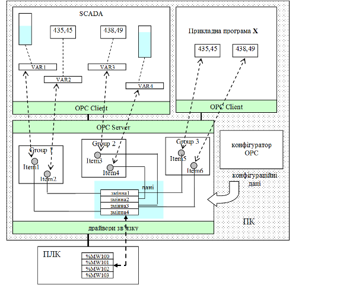
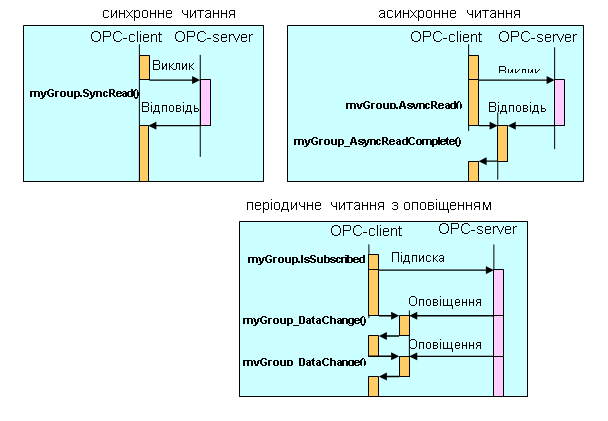
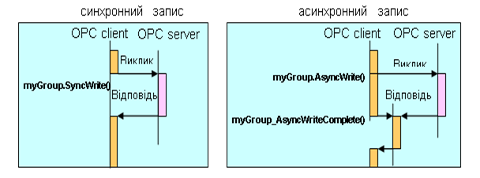
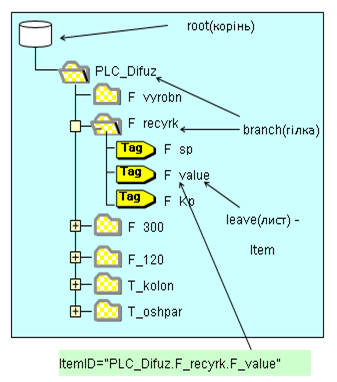
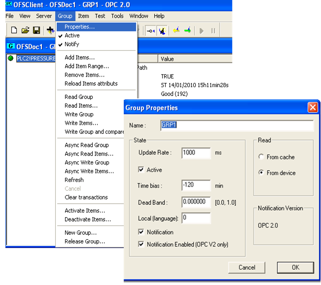
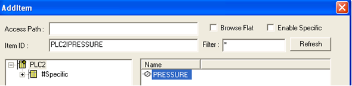
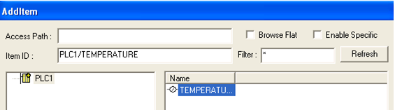
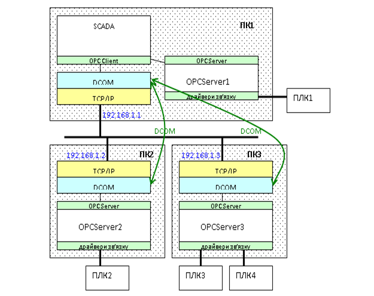

[

[Промислові мережі та інтеграційні технології в автоматизованих системах](README.md). 13.[Технологія ОРС](13.md)

## 13.2. Принципи функціонування ОРС DA

### 13.2.1. ОРС модель взаємодії. 

#### 13.2.1.1. Клієнт-Серверна модель. 

ОРС DA технологія базується на Клієнт-Серверній архітектурі. ОРС-Клієнт користується послугами ОРС-Сервера, використовуючи СОМ-інтерфейси його об’єктів. В наведеному на рис.13.9 прикладі, ОРС-Клієнтом є SCADA-програма, задачею якої є відображення чотирьох змінних (%MW100-%MW103) які знаходяться на ПЛК. OPC-Сервер отримує необхідні дані через драйвери зв’язку і зберігає їх у своїй базі даних реального часу. Для того щоб доступитися до даних ОРС-Сервера, ОРС-Клієнт створює для себе ОРС-Group (Group1, Group2), в яких створює ОРС Item (Item1, Item2), що посилаються на ці дані.

ОРС-Клієнт (OPC Client) – прикладна програма, яка вміє користуватися об’єктами OPC-Сервера за допомогою ОРС-інтерфейсів (підмножина СОМ-інтерфейсів). 

ОРС-Сервер (OPC Server) – прикладна програма, яка надає доступ до визначених в специфікації ОРС СОМ-об’єктів за допомогою ОРС-інтерфейсів.

 З одним ОРС-Сервером можуть з’єднатися декілька ОРС Клієнтів. З іншого боку, одна і та сама програма ОРС- Клієнт, може одночасно користуватися послугами декількох ОРС-Серверів. Тобто ОРС технологія є мультиклієнтною і мультисерверною. 

#### 13.2.1.2. Ідентифікація ОРС-Серверу. 

Так як ОРС-Сервер – це СОМ-Сервер, він реєструється на комп’ютері унікальним числовим ідентифікатором (GUID) та має унікальний строковий програмний ідентифікатор (ProgID). Тобто, для того щоб для ОРС-Клієнта визначити з яким ОРС-Сервером на тому самому ПК йому необхідно з’єднатися, достатньо вказати його ProgID. 

#### 13.2.1.3. Об’єкти OPC-Item та ідентифікація даних. 

Об’єкт ОРС-Item надає доступ до джерела даних (надалі тег) в межах ОРС-Сервера, яке ідентифікується унікальним в межах сервера ідентифікатором ItemID. Тому при створенні ОРС-Item’а, вказується ItemID необхідного тега. Правила ідентифікації даних залежать від реалізації ОРС-Сервера, а механізм визначення їх джерел (наприклад адреса пристрою та змінної в ПЛК) як правило реалізується в конфігураторі цього сервера. В прикладі 13.2 ми вже розглянули два варіанта формування ItemID, нижче більш детально розгялнуті способи ідентифікації тегів. Тут тільки зазначимо, що весь список ItemID може мати деревовидну ієрархічну структуру, що дозволяє зручніше використовувати цей механізм в проектах з великою кількістю даних. Для навігації по списку/дереву ідентифікаторів ОРС-Сервер, як правило, має об’єкт OPC Browser. 

ОРС-Item належить Клієнту, який його створив і тому його не можуть використовувати декілька Клієнтів. Тим не менше є можливість посилатися на одні і ті ж дані. На рис. 13.9 два Клієнта одночасно використовують дані з %MW100 та %MW102, однак створюють для цього різні OPC-Item. Слід відмітити, що джерелом даних не обов’язково є змінна на зовнішньому пристрої, це можуть бути внутрішні дані самого Серверу. 

З кожним ОРС-Item'ом асоціюється плинне значення (Value), відмітка часу (Time Stamp) та якість (Quality). 

Рис.13.9. Принципи функціонування ОРС DA

#### 13.2.1.4. Групування OPC-Item в OPC-Group. 

OPC-Group – об’єкт ОРС-Сервера, який призначений для виконання групових операцій над ОРС-Item’ами. Так як ОРС-Item не може існувати без цього об’єкту, спочатку ОРС-Клієнт створює ОРС-Group, а потім в його межах створює ОРС-Item’и. 

В інтерфейсі OPC DA 2.0 кожний ОРС-Group, як і все його наповнення, належить окремому Клієнту. Механізм групування дозволяє розділяти дані за принципом читання/запису, періодичністю операцій та активувати/деактивувати відновлення змінних.

### 13.2.2. Механізми читання та запису даних процесу

#### 13.2.2.1. Загальні підходи. 

Технологія ОРС надає двохсторонній доступ до даних, тобто як для читання так і для запису. Механізми реалізації цих сервісів практично однакові за принципом, однак мають свої особливості у різних версіях специфікації ОРС DA. Ми розглянемо їх в контексті 2-ї версії цієї специфікації, оскільки на сьогодні вона є найбільш популярною. 

Читання зводиться до вирішення наступних питань:

-    коли на ОРС-Сервері повинні відновлюватися дані з пристроїв для кожного з ОРС-Item'ів;

-    яким чином про відновлення даних дізнається ОРС-Клієнт і як він їх отримає.

Операції читання та запису проводиться одночасно для всіх Item'ів в межах ОРС-Group. 

#### 13.2.2.2. Синхронне читання (Sync Read). 

Ініціація процесу відновлення змінних на ОРС-Сервері може проводитись самим ОРС-Клієнтом. Тобто при необхідності ОРС-Клієнт робить запит на відновлення певної ОРС-Group. В такому випадку Клієнт може заморозити виконання своєї програми (потоку), поки не дочекається результату читання від ОРС-Сервера. Такий спосіб називається Синхронним Читанням (Sync Read). На рис.13.10 графічно зображений процес обміну між ОРС-Клієнтом та ОРС-Сервером. При необхідності Клієнт робить запит за допомогою виклику метода SyncRead для OPC-Group "myGroup" та чекає поки той не поверне відповідь. 

Рис.13.10. Способи читання OPC-Item в ОРС-Group

#### 13.2.2.3. Аинхронне читання (Async Read).  

Механізм синхронного читання гальмує роботу програми (потоку) Клієнта, тому доречний для читання невеликих об’ємів даних. Альтернативою йому може бути використання Асинхронного Читання (Async Read), при якому ОРС-Клієнт теж ініціює обмін, однак не чекає результату обробки. Замість цього, при закінченні процесу читання ОРС-Сервер викликає функцію зворотного виклику ОРС-Клієнта (обробник події AsyncReadComplete), в яку передає результат читання. Для реалізації цього механізму необхідно, щоб в об’єкті OPC-Group був активований механізм Підписки (Subscript). 

#### 13.2.2.4. Періодичне Читання з Оповіщенням (Periodical Read with Notify). 

При необхідності відновлення даних , обидва наведених вище способи потребують від ОРС-Клієнта кожний раз проводити запит до ОРС-Сервера. Однак як правило дані необхідно читати періодично через певні інтервали часу. Для цього в специфікаціях OPC DA є механізм Періодичного Читання з Оповіщенням (Periodical Read with Notify). При створенні ОРС-Group, Клієнт замовляє частоту відновлення Item'ів в межах цієї групи. Через вказані проміжки часу ОРС-Сервер буде відновлювати ці дані, а результат буде зберігати в Кеші (Cache). Якщо дані (Value або Quality) хоча б для одного ОРС-Item'а в OPC-Group змінилися, буде викликана зворотна функція Оповіщення (Notify), тобто обробник події DataChange, в параметрах виклику якого будуть передані нові значення. Для ефективного використання цього механізму можна скористатися зоною нечутливості (Deadband). Необхідно зазначити, що в об’єкті OPC-Group повинен бути активований механізм Підписки та прапорець Активності (ACTIVE FLAG). Крім того, періодично відновлюватись будуть тільки Активні OPC-Item.      

#### 13.2.2.5. Синхронний та асинхронний запис. 

Операції запису можуть проводитись двома способами: Синхронний Запис (Sync Write) та Асинхронний Запис (Async Write). Функціонування повністю аналогічне як і в операціях читання (рис.13.11).

 Рис.13.11. Способи запису OPC Group

### 13.2.3. Ідентифікатори ItemID. 

#### 13.2.3.1. Способи ідентифікації даних.  

ItemID – це унікальний, в межах OPC-Сервера, символьний ідентифікатор, який однозначно ідентифікує дані (теги) на цьому Сервері. Тобто він не повинен вказувати, з якого пристрою беруться дані, а тільки де вони розміщуються на Сервері. 

Частіше всього ItemID створюються за допомогою конфігуратора ОРС Сервера. Саме там і конфігурується розміщення джерела даних. У прикладі 13.2. таким способом ідентифікуються теги на VIPA.OPCServer - "Temperature". 

В деяких реалізаціях ItemID може створюватись автоматично. В цьому випадку розміщення джерела даних, зона нечутливості, мінімум та максимум і інше вказується в самому символьному рядку ідентифікатора. Наприклад, символьний рядок ItemID "MODBUS01:5!%MW100" в OFS Server (OPC Server від Schneider Electric) означає, що джерело даних розміщується на шині Modbus у Веденого з адресою 5, в змінній %MW100.

#### 13.2.3.2. Доступ до списку ItemID (Об’єкт OPCBrowser).  

Для зручності ідентифікації джерела даних, ОРС-Сервер опціонально може підтримувати об’єкт-навігатор OPCBrowser. В версіях ОРС DA 1.0/2.0 та ОРС DA 3.0 реалізація механізмів навігації відрізняється, однак і в першому і в другому випадку весь перелік ItemID може формувати плаский список (flat) або ієрархічне дерево (hierarchical). Ієрархічна структура формується у вигляді дерева, приклад якого наведений на рис.13.12.

Рис.13.12. OPC Browser

OPCBrowser, як правило, потрі-бен тільки для Клієнтів, які необхідно конфігурувати, наприклад SCADA. У випадку його відсутності, користувачу треба добре знати правило формування символьного рядку ItemID для конкретного ОРС-Сервера, адже це не обумовлено в стандарті. Так наприклад, в рядку ItemID з рис.13.12 замість відокремлюючих крапок можуть використовуватися інші символи, наприклад "!". 

Приклад 13.3. OPC. Створення OPCGroup, OPCItem та налаштування відновлення, з використанням тестової програми OPC-Client. 

Завдання. Необхідно за допомогою тестової програми OFS-Client створити 2 групи в межах ОFS-Сервера, сконфігурованого по прикладу 13.2 з наступними параметрами:

-    перша група з періодичним читанням та оповіщенням (період=1с);

-    друга група тільки для синхронних операцій.

Продемонструвати роботу об’єкта OPC Browser для OFS Server та VIPA-OPC.

Рішення. OFS-Client – це тестова програма ОРС-Клієнта, яка поставляється разом з Сервером OFS від Шнейдер Електрик. За її допомогою можна перевірити роботу будь якого ОРС-Сервера. При запуску ОРС-Клієнта він пропонує вибрати один з ОРС-Серверів, зареєстрованих на ПК (рис.13.13). В нашому прикладі ми вибираємо Schneider-Aut.OFS. 

Рис.13.13. Вікно вибору ОРС Сервера в OFS Client.

При підключенні до Сервера, створюємо ОРС-Group (рис.13.14). Для першої визначаємо швидкість відновлення UpdateRate=1000 мс, виставляємо опцію Active – періодичне зчитування, виставляємо опцію Notifycation – активація оповіщення. На рис.13.14 видно, що можна також налаштувати зону нечутливості та способи її читання (Cash чи Device). Для другої групи опції Notifycation та Active повинні бути відключені. В обох випадках можна проводити операції синхронного читання або запису (Read Group/Write Group). Асинхронні операції можна проводити тільки для першої групи, оскільки тільки для неї активована функція оповіщення (Notifycation). Крім того для першої групи всі Item будуть автоматично відновлятися на сервері 1рас/с. 

Рис.13.14. Робота з ОРС Group. 

Вікна браузера ОРС-ItemID при підключенні до OFS Server та VIPA-OPC зображені відповідно на рис.13.15 та 13.16. З них видно, що перелік ItemID для обох серверів має ієрархічний вигляд. Виставивши опцію Browse Flat можна перейти до пласкої форми. Крім того браузер автоматично формує ItemID при його виборі. 

 

Рис.13.15. Вікно браузера ОРС-ItemID для OFS-Серверу.

 Рис.13.16. Вікно браузера ОРС-ItemID для Серверу VIPA-OPC

### 13.2.4.  Робота ОРС-Клієнта з віддаленими ОРС Серверами

ОРС-Клієнт та ОРС-Сервер на одному і тому самому ПК запускаються як окремі Процеси. Обмін даними між цими Процесами відбувається по правилам СОМ-технології. Інколи виникає необхідність у з’єднані ОРС-Клієнта з віддаленим ОРС-Сервером, який знаходиться у мережі на іншому ПК. Для такого з’єднання використовуються сервіси DCOM.

На рис.13.17 наведений приклад, у якому ОРС-Клієнт (SCADA) на ПК1 з’єднується з локальним ОРС-Сервером (OPCServer1) та двома віддаленими (OPCServer2 на ПК2 та OPCServer3 на ПК3). Для реалізації такого з’єднання для ОРС-Клієнта окрім ProgID необхідно вказати розміщення ПК з ОРС-Сервером, а також вірно налаштувати DCOM-конфігуратор. Таким чином необхідно виконати наступну послідовність:

1. Налаштувати DCOM Конфігуратор на вузлі Серверу та Клієнта (див. розділ 12).

2. Вказати Server Node (Ім’я вузла ОРС Серверу) або його IP.

3. Вказати ProgID Сервера. 

  

Рис.13.17. Приклад з’єднання трьох пристроїв через  DCOM

Однак зв’язатися з віддаленим ОРС за допомогою ОРС DA можливо тільки у випадку коли вузли знаходяться в межах одного домену або робочої групи Windows та не розмежовуються брандмауерами. Останні можуть не пропустити пакети СОМ (порти RPC як правило закриті для доступу), тому для з’єднання через Інтернет необхідно вдаватися до неабияких хитрощів. Щоб вирішити цю проблему OPC Foundation пропонує технології  OPC XML та OPC UA.

<-- 13.1. [Загальні концепції](13_1.md) 

--> 13.3. [Типи ОРС DA інтерфейсів](13_3.md) 