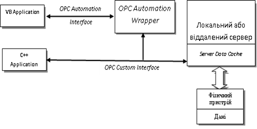
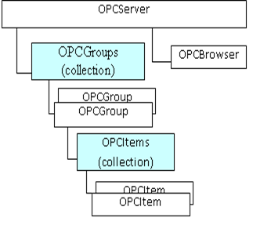
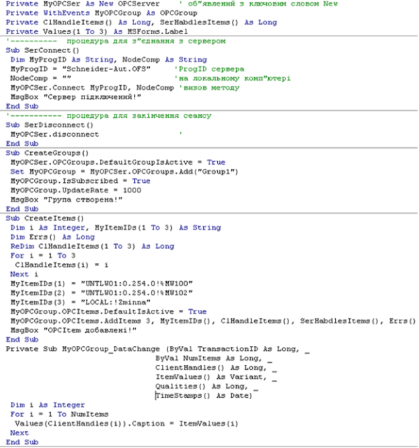

[Промислові мережі та інтеграційні технології в автоматизованих системах](README.md). 13.[Технологія ОРС](13.md)

## 13.3. Типи ОРС DA інтерфейсів

### 13.3.1. Загальний огляд типів інтерфейсів

OPC-Клієнти можуть зв'язуватись з OPC-Серверами через два набори COM-інтерфейсів: OPC Custom Interfaces і OPC Automation Interfaces (рис.13.18). Набір Custom інтерфейсів є обов'язковим набором COM-інтерфейсів, який використовують SCADA-програми та прикладні програми написані, наприклад, на C++ чи Delphi. 

Рис.13.18. Типи OPC-інтерфейсів

Набір Automation інтерфейсів був розроблений для використання їх в програмах, побудованих на MS Visual Basic (³V5.0) та VB for Application з використанням технології OLE Automation. Цей набір інтерфейсів є необов'язковим, але як правило присутній на OPC-Серверах основних виробників контролерів. Доступ до Сервера через такі види інтерфейсів проходить через так звану "Wrapper" DLL-бібліотеку, яка в свою чергу використовує той самий OPC Custom Interface. 

OPC Custom інтерфейси більш гнучкі і використовуються для написання OPC-Клієнтів професійними спеціалістами, наприклад для SCADA-програм. Однак для спеціалістів, які займаються розробленням та впровадженням систем автоматизації, може знадобитися знання Automation інтерфейсу, наприклад для написання невеликих програм на VBA, який вбудований в офісний пакет MS Office. Цей інтерфейс виділяється простотою у використанні, оскільки програміст не знаючи про механізми роботи COM/DCOM, може користуватися методами та властивостями об'єктів Сервера, як звичайного елемента управління. Для цього необхідно підключити бібліотеку типів - Wrapper (як правило, "OPC Automation 2.0" (OPCDAuto.dll), яку перед цим необхідно зареєструвати в операційній системі, виконавши операції:

1. Переписати OPCDAuto.dll в папку system32 системної папки;

2. Запустити команду реєстрації бібліотеки: regsvr32 opcdaauto.dll.

### 13.3.2. Об’єктна модель інтерфейсу OPC Automation

#### 13.3.2.1. Основні об’єкти OPC Automation. 

Нижче перераховані основні об’єкти бібліотеки OPC Automation 2.0, а також приклад їх застосування (табл.13.1). На рис.13.19 показана об’єктна архітектура Automation-інтерфейсу. 

Рис.13.19. архітектура Automation-інтерфейсу

Спочатку створюється об’єкт OPCServer, за допомогою якого можна продивитись список зареєстрованих Серверів та з’єднатися з необхідним. Об’єкт OPCBrowser призначений для доступу до списку ItemID. Створення та використання об’єктів OPCGroup та OPCItem можливе через об’єкти-колекції, в які вони об’єднані.

Таблиця 13.1 Основні об’єкти OPC Automation 2.0 та їх призначення

| Об’єкт     | Призначення                                                  |
| ---------- | ------------------------------------------------------------ |
| OPCServer  | Створюється для доступу до інших об’єктів  OPC-сервера: OPCGroups і OPCBrowser. |
| OPCGroups  | Колекція об’єктів OPCGroup для даного  ОРС-клієнта           |
| OPCGroup   | Даний об’єкт реалізує механізм створення та  знищення об’єктів OPCItem та збору  даних для цих об’єктів |
| OPCItems   | Колекція об’єктів OPCItem, створених в межах  OPCGroup       |
| OPCItem    | Об’єкт, який зберігає поточне значення даних на які  поси-лається, інформацію про їх стан та час останньої модифікації |
| OPCBrowser | Об’єкт, призначений для перегляду списку  ідентифікаторів даних ОРС-сервера |

#### 13.3.2.2. Послідовність створення об’єктів OPC Automation у програмі VBA. 

Застосування ОРС Automation інтерфейсу не потребує високої кваліфікації програміста. Тому найбільш ймовірні випадки його використання – це невеликі за обсягом програми, написані на VB-подібній мові. Це може бути макрос в MS Excel чи програма для візуалізації написана в VisualBasic. Багато сучасних SCADA-програм також мають вбудовані VBA чи VB-скрипти, в яких можна користуватися об’єктами OLE Automation та ActiveX. За допомогою цього інтерфейсу відкриваються додаткові можливості при вертикальній інтеграції в комп’ютерно-інтегрованих системах.

Пропонується наступний порядок створення об’єктів для доступу до даних на ОРС-Сервері.

1. Створюється об’єкт OPCServer:

-     оголошується об’єкт типу OPCServer з ключовим словом NEW;

-     викликається його метод Connect;

2. Створюється об’єкт OPCGroup:

-     оголошується об’єкт типу OPCGroup (для роботи з подіями об’єкта необхідно об’явити його з ключовим словом WithEvents на рівні модуля); 

-     в колекції OPCGroups викликається метод Add

3. Створюються об’єкти OPCItem шляхом виклику метода AddItems або AddItem.

4.   Для закінчення роботи з ОРС-Сервером необхідно викликати метод Disconnect відповідного об’єкту OPCServer.

#### 13.3.2.3. Користування сервісами читання та запису об’єктів OPC Automation у програмі VBA.

1. Періодичне читання групи (OPCGroup) з повідомленням:

-    відповідний об’єкт OPCGroup необхідно об’явити з ключовим словом WithEvents на рівні модуля;

-    властивісті IsActive та IsSubscribe відповідного об’єкту OPCGroup необхідно присвоїти  − TRUE;

-    властивісті IsActive кожного OPCItem, який треба відновлювати,  необхідно присвоїти − TRUE;

-    якщо хоча б одне значення OPCItem змінилося, буде викликаний обробник подій DataChange відповідного об’єкту OPCGroup.

2. Синхронне читання:

-    для читання декількох OPCItem в групі необхідно викликати метод SyncRead відповідного об’єкту OPCGroup;

-    для читання OPCItem необхідно викликати його метод Read.

3. Синхронний запис:

-    для запису декількох OPCItem в групі необхідно викликати метод SyncWrite відповідного об’єкту OPCGroup;

-    для запису OPCItem необхідно викликати його метод Write.

4. Асинхронне читання:

-    відповідний об’єкт OPCGroup необхідно об’явити з ключовим словом WithEvents на рівні модуля;

-    викликати метод AsyncRead відповідного об’єкту OPCGroup;

-    після обробки транзакції буде викликаний обробник подій AsyncReadComplete відповідного об’єкту OPCGroup.

5. Асинхронний запис:

-    відповідний об’єкт OPCGroup необхідно об’явити з ключовим словом WithEvents на рівні модуля;

-    викликати метод AsyncWrite відповідного об’єкту OPCGroup;

-    після обробки транзакції буде викликаний обробник подій AsyncWriteComplete відповідного об’єкту OPCGroup. 

### 13.3.3. Синтаксис основних методів, властивостей та подій об’єктів бібліотеки OPCAutomation

#### 13.3.3.1. Загальні формальні параметри. 

Перед тим як розглянути основні методи та властивості об’єктів бібліотеки OPCAutomation, розглянемо формальні параметри, які найбільш часто використовуються.

Для об’єктів типу OPCGroup та OPCItem: 

-     ClientHandle – це клієнтський дескриптор, за допомогою якого сервер зможе вказати клієнту на об’єкт (для ідентифікації);

-     ServerHandle – це серверний дескриптор, за допомогою якого клієнт зможе вказати на сервері об’єкт. 

У деяких методах та подіях повертаються наступні параметри:

-     Values – це масив прочитаних (записаних) значень OPCItem;

-     Errors – це масив, у якому розміщені коди помилок, якщо операція пройшла невдало;

-     NumItems – кількість OPCItem, які приймають участь у методі або повертаються з подією; 

-     Qualities – це масив, в якому розміщені значення параметрів якості даних

-     TimeStamps – список значень UTC TimeStamps (час відновлення) для кожного із даних.

Параметр Source вказує на Джерело даних OPC_DS_CACHE (кеш) або OPC_DS_DEVICE (пристрій) .  

#### 13.3.3.2. OPCServer. 

Повертає вказівку на колекцію об’єктів OPCGroup. Властивість по замовченню.

Таблиця 13.2

| Властивість/метод                                       | Опис                                                         |
| ------------------------------------------------------- | ------------------------------------------------------------ |
| OPCGroups                                               | Повертає вказівку на колекцію об’єктів OPCGroup. Властивість по замовченню. |
| GetOPCServers  (Optional Node As Variant) As  Variant   | Повертає масив імен (ProgID’s) зареєстрованих OPC Серверів на локальному або  віддаленому комп’ютері. Повернений ProgIDs можна використати в методі Connect.   Node –  ім’я  віддаленого вузла (комп’ютера), на якому потрібно  переглянути список зареєстрованих  OPC-серверів через  DCOM. Наприклад: UNC ім’я  (“Comp1”), або DNS ім’я (“server.com”, “www.vendor.com”, або “180.151.19.75”). |
| Connect   (ProgID As String, Optional  Node As Variant) | Використовується для з’єднання з OPC Data Access Server (через custom interface). При повторному використанні  методу об’єкту без явного його від’єднання від сервера automation wrapper буде автоматично відключати  існуюче з’єднання.   ProgID -  Унікальне ім’я (ProgID) зареєстрованого OPC Data Access Server  Node -  Може використовуватись для підключення до іншого комп’ютера через DCOM. |
| Disconnect()                                            | Від’єднання від OPC-сервера. Після від’єднання всі  посилання об’єктів OPCServer, OPCGroup(s) і OPCItem(s) будуть знищені. |
| CreateBrowser() As OPCBrowser                           | Створює об’єкт OPCBrowser та повертає ссилку на нього. Метод буде  виконаний тільки в тому випадку, якщо OPC Custom інтерфейс його підтримує (він  є опціональний). |

#### 13.3.3.3. OPCGroups.  

Об’єкт OPCGroups є колекцією об’єктів OPCGroup, за допомогою якого можна створювати, знищувати та управляти ними. Через нього можна також настроїти властивості по замовченню для груп, які будуть створюватись. Але для вже існуючих груп ці властивості залишаться такими як були

Таблиця 13.3

| Властивість/метод                                    | Опис                                                         |
| ---------------------------------------------------- | ------------------------------------------------------------ |
| Item (ItemSpecifier   As Variant) As OPCGroup        | Повертає ссилку на об’єкт OPCGroup по його ItemSpecifier (індекс починаючи з 1 або  ім’я). Метод по замовченню |
| Add  (Optional Name As Variant) As OPCGroup          | Створю новий об’єкт OPCGroup і добавляє його в колекцію. Група створюється з  властивостями по замовченню. Після створення властивості групи також можуть  змінюватись.  Name -  Ім’я групи. Повинно бути унікальним серед всіх груп даного клієнта, інакше  буде згенерована помилка. Якщо ім’я групи не вказується, сервер автоматично  присвоює їй унікальну назву. |
| GetOPCGroup   (ItemSpecifier As Variant) As OPCGroup | Повертає ссилку на об’єкт OPCGroup по його ItemSpecifier (OPCGroup’s ServerHandle або ім’я). |
| Remove  (ItemSpecifier As Variant)                   | Знищує вказану групу з колекції.  ItemSpecifier - OPCGroup’s ServerHandle або ім’я OPCGroup, яка буде знищена. |

#### 13.3.3.4. OPCGroup. 

OPC Group призначені для організації даних для клієнтів. Дані можуть як зчитуватись так і записуватись. OPC Клієнт може сконфігурувати час відновлення, через який OPC Сервер буде повідомляти про зміни значень OPCItem в групі.

Таблиця 13.4 

| Властивість/метод                                            | Опис                                                         |
| ------------------------------------------------------------ | ------------------------------------------------------------ |
| Name                                                         | Унікальне серед всіх груп  даного клієнта символьне ім’я групи. Якщо  клієнт не дає ім’я групі при створенні, то сервер генерує його автоматично. |
| IsActive                                                     | Стан групи (активна/неактивна). Якщо група неактивна, то група не буде  періодично зчитувати дані. |
| IsSubscribed                                                 | Ця властивість вказує на  можливість повідомлення клієнта в результаті роботи асинхронних  операцій. |
| ClientHandle                                                 | Значення клієнтського дескриптору, який  пов’язаний з групою. Його можна використовувати для ідентифікації групи при  повідомленнях. |
| ServerHandle                                                 | Значення унікального серед всіх  груп в сервері серверного дескриптору, який пов’язаний з групою. Цей  дескриптор використовується в деякий методах, наприклад OPCGroups.Remove. |
| UpdateRate                                                   | Найменше значення часу в мілісекундах відновлення всіх змінних в  групі. Сервер може не підтримувати таку швидкість відновлення, тоді він буде  зчитувати дані з найбільшою швидкістю, на яку здатен. |
| OPCItems                                                     | Колекція об’єктів OPCItem.  Властивість по  замовченню       |
| SyncRead  (Source As Integer, NumItems  As Long, ServerHandles() As Long, ByRef Values() As Variant, ByRef Errors() As Long, Optional ByRef  Qualities As Variant, Optional ByRef TimeStamps As Variant) | Операція синхронного читання,  повертає значення(value), якість(quality) та час відновлення(timestamp) items в групі. Функція буде чекати повернення результата.  Дані можуть бути прочитані із кеша у випадку, якщо вони будуть  задовільняти ‘UpdateRate’ і deadband для групи, в іншому випадку  вони будуть прочитані з пристрою. Якщо стан групи або елемента буде  неактивний, то при читанні з кеша Quality буде повернений OPC_QUALITY_OUT_OF_SERVICE. |
| SyncWrite  (NumItems As Long,  ServerHandles() As Long, Values() As Variant, ByRef Errors() As Long) | Операція синхронного запису  значення одного або декілька елементів в групі. Функція повертає управління тільки у випадку, коли значення буде записано  на пристрій(DEVICE). |
| AsyncRead  (NumItems  As Long, ServerHandles() As Long, ByRef Errors() As Long, TransactionID As  Long, ByRef CancelID As Long) | Операція синхронного читання,  повертає значення(value),  якість(quality) та  час відновлення(timestamp) items в групі, результат  повертається при повідомленні AsyncReadComplete для даного об’єкта OPCGroup. Асинхронне читання  проводиться тільки з пристрою (‘DEVICE’) при будь яких значеннях стану  ACTIVE групи або елемента.  TransactionID – ID транзакції, по якій клієнт при  отриманні повідомлення про обробку зможе ідентифікувати номер запиту на  читання.  CancelID - ID, згенерований сервером, для можливості відмови  поточної транзакції. |
| AsyncWrite  (NumItems As Long,  ServerHandles() As Long, Values() As Variant, ByRef Errors() As Long,  TransactionID As Long, ByRef CancelID As Long) | Операція асинхронного запису  значення одного, або декілька елементів в групі. Результат операції  повертається з повідомленням AsyncWriteComplete поточного об’єкта OPCGroup.  TransactionID - ID транзакції, по якій клієнт при  отриманні повідомлення про обробку зможе ідентифікувати номер запиту на  запис.  CancelID - ID, згенерований сервером, для  можливості відмови поточної транзакції. |
| DataChange   (TransactionID As Long,  NumItems As Long, ClientHandles() As Long, ItemValues() As Variant,  Qualities() As Long, TimeStamps() As Date) | Подія  виникає в тому випадку, коли значення або якість елемента в групі змінилося і  якщо даний елемент і група являються активними.  TransactionID - ID(ідентифікатор) клієнтського  запиту. Повертає ненульове значення ID запиту  функції AsyncRefresh, 0 – якщо подія виникла в  результаті відновлення по звичайній подписці на відновлення. |
| AsyncReadComplete  (TransactionID As Long,  NumItems As Long, ClientHandles() As Long, ItemValues() As Variant,  Qualities() As Long, TimeStamps() As Date, Errors() As Long) | Подія виникає після закінчення  обробки методу AsyncRead     |
| AsyncWriteComplete  (TransactionID As Long,  NumItems As Long, ClientHandles() As Long, Errors() As Long) | Подія виникає після закінчення  обробки методу AsyncWrite    |

#### 13.3.3.5. OPCItems. 

Це колекція елементів OPCItem, яка також визначає настройку об’єктів OPCItem по замовченню. При добавлені об’єкта OPCItem в колекцію властивості DefaultXXXX будуть ініціалізуватися по замовченню.

Таблиця 13.5

| Властивість/метод                                            | Опис                                                         |
| ------------------------------------------------------------ | ------------------------------------------------------------ |
| DefaultIsActive                                              | Статус активності для  новостворюваних елементів. По замовченню True. |
| Count                                                        | Кількість елементів в колекції.                              |
| Item  (ItemSpecifier As Variant)  As OPCItem                 | Повертає ссилку на елемент в  колекції.  ItemSpecifier - Номер (починаючи з 1) елемента в колекції |
| GetOPCItem  (ServerHandle As Long) As  OPCItem               | Повертає ссилку на OPCItem по його ServerHandle.  ServerHandle - Це серверний дескриптор OPCItem. |
| AddItem  (ItemID As String,  ClientHandle As Long)           | Створює новий об’єкт OPCItem і добавляє його в колекцію.  ItemID -  Повний ідентифікатор елемента  ClientHandle - Клієнтський дескриптор, який буде присвоєний об’єкту |
| AddItems  (Count As Long, ItemIDs() As  String, ClientHandles() As Long, ByRef   ServerHandles() As Long, ByRef Errors() As Long, Optional  RequestedDataTypes As Variant, Optional AccessPaths As Variant) | Створює  декілька об’єктів OPCItem і  добавляє їх в колекцію.  Count – Кількість елементів для  добавлення  ItemIDs – Масив із повних ідентифікаторів ItemID  ClientHandles – Масив клієнтських  дескрипторів елемнтів, які добавляються  ServerHandles – Масив серверних дескрипторів  елемнтів, які добавляються  Errors – Масив помилок, який індикує  результат створення елементів.  RequestedDataTypes – Опціональний Список типів  даних по кожному з елементів.  AccessPaths – Опціональний Список типів даних по кожному з  елементів, в якому вказаний шлях доступу Access Path’s. |
| Remove  (Count As Long,  ServerHandles() As Long, ByRef Errors() As Long) | Знищує об’єкти OPCItem і видаляє з колекції                  |
| SetActive   (Count As Long,  ServerHandles() As Long, ActiveState As Boolean, ByRef Errors() As Long) | Позволяє активувати або  деактивувати OPCItem в  колекції  ActiveState - TRUE для активації. FALSE для деактивації. |

#### 13.3.3.6. OPCItem. 

Представляє собою об’єкт, який підключається до джерела даних в межах сервера. Він зв’язаний з Value, Quality and Time Stamp кожного з елементів

Таблиця 13.6

| Властивість/метод                                            | Опис                                                         |
| ------------------------------------------------------------ | ------------------------------------------------------------ |
| ClientHandle                                                 | Клієнтський дескриптор,  асоційований з OPCItem. По цьому дескриптору клієнт  може визначити джерело даних при виклику події в групі. |
| ServerHandle                                                 | Унікальний серверний дескриптор  для елемента. Його необхідно вказувати при визові деяких методів (наприклад  OPCItems.Remove). |
| IsActive                                                     | Стан елемента (Активний = TRUE / неактивний = FALSE).        |
| Value                                                        | Повертає останнє значення  елемента. Властивість по замовченню. |
| Quality                                                      | Повертає останню величину  якості елемента.                  |
| TimeStamp                                                    | Повертає останню величину  часової мітки елемента.           |
| Read   (Source As  Integer, Optional ByRef Value As Variant, Optional ByRef Quality As Variant,  Optional ByRef TimeStamp As Variant) | Зчитує дані для елемента з сервера.  Дані можуть бути зчитані як з кеша так і з пристрою (OPCCache або OPCDevice) для відновлення інформації  про значення, якості та часової мітки елемента. |
| Write (Value As Variant)                                     | Записує значення елемента в  сервері.                        |

Приклад 13.4. ОРС. Робота з ОРС за допомогою VBA. 

Завдання. Написати програму на VB/VBA для періодичного зчитування 2-х змінних з ПЛК та 1 внутрішньої змінної OFS Сервера. 

Рішення. В VB створюємо форму, у якій розміщуємо 3 елементи: Labels(1), Labels(2), Labels(3). У цих елементах будуть відображатися значення змінних. Також створимо 3 кнопки, які будуть викликити відповідні процедури: SerConnect, CreateGroups та CreateItems.

В розділі об’явлення змінних (рис.13.20) вказуємо змінні для об’єктів класів OPCServer та OPCGroup. Для зберігання клієнтських та серверних індексів Item об’являємо два масиви. 

Рис.13.20. Лістинг програми на VBA для роботи з ОРС Сервером

При створенні групи в процедурі CreateGroups вказується ім’я групи, періодичність відновлення та активність. При створенні Item, в методі AddItems передається масив клієнтських дескрипторів (ClHandleItems). При відновленні даних буде викликаний обробник події DataChange об’єкта MyOPCGroup, в який у вигляді масивів будуть передані значення ItemValues(), TimeStamps(),Qualities() а також масив клієнтських дескрипторів тих змінних, які змінилися. По клієнтським дескрипторам змінні будуть відображені у конкретному текстовому полі Label.       

<-- 13.2. [Принципи функціонування ОРС DA](13_2.md) 

--> 13.4. [Область застосування технології ОРС](13_4.md)