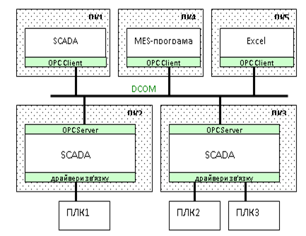

[Промислові мережі та інтеграційні технології в автоматизованих системах](README.md). 13.[Технологія ОРС](13.md)

## 13.4. Область застосування технології ОРС

У прикладах, наведених вище, розглянута технологія ОРС-DA в контексті вирішення проблеми доступу до даних ПЛК зі SCADA. Тобто ОРС-Сервер розглядався у якості стандартного драйвера зв’язку. Однак область застосування ОРС цим не обмежується. 

На рис.13.21 показаний приклад використання інтерфейсів ОРС в якості „мосту” між двома прикладними програмами на різних ПК. При горизонтальній інтеграції може знадобитися об’єднання в єдиний інформаційний простір SCADA програм. Популярність ОРС-технології призвела до появи в останніх не тільки клієнтської сторони ОРС, а і серверної. Тобто SCADA може виступати як ОРС-Клієнтом так і ОРС-Сервером. 

Рис.13.21. Приклад використання ОРС в якості „мосту”

Існування в SCADA Серверного інтерфейсу дає можливість доступитись до її даних зі сторони прикладних програм рівня MES чи ERP. Офісні програми завдяки наявності VBA та ActiveX теж надають таку можливість. 

<-- 13.3. [Типи ОРС DA інтерфейсів](13_3.md) 

--> 14. [Стандартні технології доступу до баз даних](14.md)

## Контрольні запитання до розділу 13

1. Розкажіть про передумови виникнення технології ОРС. Наведіть декілька способів подолання проблеми сумісності зв’язку SCADA-програм з контролерами, периферійними засобами, тощо. 

2.   Поясніть основні принципи функціонування технології ОРС. На якій технології міжпрограмного обміну вона базується?  Назвіть специфікації стандарту ОРС, які функціонують на сьогоднішній день, та їх призначення.

3.   Яку послідовність необхідно зробити, щоб забезпечити доступ в програмі ОРС-Клієнта до змінної в контролері через ОРС-Сервер? 

4.   Як визначаються дані в межах ОРС-Серверу та їх джерело? Як ідентифікуються ці дані ОРС-Клієнтом? 

5.   Як ОРС-Клієнт ідентифікує необхідний ОРС-Сервер?

6.   Яка програма може називатись ОРС-Клієнтом а яка ОРС-Сервером? Чи може одна і та сама програма бути одночасно і ОРС-Клієнтом і ОРС-Сервером? Поясніть мультисерверність та мультиклієнтність ОРС.

7.   Розкажіть як відбувається доступ до даних через об’єкти OPC-Item. Чи може надаватися доступ ОРС-Клієнтам до одних і тих самих даних ОРС-Сервера? Чи можуть декілька ОРС-Клієнтів користуватися одним і тим самим OPC-Item?

8.   Яка інформація про дані надається через об’єкт OPC-Item?

9.   Розкажіть про призначення об’єктів ОРС-Group. Які групові операції для об’єктів OPC-Item проводяться через ОРС-Group.

10.            Які способи читання з джерела даних доступні в ОРС-DA 2.0? Як вони функціонують? Яке з них на Вашу думку найбільш підходить до опитування даних процесу в засобах SCADA/HMI?

11.            Які способи запису даних доступні в ОРС-DA 2.0? Як вони функціонують? Яке з них на Вашу думку найбільш підходить до супервізорної зміни даних в засобах SCADA/HMI?

12.            Як ідентифікуються дані в ОРС-Сервері? Які правила створення імен ідентифікаторів визначені стандартами ОРС?

13.            Розкажіть про необхідність використання об’єкту ОРСBrowser? Які два види структури імен ItemID можуть бути доступні в ОРС-Сервері?

14.            Які вимоги ставляться до мережної системи для можливості зв’язку ОРС-Клієнта з віддаленим ОРС-Сервером? Що додатково необхідно вказати в ОРС-Клієнті для ідентифікації ОРС-Сервера, з яким необхідно з’єднатись?

15.            Які типи ОРС-Інтерфейсів визначені в стандартах ОРС DA? Розкажіть в яких випадках використовується кожний із типів.  Навіщо потрібна бібліотека OPC Wrapper і як її використовують?

16.            Перерахуйте основні об’єкти ОРС DA Automation інтерфейсів та їх призначення. Яку послідовність дій в програмі необхідно зробити для організації доступу до даних для читання/запису? 

17.            Наведіть приклади використання ОРС-технології. 

 