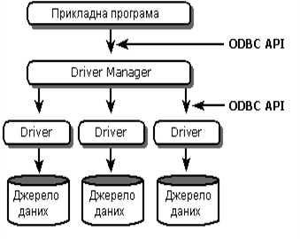

[Промислові мережі та інтеграційні технології в автоматизованих системах](README.md). 14. [Стандартні технології доступу до баз даних](14.md)

## 14.3. ODBC та DAO

ODBC (Open Database Connectivity) – один із стандартних інтерфейсів доступу до реляційних баз даних, які засновані на мові SQL. Архітектура ODBC показана на рис.14.1. 

Рис.14.1. Архітектура ODBC

Зв’язок з різними джерелами даних проводиться за допомогою Драйверів ODBC, які оформлені у вигляді динамічних бібліотек (DLL) і підтримують єдиний інтерфейс ODBC API, що базується на виконанні SQL-запитів. Тобто, незалежно від типу джерела даних, прикладна програма генерує SQL-запити, які відправляються потрібному драйверу, що працює з даним джерелом. Драйвер забезпечує потрібне перетворення цих запитів в мову джерела, або сам виконує необхідні операції, що вказані в запиті.

Для користувача даної технології, необхідно зробити наступну послідовність операцій. В Адміністраторі ODBC, який знаходиться в панелі управління адміністратору Windows, створюється DSN (Data Source Name) для необхідного джерела даних:

-    вибирається тип DSN: System DSN (доступний всім користувачам), User DSN (доступний плинному користувачу), File DSN (настройки зберігаються в окремому файлі);

-    вказується ім’я DSN;

-    вибирається драйвер ODBC;

-    налаштовується драйвер для конкретного джерела даних.

В клієнтській прикладній програмі в якості джерела даних вказується ім’я DSN. З’єднання прикладної програми з необхідним джерелом даних забезпечиться Диспетчером Драйверів (Driver Manager), який реалізований у вигляді бібліотеки ODBC.DLL (рис.14.1). 

При написанні прикладних програм з використання ODBC більш зручний доступ до ODBC через RDO  та DAO (рис.14.2). RDO (Remote Data Object) – являється об’єктним інтерфейсом доступу до ODBC джерел даних. 

Рис.14.2. Принцип доступу до джерел даних через стандартні інтерфейси 
DAO (Data Access Object) - являється об’єктним СОМ-інтерфейсом до процесора баз даних Jet (Joint Engine Technology database engine), а також до надбудовою над RDO-інтерфейсом. 

Режим ODBCDirect перетворює всі об’єкти та методи DAO в еквівалент RDO.

Приклад 14.3.  Бази даних. Доступ до змінних Citect через ODBC інтерфейс.

Завдання. Використовуючи технологію ODBC забезпечити періодичне відновлення даних в комірках листу Microsoft Excel, що посилаються на змінні з прикладу 13.3.

Рис.14.3. Зовнішній вигляд вікна настройки DSN для джерела даних CitectDriver

Рішення. SCADA Citect надає можливість доступу до бази даних реального часу через інтерфейс ODBC. При інсталяції SCADA на комп’ютер, в списку драйверів ODBC з’явиться драйвер CitectDriver.  

Для створення DSN викликаємо Адміністратор джерел даних: "Пуск"-> "Настройка"->"Панель управления"-> "Администрирование"->"Источники данных ODBC". На вкладці "Системные DSN " створюємо DSN типу CitectDriver. Настроюємо DSN як на рис.14.3. Якщо необхідно з’єднатися з Citect на іншому ПК, замість LOCALHOST вказується ім’я даного ПК. 

  В Microsoft Excel створити зв’язок з зовнішніми даними, використовуючи майстра по створенню SQL запитів MicrosoftQuery:

1. "Данные"->"Импорт внешних данных"->"Создать запрос";

2. Вибрати джерело даних з іменем Citcet;

3. Вибрати стовбці NAME,VALUE;

4. На відповідній вкладці вибрати "Просмотр или изменение в Microsoft Query", а потім нажати кнопку SQL, для перегляду створеного майстром запиту (рис.14.4).

5. Після закриття MicrosoftQuery, вказати ячейки, де будуть розмішуватися данні.

Для автоматичного періодичного відновлення даних, в контекстному меню комірок з імпортованими даними вибираємо "Свойства диапазона данных"->"Обновлять каждые"->"1 мин".  

Рис.14.4. Зовнішній вигляд вікна настройки запитів в Microsoft Query

<-- 14.2. [Мова SQL](14_2.md)   

--> 14.4. [OLE DB, ADO та ADO.NET](14_4.md) 
