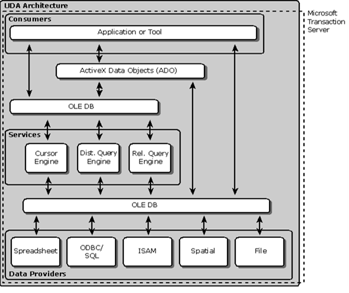

[Промислові мережі та інтеграційні технології в автоматизованих системах](README.md). 14. [Стандартні технології доступу до баз даних](14.md)

## 14.4. OLE DB, ADO та ADO.NET

Альтернативою ODBC є OLE DB – це об’єктно-орієнтована технологія доступу до даних, яка базується на COM. Спеціалістами Microsoft запропонована стратегія універсального доступу до будь яких джерел даних UDA (Universal Data Access), де драйвери OLE DB займають нижній щабель ієрархії (рис.14.5). В цій архітектурі виділяються OLE DB Consumers (OLE DB Споживачі) – це будь-яка частина прикладної програми, яка користується OLE DB-інтерфейсами та OLE DB Providers (OLE DB Провайдери) – це частина прикладної програми, яка надає свої послуги через OLE DB-інтерфейси.

Рис.14.5. UDA Архітектура

Розрізняють два види OLE DB Провайдерів: OLE DB Провайдер Даних (OLE DB Data Provider), OLE DB Провайдер Сервісів (OLE DB Service Provider). OLE DB Провайдер даних надає послуги доступу до власних баз даних у вигляді таблиць. Провайдер Сервісів не має власних даних, однак як Провайдер – він надає набір послуг (сервісів). Споживачі користуються цими сервісами, частина з яких використовує Провайдерів Даних для доступу до даних. Тобто Провайдер Сервісів по відношенню до Провайдерів Даних виступає як Споживач.  

На відміну від ODBC, який надає доступ тільки до реляційних даних, OLE DB може надати доступ до будь якого джерела даних, оскільки базується на об’єктній моделі, яка спроектована для представлення даних довільного формату. Для сумісності з розробленими ODBC драйверами, OLE DB має інтерфейс доступу до них через Провайдера ODBC. Інтерфейс OLE DB – складний в реалізації і призначений для розробки драйверів для нового типа джерела даних. Для кінцевого користувача необхідно мати зручний і легко зрозумілий прикладний інтерфейс (API), яким служить технологія ADO.

ADO (ActiveX Data Object) визначає модель програмування – послідовність дій, які необхідні для отримання доступу та модифікації джерела даних. Це об’єктна модель, тобто представляє собою набір об’єктів зі своїми методами, властивостями та подіями. 

Модель базується на наступних ключових поняттях.

1) Connection (Підключення) - це джерело даних, з яким необхідно з’єднатися, може бути представлений у вигляді символьного Рядка Підключення (Connection String) або Uniform Resource Locator (URL). В рядку вказується вся послідовність (транзакція) підключення, частини (кроки) якої розділені спеціальними роздільниками. В Рядку Підключення спочатку вказується Провайдер OLE DB, а потім всі інші параметри, які відрізняються в залежності від Провайдера. Слід зазначити, що транзакція виконується повністю, або не виконується взагалі, тобто виконання підключення до частини вказаної в Рядку Підключення неможливе. 

2) Command (Команда) – вказує операцію, яку необхідно зробити з джерелом даних визначених Підключенням (добавити, знищити, модифікувати, знайти дані по заданим параметрам). Розрізняють декілька типів команд: 

-    по замовченню: тип команди визначається самим Провайдером; 

-    текст (SQL) : команда записується у вигляді SQL-виразу;

-    таблиця: команда являє собою назву таблиці, всі колонки якої повертаються з запитом;

-    збережена процедура (stored procedure) – назва процедури, яка повинна бути викликана;

-    файл: вказується ім’я файлу, з яким необхідно з’єднатися.  

3) Parameters (Параметри) – це параметри команди, які можуть змінюватися. Команда може виступати як функція, тобто частина команди незмінна, а інша частина виступає в якості параметрів (параметричні запити).

4) Recordset – це об’єкт, за допомогою якого можна доступитись до рядків таблиці, які повертає Команда-запит. 

5) Field (Поле) – об’єкт, який надає доступ до полів об’єкту Recordset. 

6) Error (Помилка) – об’єкт, який містить в собі інформацію про помилку. Ці об’єкти асоціюються з кожним Підключенням.

7) Property (Властивість) – кожний ADO-об’єкт має набір динамічних та статичних властивостей.

8) Record (Запис) – це об’єкт, який надає доступ до даних, які представляються у вигляді контейнеру (container) та місткості (content). Для прикладу в файловій системі каталоги – це контейнери, які можуть вміщувати інші каталоги (контейнери) або файли (місткість). Цей об’єкт дає можливість працювати з нереляційними даними.

9) Stream(Потік) – це об’єкт, за допомогою якого можна працювати з потоками байтів файлів чи буферів пам’яті (дані content). 

10) Collection (Колекція) – це об’єкт, який вміщує декілька об’єктів одного типу, до яких можна доступитися по імені, чи індексу. 

11) Event (Подія).

Таким чином для доступу до даних за допомогою ADO, та їх модифікації необхідно провести таку послідовність:

1) Вказати джерело даних для Підключення, тобто його розміщення в Рядку Підключення або в URL. Виконати з’єднання з вказаним джерелом.

2)  Визначити Команду для доступу до джерела даних, її тип та при необхідності параметри. Виконати команду.

3) Для реляційних баз даних результати виконання команди у вигляді таблиці записуються в кеш. При необхідності їх можна модифікувати за допомогою об’єкту Recordset.

Технологія ADO, в якості API інтерфейсу OLE DB, надає стандартні сервіси та методи роботи з даними незалежно від Провайдеру даних. Однак, в зв’язку зі специфікою останніх, можливі деякі особливості при їх використанні. Відмінності, як правило, стосуються Рядку Підключення (Connection String), використання Команди та об’єкту Recordset. Зупинимося на основних правилах формування Рядку Підключення та Команди. 

Рядок Підключення (Connection String) формується з послідовності виразів типу аргумент=значення розділених крапкою з комою. Типові аргументи наведені в табл.14.1

Таблиця 14.1 Типові аргументи ADO

| Аргумент         | Пояснення                                                    |
| ---------------- | ------------------------------------------------------------ |
| Provider=        | Назва Провайдеру даних                                       |
| File Name=       | Назва файлу, де зберігаються наперед визначені настройки Підключення |
| Remote Provider= | Назва віддаленого Провайдеру (тільки для Remote Data Service) |
| Remote Server=   | Шлях до віддаленого серверу (тільки для Remote Data Service) |
| URL=             | URL-шлях до файла чи папки                                   |

Команда (Command) вказується за допомогою текстового рядку. Правила його формування залежать від типу команди. Зазвичай - це команда SQL, діалект якої залежить від Провайдеру даних, однак це може бути інший текст.

На сьогоднішній день найбільш використовувані Провайдери Даних: Microsoft OLE DB Provider for ODBC, OLE DB Provider for Microsoft Jet, Microsoft OLE DB Provider for SQL Server. Для більш детальної інформації по викладеному матеріалу та використання описаних технологій в інструментах програмування можна звернутися до довідкової інформації в MSDN. 

Все більшого використання набуває технологія .NET, яка лягла в основу стандартного механізму доступу до даних під назвою ADO.NET. Так само як ADO базується на OLE DB, ADO.NET базується на .NET Framework. Принципи застосування залишилися однакові. На момент написання книги відомі такі провайдери від Microsoft: 

- Провайдер даних NET Framework для SQL-сервера;

- Провайдер даних .NET Framework для OLE DB;

- Провайдер даних .NET Framework для ODBC;

- Провайдер даних .NET Framework для Oracle.

Як видно зі списку, технологія ADO.NET підтримує сумісність із OLE DB та ODBC.

<-- 14.3. [ODBC та DAO](14_3.md)   

--> 15. [Проектування ІНТЕГРОВАНИХ АВТОМАТИЗОВАНИХ СИСТЕМ](15.md) 

## Контрольні запитання до розділу 14

1. Які програмні засоби і навіщо доступаються до архівних даних. Які проблеми сумісності можуть при цьому виникати? Які варіанти рішення цих проблем?

2. Як вирішується питання стандартизації інтерфейсу до СУБД через використання мови SQL? Що таке діалект SQL? 

3. Поясніть синтаксис оператору вибірки SELECT?

4. На яких технологіях базується ODBC. З яких складових складається архітектура ODBC? Поясніть призначення кожного компоненту цієї структури.

5. Як ідентифікується джерело даних в ODBC?

6. Наведіть послідовність операцій, яку необхідно зробити користувачеві для вказівки джерела даних програмі клієнту ODBC.

7. Якими програмними інтерфейсами користуються  для доступу до даних через ODBC з прикладної програми?

8. На основі якої технології базується OLE DB? Які недоліки в технології ODBC порівняно з OLE DB?

9. Поясніть призначення компонентів UDA-архітектури.

10. Яке призначення OLE DB Провайдерів Даних та Провайдерів Сервісів?

11. Яким прикладним інтерфейсом як правило користуються при користуванні OLE DB?

12. Чи можна доступитись до джерел даних ODBC через інтерфейс OLE DB? Чи можна через інтерфейс ADO? Обґрунтуйте свою відповідь.

13. Поясніть призначення об’єктів Connection (Connection String), Command та Recordset в технології ADO? Яким чином формується Строка Підключення?

14. Яку послідовність дій необхідно провести при налаштуванні OLE DB Споживача для доступу до даних за допомогою ADO? 

15. На основі якої технології базується ADO.NET? Чи можна доступитись до джерел даних ODBC через інтерфейс ADO.NET? Чи можна доступитись до джерел даних ADO через інтерфейс ADO.NET? Обґрунтуйте свою відповідь.

 

