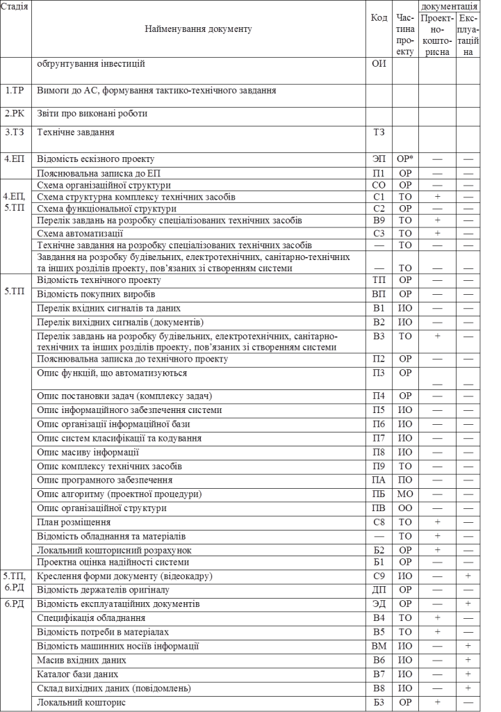

[Промислові мережі та інтеграційні технології в автоматизованих системах](README.md). 15. [Проектування інтегрованих автоматизованих систем](15.md) 

## 15.1. Загальні підходи до проектування автоматизованих систем

### 15.1.1. ІАС – як клас автоматизованих систем 

Інтегровані автоматизовані системи відносяться до класу автоматизованих систем, на правила проектування яких поширюються вітчизняні (ДСТУ), міждержавні(ГОСТ)  та міжнародні (ISO, IEC) стандарти. В даному розділі пропонується підхід до розробки ІАС з урахуванням етапів розробки згідно діючих стандартів. В перших двох підрозділах наведений життєвий цикл та відповідно вимоги до комплектності та змісту документації автоматизованих систем, згідно діючих стандартів. На базі цих вимог в наступних розділах пропонуються деякі підходи та рекомендації щодо життєвого циклу та документації інтегрованих автоматизованих систем управління як підкласу автоматизованих систем.    

### 15.1.2. Стадії створення автоматизованих систем

#### 15.1.2.1. Стандарт на стадії створення АС.

Життєвий цикл інтегрованої автоматизованої системи, які і будь-якої автоматизованої системи (надалі АС), включає сукупність взаємозв’язаних процесів створення та послідовної зміни станів системи від формування вихідних вимог до неї, введення в дію, до кінця експлуатації та утилізації комплексу засобів автоматизації. При створенні нової або вдосконалення існуючої АС проектні та інжинірингові організації керуються рядом нормативних документів (стандартами, робочими документами, методичними вказівками). 

Процес створення автоматизованих систем регламентується стандартом ГОСТ 34.601-90 "Автоматизированные системы. Стадии создания". Згідно цього стандарту процес створення АС представляє собою сукупність впорядкованих в часі взаємозалежних, об’єднаних в стадії, етапи робіт, виконання яких необхідно і достатньо для створення АС, яка відповідає заданим вимогам. Стадії та етапи створення автоматизованих систем виділяються як частини процесу створення для раціонального планування та організації робіт, які закінчуються заданим результатом. 

#### 15.1.2.2. Структура стадій створення АС. 

Склад та правила виконання робіт на стадіях та етапах визначають у відповідній документації організацій, які приймають участь в створенні конкретних видів автоматизованих систем. В роботах по створенню автоматизованих систем можуть приймати участь наступні організації: організація замовник; організація розробник; організація поставщик; організація ген-проектувальник об’єкта автоматизації; організації проектувальники різних частин об’єкта автоматизації; будівельні, монтажні та наладочні організації. 

Згідно цього ж стандарту в загальному випадку створення автоматизованих систем складається з наступних стадій:

1. Формування вимог до АС;

2. Розробка концепції АС;

3. Технічне завдання;

4. Ескізний проект;

5. Технічний проект;

6. Робоча документація;

7. Введення в дію;

8. Супроводження. 

Перші три стадії відносяться до передпроектних робіт, стадії 4-6 а також частково 7 - до проектних робіт. Кожна стадія складається з етапів. Стадії та етапи, які виконуються організаціями-учасниками робіт по створенню АС, встановлюються в договорах і технічному завданні на основі даного стандарту. Допускається виключати стадію "Ескізний проект" та окремі етапи робіт на всіх стадіях, об’єднувати стадії "Технічний проект" та "Робоча документація" в єдину стадію "Техно-робочий проект". В залежності від специфіки виконуваних АС та умов їх створення допускається виконувати окремі етапи робіт до завершення попередніх стадій, паралельне в часі виконання етапів робіт, включення нових етапів робіт. 

Нижче розглянемо етапи робіт на кожній стадії створення АС, згідно стандарту ГОСТ 34.601-90.

#### 15.1.2.3. Стадія формування вимог до АС (ТР). 

Ця стадія складається з наступних етапів:

1. Дослідження об’єкту та обумовлення необхідності створення АС.

2. Формування вимог до АС.

3. Оформлення звіту про виконану роботу та заявки на розробку АС (тактико-технічного завдання).

При дослідженні об’єкту проводять збір даних про об’єкт автоматизації, оцінку якості функціонування об’єкту, виявлення проблем, вирішення яких можливе засобами автоматизації. В кінці дослідження роблять техніко-економічну оцінку цілесообразності створення АС. При позитивному результаті проводять підготовку вихідних даних для формування вимог АС: характеристику об’єкта автоматизації, опис вимог до системи, обмеження допустимих затрат на розробку, введення в дію та експлуатацію, очікуваний ефект, умови створення і функціонування системи. Виконанні роботи висвітлюються в звіті. В кінці стадії формують заявку на розробку АС (тактико-технічне завдання).

#### 15.1.2.4. Стадія розробки концепції АС (РК). На даній стадії виконується такі етапи робіт:

1. Вивчення об’єкту.

2. Проведення науково-дослідних робіт.

3. Розробка варіантів концепції АС, яке задовольняє вимогам користувача.

4. Оформлення звіту про виконану роботу. 

На даних етапах організація розробник проводить детальне вивчення об’єкту автоматизації та необхідні науково-дослідні роботи (НДР), які пов’язані з пошуком шляхів та оцінкою можливості реалізації вимог. Після цього проводиться розробка альтернативних варіантів концепції створюваної АС та планів їх реалізації, оцінку необхідних ресурсів для їх реалізації та забезпечення функціонування, оцінку переваг та недоліків кожного варіанту, визначення порядку оцінки якості та умов прийомки системи, оцінку очікуваних ефектів. Всі роботи зводяться в звіті про виконану роботу.

#### 15.1.2.5. Стадія технічне завдання (ТЗ). 

На даній стадії проводиться розробка, оформлення, узгодження та затвердження технічного завдання на АС в цілому та при необхідності на його окремі частини.

#### 15.1.2.6.  Стадія ескізний проект (ЕП). 

На даній стадії визначаються: функції АС; функції підсистем, їх цілі та ефекти; склад комплексів задач та окремих задач; концепція інформаційної бази, її укрупнена структура; функції системи управління базою даних; склад обчислювальної системи; функції та параметри основних програмних засобів. Після цього проводять розробку документації в обсязі, необхідному для опису повної сукупності прийнятих проектних рішень та достатньому для подальшого виконання робіт по створенню АС. Види документів розробляються згідно ГОСТ 34.201-89.  

Згідно прийнятих проектних рішень розробляють документацію в обсязі, яка достатня для виконання   

#### 15.1.2.6. Стадія технічний проект (ТП). 

Дана стадія складається з таких етапів:

1. Розробка проектних рішень по системі та її частинам.

2. Розробка документації на АС та її частини;

3. Розробка та оформлення документації на поставку виробів для комплектування АС та технічних вимог (технічних завдань) на їх розробку.

4. Розробка завдань на проектування в суміжних частинах проекту об’єкта автоматизації.

На першому етапі даної стадії проводять розробку загальних рішень по системі та її частинам, функціонально-алгоритмічній структурі системи, по функціям персоналу та організаційній структурі, по структурі технічних засобів, по алгоритмам рішення задач та використовуваним мовам, по організації та веденню інформаційної бази, системі класифікації та кодування інформації, по програмному забезпеченню. Результати висвітлюють в документації згідно ГОСТ 34.201-89. 

На 3-му етапі проводять підготовку та оформлення документації на поставку вимог для комплектування АС, визначення технічних вимог та складання ТЗ на розробку виробів, які не виготовлюються серійно.

На 4-му етапі проводять розробку завдань на проектування в суміжних частинах проекту об’єкта автоматизації для проведення будівельних, електротехнічних, санітарно-технічних та інших підготовчих робіт, пов’язаних зі створенням АС.

#### 15.1.2.7. Стадія робоча документації (РД). 

Стадія складається з двох етапів:

1) Розробка робочої документації на систему та її частини.

2) Розробка або адаптація програмного забезпечення.

На першому етапі проводять оформлення робочої документації згідно ГОСТ 34.201-89, узгодження та затвердження. Робоча документація повинна вміщувати всі необхідні та достатні відомості для забезпечення виконання робіт по введенню АС в дію та її експлуатації, а також для підтримки рівня експлуатаційних характеристик (якості) системи у відповідності з прийнятими проектними рішеннями. 

На другому етапі проводять розробку програм та програмних засобів системи, вибір, адаптацію та (або) прив’язку програмних засобів що придбаються, розробку програмної документації згідно ГОСТ 19.101.

#### 15.1.2.8. Стадія Введення в дію (ВД). 

Стадію виконують у 8 етапів:

1. Підготовка об’єкта автоматизації до вводу АС в дію;

2. Підготовка персоналу.

3. Комплектація АС виробами що поставляються.

4. Будівельно-монтажні роботи.

5. Пусконалагоджувальні роботи.

6. Проведення попередніх випробувань.

7. Проведення досвідної експлуатації.

8) Проведення приймальних випробувань. 

На першому етапі проводять роботи по організаційній підготовки об’єкта автоматизації до вводу АС в дію, в тому числі:

-    реалізацію проектних рішень по організаційній структурі АС;

-    забезпечення підрозділів об’єкта управління інструктивно-методичними матеріалами;

-    впровадження класифікаторів інформації.

На другому етапі після підготовки персоналу проводять також перевірку його здатності забезпечити функціонування АС.

На 3-му етапі забезпечують отримання комплектуючих засобів серійного та одиничного виробництва, матеріалів та монтажних виробів (програмними та технічними засобами, програмно-технічними комплексами, інформаційними виробами), проводять вхідний контроль їх якості. 

На етапі будівельно-монтажних робіт проводять:

-     виконання робіт по будівництву спеціалізованих будівель (приміщень) для розміщення технічних засобів та персоналу АС;

-     створення кабельних каналі;

-     виконання робіт по монтажу технічних засобів та ліній зв’язку;

-     випробування змонтованих технічних засобів;

-     здачу технічних засобів для проведення пусконалагоджувальних робіт;

На етапі пусконалагоджувальних робіт проводять:

- автономну наладку технічних та програмних засобів;

- завантаження інформації в базу даних та перевірку системи її введення;

- комплексну наладку всіх засобів системи.

На етапі проведення попередніх випробувань проводять:

-    випробування АС на працездатність та відповідність технічному завданню у відповідності з програмою та методикою попередніх випробувань;

-    усунення несправностей та внесення змін в документацію на АС, в тому числі експлуатаційну у відповідності з протоколом випробувань;

-    оформлення акту про прийомку АС в досвідну експлуатацію.

На етапі проведення досвідної експлуатації проводять:

- досвідну експлуатацію АС;

- аналіз результатів досвідної експлуатації АС;

- доробку (при необхідності) технічних засобів АС;

- оформлення акту про завершення досвідної експлуатації.

На етапі проведення приймальних випробувань проводять:

-    випробування на відповідність технічному завданню у відповідності з програмою та методикою приймальних випробувань;

-    аналіз результатів випробувань АС та усунення недоліків, виявлених при випробуваннях;

-    оформлення акту про прийомку АС в постійну експлуатацію.

#### 15.1.2.9. Супроводження (СП). 

Стадія проходить в два етапи:

1. Виконання робіт у відповідності з гарантійними обов’язками.

2. Післягарантійне обслуговування.

На першому етапі проводяться роботи по усуненню недоліків, виявлених при експлуатації АС протягом встановлених гарантійних термінів, внесенню необхідних змін в документацію по АС.

На другому етапі проводять роботи по:

-     аналізу функціонування системи;

-     виявленню відхилень фактичних експлуатаційних характеристик АС від проектних значень;

-     встановленню причини відхилень;

-     встановленню виявлених недоліків по забезпеченню стабільності експлуатаційних характеристик АС;

-     внесенню необхідних змін в документацію на АС.

#### 15.1.2.10. Допустимі варіанти стадійності. 

Відповідно до ГОСТ 34.601-90 п.2.2. допускається:

-    виключати стадію "Ескізний проект";

-    виключати окремі етапи робіт на всіх стадіях;

-    для невеликих об’єктів об’єднувати стадії "Технічний проект" та "Робоча документація" в одну стадію – "Техно-робочий проект".

Крім того, в залежності від специфіки створюваних АС та умов їх створення допускається:

-    виконувати окремі етапи робіт до завершення попередніх стадій;

-    паралельне в часі виконання етапів робіт;

-    включення нових етапів робіт.

### 15.1.3. Розробка документації на стадіях створення автоматизованих систем

#### 15.1.3.1. Стандарт на види, тип та комплектність документів на АС. 

На стадіях життєвого циклу автоматизованої системи, зокрема при її створенні, розробляється ряд документів, які зводяться в певний вид документації. Правила створення документації регламентується міждержавним стандартом ГОСТ 34.201-89 "Виды, комплектность и обозначение документов при создании автоматизированных систем". Згідно даного стандарту документація на автоматизовану систему – комплекс взаємопов’язаних документів, в якому повністю описані всі рішення по створенню та функціонуванню системи, а також документів, які підтверджують відповідність системи вимогам технічного завдання та готовність її до експлуатації (функціонування). Проектно-кошторисна документація на АС – частина документації на АС, яка розробляється для виконання будівельних та монтажних робіт, які пов’язані зі створенням АС. Робоча документація на АС – частина документації на АС, яка необхідна для виготовлення, будівництва, монтажу та наладки автоматизованої системи в цілому, а також програмно-технічних, програмно-методичних комплексів та компонентів технічного, програмного та інформаційного забезпечення, що входять в систему. 

#### 15.1.3.2. Документи на види забезпечення. 

Створення АС об’єкта управління проводиться по документам таких видів забезпечення:

-     технічне забезпечення (ТО);

-     інформаційне забезпечення (ИО);

-     організаційне забезпечення (ОО);

-     математичне забезпечення (МО);

-     програмне забезпечення (ПО);

-     алгоритмічне забезпечення (АО);

Технічне забезпечення АС (ТО) – сукупність технічних засобів системи та експлуатаційної документації, здатних забезпечити функціонування системи в повному обсязі.

Інформаційне забезпечення АС (ИО) – набір документів та даних, які вміщують:

-     перелік і характеристики змінних, які відображають фактичний стан об’єкта управління та автоматизованої системи;

-     опис правил класифікації та кодування інформації та її груп;

-     опис масивів вхідної та вихідної інформації;

-     форми документів, відеокадрів, які використовуються в системі.

Математичне забезпечення (МО) – сукупність методів, моделей та алгоритмів, які використовуються в системі. МО реалізується у вигляді програм спеціального ПО.

Програмне забезпечення АС (ПО) – сукупність програм та експлуатаційної програмної документації, необхідних для реалізації АС при використанні технічного забезпечення системи. Загальне програмне забезпечення – частина програмного забезпечення, яка:

-     поставляється в комплексі з засобами обчислювальної техніки;

-     придбається на ринку програмних продуктів.

Спеціальне програмне забезпечення – частина програмного забезпечення, яка розробляється спеціально при створенні даної системи для реалізації основних та додаткових функцій АС. Це програмне забезпечення створюється на базі загального ПО.

Організаційне забезпечення (ОО) – опис структур АС, інструкції оперативному персоналу, на основі яких персонал повинен функціонувати в складі автоматизованого технологічного комплексу.

Перелік найменувань документів, що розробляються та їх комплектність на систему та її частини повинен бути визначений в технічному завданні на створення автоматизованої системи (підсистеми). Комплектність проектно-кошторисної документації визначають згідно з правилами, які встановлені системою проектної документації для будівництва (СПДС). На кожний комплект повинна бути складена відомість документів. Комплектність документації, яка забезпечує виготовлення, прийомку та монтаж технічних засобів визначається ГОСТ 2.102, експлуатаційної документації на ці засоби – ГОСТ 2.601. Комплектність документації на програмні засоби обчислювальної техніки визначається ГОСТ 19.101.

#### 15.1.3.3. Комплектність та види документів по стадіям створення АС. 

Види документів по стадіям створення АС, відповідно до типу забезпечення  зведені в таб.15.1. 

Таблиця.15.1 Види документів, що створюються по стадіям створення

*ОР – загальносистемні рішення

В залежності від методів проектування та специфіки АС, що створюються дозволяється: розробляти групові та базові документи в відповідності з розділами 1,3,4,6 ГОСТ 2.113; випускати документи окремими самостійними частинами, які відповідають розділам основного документу; розширяти номенклатуру документів, які встановлені стандартом ГОСТ 34.201-89.

Для невеликих систем використовують одностадійне проектування, коли стадія ескізний проект виключається, а стадія технічний проект та робоча документація об’єднуються в одну стадію – техноробочий проект. Згідно такого підходу, техноробочий проект включає частину яка затверджується (замість технічного проекту) і безпосередньо робочий проект. 

Вимоги до складу та змісту документації на АС наведені в методичних вказівках РД 50-34.698-90 . В таб.15.2-15.6 наведений склад документів техноробочого проекту.

#### 15.1.3.4. Загальносистемні рішення (ОР). 

Таблиця 15.2 Склад документів  по загальносистемним рішенням

| ЗАГАЛЬНОСИСТЕМНІ РІШЕННЯ                                     |                                                              |
| ------------------------------------------------------------ | ------------------------------------------------------------ |
| Відомість (склад) проекту (ТП).                              |                                                              |
| Пояснювальна записка до проекту  (П2).                       | Загальні  положення. Опис процесу діяльності. Основні технічні рішення. Заходи, щодо  підготовки та вводу системи в дію. |
| Схема функціональної структури  (С2).                        |                                                              |
| Відомість покупних виробів  (ВП).                            |                                                              |
| Опис функцій, що  автоматизуються (П3).                      | Вихідні  дані. Цілі АС та автоматизовані функції. Характеристика функціональної  структури. Типові рішення. |
| Опис постановки задачі  (комплексу задач) (П4).              | Характеристики  комплексу задач. Вихідна інформація. Вхідна інформація. |
| Локальний кошторис (Б3) та локальний кошторисний  розрахунок (Б2). |                                                              |
| Паспорт  (ПС).                                               | Загальні  відомості про АС. Основні характеристики АС. Комплектність. Свідоцтво про  прийомку. Гарантії виробника. Відомості про рекламацію. |
| Формуляр (ФО).                                               | Загальні відомості. Основні характеристики. Комплектність. Свідоцтво про  прийомку. Гарантійні обов’язки. Відомості про прийомку. Відомості про стан АС.  Відомості про рекламації. |
| Проектна оцінка надійності  системи (Б1).                    | Введення. Вихідні  дані. Методика розрахунку. Розрахунок показників надійності. Аналіз  результатів розрахунку. |
| Загальний опис системи (ПД).                                 | Призначення  системи. Опис системи. Опис взаємозв’язків АС з іншими системами. Опис  підсистем. |
| Відомість тримачів оригіналів  (ДП).                         |                                                              |
| Відомість експлуатаційних  документів (ЭД).                  |                                                              |
| Програма та методика  випробувань (ПМ).                      |                                                              |
| Схема організаційної структури  (СО).                        |                                                              |

 

#### 15.1.3.5. Організаційне забезпеченню (ОО). 

Таблиця 15.3 Склад документів по організаційному забезпеченню

| ОРГАНІЗАЦІЙНЕ ЗАБЕЗПЕЧЕННЯ.                                |                                                              |
| ---------------------------------------------------------- | ------------------------------------------------------------ |
| Опис організаційної структури  (ПВ).                       | Зміна в  організаційній структурі управління об’єктом. Організація підрозділів. Організація  існуючих підрозділів управління. |
| Методика (технологія)  автоматизованого проектування (И1). | Загальні  положення. Постановка задачі. Методика проектування. Вихідні дані. Проектні  процедури. Оцінка результатів. |
| Технологічна інструкція (И2).                              |                                                              |
| Інструкція користувача (И3).                               | Введення. Призначення  та умови застосування. Підготовка до роботи. Опис операцій. Аварійні ситуації.  Рекомендації до освоєння. |
| Опис технологічного процесу  обробки даних (ПГ).           | Технологічний  процес збору та обробки даних на периферійних пристроях при децентралізованій  обробці даних. Технологічний процес обробки даних на обчислювальному центрі. |

 

#### 15.1.3.6. Технічне забезпечення (ТО). 

Таблиця 15.4 Склад документів по технічному забезпеченню

| ТЕХНІЧНЕ ЗАБЕЗПЕЧЕННЯ.                                       |                                                              |
| ------------------------------------------------------------ | ------------------------------------------------------------ |
| Схема автоматизації (С3);                                    |                                                              |
| Опис комплексу технічних засобів (П9).                       | Загальні  положення. Структура комплексу технічних засобів. Засоби обчислювальної технічки.  Апаратура передачі даних. |
| План розміщення обладнання та  проводок на об’єкті (С7).     |                                                              |
| План розміщення обладнання та  проводок (С8);                |                                                              |
| Технічне завдання на розробку  спеціалізованих технічних засобів; |                                                              |
| Завдання на розробку  будівельних, електротехнічних, санітарно-технічних та інших розділів проекту,  пов’язаних зі створенням системи. |                                                              |
| Перелік завдань на розробку спеціалізованих технічних  засобів. |                                                              |
| Перелік завдань на розробку  будівельних, електротехнічних, , санітарно-технічних та інших розділів  проекту, пов’язаних зі створенням системи (В3). |                                                              |
| Схема структурна комплексу  технічних засобів (С1).          |                                                              |
| Схема з’єднань зовнішніх  проводок (С4).                     |                                                              |
| Схема підключень зовнішніх  проводок (С5).                   |                                                              |
| Таблиця з’єднань та підключень  (С6)                         |                                                              |
| Схема поділу системи  (структурна) (Е1) .                    |                                                              |
| Креслення загального вигляду  щита (пульта) (В0).            |                                                              |
| Креслення установки технічних  засобів (СА).                 |                                                              |
| Схеми принципові (СБ).                                       |                                                              |
| Специфікація обладнання (В4).                                |                                                              |
| Відомість потреб в матеріалі  (В5).                          |                                                              |
| Інструкція по експлуатації комплексу технічних засобів  (ИЭ). | Загальні  вказівки. Міри безпеки. Порядок роботи.  Перевірка  правильності функціонування. Вказівки про діяльність в реальних режимах. |
| Відомість обладнання та  матеріалів.                         |                                                              |

#### 15.1.3.7. Інформаційне забезпечення (ИО). 

Таблиця 15.5 Склад документів по інформаційному забезпеченню

| ІНФОРМАЦІЙНЕ ЗАБЕЗПЕЧЕННЯ.                                   |                                                              |
| ------------------------------------------------------------ | ------------------------------------------------------------ |
| Перелік вхідних сигналів та даних (В1).                      | Перелік вхідних  сигналів. Перелік вхідних даних.            |
| Перелік вихідних сигналів (документів) (В2):                 | Перелік вихідних  сигналів. Перелік вихідних документів.     |
| Опис інформаційного забезпечення системи (П5):               | Склад  інформаційного забезпечення. Організація інформаційного забезпечення. Організація  збору та передачі інформації. Побудова системи класифікації та кодування. Організація  внутрішньомашинної інформаційної бази. Організація позамашинної інформаційної  бази. |
| Відомість машинних носіїв інформації (ВМ).                   |                                                              |
| Опис організації інформаційної бази (П6).                    | Опис внутрішньо  машинної інформаційної бази.  Опис поза  машинної інформаційної бази. |
| Опис систем класифікації та кодування (П7).                  |                                                              |
| Опис масиву інформації (П8).                                 |                                                              |
| Креслення форми документу (відеокадру) (С9).                 |                                                              |
| Масив вхідних даних (В6).                                    |                                                              |
| Каталог бази даних (В7).                                     |                                                              |
| Склад вихідних даних (повідомлень) (В8).                     |                                                              |
| Інструкція по формуванню та веденню бази даних (набору  даних)(И4): | Правила підготовки  даних. Порядок та засоби заповнення бази даних. Процедури зміни та контролю  бази даних. Порядок та засоби відновлення бази даних. |

#### 15.1.3.8. Програмне забезпечення (ПО).

Таблиця 15.6 Склад документів по програмному забезпеченню

| ПРОГРАМНЕ ЗАБЕЗПЕЧЕННЯ               |                                                              |
| ------------------------------------ | ------------------------------------------------------------ |
| Опис програмного забезпечення  (ПА). | Структура  програмного забезпечення. Функції частин програмного забезпечення. Методи та  засоби розробки програмного забезпечення. Операційна система.  Засоби, які розширюють можливості операційної  системи. |

#### 15.1.3.9. Математичне забезпечення (МО).

Таблиця 15.6 Склад документів по математичному забезпеченню

| МАТЕМАТИЧНЕ ЗАБЕЗПЕЧЕННЯ.                   |                                                              |
| ------------------------------------------- | ------------------------------------------------------------ |
| Опис алгоритму (проектної  процедури) (ПБ). | Призначення та  характеристика. Інформація, що використовується. Результати рішення. Математичний  опис. Алгоритм рішення. |

#### 15.1.3.10. Допустимі варіанти комплектності. 

Перелік (комплектність) документів та їх зміст згідно стандарту визначається з узгодженістю сторін договору. Тобто вітчизняні нормативні документи дають достатньо ступенів вільності для можливості добавлення та модифікації тих документів, які вважає за необхідне проектувальник, при умові погодження цього з замовником. 

Існуючі стандарти не визначають механізми розробки проекту. Методика проектування залежить від багатьох факторів: 

1. типу та масштабу об’єкту;

2. комплексу програмних засобів, що використовуються при проектуванні (САПР);

3. досвід та надбання проектувальників;

4. кількість задіяних організацій та осіб.

Для ІАС, як підкласу АС загальна послідовність проектних робіт співпадає з етапами згідно ГОСТ 34.601-90 а комплектність документів згідно ГОСТ 34.201-89 та РД 50-34.698-90. Нижче запропоновані деякі механізми, які можна використати при проектуванні ІАС, при вирішенні специфічних для цих систем задач.

 

<-- 15. [Проектування інтегрованих автоматизованих систем](15.md) 

--> 15.2. [Загальні підходи до проектування інтегрованих автоматизованих систем](15_2.md)   
