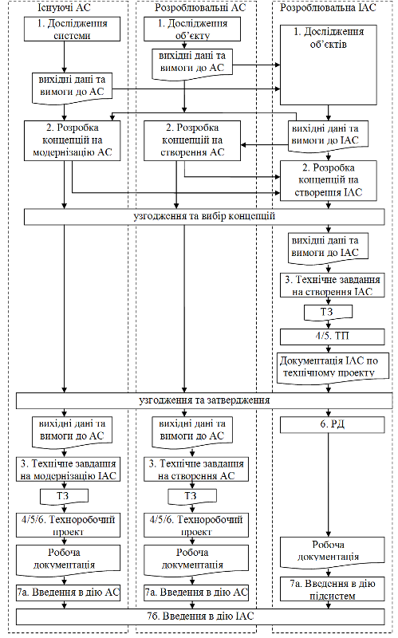
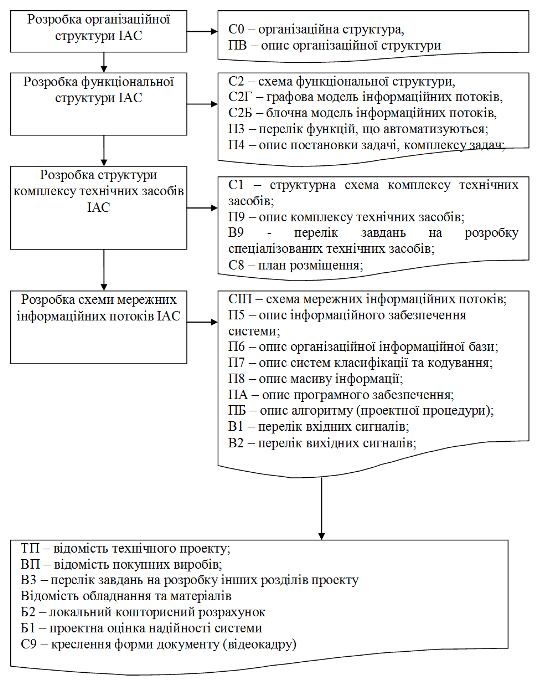

[Промислові мережі та інтеграційні технології в автоматизованих системах](README.md). 15. [Проектування інтегрованих автоматизованих систем](15.md) 

## 15.2. Загальні підходи до проектування інтегрованих автоматизованих систем

### 15.2.1. Життєвий цикл ІАС

#### 15.2.1.1. ІАС – система взаємопов’язаних АС різного типу. 

Інтегрована автоматизована система може бути складною ієрархічною системою і включати в себе декілька підсистем автоматизованого управління різними класами об’єктів. Хоч ці підсистеми відносяться до класу автоматизованих систем, послідовність розробки, механізми та комплектність документації для них можуть значно відрізнятися між собою. Так скажімо, для інтегрованих автоматизованих систем управління (ІАСУ), розробленням підсистем АСУП та АСУТП займаються люди різної кваліфікації, що значно ускладнює її створення однією організацію-підрядником. Необхідно також врахувати масштабність та складність таких робіт, адже ІАС може створюватися для всього підприємства. З наведеного можна зробити висновок, що життєвий цикл створення ІАС необхідно поділити на декілька частин.  

#### 15.2.1.2. Загальний підхід до розробки ІАС, запропонований в даному посібнику.  

По суті, створення ІАС – це створення автоматизованої системи шляхом інтеграції вже існуючих та/або розроблювальних підсистем. Враховуючи цю особливість, проектування ІАС пропонується проводити в двох площинах: на рівні підсистем та на рівні системи вцілому. Тобто пропонується відокремити процеси проектування автоматизованих систем, як самостійних частин, однак узгоджених на загальносистемному рівні. Такий підхід дає наступні можливості:

-    інтегрувати існуючі АС в ІАС, не змінюючи комплектність та склад їх документації;

-    відокремити життєві цикли підсистем як незалежних АС між собою, що дає можливість проводити поетапне створення та введення в дію ІАС;

-    прилучати до робіт декілька організацій-субпідрядників, з визначеними межами та обов’язками їх робіт)  

Відповідно до запропонованого підходу, життєвий цикл інтегрованої автоматизованої системи управління включає в себе життєві цикли всіх АС, що є її підсистемами, та процеси їх інтеграції в єдине ціле. Надалі під абревіатурою АС будемо розуміти ті АС, які планується інтегрувати як підсистему в складі єдиної ІАС. 

В даному посібнику під процесом створення інтегрованої автоматизованої системи будемо розуміти сукупність взаємопов’язаних процесів функціональної, інформаційної, технічної та програмної інтеграції існуючих або/та розроблювальних АС, для досягнення заданої мети. Результатом такого процесу є інтегрована автоматизована система (ІАС), яка крім АС включає додаткові засоби, а інколи підсистеми, які служать для досягнення загальносистемних цілей. ІАСУ можна розглядати як частковий випадок ІАС, що включає вертикальну інтеграцію рівнів АСУТП та АСУП та появу в результаті цього підсистем рівня MES.

При запропонованому підході створенням інтегрованої автоматизованої системи може займатись окрема організація, а сама система супроводжуватися окремим комплектом документації. 

На сьогоднішній день участь в проектних роботах різних організацій залучається на конкурсній (тендерній) основі. Враховуючи це, передпроектні роботи повинні фінансуватися замовником, за окремим договором. В будь якому випадку, кожна стадія, а навіть ряд етапів робіт по розробці окремої системи може проводитись різними організаціями за окремими договорами. Організації, що запрошені до конкурсу на розробку АС/ІАС будемо називати потенційними розробниками.  

#### 15.2.1.3. Послідовність розробки ІАС. 

Розглянемо як створення ІАС взаємопов’язане з життєвими циклами всіх АС, що входять до неї (рис.15.1). Передпроектні роботи проводяться паралельно організаціями розробниками АС та ІАС. Серед АС окремо виділяються існуючі системи, які необхідно інтегрувати в єдину АС. Для неї пункти 3-7а є опціональними, оскільки їх інтеграція в єдину систему можлива без модернізації. Це рекомендована блок схема життєвого циклу розробки ІАС. Схема на рис.15.1 спрощена, оскільки на ній не показані ітерації)  

При розробці АС та ІАС різними організаціями, ми рекомендуємо стадію технічне завдання на АС виконувати після узгодження технічного проекту ІАС. В іншому випадку – можлива неузгодженість рішень (навіть на рівні ТЗ) між АС та ІАС, що приведе до проблем в реалізації. Нижче більш детально розглянуті основні стадії розробки ІАС, та їх взаємозв’язок з стадіями АС) 

Рис.15.1. Життєвий цикл ІАС.

#### 15.2.2. Дослідження об’єкту та формування вимог до ІАС

На першій стадії замовник проводить дослідження об’єктів автоматизації та формує вимоги до них: характеристику об’єктів автоматизації, опис вимог до АС, обмеження допустимих затрат на розробку, введення в дію та експлуатацію, очікуваний ефект, умови створення і функціонування системи. Дослідження об’єкту може проводитись з участю інших компетентних організацій, наприклад потенційних розробників АС/ІАС, як правило при фінансуванні замовника. Слід зазначити, що виділення АС в складі ІАС повинно проводитись вже на даному етапі.

В процесі дослідження об’єктів формуються вимоги до АС. Паралельно ведеться дослідження об’єктів на загальносистемному рівні. Потенційними розробниками ІАС оцінюються результати досліджень АС та формуються вимоги до ІАС. Загальний перелік функцій та вимог поставлених на загальносистемному рівні та вся необхідна інформація входять до складу вихідних даних на ІАС. Сформовані вихідні дані та вимоги оформлюються в довільній формі у вигляді тактико-технічного завдання на кожну АС та ІАС в цілому, яке вміщує:

-    пропозицію організації-замовника до потенційної організації-розробника на проведення робіт по створенню АС/ІАС;

-    вимоги замовника до АС/ІАС;

-    умови та ресурси на створення АС/ІАС

При дослідженні існуючих АС, що повинні входити до складу розроблювальної ІАС необхідно звернути увагу на такі особливості:

-    наявність сервісної підтримки даної АС та програмно-технічного комплексу на базі якого вона розроблена; 

-    працездатність та надійність існуючої АС в цілому та окремих її складових;

-    використання відкритих стандартів технологій зв’язку для можливості доступу до її інформаційних ресурсів;

-    можливість нарощування або заміни апаратних та програмних складових.

Процес формування вихідних даних та вимог для АС/ІАС носить ітераційний характер. Після їх отримання, потенційні організації-розробники, перевіряють однозначність, узгодженість та цілісність вихідних матеріалів, що може привести до необхідності уточнення вихідних даних замовником. 

### 15.2.3. Розробка концепції ІАС

На даних етапах потенційні організації-розробники АС/ІАС, при участі організації-замовника  при необхідності проводять:

-    детальне вивчення об’єкту автоматизації та необхідні науково-дослідні роботи (НДР);

-    оцінку можливості реалізації вимог замовника;

Кожна з потенційних організацій розробників АС/ІАС проводить розробку альтернативних варіантів концепції створюваної системи та планів їх реалізації, оцінку необхідних ресурсів для їх реалізації та забезпечення функціонування, оцінку переваг та недоліків кожного варіанту, визначення порядку оцінки якості та умов прийомки системи, оцінку очікуваних ефектів, орієнтовну вартість системи. 

Розмежування між областю проектування АС та ІАС проводиться вже на етапі формування вимог, однак потенційний розробник ІАС може прийняти участь і в конкурсі на розробку АС. При аналізі концепцій кожної з організацій-конкурсантів, враховується сумісність рішень з концепціями по розробці ІАС)

Вибір альтернативних програмно-технічних засобів для АС та ІАС можна проводити по наступним критеріям:

-    взаємна апаратна та програмна сумісність засобів АС; 

-    технічний рівень програмного/технічного засобу;

-    рівень забезпечення необхідної надійності;

-    рівень повноти програмних засобів та простота конфігурування;

-    ступінь захисту від проникнення в систему;

-    досвід застосування даного обладнання на аналогічних об’єктах;

-    рівень довіри до поставщика обладнання та програмного забезпечення;

-    здатність поставщика обладнання взяти на себе роль розробника;

-    адекватність ціни та запропонованих засобів або виконуваних послуг; 

### 15.2.4. Технічне завдання на ІАС та АС

#### 15.2.4.1. Порядок розробки ТЗ. 

Результатом виконання попередніх стадій є розробка та оформлення технічного завдання (ТЗ) на ІАС вцілому. Як видно з рис.15.1, створення ТЗ для АС розробляється тільки після узгодження технічного проекту на ІАС з замовником системи. Така послідовність диктується необхідністю узгодженості АС та ІАС на загальносистемному рівні: технічне завдання на АС в багатьох розділах містить інформацію, яка стосується стику АС з іншими системами, зокрема іншими АС. При виконанні всіх АС в складі ІАС однією організацією, на стадії ТЗ може бути розроблений та затверджений один документ технічного завдання)   

 Згідно ГОСТ 34.602-89 проект ТЗ на АС розробляє розробник з участю замовника на основі технічних вимог. При конкурсній організації робіт варіанти ТЗ розглядаються замовником, який або вибирає кращий варіант, або на основі порівняльного аналізу підготовлює із участю потенційного розробника АС кінцевий варіант ТЗ.  Будемо вважати, що на даному етапі вже визначені результати конкурсного відбору розробника ІАС, тому технічне завдання створюється саме ним. 

При використанні запропонованого в даному посібнику підході, в першу чергу, розробляється проект технічного завдання на ІАС. Зміст більшості пунктів ТЗ залежить від особливостей об’єкту управління. Загальні рекомендації до ТЗ по кожному пункту приводяться в ГОСТ 34.602-89. 

#### 15.2.4.2. Зміст технічного завдання. 

Згідно ГОСТ 34.602-89, технічне завдання повинно складатися з наступних розділів:

1) Загальні відомості.

- 1.1.Повне найменування системи та її умовне позначення.
- 1.2. Шифр теми або шифр (номер) договору;
- 1.3.Найменування підприємств (об’єднань) розробника та замовника (користувача) системи та їх реквізити;
- 1.4.Перелік документів, на основі яких створюється система, ким і коли затвердженні ці документи;
- 1.5.Планові терміни початку та закінчення роботи по створенню системи;
- 1.6.Відомості про джерела та порядок фінансування робіт;
- 1.7.Порядок оформлення та пред’явлення замовнику результатів робіт по створенню системи (її частин), по виготовленню та наладці окремих засобів (технічних, програмних, інформаційних) та програмно-технічних комплексів системи.

2) Призначення та цілі створення (розвитку) системи.

- 2.1.Призначення системи.
- 2.2.Цілі створення системи.

3) Характеристика об’єкту автоматизації.

4) Вимоги до системи.

- 4.1.Вимоги до системи вцілому;
  - 4.1.1. вимоги до структури та функціонуванню системи; 
  - 4.1.2. вимоги до чисельності та кваліфікації персоналу системи та режиму його роботи;
  - 4.1.3. показники призначення;
  - 4.1.4. вимоги до надійності;
  - 4.1.5. вимоги безпеки;
  - 4.1.6. вимоги до ергономіки та технічної естетики;
  - 4.1.7. вимоги до транспортабельності для пересувних АС;
  - 4.1.8. вимоги до експлуатації, технічному обслуговуванню, ремонту та збереженню компонентів системи;
  - 4.1.9. вимоги до захисту інформації від несанкціонованого доступу;
  - 4.1.10.вимоги до по збереженню інформації при аваріях;
  - 4.1.11.вимоги до захисту від впливу зовнішніх дій;
  - 4.1.12.вимоги до патентної чистоти;
  - 4.1.13.вимоги по стандартизації та уніфікації;
  - 4.1.14.додаткові вимоги.

- 4.2.Вимоги до функцій(задач), що виконуються системою;

  - 4.2.1. Перелік функцій, задач або їх комплексів (в тому числі що забезпечують взаємодію частин системи); функціональних підсистем;

  - 4.2.2. часовий регламент реалізації кожної функції, задачі (або комплексу задач);

  - 4.2.3. вимоги до якості реалізації кожної функції (задачі або комплексу задач), до форми представлення вихідної інформації, характеристики необхідної точності та часу виконання, вимоги одночасності виконання групи функцій, достовірності видачі результатів;

  - 4.2.4. перелік та критерії відмов для кожної функції, по якій задаються вимоги надійності;

- 4.3.Вимоги до видів забезпечення.
  - 4.3.1. вимоги до математичного забезпечення;
  - 4.3.2. вимоги до інформаційного забезпечення;
  - 4.3.3. вимоги до лінгвістичного забезпечення;
  - 4.3.4. вимоги до програмного забезпечення;
  - 4.3.5. вимоги до технічного забезпечення;
  - 4.3.6. вимоги до метрологічного забезпечення;
  - 4.3.7. вимоги до організаційного забезпечення;
  - 4.3.8. вимоги до методичного забезпечення;
  - 4.3.9. вимоги до інших видів забезпечення.

5) Склад та зміст робіт по створенню(розвитку) системи.

6) Порядок контролю та прийомки системи.

7) Вимоги до складу та змісту робіт по підготовці об’єкту автоматизації до вводу системи в дію.

8) Вимоги до документування.

9) Джерела розробки.

10) Додатки (при необхідності). 

#### 15.2.4.3. Зв’язок ТЗ на АС з технічним проектом ІАС. 

Технічне завдання на АС пов’язаний з технічним проектом ІАС в основному пунктами 4.1-4.3. Зокрема це стосується таких підпунктів: 

- 4.1.1 вимоги до структури та функціонування системи, зокрема: до переліку підсистем, їх призначення та основних характеристик; до кількості рівнів в ієрархії та степені централізації системи; до способів та засобів зв’язку для інформаційного обміну між компонентами системи; до характеристики взаємозв’язків АС з суміжними системами (ІАС), до її сумісності, в тому числі указанні про способи обміну інформацією (автоматично, пересилкою документів, по телефону і т.д.) 
- 4.2.2 вимоги до функцій (задач), що виконуються системою;
- 4.3 вимоги до видів забезпечення;

Ці вимоги випливають з ряду документів, розроблених в технічному проекті ІАС, які є предметом наступних підрозділів.

### 15.2.5. Технічний проект ІАС

Рекомендована комплектність документації для технічного проекту співпадає з загальними вимогами до комплектності для автоматизованих систем, наведеної в таб.1 та відповідно до неї таб.2-таб.6 В будь якому випадку форма та зміст цих документів визначається в документі ТЗ в вимогах до документування. В посібнику пропонується послідовність розробки технічного проекту, та відповідно документації, яка зображена у вигляді блок-схеми на рис.15.2 ) 

 Рис.15.2. Послідовність розробки та комплектність документації ІАС на стадії "Технічний проект".

### 15.2.6. Робоча документація та введення в дію

Після затвердження технічного проекту розробники ІАС працюють над робочою документацію (рис.15.1). Порядок та правила створення документів робочого проекту виходять за рамки даного посібника. Комплектність робочої документації на ІАС відповідає комплектності на АС, що наведений в таб.15.1 і виконуються аналогічно як для автоматизованих систем, зокрема АСУТП)

Нагадаємо, що згідно підходу, запропонованому в даному посібнику, до проекту ІАС не включаються роботи над проектами АС (підсистемами) а тільки роботи по їх інтеграції. Таким чином до області проектування ІАС на стадії "робоча документація" відносяться роботи по проектуванню всієї мережної інфраструктури (програмне та технічне забезпечення серверів, робочих станцій, тощо), що служить для вирішення задач інтеграції АС в єдину систему. При створенні ІАСУ, для якого інтеграція АСУТП та АСУП приводить до появи рівня MES, на стадії "робоча документація" ведуть роботи над проектуванням саме цього рівня.

Введення ІАС в дію пропонується проводити двома етапами: введення в дію окремо всіх підсистем, після чого провести введення в дію всієї системи. Поетапний підхід дасть можливість зробити наладку систем організаціям розробникам на локальному рівні АС. Практично, це означає, що кожна підсистема може бути запущена на досвідну експлуатацію незалежно одна від одної. Загальносистемні функції можна вводити в дію теж поетапно, в залежності від введення в дію тих АС, які приймають участь у вирішенні цих функцій.

В наступному підрозділі розглянемо рекомендації до створення структурних схем, які використовуються на стадії "Технічний проект" життєвого циклу ІАС)

<-- 15.1. [Загальні підходи до проектування автоматизованих систем](15_1.md) 

--> 15.3. [Розробка структурних схем ІАС](15_3.md)  