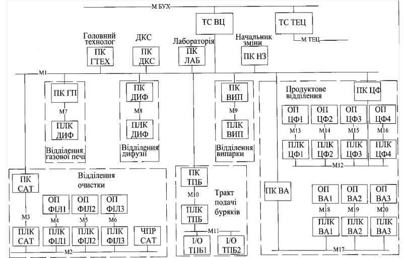
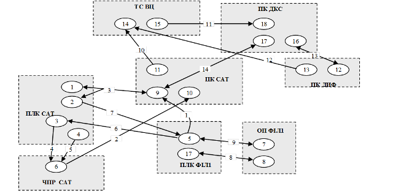
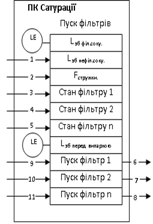
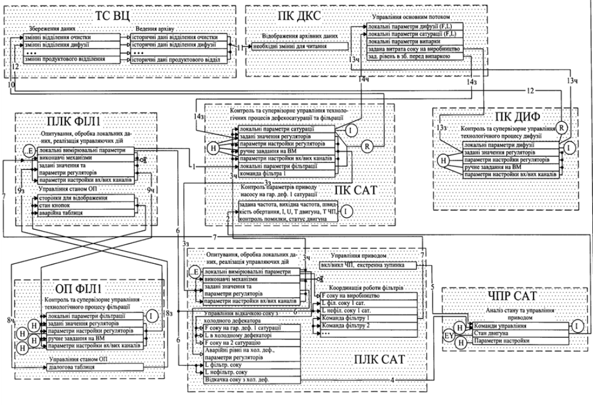

[Промислові мережі та інтеграційні технології в автоматизованих системах](README.md). 15. [Проектування інтегрованих автоматизованих систем](15.md) 

## 15.3. Розробка структурних схем ІАС

### 15.3.1. Зміст структурних схем.

#### 15.3.1.1. Місце структурних схем в проектній документації. 

Після дослідження об’єкту, на стадії технічний проект необхідно визначити: функції ІАС; функції підсистем, їх цілі та ефекти; склад комплексів задач та окремих задач; концепцію інформаційної бази, її укрупненої структури; функції систем управління базою даних; склад обчислювальної системи;  функції та параметри основних програмних засобів.  

Методика виділення функцій систем та підсистем із загальних поставлених задач залежить від об’єкту і виходить за рамки даного посібника. Результати даної стадії формалізуються у вигляді організаційної структури (C0), схеми функціональної структури(C2), структурної схеми комплексу технічних засобів (C1). 

#### 15.3.1.2. Схема організаційної структури (С0). 

Дана схема відноситься до загальносистемних рішень, однак опис її входить до складу організаційного забезпечення. Згідно РД 50-34.698.90, схема та опис включають: склад підрозділів (посадових осіб) організації, які забезпечують функціонування автоматизованої системи або використовують при прийнятті рішень інформацію, яка отримана від автоматизованої системи; основні функції та зв’язки між підрозділами та окремими посадовими особами, які вказані на схемі та їх підлеглість. 

Схема організаційної структури в початковому вигляді визначається ще на етапі формування тактико-технічного завдання. Надалі вона може бути при необхідності модифікована. 

#### 15.3.1.3. Схема функціональної структури (С2). 

Схема відноситься до загальносистемних рішень. Згідно РД 50-34.698.90 вона  включає:

-     елементи функціональної структури ІАС (підсистем АС); автоматизовані функції та (або) задачі (комплексу задач); сукупності дій (операцій), які виконуються при реалізації автоматизованих функцій тільки технічними засобами (автоматично) або тільки людиною;

-     інформаційні зв’язки між елементами та з зовнішнім середовищем та короткою вказівкою змісту повідомлень та (або) сигналів, які передаються по зв’язкам, та при необхідності, зв’язки інших типів;

-     деталізовані схеми частин функціональної структури (при необхідності).

#### 15.3.1.4. Опис автоматизованих функцій (П3). 

Функціональна структура повинна супроводжуватись описом автоматизованих функцій (П3), який згідно стандарту вміщує розділи: 

1. Вихідні дані: перелік вихідних матеріалів та документів, які використовувались при розробці функціональної частини проекту системи; особливості об’єкта управління, які впливають на проектні рішення по автоматизованим функціям; дані про системи управління, які взаємопов’язані з розроблювальною ІАС і відомості про інформацію, якою вона повинна обмінюватися з абонентами та іншими системами; опис інформаційної моделі об’єкту разом з його системою управління.

2. Цілі ІАС та функції що автоматизуються: опис функцій що автоматизуються, які направлені на досягнення встановлених цілей;

3. Характеристику функціональної структури: перелік підсистем АС з вказівкою функцій та (або) задач, які реалізуються в кожній підсистемі; опис процесу виконання функцій (при необхідності); необхідні пояснення до розділення автоматизованих функцій на дії (операції), які виконуються технічним засобами та людиною; вимоги до часового регламенту та характеристикам процесу реалізації автоматизованих функцій (точності, надійності і т.д.) та рішення задач.

4. Типові рішення: перелік типових рішень з вказівкою функцій, задач, комплексів задач, для виконання яких вони застосовуються.

#### 15.3.1.5. Опис постановки задача (П4). 

Крім П3, в комплектності документів загальносистемного забезпечення наводиться опис постановки задач (П4), який вміщує розділи:

1. Характеристики комплексу задач: призначення комплексу задач; перелік об’єктів, при управлінні якими вирішують комплекс задач; періодичність і тривалість рішення; умови, при яких закінчується рішення комплексу задач автоматизованим способом (при необхідності); зв’язки даного комплексу задач з іншими комплексами (задачами) ІАС; посади осіб та (або) найменувань підрозділів, які визначають умови та часові характеристики конкретного рішення задачі (якщо вони не визначені загальним алгоритмом функціонування системи); розподіл дій між персоналом та технічними засобами при різних ситуаціях рішення комплексу задач;

2. Вихідна інформація: перелік вихідних повідомлень; перелік та опис структурних одиниць інформації вихідних повідомлень (показників, реквізитів та їх сукупності, сигналів управління), які мають самостійне смислове призначення, або посилання на документи з цими даними.

3. Вхідна інформація (аналогічно вихідної).

В описі по кожному повідомленню або структурній одиниці інформації необхідно вказати: ідентифікатор повідомлення, найменування структурної одиниці, форму представлення повідомлення (документ, відеокадр, сигнал управління) та вимоги до неї; періодичність видачі (вихідна); терміни видачі та допустимі затримки рішення (вихідна); отримувачів та призначення вихідної інформації, джерела вхідної інформації; вимоги до точності та надійності розрахунку.

В описі постановки задач (П4) допускається давати у вигляді додатків ілюстраційний матеріал, таблиці або текст допоміжного характеру, а також документи, які мають самостійне позначення (креслення форм документів, опис масивів інформації, схеми і т.д.)   

#### 15.3.1.5. Структурна схема комплексу технічних засобів (С1).  

Враховуючи необхідність інтеграції існуючих підсистем в єдину систему, функціональну структуру та задачі необхідно розробляти в комплексі з технічною структурою інтегрованої системи. Структурна схема комплексу технічних засобів (структурна схема КТС) є частиною ТО технічного проекту та робочої документації  і вміщує склад комплексу і зв’язки між технічним засобами або групами технічних засобів, які об’єднані по яким-небудь логічним ознакам (наприклад, сумісному виконанню окремих або декількох функцій, однаковому призначенню і т.д.). 

При виконанні цих схем допускається: вказувати основні характеристики технічних засобів; представляти структуру комплексу ІАС (при необхідності) декількома схемами, першою з яких є укрупнена схема вцілому. 

Для розробки схеми інформаційних потоків (СІП) структурна схема комплексу технічних засобів повинна містити інформацію про способи об’єднання вузлів між собою. Тобто на кресленні необхідно показати інформацію про засоби та порти, через які кожен вузол підключається до загальної мережі. Таким чином будемо виділяти два рівня структурних схем КТС: 

-     узагальнена структурна схема КТС;

-     деталізована структурна схема КТС.

Узагальнена структурна схема КТС представляє собою укрупнену схему ІАС вцілому, яка розробляється вже на стадії розробки концепції. Вона являється частиною вихідних даних та вимог до ІАС, що входять до тактико-технічного завдання на ІАС. Деталізована структурна схема КТС (С1) розробляється на стадії "технічний проект" з урахуванням інформаційної структури. Вона може бути виконана для частини ІАС і містить інформацію про засоби та порти підключення вузлів до мережі.  

#### 15.3.1.6. Моделі інформаційних потоків як особливий вид функціональної структури. 

При розробці інтегрованих автоматизованих систем вже на початковій стадії технічного проекту необхідно визначитися з організаційною та функціональною структурою, функціями та комплексом задач, а також узагальненою технічною структурою системи вцілому, в контексті засобів якої виконуються задачі. Враховуючи складність декомпозиції поставлених перед системою задач на функції та підзадачі з урахуванням інформаційних взаємозв’язків, пропонується в якості доповнення або альтернативи до функціональної структури використовувати наступні графічні матеріали: графову модель інформаційних потоків (С2Г) або блочну модель інформаційних потоків (С2Б). В основі цих моделей лежить функціональна структура, інформаційні зв’язки якої являються інформаційними потоками.  

### 15.3.2. Використання графової моделі інформаційних потоків (С2Г) 

Графова модель інформаційних потоків представляється у вигляді потокового орієнтованого графу. Вершинами є реалізація функцій (процес рішення та отримані дані), а дугами передача інформації (аргументів функцій – необхідні дані). На дугах вказуються умовні номери інформаційних потоків, на вершинах – назва функцій, або умовне позначення (наприклад, числове). Напрямок дуг вказує на напрямок передачі даних. Двосторонні дуги – об’єднання інформаційних потоків в протилежному напрямку, але з однаковими даними.

Для розшифровки позначень дуг та вершин до графічного представлення моделі додається текстова частина з поясненням до них. в поясненні вказуються дані, які передаються, параметри потоків (періодичність, особливості тощо). Форма та зміст текстової частини відповідає вимогам до П3 та П4. 

Для забезпечення виділених при декомпозиції функцій необхідними даними можуть з’явитися додаткові функції, які теж необхідно показати. Найбільш примітивні функції, які являються кінцевими вершинами, є функції вводу/виводу (I/O), тобто: опитування датчиків, управління виконавчими механізмами, передача/прийом даних по мережі. Ці функції умовно можна назвати інтерфейсними. Далі від цих функцій інформаційні потоки приймають інший (не цифровий вигляд), тому не показуються на графі. Перетворення цифрової інформації з одного формату в інший теж являється додатковою функцією, тому виділяється як окрема вершина. 

Показуються тільки ті функції та інформаційні потоки, які стосуються мережного зв’язку. Ці функції на графі часто об’єднуються в єдину вершину, а дуги вказують на об’єднані інформаційні потоки в один. Така операція можлива у випадку, коли інформаційні потоки, які об’єднуються, будуть мати однакові характеристики: напрямок, швидкість відновлення, спосіб можливої реалізації, тощо.

При проектуванні бажано розпочати з детального графового представлення інформаційних потоків, що дозволить наглядно представити поставлену задачу, та допомогти в організації її вирішення. 

Приклад 15.1. Проектування. Використання графової моделі інформаційних потоків. 

Завдання. Аналіз існуючої системи на цукровому заводі показав, що всі виробничі відділення автоматизовані з використанням сучасної мікропроцесорної техніки. Узгодженість роботи відділень досягається за рахунок управлінських дій начальників змін та головного технолога. Реалізовані контури управління кожного відділення по якісним критеріям управління задовольняють поставленим вимогам. Організаційно-економічні відділи підприємства автоматизовані з використанням пакету 1С “Предприятие”. Попри високий рівень автоматизації існують деякі проблеми:

1) При нештатних ситуаціях на одному з відділень виникають проблеми з управлінням потоком та підтримкою стабільної якості на суміжних відділеннях, зокрема: 

-     при значному збільшенні відкачки соку з дифузійного відділення відчувається інерційність роботи фільтрів соку 1 сатурації ;

-     при значному зменшенні подачі соку на випарне відділення, фільтри соку 1 сатурації та дифузійне відділення продовжують працювати з тією ж потужністю; 

2) Існують джерела наднормативних витрат пари, які практично важко визначити.

3) Складно проаналізувати роботу всього підприємства в цілому, із-за відсутності централізованого доступу до необхідних плинних та історичних даних.

4) Параметри управління не підстроюються під плинні якісні параметри буряку.

5) Відсутня інформація про середні, максимальні, мінімальні та загальні витрати основного потоку по всьому підприємству, що затрудняє визначити "вузькі" міста та причини неритмічності роботи заводу.

Для того щоб позбутися поставлених проблем вирішено на першому етапі вирішити та реалізувати наступні проектні задачі:

1. Забезпечити централізований збір інформації по всьому виробничому потоку з можливістю кореляції завдань по основним витратним параметрам;
2. Забезпечити координацію сокоочисного, дифузійного відділень та фільтрів соку 1-ї сатурації.
3. Забезпечити агрегованою інформацією робочі станції організаційно-економічного рівня.
4. Забезпечити централізований доступ до архівних даних.

Для вирішення цих задач в першому варіанті запропонована узагальнена структура комплексу технічних засобів ІАСУ  виробництвом цукру, яка зображена на рис.15.3. Перелік технічних засобів, наведений в таб.15.7. Необхідно провести декомпозицію поставлених задач, та показати інформаційну взаємодію отриманих підфункцій у вигляді графової  моделі, у відповідності з поставленими вимогами.  

Таблиця 15.7 Специфікація технічних засобів

| Позначення                      | Найменування                                                 | Характеристика                  |
| ------------------------------- | ------------------------------------------------------------ | ------------------------------- |
| М1, М  ТЕЦ, М БУХ               | Локальна  обчислювальна мережа відповідно виробництва, ТЕЦ та бухгалтерії | Ethernet  100 Base-TX           |
| М2-М6                           | Локальні  мережі управління технологічного відділення очистки | Modbus  RTU на RS-485           |
| M7-М9                           | Локальні  мережі управління технологічних відділень відповідно газової печі, дифузії та  випарки | UniTelway  на RS-485            |
| М10                             | Локальна  мережа управління тракту подачі буряків            | Ethernet  100 Base-TX           |
| М11                             | Локальна  мережа управління тракту подачі буряків            | Profibus  DP                    |
| М12-M20                         | Локальні мережі управління продуктового  відділення          | UniTelway  на RS-485            |
| TC  ТЕЦ,   TC BЦ                | Технологічний  сервер ТЕЦ та виробництва цукру відповідно    | Intel  Pentiun 4 GHz, RAM 512Mb |
| ПК  ГТЕХ, ПК ДКС, ПК ЛАБ, ПК НЗ | Персональний  комп’ютер (ПК) головного технолога, диспетчерсько-координуючої станції,  лабораторії та начальника зміни відповідно | Celeron  1,7 GHz, RAM 256Mb     |
| ПК ГП,    ПК  ДИФ,   ПК ВИП     | ПК  відділень газової печі, дифузії та випарної станції відповідно | Celeron  1,7 GHz, RAM 256Mb     |
| ПК ЦФ,    ПК ВА                 | ПК  центрифуг та вакуум-апаратів продуктового відділення відповідно | Celeron  1,7 GHz, RAM 256Mb     |
| ПК ТПБ                          | ПК  тракту подачі буряків                                    | Celeron  1,7 GHz, RAM 256Mb     |
| ПК САТ                          | ПК  відділення очистки                                       | Celeron  1,7 GHz, RAM 256Mb     |
| ПЛК  ТПБ                        | Програмований  логічний контролер тракту подачі буряків      | Vipa  317SN                     |
| ПЛК  ГП, ПЛК ДИФ, ПЛК ВИП       | Програмований  логічний контролер відповідно відділень газової печі, дифузії та випарки | TSX  57303                      |
| ПЛК  ЦФ1-4, ПЛК ВА1-3           | Програмований  логічний контролер відповідно центрифуг та вакуум-апаратів продуктового  відділення | TSX  3722                       |
| ПЛК  САТ                        | Програмований  логічний контролер відділення очистки         | TSX  57303                      |
| ПЛК  ФІЛ1-3                     | Програмований  логічний контролер фільтрації відділення очистки | TWD  LCAA 40DRF                 |
| ОП  ФІЛ1-3                      | Операторська  панель фільтрації відділення очистки           | XBTN400                         |
| ОП  ВА1-3, ОП ЦФ1-4             | Операторська  панель вакуум-апаратів та центрифуг продуктового відділення | XBTN400                         |
| ЧПР  САТ                        | Частотний  перетворювач відділення сатурації                 | ATV58                           |
| І/О  ТБП1,2                     | Віддалені  входи/виходи відповідних відділень                | SM  153-4PF00                   |

 Рис.15.3. Загальна структура комплексу технічних засобів ІАСУ виробництва цукру .

Рішення. Один із варіантів декомпозиції поставлених задач та їх інформаційні зв’язки показані на рис.15.4, де вершинами графу є задачі:

1, 5 – опитування, збереження локальних даних, реалізація управляючих дій; 2 – координація роботи фільтрів; 3 – управління відкачкою соку з холодного дефекатора; 4 – управління станом комунікаційного обміну; 6 – аналіз стану та управління приводом; 7 – контроль та супервізорне управління технологічного процесу фільтрації; 8 – управління станом операторської панелі; 9 – контроль та супервізорне управління технологічних процесів дефекосатурації та фільтрації; 10 – контроль роботи приводу насосу соку на гарячий дефекатор 1 сатурації; 11, 13 – збереження даних; 12 – анімація технологічного процесу дифузії; 14 – збереження даних; 15 – ведення архіву;  16 – управління основним потоком; 17 – управління станом операторської панелі;  18 – відображення архівних даних.

Дуги графів представляють інформаційні потоки, зміст та вимоги до яких: 1 – параметри для відображення стану фільтрації: ... (йде перерахунок параметрів) - 1 раз/с; 2 – параметри, які відображають стан приводу насосу подачі соку на гарячий дефекатор:.. (йде перерахунок параметрів) - 1 раз/с; 3 - параметри для відображення стану, диспетчерського управління та зміни завдання дефекосатурації: ... (йде перерахунок параметрів) - 1 раз/с, по зміні значення; 4 – задана частота обертання, параметри управління приводом, задане значення ПІ-регулятора - 1 раз/с; 5 – команда на включення роботи приводу з комунікацією - при старті ПЛК; 6 – рівень в збірнику фільтрованого соку, рівень в збірнику нефільтрованого соку - якнайчастіше; 7 - F соку на дефекосатурацію, F соку на гар. дефекатор 1-ї сатурації, F соку на 2-гу сатурацію - по запиту; 8 – сторінки для відображення, стан кнопок, аварійна таблиця - 400 мс; 9 – параметри для відображення стану фільтрації, диспетчерського управління та зміни завдання: ... (йде перерахунок параметрів) - по запиту; 10, 12 – параметри для збереження:...(йде перерахунок параметрів) - 1/1 хв. на весь сезон; 11 – параметри для читання (всі які пишуться) - по запиту; 13 - параметри для відображення стану та для диспетчерського управління та зміни завдання на відділення дифузії: ... (йде перерахунок параметрів, що відображають витратні характеристики та управляючі дії) - 1/5 с; 14 - параметри для відображення стану та для диспетчерського управління та зміни завдання на відділення дефекосатурації: ... (йде перерахунок параметрів, що відображають витратні характеристики та управляючі дії) - 1/5 с.

 Рис.15.4. Фрагмент графової моделі інформаційних потоків КІСУ.

### 15.3.3. Використання блочної моделі інформаційних потоків (С2Б)

В блочній моделі інформаційних потоків кожна функція графічно відображається як функціональний блок, який "наповнений" даними – аргументами та результатами функцій. Зверху над функціональним блоком вказується назва функції. Дані функціонального блоку можуть представляти собою входи, виходи, входи/виходи та внутрішні (рис.15.5). Вхідні дані – це аргументи функції, які беруться з інших функціональних блоків, або з локальних джерел вводу даних (датчики, засоби ЛМІ, тощо). Дані, які являються результатом даної функції є вихідними даними. Це можуть бути входи функціональних блоків (функцій) інших вузлів, або виконавчими механізмами локального вузла. Деякі дані можуть модифікувати вхідні дані, в такому випадку дані являються і вхідними і вихідними. Інколи дані є проміжними результатами інших функцій даного вузла, які немає необхідності показувати окремо на моделі. Якщо дані являються локальними, то до них підключаються локальні прилади, які позначаються так само, як на схемах автоматизації.

Рис.15.5. Фрагмент блочної моделі інформаційних потоків

Додаткову інформацію, що неможливо показати на схемі приводять в текстовій частині у вигляді документів П3 та П4.

Приклад 15.2. Проектування. Використання блочної моделі інформаційних потоків. 

Завдання. Для вирішення задачі 1.1 скористуватися блочною моделлю інформаційних потоків.

Рішення. Варіант представлений на рис.15.6.  

 

Рис.15.6. Приклад блочної моделі інформаційних потоків КІСУ виробництва цукру  

<-- 15.2. [Загальні підходи до проектування інтегрованих автоматизованих систем](15_2.md)   

--> 15.4. [Розробка документів інформаційного забезпечення ІАС](15_4.md) 