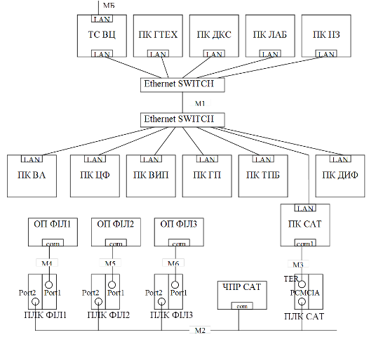
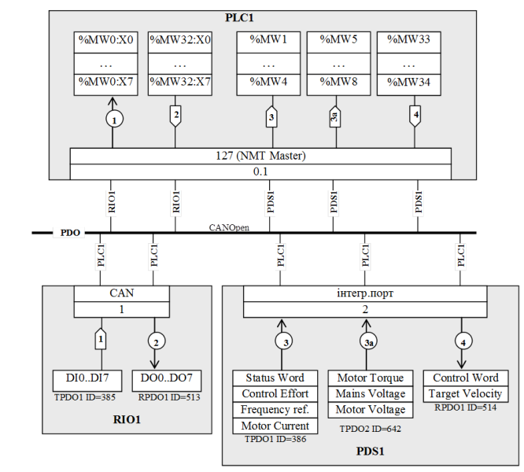

[Промислові мережі та інтеграційні технології в автоматизованих системах](README.md). 15. [Проектування інтегрованих автоматизованих систем](15.md) 

## 15.4. Розробка документів інформаційного забезпечення ІАС

### 15.4.1. Комплекнтість документів інформаційного забезпечення

Для  організації інформаційного забезпечення на стадії технічний проект необхідно розробити узгоджуючі документи комплекту інформаційного забезпечення на рівні всієї системи. Згідно стандарту комплектність цих документів повинна вміщувати наступні важливі розділи.

1) Опис інформаційного забезпечення системи. Він складається з розділів:

- 1.1. Склад інформаційного забезпечення: найменування та призначення всіх баз даних та наборів даних;

- 1.2. Організація інформаційного забезпечення: принципи організації інформаційного забезпечення системи; обґрунтування вибору носіїв даних та принципи розподілу інформації по типам носіїв; опис прийнятих видів та методів контролю в маршрутах обробки даних при створенні та функціонуванні поза машинної та внутрішньо машинної інформаційних баз з вказівкою вимог, на відповідність яким проводять контроль; опис рішень, які забезпечують інформаційну сумісність АС з іншими системами управління по джерелам, споживачам інформації, по спряженню використовуваних класифікаторів (при необхідності), по використанню в АС уніфікованих систем документації.

- 1.3. Організація збору та передачі інформації: перелік джерел та носіїв інформації з вказівкою оцінки інтенсивності та об’єму потоків інформації; опис загальних вимог до організації збору, передачі, контролю та корегування інформації. 

- 1.4. Побудова системи класифікації та кодування: опис прийнятих для застосування в ІАС класифікації об’єктів в заново розроблених класифікаторах та в тих діючих класифікаторах, з яких використовується частина коду; методи кодування об’єктів класифікації в заново розроблених класифікаторах.

- 1.5. Організація внутрімашинної інформаційної бази: опис принципів побудови внутрімашинної інформаційної бази, характеристика її складу та обсягу; опис структури внутрімашинної інформаційної бази на рівні баз даних з описом характеру взаємозв’язків баз даних та вказівкою функцій ІАС, при реалізації яких використовують кожну базу даних, характеристики даних, які вміщуються в кожній базі даних.

- 1.6. Організація позамашинної інформаційної бази: характеристики складу та об’єму позамашинної інформаційної бази, принципи її побудови, в тому числі основні положення по організації та обслуговуванню фонду нормативно-довідкової інформації в взаємозв’язку з автоматизованими функціями.

- 1.7. Опис інформаційного забезпечення системи: довідникові та інші додаткові матеріали та відомості (систематизований перелік найменувань структурних одиниць інформації з присвоєними їм позначеннями та описами їх сутності) 

2) Опис організації інформаційної бази.

- 2.1. Опис внутрімашинної інформаційної бази: опис логічної структури (складу даних, їх формату та взаємозв’язків між даними); опис фізичної структури (вибраний варіант та розміщення даних на конкретних машинних носіях); 

- 2.2. Опис позамашинної інформаційної бази.

3) Опис масиву інформації.

- 3.1. Найменування масиву;

- 3.2. Позначення масиву;

- 3.3. Найменування носіїв інформації;

- 3.4. Перелік реквізитів в порядку їх слідування в записах масиву з вказівкою по кожному реквізиту, позначення алфавіту, довжини в знаках та діапазону змін (при необхідності), логічних та семантичних зв’язків з іншими реквізитами даного запису та іншими записами масиву;

- 3.5. Оцінка об’єму масиву;

- 3.6. Інші характеристики масиву (при необхідності).

Для наглядності представлення даної інформації на загальносистемному рівні пропонується використовувати схеми мережних інформаційних потоків, які графічно представляють масиви даних в базах даних вузлів системи, та їх взаємозв’язок інформаційними потоками. 

### 15.4.2. Використання схеми мережних інформаційних потоків (СІП)

#### 15.4.2.1. Призначення схеми мережних інформаційних потоків. 

Схему мережних інформаційних потоків (СІП) розробляють на основі деталізованої структури КТС ІАС (С1) та моделі мережних інформаційних потоків (С2Г або С2Б). Основна задача схеми показати реалізацію інформаційних потоків з точки зору інформаційного забезпечення (ИО), оскільки апаратна частина показується та описується на структурних схемах КТС. 

Схема мережних інформаційних потоків повинна:

-    дати представлення про обмін даними в мережі між різними типами баз даних;

-    служити інструментом для вияву конфліктних ситуацій, вирішення оптимальної стратегії зв’язку, зменшення надлишкових потоків і т.д.;

-    допомогти в формуванні технічного завдання для підрозділів або підрядників, які відповідають за певну частину (підсистему) проекту ІАС, який розробляється.

Наочність дає змогу краще розуміти процеси обміну, які діють в системі, тому бажано особливо не нагнітати її надлишковою інформацією. Саме з цієї схеми можна почати розподілення адрес між пристроями, виділення ресурсів (змінних), визначення боку клієнта та сервера тощо. 

Для грамотної побудови такої схеми, проектант повинен розуміти основні принципи роботи мережного обладнання, протоколів обміну, програмного забезпечення вузлів і т.д.

#### 15.4.2.2. Елементи схеми інформаційних потоків. 

Основними елементами схеми є:

1) масиви даних процесу в межах баз даних, які приймають участь в загальносистемному, на певному рівні, обміні, тобто які циркулюють по обчислювальним мережам;

2) інформаційні потоки, які забезпечують доставку даних з бази даних джерела в базу даних отримувачів; вони показані на моделі інформаційних потоків з відповідними номерами, що можуть співпадати, об’єднуватись, добавлятись; загальна концепція позначень інформаційних потоків на схемі повинна зберегтись з позначеннями на моделі (С2Г або С2Б);

3) мережні сервіси або протоколи, за допомогою яких реалізовані інформаційні потоки;

4) комунікаційні логічні канали пристроїв та програмного забезпечення, через які проходять інформаційні потоки: драйвер, логічний канал, адреса, тощо; 

5) уточнюючі характеристики інформаційних потоків: в графічній частині бажано показати хто ініціював запит (Клієнт, Видавець або Виробник) та напрямок передачі інформації; в текстовій – всю іншу інформацію, відповідно до вимог до ИО.

#### 15.4.2.3. Масиви даних. 

З точки зору моделі інформаційних потоків масиви даних або блок даних – це відображення аргументів функцій в конкретній базі даних, конкретного вузла системи. Кожний інформаційний потік починається та закінчується масивом даних або операціями. Масивами даних можуть бути змінні бази даних контролера, змінні бази даних реального часу SCADA, записи в базах даних і т.д., які як правило об’єднані (згруповані) між собою по принципу: один масив даних спільний для одного інформаційного потоку. Таке об’єднання дозволяє графічно наглядно представити весь процес обміну, а інколи допомагає згрупувати змінні для зменшення навантаження на мережу. 

Масиви даних розміщуються в базах даних програмно-технічного засобу. Під базою даних розуміється виділена структурна одиниця даних. Фізично масиви даних можуть являти собою пам’ять контролера або його частини, виділені для обміну змінні програми або її частини, дисковий простір тощо. Для ідентифікації розміщення даних необхідно показати їх в складі засобу в порядку їх вкладеності: 

засіб -> програма -> частина програми (база даних) -> масив даних. 

На рис.15.7 на комп’ютері ПК ДИФ розміщуються 4-ри масиви даних. Перші три масиви розміщені в SCADA-системі, однак потрібно ідентифікувати де саме вони знаходяться. Блоки 1 та 2 – це змінні (теги) бази даних реального часу (БДРЧ), а блок3 – це таблиця, або її частина, реляційної бази даних (РБД) під назвою "Trends". Звісно, що деталізація розміщення залежить від конкретної ситуації. Так, наприклад, якщо всі дані на схемі інформаційних потоків є тільки складовими бази даних реального часу, то для спрощення можна БДРЧ не вказувати. Блок4 розміщений на тому самому комп’ютері, однак в іншій прикладній програмі – Excel. Причому ці дані розміщені на листі "Лист1". Якщо якийсь масив даних стосується суто змінних VBA в Excel, то необхідно вказати рядом з листом ще і VBA-модуль.  


Рис.15.7. Фрагмент схеми мережних інформаційних потоків.

На контролері, як правило виконується тільки одна прикладна програма (принаймні з точки зору розробника програми користувача). Тому блок5 розміщується безпосередньо в ПЛК ДИФ.  

Для ідентифікації складових масивів даних, в них вказуються назви змінних, або групи змінних, таблиці змінних, таблиці, масиви, записи тощо. Є декілька способів показати склад масивів. Перший спосіб – відобразити масив у вигляді списку, тобто як повний перелік одиничних даних однакового формату (рис.15.8. – верхні блоки). Цей універсальний спосіб дає змогу побачити всі елементи з даного масиву без додаткової уточнюючої інформації. Такий спосіб втрачає свої переваги при великій кількості одиничних даних.


Рис.15.8. Приклади зображення масивів даних: а, б – в ПЛК; в – в SCADA

Більш економічний спосіб, з точки зору місця на кресленні, - монолітний, тобто використання унітарного позначення всього масиву (рис.15.8 – середні блоки). Тоді весь масив позначається одним унікальним для цього креслення ідентифікатором, який розшифровується (розписується) в текстовій частині. Якщо врахувати, що перелік мережних змінних (вхідних та вихідних змінних) повинен перераховуватися в текстовій частині ИО, цей спосіб має суттєві переваги перед попереднім. Однак в деяких випадках переваги перетворюються в недоліки. Так, наприклад при присутності одних і тих самих змінних в декількох інформаційних потоках, вони повторюються в різних масивах, що не видно на основному кресленні. В цьому випадку перехресні (стосовно потоків) дані можна виділити в окремі масиви як у монолітному вигляді так і в вигляді списку.   


Рис.15.9. Приклади зображен-ня інформаційних потоків

Деякі дані можна представити у вигляді розірваного масиву з першим та кінцевим елементом. Таке зображення можливе у випадку, коли термінальні елементи (перший та останній в масиві) повністю визначають весь склад масиву даних. Так на рис.15.8 показані рекомендовані зображення масивів. Для ситуації (а) можливі всі три варіанти, оскільки змінні нумеруються і розміщені без розриву по номеру. Однак, якщо деякі з них присутні в різних інформаційних потоках, використання даних у вигляді моноліту та розірваного масиву себе не виправдовують. Крім, того, якщо існує розрив в номерах, слід вказати ключові номери елементів, як наприклад, на рис.15.8 (б). 

Всі ці способи можна комбінувати. Так для змінних контролера найбільш підходить вигляд розірваного масиву, для тегів SCADA – список або моноліт. Для останніх вигляд розірваного масиву не підходить, оскільки дані між термінальними елементами не можна однозначно ідентифікувати (рис.15.8(в). З приводу зображення даних слід мати на увазі, що все наведене вище є рекомендаціями. Головне правило – дані повинні бути однозначно ідентифіковані і прив’язані до інформаційних потоків. 

#### 15.4.2.4. Інформаційні потоки. 

Інформаційні потоки зображуються у вигляді лінії, на якій вказується його номер. Для уточнення інформації про інформаційний потік номер може бути вписаний в певну геометричну фігуру. Фігура може вказувати на тип сервісу. Наприклад, для Клієнт-Серверних моделей сервісів, з боку Клієнту (той, хто ініціює запит) можна вказати фігурну стрілку, яка вказує на напрямок передачі даних, а з боку Серверу – коло зі стрілками (рис.15.9). У всіх інших випадках можна вказувати круг. Для pull моделі Видавець-Підписувач (Виробник-Споживач) фігурну стрілку можна вказати з боку Pull Publishing Manager. При двосторонньому обміні (читання/запис однакових змінних), при використанні одного і того ж сервісу, два і більше потоки можна умовно об’єднувати в один. При цьому зі сторони Клієнта вказується двостороння фігурна стрілка, а в текстовій частині інформація уточнюється. 

Номери потоків в схемі інформаційних потоків повинні перекликатися з номерами в моделі інформаційних потоків. Однак при необхідності, - коли потік реалізовується як декілька окремих потоків, або навпаки, коли декілька потоків об’єднуються в один, - можна змінити позначення. Так при розбитті потоку 1 на три потоки можна їх позначити відповідно 1-1, 1-2, 1-3, а при об’єднанні потоків 4, 8, 9 можна позначити потік 4.8.9. Головний критерій формування таких номерів – максимальна простота і зрозумілість. В будь якому випадку на кресленні в таблиці умовних позначень необхідно вказати призначення кожного неоднозначного елементу схеми.  

#### 15.4.2.5. Комунікаційні сервіси 

На кресленні вказуються комунікаційні сервіси, якими "користуються" інформаційні потоки. Якщо сервіси однозначно визначаються протоколом, то вказується протокол обміну. Як правило необхідно вказувати прикладні сервіси і відповідно прикладні протоколи. Для спрощення в контексті правил побудови буде використовуватись слово "сервіс" а не "протокол". 

  Кожний потік починається з масиву даних. Початком потоку умовно можна вважати бік його ініціювання. Далі в порядку слідування потоку вказуються комунікаційні засоби програмного забезпечення, що відповідає за обмін, тобто його інтерфейсна частина (драйвери пристроїв, бібліотеки обміну і т.д.). Якщо ці складові приховані від розробника системи і вважаються внутрішньою закритою складовою програмно-технічного засобу, то її вказувати не потрібно. Вказуються тільки ті частини програмного забезпечення, які неоднозначні і можуть бути замінені на альтернативні. Вказувати частини програмного засобу, що відповідають за обмін надзвичайно важливо, оскільки це дає представлення про його реалізацію. 

На рис.15.10 показані три типові випадки (не повний перелік) слідування інформаційних потоків від масиву даних до зовнішнього порту комп’ютера. Всі вони користуються умовними інтерфейсними каналами прикладної програми, які будемо називати драйверами. Для кожного драйверу можуть існувати настройки, які інколи необхідно уточнювати або на схемі, або в текстовій частині. Як мінімум на схемі потрібно показувати дійсну або умовну назву цього каналу.


Рис.15.10. Приклад проходження інформаційних потоків.

Перший інформаційний потік починається з масиву даних Т1. Для передачі даних по мережі М1 використовується драйверХ, який являється інтерфейсною частиною прикладної програми ExmplSCADA. В даному випадку достатньо вказати тільки цей інтерфейс, можливо з деякими уточненнями. Якщо всі дані передаються через єдиний інтерфейс, який не можливо змінити, то драйверХ не вказується, оскільки інших варіацій бути не може.

Інколи драйвер прикладної програми використовує проміжну бібліотеку (програму, драйвер). Причому ім’я бібліотеки або її тип може відрізнятися. Для прикладу, якщо на рис.15.10 драйверY – це реалізація ОРС-клієнтського інтерфейсу, то необхідно вказати також ОРС-Сервер для реалізації потрібного протоколу мережі. В цьому випадку бібліотеку просто показують на шляху слідування потоку без його "розриву". Уточнення до бібліотеки можна вказати разом з її назвою. 

При необхідності в проміжній бібліотеці (програмі, драйвері) можна деталізувати внутрішню структуру. Так, наприклад, при використанні ОРС з декількома реалізованими протоколами обміну необхідно вказати який з них використовується даним інформаційним потоком (йде через нього), та настройки цього драйверу. В деяких випадках необхідно показати внутрішні дані цієї програми, через який проходить обмін. На рис.15.10 інформаційний потік 3 проходить через таку програму. Вона "розриває" потік, тому він реалізовується у вигляді двох потоків 3k та 3s. Всередині показаний допоміжний масив даних Т6. 

#### 15.4.2.6. Логічні канали. 

Після програмного забезпечення, драйверів, бібліотек, на шляху проходження потоку при необхідності вказуються адреси станцій (вузлів) на мережі та логічні канали або порти, які є інтерефейсними для програмно-технічного засобу. Логічний канал являється відображенням фізичного каналу, а його маркування залежить від реалізації та типу ПЗ. Якщо ніякого представлення каналу в останнього немає, в загальному випадку логічний канал може мати вигляд:

```
 тип_комунікаційного_обладнання : номер_плати . номер_каналу    
```

Такий вигляд необхідний для зрозумілої ідентифікації каналу. Логічні канали на одному пристрої не можуть мати один і той же ідентифікатор, однак можуть співпадати з логічними каналами інших пристроїв.

Адреса(-си) можуть прив’язуватися до логічних каналів. У випадках, коли на одному логічному каналі знаходиться декілька адрес, пристрій через нього може спілкуватися від різних адрес, а отже необхідно їх вказати на шляху інформаційних каналів. Коли канал використовується декількома драйверами (якщо таке можливо), адреси не прив’язуються до каналу, а прив’язуються до драйверу.

#### 15.4.2.7. Інформаційні шини. 

Після каналу всі потоки об’єднуються в одну інформаційну шину, що являє собою використання єдиного комунікаційного сервісу, яким вони користуються. Окрім інформації про спосіб реалізації потоку, таке представлення може допомогти оцінити інформаційне навантаження на мережу. Одна мережа (фізична) та протокол може підтримувати декілька сервісів (протоколів). Інформаційні шини не обов’язково повинні відповідати сервісам протоколу одного рівня (наприклад прикладного), але повинні однозначно вказати чим "користуються" інформаційні потоки.

Інформаційний потік закінчується аналогічно, як і починався. Тому "початок" потоку є умовним і не обов’язково починається зі сторони клієнта. Оскільки в ПЛК1 та ПЛК2 (рис.15.11) немає явно виділених прикладних програм та драйверів, масив даних інформаційним потоком зв’язується безпосередньо з логічним каналом. Однак до цього каналу можна прив’язати мережну адресу, або логічний порт і т.д., що буде розглянуто нижче.  


Рис.15.11. Приклад зображення інформаційного потоку з інформаційною шиною.

#### 15.4.2.8. Текстова частина.  

Текстова частина повинна описати кожний інформаційний потік з точки зору його реалізації. Це параметри інформаційних потоків по номерам: періодичність обміну, уточнення до способу реалізації. Крім того текстова частина повинна вміщувати необхідну інформацію по масивам даних, що наведені в переліку комплектності інформаційного забезпечення технічного та робочого проектів (П5-П8)

#### 15.4.2.9. Рекомендації до виконання. 

Схему рекомендується приводити окремо для кожної мережі (рівня мереж), якщо дані з пристрою одної мережі (одна схема) безпосередньо не передаються на пристрої іншої мережі (друга схема). Тобто інформаційний потік графічно бажано не "розривати". Крім того краще не нагнітати схему мало-важливою інформацією, яку можна вказати в текстовій частині, оскільки втрачається її наочність. 

Для швидшого пошуку продовження інформаційного потоку після інформаційної шини можна "загинати" кінці потоку при попаданні на шину в той бік, куди направляється потік (рис.15.11). Крім цього можна вказувати назву пристрою – адресату. 

В мережі можуть використовуватись декілька сервісів, які показуються інформаційними шинами. Назву кожної інформаційної шини бажано показувати в її розриві, а самі шини розміщувати якнайближче одну до одної в складі єдиної фізичної мережі. Графічне групування шин можна проводити зміною кольору заднього фону (рис.15.12), або об’єднанням в єдиний контур.


Рис.15.12.  Приклад зображення інфор-маційних шини    

### 15.4.3. Використання схеми інформаційних потоків при проектуванні мереж Modbus RTU

Виконання схеми інформаційних потоків розглянемо на прикладі Modbus RTU (рис.15.13). Комп’ютер під’єднується до шини Modbus RTU через СОМ-порти. Для операційної системи ПК не важливо, чи це реалізація інтерфейсу RS-232, чи RS-485 в послідовному режимі. Для неї це завжди буде СОМ-порт з певним номером. Оскільки при настройці драйверу необхідно вказати номер порту, його треба показати на інформаційному потоці. Як відомо SCADA/HMI пристрої на Modbus RTU, як правило, являються Клієнтами а отже Ведучими, однак це теж треба показати, адже можуть бути винятки (деякі SCADA/HMI підтримують драйвер Modbus RTU Веденого).

Хоч на Modbus RTU використовуються тільки Modbus-запити, все одно їх бажано показати для уніфікації підходу. Один із варіантів показувати їх у вигляді зноски, як це продемонстровано на рис.15.13. 


Рис.15.13. Приклад схеми мережних інформаційних потоків системи, реалізованої з використанням Modbus RTU.

ПЛК на шині може бути як Ведучим, так і Веденим. Оскільки в нашому прикладі Ведучий вже є, ПЛК1 та ПЛК2 являються Веденими. Адреса веденого прив’язується до логічного каналу контролера. В ПЛК1 логічний канал адресується як PORT1 (наприклад контролер TWIDO). В ПЛК2 адресація йде за принципом номер_модуля.номер_каналу (наприклад TSX Premium), тобто з’єднання з Modbus RTU проводиться через 0-й канал 0-го модуля (термінальний порт). Адреса Ведених для двох ПЛК для прикладу показана по різному: слово "slave" може вказуватись а може бути присутній тільки номер Веденого. 

### 15.4.4. Використання схеми інформаційних потоків при проектуванні мереж на базі Ethernet

На рис.15.14 показано функціонування системи, яка складається з трьох ПК та двох ПЛК, які підключені до Ethernet. Комп’ютери підключаються за допомогою вбудованих портів на материнській платі, ПЛК1 та ПЛК2 через інтегровані канали в процесорному модулі. Всі сервіси без винятку в даному випадку використовують протоколи ТСР/IP, тому до портів необхідно прив’язати адресу ІР (в даному випадку МАС адреса мало цікавить інтегратора). Графічно адреса може бути розташована над логічним каналом, як показано в ПК3, або біля нього – як в усіх інших випадках.


Рис.15.14. Приклад схеми мережних інформаційних потоків, реалізованій на Ethernet

Прокоментуємо потоки. 

1-й потік. SCADA в ПК1 читає змінні з ПЛК2 використовуючи Modbus TCP/IP. Для цього в SCADA використовується відповідний драйвер, а ПЛК звісно підтримує цей протокол (наявність Ethernet в ПЛК не визначає присутність протоколу Modbus TCP/IP). 

2-й потік. SCADA на ПК2 читає дані зі SCADA на ПК1 використовуючи технологію ОРС, яка в свою чергу базується на сервісах DCOM. Для цього SCADA на ПК2 має ОРС-клієнтський інтерфейс, а на ПК1 – ОРС-серверний. 

3-й потік. SCADA на ПК1 записує дані в архів реляційної бази даних під назвою "БД1", в таблицю "Table4". Формат БД - SQL Server, управляється СУБД MS SQL Server 2000, обмін проводиться за допомогою технології OLE DB через відповідний провайдер даних.

4-й потік. В SCADA на ПК2 вбудований стандартний елемент ActiveX – Internet Explorer, за допомогою якого користувач може доступатися до WEB-сторінок. В даному випадку він може заглянути на WEB-сторінку ПЛК1, на якій є зображена мнемосхема з даними Т4. 

5-й потік аналогічний 4-му. В цьому випадку користувач доступається через WEB-сервер програми MES-системи, під назвою MES-Х, до архівних даних з БД1. 

В наведеному нижче прикладі приводяться всі деталі побудови графічної та текстової частини схеми інформаційних потоків.

Приклад 15.2. Проектування. Виконання деталізованої структурної схеми КТС.

Завдання. Розробити деталізовану структурну схему КТС, відповідно до завдання з прикладу 15.1.

Рішення. Деталізована структурна схема КТС показана на рис.15.15. Специфікація мережних засобів показана в таб.15.3 



Рис.15.15. Деталізована структурна схема КТС (С1) до прикладу 1.2

Приклад 15.3. Проектування. Виконання схеми мережних інформаційних потоків.

Завдання. Розробити схему мережних інформаційних потоків до задачі 15.1.

Рішення. На основі структурної схеми КТС та моделі інформаційних потоків, розробляється схема мережних інформаційних потоків – рис.15.16. До неї додається таблиця мережних змінних, що приведена в табл.15.8.

Таблиця 15.8. Фрагмент таблиці мережних змінних ІАСУ виробництвом цукру. 


Рис.15.16. Фрагмент схеми мережних інформаційних потоків ІАСУ виробництвом цукру.

### 15.4.5. Використання схеми інформаційних потоків при проектуванні мереж Profibus

Загальні рекомендації для побудови схеми мережних інформаційних потоків для мереж Profibus залишаються без змін. На прикладному рівні або на "рівні профілів" можливе використання різних типів сервісів, що необхідно показати на схемі інформаційних потоків. Для обміну процесними даними можуть використовуватись циклічний (Data-Exchange) та ациклічний DP-обмін даними, обмін типу Видавець/Підписувач, обмін FMS-повідомленнями. Крім того на цій же мережі можуть підтримуватись інші сервіси, які не визначені в стандартах Profibus. Так в програмно-технічних засобах Siemens та VIPA підтримуються Siemens-сумісні S7-функції обміну (до них також відносяться PG/OP-сервіси) та S5-функції (SEND/RECEIVE). Таким чином на одній мережі можуть бути зображені декілька інформаційних шин.

Вхідні та вихідні дані, що приймають участь в обміні показуються відповідно як окремі масиви даних. В наповненні масиву даних вказується джерело даних для даного вузлу (змінні, номера входів або виходів, назва параметру, тощо). 

Для клієнт-серверного типу обміну циклічними та ациклічними даними процесу, позначення клієнтської та серверної сторони співпадає з загальноприйнятими. Для обміну Видавець-Підписувач, номера потоків в фігурних стрілках можна вказувати з боку Видавця а можна з боку Ведучого. В будь якому випадку позначення необхідно описати.    

При необхідності, на схемі інформаційних потоків можна окремо виділяти групи SYNC/FREEZE, консистентість даних, тощо. 

Приклад 15.4. Проектування. Схема мережних інформаційних потоків PROFIBUS. 

Завдання. Розробити схему мережних інформаційних потоків до задачі 7.2 при умові добавлення до мережі операторської панелі Siemens TP 177B, яка обмінюється даними з PLC1 (з DB10.DBW0 по DB10.DBW98) по S7 сумісному протоколу зв’язку. 

Рішення. На рис.15.17 наведена схема мережних інформаційних потоків для даної задачі. Всі пристрої, крім OP1 ( операторська панель Siemens TP 177B), обмінюються даними з Ведучим з використанням циклічного DP-обміну Data-Exchange. На графічному зображенні даний сервіс покажемо як DP. Враховуючи, що в даному обміні процес Ведучого являється Клієнтом, саме з його боку показаний бік ініціювання обміну. 


Рис.15.17. Схема мережних інформаційних потоків до прикладу 15.4. 

Вузол OP1 є DP-Веденим на шині (операторські панелі можуть бути і Ведучими шини). Дана панель використовує DP сервіси тільки для відправки Ведучому (PLC1) номеру нажатої клавіши на сенсорному екрані панелі (режим Direct Keys). Для цього в області входів PLC1 виділяється 4-ри байти (IB3-IB6), де буде зберігатися стан 32 клавіш панелі. Зчитування та запис значень для змінних Tag1-Tag50 операторська панель буде проводити з використанням S7 функцій зв’язку, зокрема сервісів PG/OP. 

S7-комунікації – являються стандартним типом зв’язку між ПЛК Siemens S200, S300/400 та засобами ЛМІ від Siemens. Вони базуються на клієнт-серверному обміні зі встановленням з’єднання. З’єднання можуть бути наперед конфігурованими або без попередньої конфігурації. В будь якому випадку Клієнт та Сервер організують з’єднання через транспортні адреси TSAP. Адреса TSAP складається з 2-х байтів: 1 байт – ресурс з’єднання (Connection Resource), 2 байт – шассі та слот модуля з’єднання (Rack/Slot). Для PG та OP з’єднань зарезервовані спеціальні ресурси з’єднання: PG =1 та OP=2, тому при використанні цих серверних ресурсів, попередньо конфігурувати з’єднання не потрібно. Виходячи з вищесказаного, для налаштування S7 зв’язку, при конфігурації панелі необхідно крім адреси DP-вузла вказати шассі (=0) та слот (=2), де знаходиться центральний процесор PLC1, який є його партнером по зв’язку. Враховуючи що панель використовує ОР ресурс, серверний TSAP для зв’язку ОР1-PLC1 буде дорівнювати TSAP=02.02. Клієнтський TSAP в даному випадку виділяється в ОР1 самостійно, тому його вказувати при конфігуруванні не потрібно. 

Слід звернути увагу, що на схемі мережних інформаційних потоків 8-й потік, що реалізований з використанням PG/OP сервісів ініціюється з боку операторської панелі ОР1, оскільки вона являється клієнтом.   

### 15.4.6. Використання схеми інформаційних потоків при проектуванні CANOpen

На прикладному рівні CANOpen, для обміну даними процесу можуть використовуватися два типи сервісів: PDO та SDO. Тому на схемі мережних інформаційних потоків, в якості інформаційної шини необхідно показати який саме тип сервісу використовується. 

Масиви даних процесу, які приймають участь в обміні, показуються окремо для кожного PDO/SDO. Наповнення масиву даних для PDO співпадає з PDO-Відображенням (PDO Mapping), а номер TPDO чи RPDO вказується як назва цього масиву. Бажано також вказати COB-ID для кожної пари зв’язаних PDO. Якщо в якості NMT-Ведучого є ПЛК, в якості масиву даних вказується діапазон змінних, який пов’язаний з TPDO або RPDO.  

Для обміну великим обсягом даних процесу можуть використовуватись SDO. В цьому випадку у вигляді масиву даних вказуються об’єкти SDO (номери та COB-ID), а в якості його наповнення – перелік назви об’єктів та їх Index/ SubIndex, які переносяться цим SDO. Слід зауважити, що SDO використовується для конфігурації вузлів, однак на схемі мережних інформаційних потоків немає сенсу це вказувати.

Приклад 15.5. Проектування. Схема мережних інформаційних потоків CANOpen. 

Завдання. Розробити схему мережних інформаційних потоків до задачі 9.7 при умові, що 1-й, 2-й та 4-й потоки реалізують запис значення по зміні, 3-й – періодичне читання. 

Рішення. Схема мережних інформаційних потоків зображена на рис.15.18. Для реалізації всіх потоків використовуються сервіси PDO, що зображено відповідною інформаційною шиною. Значення змінних відповідно до рішення задачі 9.7 передаються та приймаються TPDO з номерами, що вказані на рис.15.18 біля кожного масиву даних. Оскільки змінні з PDS1 передаються двома PDO (TPDO1 та TPDO2), інформаційний потік поділений на дві частини: 3 та 3а. Кожний PDO в мережі має унікальний COB-ID, який вказаний біля цих PDO. 



Рис.15.18. Схема мережних інформаційних потоків до прикладу 15.5

PDO відповідно до задачі мають наступні комунікаційні режими (додатково див. 9.4.3):

-    RIO1: TPDO1 - (передача значення в PLC1 по зміні в RIO1), RPDO1 – 255 (передача значення в RIO1 по зміні в PLC1);

-    PDS1: TPDO1 – 253 (передача значення по запиту RTR) ,TPDO2 - 253 (передача значення по запиту RTR), RPDO1 – 255 (передача значення в PDS1 по зміні в PLC1) 

Таким чином 2,3,3а та 4 потік будуть ініціюватися PLC1, а саме: 2-й та 4-й – це запис при зміні значення, 3 та 3а – читання шляхом передачі запиту RTR (періодичність виконання потоків 3 та 3а налаштовується в конфігураторі SyCon). Перший потік ініціюється RIO1, оскільки передача значення TPDO починається по зміні його значення в RIO1. Тому ці потоки мають відповідне зображення на схемі.

Враховуючи відсутність можливості явного конфігурування PDO в NMT-Ведучому, та відсутності динамічного зв’язування PDO, на схемі (рис.15.18) біля масивів змінних відсутня ідентифікація PDO в PLC1. 


 <-- 15.3. [Розробка структурних схем ІАС](15_3.md)  


## Контрольні запитання до розділу 15

1. Які стандарти проектування поширюються на інтегровані атоматизовані системи? 

2. З яких стадій складається життєвий цикл автоматизованих систем згідно стандарту ГОСТ 34.601-90? Які з них відносяться до передпроектних робіт, які до проектних, які до узгоджувальної частини проекту? Які стадії можна виключати, об’єднувати між собою і в яких випадках?

3. З яких основних частин складається документація на АС згідно ГОСТ 34.201-89?

4. По документам яких видів забезпечення створюється документація на АС згідно ГОСТ 34.201-89? Які об’єкти відносяться до кожного з видів забезпечення?

5. З яких етапів складається стадія формування вимог до АС? Якими документами закріплюється дана стадія?

6. Що передбачає виконання стадії розробка концепції АС? Які документи є результатом даної стадії?

7. Поясніть необхідність стадії "Технічне завдання". 

8. Які роботи проводять на стадії "Технічний проект"? Які основні документи для АС розробляються на даній стадії?

9. Які роботи проводять на стадії "Робоча документація"? Навіщо потрібна робоча документація? Які креслення розробляють на даній стадії? Як документи з технічного проекту включаються в робочу документацію?

10. Які роботи проводять на стадії "Введення в дію? Якими документами закріплюється дана стадія?

11. Які роботи проводять на стадії "Супроводження"? 

12. Що розуміється під процесом створення інтегрованих автоматизованих систем, згідно запропонованому в посібнику підході? Що є результатом створення ІАС?

13. Яким чином можна розділити життєвий цикл створення ІАС від АС? Прокоментуйте життєвий цикл ІАС. Поясніть необхідність формування технічного завдання та виконання технічного проекту для ІАС до виконання відповідних стадій для підсистем, що входять до неї (АС).

14. Які основні роботи проводять на стадії дослідження об’єкту та формування вимог для ІАС? Чим відрізняються дослідницькі роботи над об’єктами АС, що розробляються, від робіт над існуючими АС.

15. По яким критеріям рекомендується проводити вибір програмно-технічних засобів при аналізі концепцій для ІАС?

16. З яких розділів повинно складатися технічне завдання згідно ГОСТ 34.602-89?

17. Які пункти технічного завдання АС більше всього залежать від технічного проекту на ІАС?

18. Яка послідовність розробки та комплектність документації використовується при розробці технічного проекту для ІАС в запропонованому посібником підході проектування?

19. Які основні підходи пропонуються при розробці проекту на ІАС?

20. Які основні питання необхідно вирішити на стадії технічний проект для ІАС?

21. Які основні структурні схеми використовуються при розробці технічного проекту? Розкажіть про їх призначення. До яких видів забезпечення вони відносяться?

22. Поясніть призначення та необхідність розробки схеми функціональної структури. Якими додатковими документами вона супроводжується згідно РД 50-34.698.90?

23. Поясніть призначення та необхідність розробки технічної структури. На яких стадіях вона розробляється? Чим відрізняється узагальнена структура від деталізованої структури КТС? 

24. Поясніть місце моделей інформаційних потоків в життєвому циклі розробки ІАС. 

25. Поясніть принципи побудови та використання графових моделей інформаційних потоків.

26. Поясніть принципи побудови та використання блочних моделей інформаційних потоків.

27. Які розділи повинна вміщувати комплектність документів на інформаційне забезпечення? 

28. Поясніть місце схеми мережних інформаційних потоків в життєвому циклі розробки ІАС. На основі яких документів розробляють схему мережних інформаційних потоків?  Яке призначення схеми інформаційних потоків?

29. Які основні елементи показуються на схемі інформаційних потоків?

30. Що розуміється під масивом/блоком даних в схемах інформаційних потоків? Які рівні вкладеності необхідно показати на схемі для достатньої ідентифікації даних?

31. Які є способи відображення даних в масивах? Які правила використання цих способів?

32. Яким чином зображуються інформаційні потоки? Як інформаційні потоки на схемі мережних інформаційних потоків перекликаються з відповідними на моделі?

33. Яким чином показуються напрямки інформаційних потоків? Які об’єкти з’єднують потоки?  Яким чином показується ініціатор обміну в потоці?

34. Що розуміється під комунікаційними сервісами, драйверами, логічним каналом та інформаційними шинами в схемах мережних інформаційних потоків? Розкажіть основні правила побудови проходження інформаційних потоків.

35. Яким чином можна зобразити використання декількох сервісів на одній і тій самій мережі? Яким чином можна ідентифікувати вузли, до яких ідуть потоки в великих та складних схемах? 

36. Що необхідно показати на схемі мережних інформаційних потоків при проектуванні мереж Modbus?

37. Які особливості побудови схеми мережних інформаційних потоків при проектуванні мереж на базі Ethernet?

38. Які особливості побудови схеми мережних інформаційних потоків при проектуванні мереж на базі PROFIBUS?

39. Які особливості побудови схеми мережних інформаційних потоків при проектуванні мереж на базі CANOpen?


