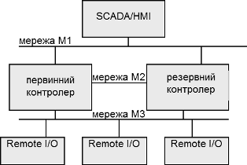

[Промислові мережі та інтеграційні технології в автоматизованих системах](README.md). [2. ЗАГАЛЬНА ХАРАКТЕРИСТИКА ПРОМИСЛОВИХ МЕРЕЖ](2.md)

## 2.1. Властивості промислових мереж

### 2.1.1. Визначення промислової мережі та їх градація

2.1.1.1. Визначення "польова шина" згідно ДСТУ. Згідно українських стандартів ДСТУ, Польова шина – це локальна мережа з лінійною топологією, призначеною для інформаційного обміну між проблемно і об'єктно орієнтованими блоками (пристроями) та територіально розосередженими джерелами: датчиками, перетворювачами, засобами ручного введення) та приймачами (підсилювачами, виконавчими пристроями, засобами віддзеркалення інформації).

2.1.1.2. Визначення "fieldbus" згідно МЕК. В стандарті МЕК 61158 під терміном Fieldbus розуміється цифрова, послідовна, мультиточкова шина з промисловими інструментальними пристроями та пристроями управління такими як – але не обмежено ними – датчиками, виконавчими механізмами та контролерами. 

2.1.1.3. Визначення "промислова мережа" в даному посібнику. В даному посібнику англомовний термін Fieldbus (дослівний переклад „польова шина”) переводиться як "промислова мережа".

В термінології МЕК є ряд обмежень, визначені словами "шина" ("bus"), "мультиточкова" ("multipoint"), в які не вписуються ряд промислових мереж. У визначенні ДСТУ фігурує централізований підхід, який характерний тільки для мереж рівня датчиків та виконавчих механізмів. Тому в даному посібнику під промисловою мережею розуміється промислова комунікаційна система з послідовною передачею бітів, яка використовує металевий кабель, оптоволокно або радіохвилі для зв’язку між мікропроцесорними засобами автоматизації. Слід зазначити, що в деяких джерелах терміни "польова шина" та "промислова мережа" не являються синонімами. 

Визначення, які наведені в даному посібнику  можуть не співпадати з прийнятими в інших джерелах.

2.1.1.4. Градація промислових мереж по області застосування. У подальшому при розгляді матеріалу будемо використовувати умовний розподіл промислових мереж в залежності від області застосування на два рівня. 

Рівень датчиків, завданням мереж якого є безпосереднє або через модулі/вводу виводу опитування датчиків і керування роботою різноманітних виконавчих механізмів. Умовно цей рівень можна розділити на два підрівня: рівень датчиків/виконавчих механізмів (Sensor/Actuator Level) та польовий рівня (Field Level). Перші призначені для роботи безпосередньо з інтелектуальними датчиками/ВМ, а другі для зв’язку з польовими засобами (розподіленим засобами вводу/виводу, приводними засобами, операторськими терміналами та панелями). В даному посібнику оба типи мереж відносяться до рівня датчиків. 

Рівень контролерів (Controller level або Cell Level), промислові мережі якого приймають участь у вирішенні завдань по керуванню виробництвом в цілому або комплексом технологічних процесів і забезпечують обмін між контролерами, засобами SCADA/HMI та засобами рівня АСУП. 

Дане розділення є умовним і може не співпадати з прийнятими в інших джерелах. 

### 2.1.2. Функціональне призначення промислових мереж

Розглянуті у першому розділі типові програмно-технічні засоби та особливості обміну між ними дозволять визначити типові функції промислових мереж. До них можна віднести:

1.   Обмін даними процесу в реальному часі.

2.   Програмування та конфігурація вузлів.

3.   Діагностика вузлів.

4.   Управління станом вузла.

5.   Функції резервного переключення між вузлами мережі.

2.1.2.1. Обмін даними процесу у реальному часі. Це одна з найважливіших функцій реалізації промислової мережі як рівня датчиків так і рівня контролерів. Дані технологічного процесу постійно змінюються в часі, тому необхідно їх доставити від джерела до споживача в потрібному обсязі, за визначений інтервал часу. Доставка даних процесу в реальному часі є одним із показників ефективності конкретної реалізації мережі. Фізичні рамки реального часу чисельно визначаються для конкретної системи управління. Тому одне рішення може задовольняти вимогам реального часу для однієї системи та зовсім не задовольняти для іншої. Відповідно до стандартів ДСТУ режимом реального часу називається режим оброблення даних, який забезпечує взаємодію обчислювальної системи з зовнішніми, по відношенню до неї, процесами у темпі порівнянному зі швидкістю протікання цих процесів. 

2.1.2.2. Програмування та конфігурування вузлів. За допомогою функцій програмування та конфігурування більшість сучасних мікропроцесорних засобів, зокрема контролери та периферійні ПТЗ, можуть програмуватись з використанням спеціалізованого програмного забезпечення, встановленого на ПК або програматорі. На відміну від функцій обміну даними процесу, ці функції не накладають жорстких вимог до обміну в реальному часі. 

2.1.2.3. Функції діагностики. Діагностика роботи вузлів мережі є такою ж важливою, як і діагностика складових будь якої мікропроцесорної системи. Функції діагностики дозволяють визначити факт (функція виявлення аварії) та причину відмови пристрою (ідентифікація аварії), що дозволяє визначити та замінити дефектний вузол, а в системах з резервуванням (standby) – переключитися на резервні підсистеми. Вияв факту несправності вузла повинен бути визначений в режимі реального часу, для можливості зворотної реакції системи на збій, що особливо стосується функціонально-небезпечних процесів. Тому ця функція базується на високо-пріоритетних повідомленнях. Ідентифікація аварії як правило потрібна для обслуговуючого персоналу, для можливості усунення проблеми, тому особливих вимог до реального часу не потребує.   

2.1.2.4. Функції управління станом вузла. Ці функції необхідні для можливості запуску, перезапуску, зупинки роботи програмного забезпечення та ініціалізації вузла. Враховуючи можливість функціонування декількох вузлів в системі, команди управління станом вузла мають нижчий пріоритет перед обміном даними процесу в реальному часі.  

2.1.2.5. Резервування вузлів в системі.  За рахунок цих функцій промислова мережа дає зручний і порівняно недорогий спосіб підвищення живучості та надійності системи. Технічні засоби систем з резервуванням діляться на основні або первинні (Primary) та резервні (Standby). В нормальному режимі функціонування у системі працюють основні вузли, у випадку виходу яких з ладу, їх функції беруть на себе резервні. В таких системах промислової мережі забезпечують можливість самодіагностики вузлів, тобто вияву дефектних засобів, переключення на резервні вузли та підтримку каналів зв’язку з основними та резервними засобами. Промислова мережа може забезпечити:

-     резервування віддалених периферійних засобів;

-     резервування контролерів;

-     резервування серверів SCADA; 

-     резервування каналів зв’язку: контролер <-> периферійні засоби, контролер <-> SCADA/HMI, контролер <-> контролер, і інші.

Функції мереж в системах з резервуванням розглянемо на прикладі.   

Приклад.2.1. Основні концепції. HotStandby. 

Завдання. Продемонструвати функціонування системи з резервуванням контролера, на прикладі рішення HotStandby ("гарячого резервування") запропонованого Шнейдер Електрик.

Рішення.

На рис. 2.1 показана структура системи, в якій первинний контролер обмінюється процесними даними з віддаленими пристроями вводу/виводу (Remote I/O) через промислову мережу М3. З іншого боку засоби людино-машинного інтерфейсу обмінюються з контролером через мережу М1. 

Рис. 2.1. Приклад реалізації системи з резервуванням на основі промислових мереж

Для функціонування такої системи резервний контролер працює паралельно з основним контролером, отримуючи від нього контекст задач по промисловій мережі М2. Конфігурація та програма обох контролерів ідентичні. Передача контексту забезпечується в реальному часі зі швидкістю, що дозволяє в будь який момент часу продовжити виконання програми резервним контролером з того місця, де закінчив первинний. 

У нормальному, тобто штатному режимі роботи системи, первинний контролер обмінюється даними з віддаленими входами/виходами та зі SCADA/HMI, а також передає контекст своїх задач резервному контролеру. Резервний контролер в цей час веде себе пасивно по відношенню до всіх перерахованих вузлів. У випадку виходу з ладу первинного контролера, резервний контролер втратить з ним зв’язок і перейде в режим активної роботи забезпечуючи обмін процесними даними з входами/виходами по мережі М3 та зі SCADA/HMI по мережі М1. Слід зазначити, що SCADA/HMI, втративши зв’язок з первинним контролером повинна перейти на зв’язок з резервним.   

### 2.1.3. Обмін даними

2.1.3.1. Класифікація за призначенням. Для забезпечення вищевказаних функцій в мережі циркулюють дані та команди. В свою чергу дані, можна умовно поділити на два типи: дані процесу та параметричні дані. Перший тип даних використовується для обміну даними процесу в реальному часі, а другі – для функцій програмування/конфігурування та функцій діагностики що відповідають за ідентифікацію несправності. 

2.1.3.2. Класифікація за форматом. В залежності від типу обміну (обмін даними процесу або параметричними даними) дані можуть бути наступних форматів:

- числові або аналогові (Integer/Word, Float/Real, Doubleword/Long);

- дискретні або бінарні (Digital/Boolean);

- часові (Time, Date, BCD, BinaryTime)

- масиви та блоки даних (Array, Datablock);

- структурні дані;

- строкові (String);

Перші три групи відносяться до типів фіксованої довжини. Текстові типи можуть відрізнятися своїм форматом. Передача структурних даних є необов’язковою, однак може значно підвищити функціональність мережі та полегшити роботу розробників системи. До обміну структурними даними будемо також відносити об’єктний підхід, при якому одна прикладна сутність доступається до властивостей та методів об’єкту іншої прикладної сутності. Таким чином доступ до даних при такому підході – це доступ до методів та властивостей об’єкту.

2.1.3.3. Класифікація за циклічністю відновлення. В одній і тій самій системі можуть бути дані, які необхідно відновлювати постійно (циклічно або періодично) та по необхідності. Можна навести такі схеми відновлення за періодичністю:

-     циклічне відновлення: відновлення даних проходить регулярно, повторюючись, тобто після чергового відновлення всіх даних – цикл повторюється;

-     періодичне відновлення: циклічне відновлення з постійною тривалістю циклу; тобто через задані інтервали часу нові дані надходять від джерела до споживача;

-     ациклічне(аперіодичне) при зміні значення даних або їх стану: дані відправляються від джерела до споживача тільки при зміні їх значення.

-     ациклічне(аперіодичне) по запиту: дані надходять до споживача після його запиту.

Циклічне відновлення проходить постійно, з мінімально можливими паузами між циклами відновлення даних. Періодичне відновлення теж проходить по циклу, але через рівні інтервали часу, що чітко визначає рамки часу доставки даних. Обидва способи використовується для обміну даними процесу. Недоліком обидвох способів є постійне завантаження мережі даними, які передаються. Так, наприклад, у працюючій системі протягом певного часу може не бути ніяких змін у технологічному процесі, але по промисловій мережі будуть курсувати одні і ті ж значення даних. Може бути і інша ситуація: в межах циклу опитування даних відбудеться зміна їх значень, які система не встигне передати. Перевагою періодичного способу є можливість визначення мережного трафіку, який витрачається на цей обмін. 

Для циклічного та періодичного відновлення характерна циклічність операцій. Тому надалі в порівняльних характеристиках їх будемо називати одним терміном - циклічно-періодичні, якщо не буде вказано інше. Циклічно-періодичні операції відновлення можуть проходити шляхом як зчитування даних з джерела так і шляхом відправки даних самим джерелом.  

Альтернативою циклічно-періодичному відновленню для обміну даними процесу може бути відправка джерелом значень ациклічно (в посібнику також використовується термін аперіодично, як синонім), тільки у разі їх зміни. Така схема ініціації відправки даних також називається подійно-орієнтована (event-triggered). У цьому випадку значно заощаджуються ресурси промислової мережі, оскільки більшу частину часу дані не змінюються. Недоліком такого способу є невизначеність в завантаженні мережі в кожний момент часу. 

Ациклічне відновлення по запиту більш підходить до ситуацій, коли у разі виникнення визначеної події споживачу необхідно зчитати певні дані з джерела. Як правило таким способом користуються при доступі до параметричних даних, однак він може використовуватись і при доступі до даних процесу. При відновленні даних цим способом витрачається додатковий час на формування, відправку та обробку запитів. 

2.1.3.4. Класифікація за синхронністю. У деяких системах є необхідність прив’язки ініціації певних дій до  конкретних часових або синхронізуючих міток. Це потрібно для синхронності (одночасності) виконання цих дій на декількох (або на всіх) вузлах мережі. До синхронних дій можна віднести одночасне відновлення вхідних даних (одночасне зчитування входів вузлів у їх вхідні буфери), одночасне відновлення вихідних даних (одночасний запис значень вихідних буферів вузлів на їх виходи), одночасну передачу даних в мережу. 

При передачі даних говорять про синхронну або асинхронну передачу. Асинхронна передача не прив’язана до синхронізуючих сигналів і може початися у довільний момент, тоді як синхронна – тільки після появи певного синхросигналу.

Особливий вид синхронних дій – ізохронна передача, яка передбачає передачу даних через постійні інтервали часу. Особливістю ізохронної передачі порівняно з періодичною є обов’язкова синхронність роботи внутрішніх тактових годинників, на яких базується ізохронна передача. Інакше кажучи ізохронна передача більш жорстко визначає рамки періодичності відновлення даних.  

Синхронність та ізохронність використовується наприклад, при необхідності синхронізувати робочі цикли контролера і мережі. Інший приклад – задача позиціонування з використанням електроприводів PDS, де синхронна та ізохронна передача є принципово необхідною (див. розділ 11). 

Приклад 2.2. Основні концепції. Синхронний та періодичний обмін. 

Завдання. Реалізація промислової мережі дає можливість віддаленому пристрою вводу/виводу (надалі пристрій) відправляти дані у будь-який момент часу (наприклад з використанням мережі CANOpen). Продемонструвати яким чином буде відбуватися передача значень входів даного пристрою при:

1)   аперіодичному відновленні, по зміні значення асинхронно;

2)   періодичному відновленні (кожні 500 мс) асинхронно;

3)   аперіодичному відновленні, по зміні значення синхронно з початком циклу контролера;

4)   періодичному відновленні (кожні 500 мс), по зміні значення синхронно з початком циклу контролеру;

Рішення.

Варіант 1. Пристрій опитує входи з максимальною швидкістю. Як тільки значення одного із його входів змінилось, воно відправляється контролеру при наданій можливості передачі.

Варіант 2. Кожні 500 мс пристрій опитує свої входи і при наданій можливості передачі відразу відправляє їх на контролер, незалежно від їх значення.

Варіант 3. Пристрій опитує входи з максимальною швидкістю. Контролер генерує синхросигнал на початку кожного робочого циклу (для прикладу цикл контролеру 100 мс). Після отримання синхроімпульсу, значення входів передається контролеру, якщо їх стан змінився з попередньої передачі.

Варіант 4. Кожні 500 мс пристрій опитує входи. Контролер генерує синхросигнал на початку кожного робочого циклу (для прикладу цикл контролеру 100 мс). Пристрій передає значення входів тільки після отримання синхроімпульсу.

Як бачимо, в третьому випадку відновлення входів пристрою для контролеру буде відбуватися з дискретністю 100 мс, але тільки в момент зміни їх значення. У четвертому випадку значення входів пристрою для контролера буде відновлятися з періодичністю 500 мс. В обидвох випадках відновлення входів контролеру буде проходити на початку його робочого циклу. 

### 2.1.4. Загальні вимоги до промислових мереж

Промислові мережі споріднені комп’ютерним мережам, однак порівняно з останніми, вимоги до промислових мереж дещо відрізняються. Ідеальний варіант промислової мережі повинен задовольняти наступним вимогам.

1. Властивість детермінованості.

2. Завадостійкість та промислові умови експлуатації.

3. Надійність та живучість.

4. Простота, зручність інсталяції та обслуговування.

5. Можливість подачі живлення по кабельній системі мережі.

6. Вільна топологія.

2.1.4.1. Детермінованість. Властивість детермінізму тісно пов’язана з реальним часом, про який вище було неодноразово згадано. Слід звернути увагу, що промислова мережа повинна забезпечити своєчасну доставку та цілісність даних процесу. З іншого боку, промислова мережа повинна забезпечити ациклічний обмін параметричними даними, які можуть бути передані без чіткого визначення часу їх доставки, однак в межах допустимого. Так, наприклад, одночасно із обміном даними процесу з розподіленими модулями вводу/виводу, необхідно змінювати конфігурацію одного з них. 

З вищесказаного можна зробити висновок, що промислова мережа повинна надавати можливість обміну обидвома типами даних, тобто надавити час для реал-тайм трафіку (для обміну даними процесу) та не реал-тайм трафіку (для обміну параметричними даними). Це можливо при умові визначення пріоритетності повідомлень для обміну даними процесу, або розділення загального мережного часу на циклічно-періодичний обмін даними процесу та ациклічний обмін параметричними даними. 

Слід зазначити, що не всі промислові мережі гарантують повну детермінованість. Навіть при чіткому розумінні побудови протоколу, деякі програмно-технічні засоби, наприклад ПК з офісними операційними системами (наприклад Widows) можуть внести певну невизначеність у роботу мережі. 

Для комп’ютерних мереж наявність повної детермінованості не є обов’язковою. Для класичного та комутованого Ethernet ця особливість є одним із каменем спотикання визнання її в області промислових мереж. Детальніше про це можна прочитати в розділі 10 даного посібника.  

2.1.4.2. Завадостійкість та промислові умови експлуатації. В промислових умовах експлуатації поряд з кабелем мережі може знаходитися силове електрообладнання, що може спричинити спотворення корисного сигналу самоіндукуючими паразитними струмами. Для боротьби з цим явищем у промислових мережах використовують спеціальні методи кодування/модуляції бітової послідовності, екранований кабель, захисне зміщення і інше(детальніше див. розділ 3). 

Промислові умови експлуатації, які обумовлюються надмірними температурами, вологістю, вібрацією або іншими кліматичними факторами потребують використання кабельної продукції і комутуючих засобів (конектори, роз’єми, коробки і іше) спеціального виконання. В деяких випадках є необхідність в іскробезпечному виконанні мережі, що накладає додаткові вимоги на середовище та способи передачі даних. 

Щодо пило- та вологозахисту технічних засобів в промислових мережах, згідно стандартів IEC 529, EN 60529 та ГОСТ 14254-96, всі електричні засоби прийнято класифікувати та маркувати по ступені захисту IP-кодом (Ingress Pritection). ІР-код - це двохзначне число, перша цифра якого вказує на ступінь захисту електрообладнання від твердих тіл, а друга – від води. Чим більше ці цифри, тим краще оболонка (корпус) засобу захищає його від попадання твердих тіл або рідини. 

Перша цифра ІР вказує на наступні ступені захисту електрообладнання від твердих тіл: IP 0x – захисту немає; IP 1x – захист від твердих тіл >50 мм (захист від проникнення в корпус руки); IP 2x – захист від твердих тіл >12 мм (захист від проникнення в корпус пальця); IP 3x – захист від твердих тіл >2.5 мм (захист від проникнення в корпус інтсрументу); IP 4x - захист від твердих тіл >1 мм (захист від проникнення невеликих тіл: гвинти, гайки і т.п.); IP 5x – пилозахищеність (пил може попадати всередину в дуже малих кількостях); IP 6x – пилонепроникність (повне виключення попадання пилу); 

Друга цифра ІР вказує на наступні ступені захисту електрообладнання від води: IP x0 – захисту немає; IP x1 – захист від вертикальних капель (попадання капель зверху на засіб не порушує його роботу); IP x2 – захист від капель, що падають під кутом <=15 град до вертикалі; IP x3 – захист від падаючих бризк під кутом <=60 град до вертикалі (захист від дощу); IP x4 – захист від бризк в будь якому напрямку; IP x5 – захист від струй води в будь якому напрямку; IP x6 – захист від морських хвиль (допускається короткочасне погруження в рідину); IP x7 – доступне короткочасне знаходження в рідині на глибині до 1 м; IP x8 – повна водонепроникність (допускається постійне знаходження на глибині 1м);

Якщо в коді замість однієї цифри вказується літера Х, то ступінь захисту по цій категорії не обумовлюється.

Згідно ГОСТ 14254-96, ІР код може бути доповнений однією додатковою та однією допоміжною літерами. Перша додаткова літера вказує на захист від доступу до небезпечних частин електрообладнання. Вона вказується тільки у випадках, якщо першої цифри в ІР-коді немає, або ступінь захисту від доступу до небезпечних частин вище ніж обумовленою нею. Друга допоміжна літера, доповнює інформацію про ступінь захисту, яка вказується в описі самого приладу. 

Позначення додатковою літерою степені захисту від доступу до небезпечних частин: ІР ххАх – захищено від доступу тильною стороною руки; ІР ххBх – захищено від доступу пальцем руки; ІР ххCх – захищено від доступу інструментом; ІР ххDх – захищено від доступу дротом.  

Так код ІР 23 CS, буде характеризувати таку ступінь захисту: (2) – оболонка захищає людей від доступу до небезпечних частин пальцями рук; захищає обладнання всередині оболонки від попадання зовнішніх твердих предметів діаметром, рівним або більшим 12,5 мм; (3) – оболонка захищає обладнання всередині оболонки від шкідливої дії води в виді дощу; (С) – оболонка захищає людей від доступу до небезпечних частин, якщо вони тримають в руках інструмент діаметром, рівним або більшим 2,5 мм, і довжиною, яка не перевищує 100 мм (інструмент може проникати на всю свою довжину в оболонку); (S) – оболонка піддана випробуванню на відповідність захисту від шкідливих дій внаслідок попадання води, коли всі її частини обладнання знаходяться в стані нерухомості. 

Стандарт IEC EN 62262 (попередня версія EN 50102) визначають ступінь захисту електрообладнання від механічної дії (ударостійкість). Цей захист визначається ІК-кодом, який вказує на максимальну енергію удару, яку витримує оболонка засобу: IK00 (0 Дж), IK01(0,14 Дж), IK02(0,2 Дж), IK03(0,35 Дж), IK04(0,5 Дж), IK05(0,7 Дж), IK06(1 Дж), IK07(2 Дж), IK08(5 Дж), IK09(10 Дж) IK10(20 Дж). 

Таким чином промислові умови експлуатації для промислових мереж обумовлюються спеціальними виконаннями технічних засобів та матеріалів, такими як: тип кабелю, ступінь захисту по IP, по IK, по NEMA, захист від агресивних середовищ, вібростійкість та ін.  

2.1.4.3. Надійність та живучість. Надійність системи перш за все залежить від надійності її компонентів та структури мережі. Мережні технології дають можливість будувати системи з резервуванням, що дозволяє збільшити надійність роботи мережі або окремих її компонентів. Резервування окремих, найменш надійних мережних компонентів дозволяє збільшити живучість системи. Однак слід зазначити, що надійність у більшості випадків реалізується на рівні програмно-апаратного забезпечення вузлів, а не мережних компонентів. В свою чергу протоколи промислових мереж повинні забезпечити можливість діагностики мережі, для своєчасного виявлення дефектних вузлів, а самі мережні компоненти повинні мати надійність значно вищу ніж мережні вузли.

В промислових мережах необхідно, щоб при виявленні дефектного вузлу,  він автоматично відключався, не порушуючи працездатність всієї мережі. Це здійснюється засобами самодіагностики мережних адаптерів, які можуть перевести вузол у режим аварійної зупинки, відправити сигнал аварії слідкуючому пристрою і відключитись від комунікаційного обміну.

2.1.4.4. Простота, зручність інсталяції та обслуговування. В промислових умовах експлуатації простій обладнання може привести до аварійної зупинки виробничої лінії, що відповідно приводить до втрат різного характеру. Тому обслуговуючий персонал, наприклад служба КВПіА, повинен швидко виявити причину зупинки та замінити дефектну частину системи, при цьому не зупиняючи функціонування мережі. Гаряча заміна вузлів, або їх частини – одна з основних вимог до промислових мереж. Процедура заміни або добавлення нового вузла повинна проходити швидко та легко. 

Для прикладу, можна привести процедуру добавлення нового вузла на шину AS-і, де кабель мережі у необхідному місті просто проколюється самою коробкою-адаптером підключення. При відключенні адаптеру, гумова ізоляція кабелю повертає його до попереднього стану (див. розділ 5). 

Для промислових мереж бажана наявність таких властивостей: мережні компоненти підключаються через конектори, в гіршому випадку через легкодоступні гвинтові або пружинні з’єднувачі, але ніяк не через пайку; мінімальна конфігурація (наприклад мережна адреса) для вузлів розподіленої периферії виставляється через перемикачі безпосередньо на пристрої; можливість гарячої заміни вузлів та складових мережі.   

2.1.4.5. Живлення вузлів по кабелю мережі. Це важлива але не принципова вимога до промислових мереж. Живлення як правило потрібне датчикам та виконавчим механізмам, які підключаються до мережі. Щоб не прокладати живлення окремим кабелем, воно подається по тому ж самому кабелю, що і цифровий сигнал, а інколи і по тій самій інформаційній парі проводів, створюючи несучий сигнал для модуляції. Сучасні мережі рівня датчиків як правило забезпечують можливість живлення датчиків по мережі. 

2.1.4.6. Вільна топологія. Потрібна топологія мережі диктується територіальним розміщенням мережних вузлів. Тому в ідеальному варіанті мережа повинна мати вільну топологію, що особливо актуально для мереж рівня датчиків та виконавчих механізмів. Однак більшість промислових мереж мають шинну топологію, рідше – дерево видну або кільцеву. Для деяких мереж топологію можна вибрати, виходячи з вимог та обмежень поставленої задачі.

Для вибору потрібної топології, у деяких мережах використовуються спеціальні адаптери. Інший шлях – побудова інтермереж з використанням міжмережних адаптерів (мостів, шлюзів). 

Таким чином промислові мережі виділяються серед комунікаційних систем характеристиками, які зведені в таблицю 2.1.

Таблиця 2.1. 

Характеристики промислових мереж (Підсумкова таблиця розділу 2.1)

|                             |                                                              |
| --------------------------- | ------------------------------------------------------------ |
| Визначення                  | Промислова  мережа – промислова комунікаційна система з послідовною передачею  бітів, яка використовує металевий кабель, оптоволокно або радіохвилі для  зв’язку між мікропроцесорними засобами автоматизації. |
| Градація                    | - рівень датчиків (включає рівень  польових засобів);  - рівень контролерів; |
| Функціональне призначення   | 1.Обмін даними процесу в реальному часі (обмін даними процесу).  2.Програмування та конфігурування вузлів (обмін параметричними даними).  3.Діагностика вузлів.  4.Управління станом вузла.  5.Функції резервного переключення між вузлами мережі. |
| Обмін даними                | 1.     Призначення даних:  a.     обмін даними процесу;  b.     обмін параметричними даними;  2.     Формати даних: числові (аналогові);  дискретні (бінарні); часові; масиви (блоки даних); структурні дані  (+об’єктний підхід);строкові.  3.     Спосіб відновлення даних  -       циклічне відновлення(дані процесу);  -       періодичне відновлення (дані  процесу);  -       ациклічне при зміні значення  (дані процесу);  -       ациклічне по запиту  (параметричні дані або дані процесу);  4.     Часова синхронізація  -       синхронна передача  -       асинхронна передача |
| Вимоги до промислових мереж | 1. Властивість  детермінованості (для обміну даними процесу).   2. Завадостійкість та  промислові умови експлуатації.   3. Надійність та живучість.   4. Простота, зручність  інсталяції та обслуговування.   5. Можливість подачі живлення  по кабельній системі мережі.   6. Вільна топологія. |

<-- [2. ЗАГАЛЬНА ХАРАКТЕРИСТИКА ПРОМИСЛОВИХ МЕРЕЖ](2.md)

--> 2.2. [Історія розвитку та стандартизації промислових мереж](2_2.md) 