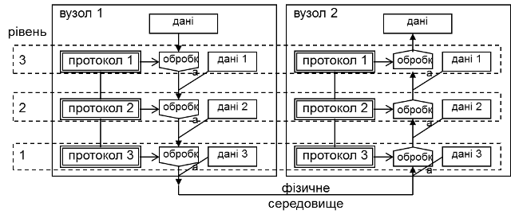
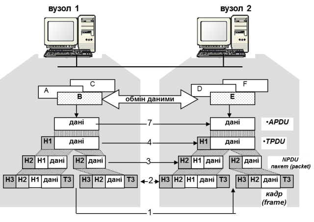

[Промислові мережі та інтеграційні технології в автоматизованих системах](README.md). [2. ЗАГАЛЬНА ХАРАКТЕРИСТИКА ПРОМИСЛОВИХ МЕРЕЖ](2.md)

## 2.3. Промислові мережі в контексті моделі ISO OSI

Об'єднання в єдину цифрову мережу декількох пристроїв – це тільки початковий крок до ефективної й надійної роботи системи зв'язку між ними. На додаток до апаратних вимог пред'являється також ряд програмних. Там, де системи зв'язку, або мережі, гомогенні (однорідні), тобто поєднують пристрої від одного виробника, ці проблеми, як правило, вирішені. Але коли мова йде про побудову мережі із пристроїв різних виробників – ці проблеми носять множинний характер. 

Системи, що є унікальними (їх робить і підтримує тільки один виробник) і працюють за унікальними протоколами зв'язку, одержали назву "Закритих систем" (closed/proprietary systems). Більшість таких систем зародилося у часи, коли проблема інтеграції виробів інших виробників не вважалася актуальною. "Відкриті системи" (open systems) приводять у відповідність специфічні вимоги до інтересів усіх. Тільки при використанні принципів відкритих систем інтеграція виробів різних виробників в одну мережу може бути вирішена без особливих проблем. 

У 1978 році Міжнародною організацією по стандартизації (ISO\) на противагу закритим мережним системам, і з метою вирішення проблеми взаємодії відкритих систем з різними видами обчислювального устаткування які працюють за різними стандартами і протоколами, була запропонована "Описова модель взаємозв'язку відкритих систем" (OSI-модель\, Open System Interconnection Reference Model). На сьогоднішній день в стандартах МЕК визначена своя модель архітектури промислових мереж, однак у технічній документації до опису функціонування мереж поки що прийнято давати їх архітектуру в контексті OSI, що допомагає краще зрозуміти принципи її функціонування. З іншого боку, протоколи мереж, які були розроблені задовго до виникнення еталонних моделей відкритих систем приводять до системи OSI (наприклад MODBUS в системі MODBUS-IDA). Тому ознайомлення з будь якою мережею через призму OSI часто носить тільки інформативний характер про протоколи та сервіси рівнів.

У моделі OSI для спрощення структури більшість мереж організовуються у набори рівнів або слоїв (layers), кожен з яких має своє призначення. Кількість рівнів, їх назва, та склад відрізняються в залежності від мережі. Однак у всіх мережах ціллю кожного рівня є представлення деяких сервісів для вищого рівня і підтримування зв’язку з однойменним рівнем на іншому пристрої. Правила і домовленості, які використовуються у даному спілкуванні називаються протоколом\ рівня (layer protocol). 

На кожному з рівнів обробка даних згідно протоколу включає в себе перетворення інформації з одного виду у інший, розбивку даних на частини та додавання службової інформації.

При розробці мереж на кожному з рівнів визначають:

-  механізм ідентифікації відправників та отримувачів та систему адресації;

-  правила переносу даних: напрямок, логічні канали та пріоритети;

-  контроль помилок при передачі даних, тип і дії при їх виникненні;

-  правило розбивки даних та їх об’єднання;

-  управління потоком даних та узгодження швидкодії;

-  маршрутизація – вибір шляху передачі даних.

Апаратуру або/і програму, яка займається задачами кожного з рівнів будемо називати об’єктом\ рівня або сутністю рівня\. Виділяють такі об’єкти рівнів: прикладний об’єкт (прикладна сутність), транспортний об’єкт (транспортна сутність), мережний об’єкт (мережна сутність), канальний об’єкт (канальна сутність) та об’єкт фізичного рівня (сутність фізичного рівня або фізичний інтерфейс). 

Для забезпечення зв’язку сутність кожного рівня займається обміном даними з сутністю такого ж рівня на іншому вузлі. Однак цей зв’язок проходить не безпосередньо, а по наступній схемі (рис.2.2): дані, які необхідно передати надходять до самого верхнього рівня, який обробляє їх і передає нижчому рівню і т.д. аж до 1-го рівня, який займається безпосередньою передачею даних по фізичному середовищу. На іншому вузлі, дані, які приймаються обробляються кожним рівнем у протилежному напрямку. Обробка інформації на кожному рівні відбувається відповідно до протоколу. 

 Рис. 2.2. Передача даних від одного вузла до іншого через мережу з багаторівневою архітектурою

Кожен із рівнів у мережі надає набір сервісів (служб) для реалізації певних задач. Сервіс\ або служба (Service) – це набір операцій, які нижній рівень представляє верхньому. Сервіс визначає які саме операції рівень буде виконувати, але не оговорює яким чином.

Між кожною парою суміжних рівнів знаходиться інтерфейс\ (interface), який визначає набір примітивних операцій, які надаються верхньому рівню від нижнього. Під інтерфейсом можна розуміти ті програмні чи апаратні функції, які надаються верхньому рівню для доступу до своїх сервісів. 

Набір рівнів і протоколів називається архітектурою мережі\. Список протоколів, які використовуються системою (по одному протоколу на рівень) називається стеком протоколів\. 

Ієрархія моделі OSI включає 7 рівнів:

1) Фізичний рівень (Physical Link Layer). Даний рівень описує механічні та електричні характеристики, а також визначає фізичне середовище для передачі даних. Тобто сутність фізичного рівня займається передачею та прийомом бітів по каналу зв’язку. Принциповими питаннями тут є: який тип сигналу (напруга, струм, світло і інші) і якої величини використовується для передачі логічної "1" та "0"; тривалість одного біту; напрямок передачі даних; коли розпочати і закінчити передачу; кількість і призначення фізичних каналів зв’язку, спосіб стикування (типи роз’ємів) і т.ін.

Фізичний рівень повинен забезпечити достовірну доставку бітів від передавача до приймача.

2) Рівень передачі даних (Data Link Layer) або канальний рівень. Його задача забезпечити можливість та надійність передачі даних на фізичному рівні. Всі дані, які передаються з верхнього (мережного) рівня, передаються у вигляді кадрів, розмір яких залежить від конкретної мережі. За допомогою спеціальних алгоритмів проводиться контроль за правильною передачею на фізичному рівні з подальшою реакцією на помилки. Окрім підтримки каналу зв’язку та контролю за помилками, у мережах з загальним доступом до сумісно використовуваного фізичного каналу, на цьому рівні регламентується алгоритми та процедури доступу. 

Канальний рівень повинен забезпечити достовірну доставку даних від одного вузла до іншого в одній і тій самій мережі. 

3) Мережний рівень (Network Layer). Основна із задач – це визначення маршруту пересилки пакетів від джерела до приймача. Мережа може являти собою об’єднання підмереж, між якими виникає необхідність в обміні даними. Оскільки підмережі можуть бути різнорідними по природі, задачею мережного рівня є забезпечення прозорості між ними. Окрім цих функцій на даний рівень накладаються також функції визначення часових затримок пакетів у мережах, питання синхронізації, часу передачі і т.ін.

Мережний рівень повинен забезпечити достовірну доставку даних від одного вузла до іншого в різних мережах, об’єднаних в одну інтермережу. 

4) Транспортний рівень (Transport Layer). Основна функція – прийняти дані від сеансового рівня (або прикладного, якщо сеансовий відсутній), при необхідності розбити їх на частини, передати їх мережному рівню і гарантувати прибуття їх в правильному порядку до місця призначення. Цей рівень забезпечує передачу даних безпосередньо між прикладними програмами.

Транспортний рівень повинен забезпечити достовірну доставку даних від однієї програми (прикладного Процесу) до іншої, які функціонують на одному вузлі або на різних вузлах в мережі. 

5) Сеансовий рівень (session Layer). Дозволяє організовувати сеанси обміну між прикладними програми (встановлення та розрив з’єднання, тощо). 

6) Рівень представлення (Presentation Layer). Служить для перетворення форматів даних із одного в інший.

7) Прикладний рівень (Application Layer). Містить набір протоколів для доступу до даних прикладного Процесу. 

Прикладний рівень повинен забезпечити одній прикладній програмі доступ до об’єктів іншої прикладної програми через систему домовленостей. 

Більшість промислових мереж підтримують фізичний рівень, рівень передачі даних і прикладний рівень. Як виключення існують протоколи промислових мереж, що реалізують всі сім рівнів OSI-Моделі, наприклад LonWorks.

Функціонування мережі в контексті моделі OSI продемонструємо на прикладі. 

Приклад 2.3 Основні концепції. Функціонування мережі в контексті OSI.

Завдання. На вузлі 1 (рис.2.3) функціонують три прикладні програми (надалі Процеси) під умовними позначками A, B, C, а на вузлі 2 – Процеси D, E, F. Необхідно: показати передачу даних від Процесу B до Процесу E, використовуючи мережу описану на 1, 2, 3, 4 та 7 рівні моделі OSI. 

Рис. 2.3. Обробка даних при обміні даними через мережу

Рішення. Процеси С та Е спілкуються за єдиними правилами обміну, які визначені протоколом 7-го рівня Частково цей протокол визначає семантику спілкування, тобто відповідність символьних позначень до функцій, які необхідно виконати, та дані, які необхідно передати з цими функціями. Таким чином між двома прикладними програмами ведеться обмін кодом та даними, по правилам протоколу даного рівня, які називають APDU\ (Application Protocol Data Unit – модуль даних протоколу прикладного рівня). Оскільки Процеси B і E повинні якось взаємодіяти між собою, то за передачу даних між цими Процесами відповідає транспортний рівень.

Для транспортного рівня код і дані прикладного рівня – це дані, які треба передати від одного Процесу до іншого. Для цього необхідно використати правила адресації цих Процесів, щоб правильно доставити дані, тобто щоб їх отримав Процес E, а не скажімо Процес F. Ці правила визначаються протоколом транспортного, тобто 4-го рівня. Для того, щоб транспортний об’єкт на вузлі 2 міг ідентифікувати Процес, якому передають дані (у нашому випадку Е), транспортний об’єкт на вузлі 1 добавляє допоміжні дані до тих, які він отримав у прикладного рівня. Дані які добавляються на кожному рівні перед даними з вищого рівня називаються заголовком (header). Таким чином, для ідентифікації Процесу отримувача транспортний об’єкт відправника добавляє його адресу (Е) у заголовок H1 і передає управління мережному рівню. Заголовок разом із даними на транспортному рівні прийнято називати TPDU\ (Transport Protocol Data Unit – модуль даних транспортного протоколу). 

Мережний рівень у свою чергу повинен забезпечити доставку модулів TPDU від вузла до вузла, які можуть знаходитись у різних за принципом функціонування підмережах. Для цього до TPDU добавляється заголовок з адресою приймача та відправника (у нашому випадку H2), який необхідний маршрутизаторам (router) для знаходження правильного шляху до визначеної підмережі. Окрім того, на даному рівні дані можуть бути розбиті на частини, для можливості їх передачі на нижніх рівнях (це саме може відбуватися на всіх рівнях). Ці частини разом із заголовками називаються пакетами\ (packet) або NPDU\ (Network Protocol Data Unit – модуль даних мережного протоколу). У нашому випадку модуль TPDU на мережному рівні ділиться на два пакети з заголовками H2, які передаються послідовно один за одним канальному рівню. 

Пакети, які отримує канальний рівень, вставляються у кадри (frame). Кадри мають заголовок, у якому міститься інформація про адресу вузла отримувача та/або відправника в локальній мережі та/або допоміжні службові коди. Отримувач може бути у свою чергу тільки допоміжним пристроєм для забезпечення передачі даних в іншу підмережу, тому може і не бути кінцевим вузлом призначення. Але для канального рівня це не важливо, тому що функції маршрутизації належать мережному рівню. Окрім заголовка, у кінці до пакету може добавлятися кінцевик (terminator) з службовою інформацією, наприклад даними контролю за правильною передачею. Безпосередня передача кадру по бітам забезпечується обладнанням та ПЗ фізичного рівня.

Отримання даних та їх обробка проходить по тій же схемі з точністю до навпаки. Засоби канального рівня на вузлі 2 відловлюють кадр, визначають по заголовку H3, що кадр призначений саме їм, по T3 перевіряють правильність отриманих даних, вилучають пакет і передають мережному рівню. Це саме вони роблять і з другим пакетом. Мережний рівень у свою чергу вилучає модулі TPDU з пакетів, об’єднує їх і передає транспортному рівню, який по заголовку H1 ідентифікує Процес E і передає йому дані.

Це спрощений і далеко неповний перелік дій з даними на кожному рівні, який дає представлення про послідовність і принцип обробки даних при передачі. 

<-- 2.2. [Історія розвитку та стандартизації промислових мереж](2_2.md) 

--> 2.4. [Основні робочі характеристики промислових мереж](2_4.md) 