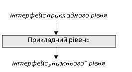
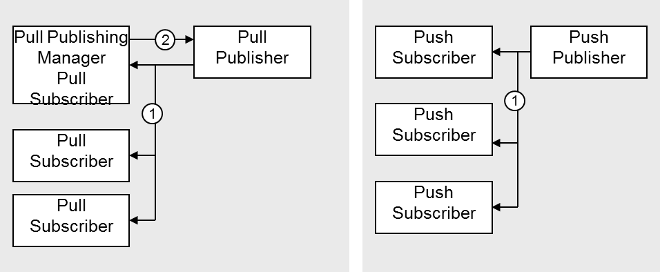
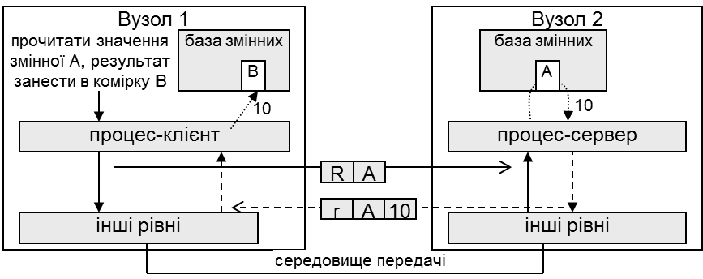

[Промислові мережі та інтеграційні технології в автоматизованих системах](README.md). [2. ЗАГАЛЬНА ХАРАКТЕРИСТИКА ПРОМИСЛОВИХ МЕРЕЖ](2.md) 2.4.[Основні робочі характеристики промислових мереж](2_4.md)

### 2.4.1. Прикладні сервіси, інтерфейс прикладного рівня

На прикладному рівні визначаються правила і семантика обміну між двома прикладними сутностями, які в свою чергу забезпечують обмін між прикладними Процесами або просто Процесами (коли слово "Процес" буде зустрічатися в тексті з прописної літери, буде вважатися прикладний процес). Для того щоб один прикладний Процес зміг спілкуватися з іншим, необхідно визначити „мову” спілкування і тип діалогу. Сервіси прикладного рівня повинні забезпечити необхідну функціональність мережі (див. таб.2.1). Можна виділити такі сервіси, які підтримуються прикладним рівнем:

1.   обмін даними процесу в реальному часі: 

2.   програмування/конфігурування вузла;

3.   діагностичні сервіси;

4.   управління станом вузла;

5.   функції резервування. 

2.4.1.1. Інтерфейс прикладного рівня. Для користування сервісами 

прикладного рівня користувачу надається інтерфейс прикладного рівня (рис.2.4). Інтерфейс прикладного рівня може представляти собою комунікаційні функції, доступ до таблиці мережних об’єктів (мережні змінні, словник об’єктів) тощо. Деякі промислові мережі надають можливість графічного конфігурування обміну даними на прикладному рівні, наприклад через мову функціональних блоків (FF, LONWorks). Ці програмні засоби надають графічний вигляд інтерфейсу прикладного рівня. 

Рис.2.4. Організація роботи прикладного рівня

У будь якому випадку інтерфейс прикладного рівня дає можливість прикладній програмі доступитися до сервісів прикладного рівня.  Прикладні Процеси, між якими необхідно встановити зв’язок, можуть знаходитись на різних вузлах або на тому самому вузлі, суть від цього не змінюється, адже обмін проходить саме між ними, а не двома вузлами. Задачею створення інформаційного каналу між прикладними Процесами займаються нижні рівні. Розглянемо яким чином реалізовуються дані сервіси на прикладному рівні.  

2.4.1.2. Взаємодія між прикладними Процесами. Для того, щоб прикладні Процеси на вузлах могли обмінюватися даними, необхідно налаштувати між ними зв’язок. В залежності від реалізації такого зв’язку можна виділити три моделі взаємодії між прикладними  Процесами:

- модель Клієнт-Сервер (Client-Server);

- модель Видавець-Підписувач (Publisher-Subscriber);

- модель Виробник-Споживач (Producer-Consumer);

 Модель Клієнт-Сервер передбачає взаємодію тільки двох прикладних Процесів: Процесу-запитувача (Клієнт) та Процесу-відповідача (Сервер). Замовлення послуг проводиться за допомогою запитів (request). Сервер, обробивши запит повертає відповідь (response). Структура запиту і відповіді залежить від реалізації протоколу. У виродженому варіанті це можуть бути дані для запису (в запиті) та для читання (у відповіді). 

Модель Видавець-Підписувач (Publisher-Subscriber) забезпечує зв’язок між декількома прикладними Процесами, один з яких Видавець а інші Підписувачі. Процедура передачі даних називається публікацією (publication). Цей тип обміну найбільш підходить для передачі даних у багатоадресному режимі, оскільки прикладних Процесів-підписувачів може бути декілька. Таким чином у певний момент часу дані надходять від прикладного Процесу-видавця всім Процесам-підписувачам. В залежності від того, який прикладний Процес генерує публікацію, виділяють два типи моделі Видавець-Підписувач (рис.2.5):

-    pull model, коли момент публікації визначає прикладний Процес одного із вузлів, який у необхідний момент відправляє запит на публікацію. У деяких системах це може бути спеціально виділений прикладний Процес, що називається Pull Publishing Manager;

-    push model, коли момент публікації визначає прикладний Процес-видавець, наприклад при зміні цих даних, або через певні проміжки часу.    

Прикладний Процес у системі для одних даних може бути Видавцем, а для інших – Підписувачем.

   

 Рис.2.5. Функціонування моделі видавець-підписувач: pull model – ліворуч, push model – праворуч. 1 – публікація, 2 – запит на публікацію. 

Модель Виробник-Споживач (Producer-Consumer) з точки зору користувача аналогічна моделі Видавець-Підписувач, за винятком того, що для  адресації отримувачів використовується фільтрація по ідентифікатору повідомлень типу Виробник-Споживач-msg. Як правило фільтрація повідомлень проходить вже на канальному рівні, однак для мереж на базі Ethernet, цей процес може проходити на більш високих рівнях. Прикладний Процес, який в широкомовному режимі видає (виробляє) дані в мережу називається Виробником, а який їх приймає – Споживачем. Всі інші характеристики аналогічні моделі Видавець-Підписувач, тому при розгляді функціонування мереж на прикладному рівні – ці моделі ототожнюються. 

Слід зазначити, що с стандарті МЕК 61158-1 виділені тільки дві моделі взаємодії між прикладними процесами Клієнт-Сервер та Видавець-Підписувач.  

2.4.1.3. Ідентифікація даних. Модель обміну між прикладними  Процесами вказує на спосіб  передачі даних між ними, однак не визначає спосіб ідентифікації цих даних. Додатково необхідно визначити місцезнаходження та формат даних як в прикладному Процесі вузла-джерела так і вузла-отримувача. 

Можна виділити два способи ідентифікації даних: вказати необхідні дані для обміну на початку функціонування мережі або вказувати область та формат даних безпосередньо в момент обміну між прикладними Процесами. Перший спосіб будемо називати ідентифікованим обміном (identified data), а другий обміном повідомленнями (messaging).  

При ідентифікованому обміні, перед операційним функціонуванням мережі (перед фазою обміну даними між прикладними Процесами) визначають область даних на джерелі та відповідну їй область даних на приймачі. Іншими словами, дані між прикладними Процесами пов’язують інформаційними зв’язками. Визначену область даних в ідентифікованому обміні будемо називати ідентифікованими даними. Таким чином при встановленні зв’язку між прикладними Процесами, дані які будуть надходити, будуть розміщуватись в наперед сконфігурованих комірках пам’яті, з наперед визначеним форматом. 

Для мереж рівня датчиків призначення даних для конкретного пристрою визначаються типом самого пристрою та його специфічними особливостями. Як правило в таких системах для кожного типу пристроїв створюють свій набір параметрів, де і визначається його поведінка та наповнення даних. Такий набір об’єднують у Прикладний Профіль пристрою. Профілювання пристроїв дає можливість легко інтегрувати однотипні пристрої різних виробників, що дає додаткові зручності при конфігуруванні мережі.

При обміні повідомленнями, тип необхідної операції кодується у повідомленні, яке може вміщувати також дані та інформацію про їх ідентифікацію. Змістовне наповнення повідомлення визначається у момент передачі. Перевага такого способу перед ідентифікованим обміном заключається у визначенні необхідних даних в будь який момент часу, недоліком – додаткове виділення додаткових часових ресурсів на процес ідентифікації даних. 

Для обміну даними процесу, зокрема циклічно-перодичного та ациклічного способу по зміні значення, більше підходить ідентифікований обмін. Для обміну параметричними даними більш підходить обмін повідомленнями. Тому, в найкращому випадку промислова мережа повинна надати два типи прикладних сервісів для різних задач:

-        ідентифікований обмін для даних процесу, що циклічно-періодично оновлюються;

-        обмін повідомленнями для даних процесу, що потрібні по запиту, або для параметричних даних (конфігурування, програмування, діагностика тощо);   

2.4.1.4. Моделі сервісів прикладного рівня. Функціонування сервісів прикладного рівня, що забезпечують обмін даними можна розглядати в контексті моделей взаємодії між  прикладними Процесами в поєднанні зі способом ідентифікації даних. Таким чином для промислових мереж можна виділити чотири моделі функціонування сервісів прикладного рівня для обміну даними:

1. Клієнт-серверна модель обміну повідомленнями; представники: MODBUS (MBAP), CANOpen (SDO), FF (незаплановані повідомлення), WorldFIP (Aperiodic Traffic).

2. Клієнт-серверна модель ідентифікованого обміну (Polling); представники: Profibus DP (DP-V0/V1), INTERBUS(PDC), AS-I.

3. Модель Видавець-Підписувач / Виробник-Споживач ідентифікованого обміну; представники: WorldFIP (Periodic Traffic), FF (заплановані повідомлення), RTPS, Profibus DP (DP-V2), CANOpen (PDO), LON-Works (NVT). 

4. Модель Видавець-Підписувач / Виробник-Споживач обміну повідомленнями; представники: CIP (Explicit Message Connection), LonWorks (SNVT),  FF (VCR розсилка звітів). 

Слід зазначити, що наведені моделі не являються загальноприйнятими і можуть відрізнятися від наведених в інших джерелах. Приведені моделі використовуються тільки для зручності сприйняття матеріалу в даному посібнику. 

Клієнт серверна модель обміну повідомленнями між прикладними Процесами функціонує наступним чином. Прикладний Процес-Клієнт формує повідомлення для Процесу-Серверу, у якому вказує необхідну функцію та дані, що її уточнюють. Він ініціює запит, в кому це повідомлення відправляється Процесу-Серверу. Той робить зворотну операцію декодування повідомлення. Провівши необхідні операції, що вказані в повідомленні, Процес-Сервер генерує повідомлення-відповідь, яке відправляє Процесу-Клієнту. Протокол прикладного рівня визначає семантику формування повідомлення-запиту і повідомлення-відповіді.

Приклад 2.4. Основні концепції. Клієнт-сереверна модель обміну повідомленнями.

Завдання. Навести приклад роботи клієнт-серверної моделі обміну повідомленнями.

Рішення. Припустимо, що прикладному Процесу вузла 1 (рис.2.6) необхідно прочитати значення змінної А з Процесу на вузлі 2 і занести результат у свою змінну В. Для цього користувачу (інженеру) необхідно скористатися відповідним інтерфейсом. Це може бути візуальний інтерфейс або прикладна функція типу:

​                  `ЧИТАТИ_МЕРЕЖ_ЗМІННУ_ (А,В) `

де: А – назва змінної з віддаленого вузла, а В – назва змінної, куди буде записуватись результат. 

 Рис.2.6. Приклад організації роботи клієнт-серверної архітектури

У цьому випадку Процес вузла 1 виступає як Клієнт, а вузла 2 – як Сервер. Вузол 1 робить запит, який складається з 2-х байт. Перший байт вказує на команду, тобто функцію (в нашому прикладі „R”- читання змінної), другий – являє собою аргумент даної функції. Оскільки використовувана функція – це читання, то аргументом буде об’єкт для читання (в нашому випадку змінна А). Єдиний протокол прикладного рівня робить такий формат запиту зрозумілим для Процесу вузла 2. Обробивши запит Клієнта, Процес-Сервер зчитує значення змінної А (=10) і направляє відповідь із 3 байт: функція – „r” (відповідь на читання), аргумент відповідної функції і безпосередньо результат. На рисунку не показане проходження запиту та відповіді через всі рівні мережі (приклад 2.3), тому вони прямують безпосередньо між Процесами 

Як правило, для клієнт-серверного обміну повідомленнями, дані при читанні/запису групують. Так, наприклад, при циклічн-періодичному опитуванні системою SCADA/HMI не згрупованих даних з контролера, вона буде звертатися до нього за кожною змінною окремим запитом, що значно зменшить продуктивність обміну. В найгіршому випадку для 100 змінних треба буде генерувати 100 повідомлень-запитів і відповідно отримати 100 повідомлень-відповідей. Крім того кожний запит обрамляється службовими байтами (символами), які можуть бути більшими за корисну інформацію. Тому на практиці при читанні та при записі користуються повідомленнями-запитами групового пересилання даних з полями „номер початкової змінної” і „кількість змінних”. Для збільшення швидкодії мережі всі змінні, які приймають участь в обміні, бажано групувати разом, щоб вони зчитувались по можливості одним запитом-повідомленням!

Клієнт-серверна модель обміну повідомленнями насамперед підходить для ациклічних операцій (ациклічний обмін даними процесу, обмін параметричними даними). У потрібний момент часу Клієнт може відправити запит-повідомлення на виконання будь-якої функції, передбаченої протоколом. У промислових мережах для цього найчастіше використовуються наступні формати повідомлень:

-    читання/запис значень змінних;

-    управління роботою пристроїв (старт, стоп, ініціалізація);

-    діагностика пристроїв;

-    конфігурування пристроїв та завантаження програми.

У клієнт-серверній моделі обміну повідомленнями можливий також циклічно-періодичний обмін даними процесу, однак при цьому витрачається значний час на формування та передачу повідомлення для тієї самої операції. Тому для циклічно-періодичних операцій краще підходить ідентифікований обмін. 

В клієнт-серверній моделі ідентифікованого обміну, яку також називають модель з циклічним полінгуванням (Polling), Процес-Клієнт ініціює доставку ідентифікованих даних до Процесу-Серверу, у відповідь отримує ідентифіковані дані призначені йому. Таким чином, на відміну від клієнт-серверної моделі обміну повідомленнями, під час обміну даними немає необхідності в їх ідентифікації, оскільки дані ідентифіковані в передопераційному режимі.   

Хоч клієнт-серверна модель ідентифікованого обміну для циклічно-періодичних операцій витрачає менше ресурсів порівняно з обміном повідомленнями, для циклічно-періодичного обміну даними процесу вона неідеальна. Враховуючи що змінні процесу, які зчитуються циклічно-періодично не змінюють своє значення з часу попереднього читання, значні ресурси мережі будуть витрачатися марно. Дієвою альтернативою клієнт-серверній моделі ідентифікованого обміну для циклічно-періодичного обміну даними є модель функціонування Видавець-Підписувач. 

Модель Видавець-Підписувач (або Виробник-Споживач) для ідентифікованого обміну функціонує наступним чином.  При конфігуруванні мережної системи, як правило при ідентифікації даних, для кожного вузла вказується належність ідентифікованих даних для Видавництва чи для Підписки. Якщо дані вузла призначені для Видавництва, то в момент необхідності їх публікації, він відправляє ці дані в широкомовному режимі. Вузли, яким потрібне значення цих даних, конфігуруються на них як Підписувачі, і в момент їх публікації, оновлюють їх значення. Аналогічно функціонують сервіси Виробник-Споживач, за винятком того, що функції виробництва та споживання даних можуть бути підтримані вже на канальному рівні через комунікаційні буфери.   

Модель Видавець-Підписувач (або Виробник-Споживач) для обміну повідомленнями підходить для тих задач, де необхідно часто відправляти велику кількість різних за типом повідомлень, без необхідності очікування відповіді. Для прикладу, це може бути діагностична інформація, дані тривог, попереджувальні повідомлення, які передаються через певний виділений логічний канал. На відміну від Клієнт-Серверної моделі обміну повідомленнями, в даній моделі немає необхідності в ініціації сеансу. Повідомлення яке передається від Видавця (Виробника) до Підписувачів (Споживачів) не передбачає обов’язкову відповідь, хоча така можлива. Крім того, повідомлення може надсилатись декільком прикладним Процесам одночасно.   

На сьогоднішній день багато промислових мереж дають можливість користуватися як мінімум двома типами сервісів прикладного рівня: клієнт-серверна модель обміну повідомленнями для ациклічного трафіку (обмін параметричними даними) та однією з моделей ідентифікованого обміну для циклічного (обмін даними процесу). Підводячи підсумки, для кожного сервісу визначимо найкращі моделі функціонування (таб.2.3).  

Таблиця 2.3 Найбільш підходящі моделі для реалізації сервісів обміну даними на прикладному рівні

| сервіси прикладного  рівня                                   | краща модель  реалізації                                     |
| ------------------------------------------------------------ | ------------------------------------------------------------ |
| обмін даними  процесу: циклічно-періодичний                  | pull Publish-Subscribe (Producer-Consumer) ідентифікованого  обміну |
| обмін даними  процесу: ациклічний по зміні                   | push Publish-Subscribe (Producer-Consumer) ідентифікованого обміну |
| обмін даними  процесу: ациклічний по запиту                  | клієнт-серверна модель обміну  повідомленнями                |
| програмування/конфігурування  вузла (обмін параметричними даними) | клієнт-серверна  модель обміну повідомленнями                |
| управління станом вузла                                      | клієнт-серверна  модель обміну повідомленнями                |
| діагностичні сервіси                                         | для  ідентифікації помилки - Publish-Subscribe  (Producer-Consumer) обміну повідомленнями |
| функції резервування                                         | для  відправки образу процесу -  Publish-Subscribe  (Producer-Consumer) ідентифікованого обміну |

<-- 2.4. [Основні робочі характеристики промислових мереж](2_4.md)

--> 2.4.2. [Забезпечення каналом зв’язку між вузлами. Методи доступу](2_4_2.md)