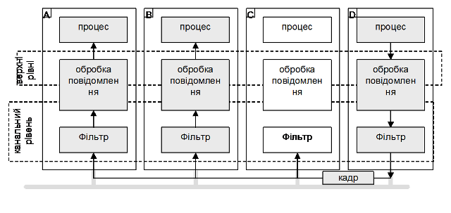
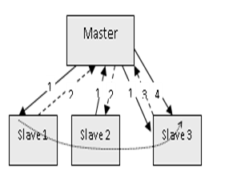
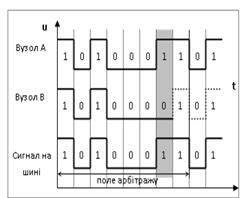
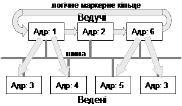

[Промислові мережі та інтеграційні технології в автоматизованих системах](README.md). [2. ЗАГАЛЬНА ХАРАКТЕРИСТИКА ПРОМИСЛОВИХ МЕРЕЖ](2.md) 2.4.[Основні робочі характеристики промислових мереж](2_4.md)

### 2.4.2. Забезпечення каналом зв’язку між вузлами. Методи доступу

Прикладні сутності (прикладні Процеси) виконуються на конкретних апаратних засобах – вузлах мережі. Для того, щоб їх зв’язати, перш за все необхідно забезпечити зв’язок між вузлами. Створенням каналу зв’язку займаються сутності канального рівня. 

Канальний рівень виконує ряд специфічних функцій: забезпечує службовий інтерфейс для верхнього рівня; обробляє помилки передачі даних в повідомленні; управляє потоком даних, що виключає порушення роботи повільних приймачів швидкими передавачами; в мережах з загальним доступом організовує порядок доступу до загального середовища передачі та забезпечує доставку даних до потрібних вузлів. 

Канальний рівень оперує **кадрами** (Frame\), що являють собою послідовність інформаційних та службових байтів, які почергово відправляються сутністю фізичного рівня. 

В широкомовних мережах задачею канального рівня є забезпечення доставки кадрів конкретному(-ним) адресатові. Так як одночасно шину прослуховують всі приймачі, необхідно ідентифікувати того, кому призначений даний кадр. 

#### 2.4.2.1 Адресація доставки кадрів. 

В широкомовних мережах всі вузли прослуховують шину і відповідно отримують однакові дані. Задача канального рівня відфільтрувати кадри, які не призначені для даного вузла (рис.2.7). 

Рис.2.7. Відфільтровування кадрів на канальному рівні

Доставка кадрів може проводитись одним із двох способів: 

-    доставка кадрів орієнтована на адресу вузлів (модель Source-Destination-msg);

-    доставка кадрів орієнтовна на ідентифікатор повідомлення (модель Producer-Consumer-msg).

 Доставка кадрів по моделі Відправник-Адресат-msg (Source-Destination-msg\) орієнтована на адресацію вузлів отримувача (інколи також відправника), і є найбільш популярним способом доставки даних. У таких системах кожен вузол в мережі має свою унікальну адресу. При формуванні кадру, канальний рівень вузла відправника добавляє до нього заголовок з адресою (-сами) вузлів отримувачів. Всі вузли отримують цей кадр, але тільки вузли з вказаною адресою пропустять його для обробки верхнім рівням. Таким чином фільтр канального рівня кожного вузла налаштований на свою адресу. Адресу вузла на канальному рівні прийнято називати MAC-адресою (Media Access Control). 

У різних протоколах використовуються свої механізми адресації, однак можна зробити деяку їх систематизацію. У мережах з методом доступу Ведучий-Ведений кожний Ведений повинен мати свою адресу, за якою він отримує кадри від Ведучого. Ведучий, в свою чергу, може не мати адреси, якщо всі кадри відправлені Веденими, будуть призначені йому. Для мереж з множинним доступом, відправник у кадрі повинен вказати окрім адреси отримувача ще і свою адресу. В іншому випадку не буде зрозуміло від кого прийшов кадр. 

Більшість мереж дозволяють проводити широкомовну передачу, тобто передавати дані всім вузлам на шині. Як правило це сервіси, які не передбачають відповіді або підтвердження від вузлів. Для широкомовної передачі виділяється спеціальна широкомовна адреса (найчастіше 25510), яка резервується для цих цілей, і пропускається фільтрами канального рівня. Крім широкомовної передачі, деякі мережі підтримують також багатоадресну передачу.

Ряд мереж з загальним доступом використовують інший спосіб фільтрації кадрів – на основі ідентифікаторів повідомлення, який отримав назву Виробник-Споживач-msg (Producer-Consumer-msg\). При такому способі адресації доставки кадрів, кожний кадр містить ідентифікаційне поле, по якому проводиться фільтрація. Фільтр кожного вузла налаштовується тільки на потрібну множину ідентифікаторів. Інакше кажучи, фільтр буде пропускати через себе тільки ті кадри, ідентифікатори яких відповідають одному із заданих значень. 

В системах Виробник-Споживач кожен кадр що передається по мережі повинен мати унікальний ідентифікатор, на який:

-  канальний рівень одного з вузлів буде налаштований як відправник (producer, Виробник);

-  канальний рівень вузлів призначення буде налаштований як отримувач (consumer, Споживач), тобто його фільтр буде пропускати цей кадр.

 Модель адресації Виробник-Споживач-msg ефективна в мережах з груповою передачею даних, зокрема в системах з ідентифікованим обміном даними Виробник-Споживач. Представниками цієї моделі адресації є  мережі CAN та WorldFIP.

Враховуючи однакову назву моделей адресації та функціонування сервісів прикладного рівня, для перших в даному посібнику введений суфікс "msg". Слід зазначити, що наведені моделі не являються загальноприйнятими і можуть відрізнятися від наведених в інших джерелах. Дані моделі використовуються тільки для зручності сприйняття матеріалу в даному посібнику.

#### 2.4.2.2. Методи доступу.  

Для широкомовних мереж (шинна та деревовидна топологія) необхідно визначити порядок доступу до єдиного каналу. Широкомовні мережі, які використовують у якості носія сигналу металевий кабель, мають шинну топологію. Якщо у мережі з шинною топологією не буде чітко визначено, хто в конкретний момент може займати шину для передачі, то може виникнути момент одночасної передачі бітової послідовності двома або кількома передавачами. Така ситуація називається колізією\ (Collision) або конфліктом. У цьому випадку приймачі не зможуть визначити, який біт був переданий, оскільки рівень сигналу буде результатом дій декількох передавачів. Окрім того, у деяких мережах таке взагалі неприпустимо, оскільки апаратура передачі пристроїв може вийти з ладу із-за значних струмів на шині. Організація доступу до шини – це одна з задач канального рівня. 

У промислових мережах найчастіше використовують централізовані методи доступу, тобто коли правом видачі дозволу на займання шини володіє один вузол. У кожний конкретний час саме він визначає, якому вузлу на шині зараз можна передавати дані. 

#### 2.4.2.3. Централізований метод доступу Ведучий-Ведений. 

Найбільш популярні серед мереж з централізованим методом доступу – мережі типу Ведучий-Ведений (Master-Slave\), у яких право на управління володінням шиною надається Ведучому, а Ведені займають шину тільки з його дозволу. Останні мають унікальну адресу (адреса Веденого), за допомогою якої Ведучий ідентифікує кому надсилається повідомлення. 

Як правило у системах Ведучий-Ведені, Ведені являються пасивними вузлами, які можуть тільки відповідати на запити Ведучого. Якщо при цьому Процеси взаємодіють по моделі Клієнт-Сервер, то Процес на вузлі з правами Ведучого завжди буде Клієнтом, а на вузлі Веденого – Сервером, що виключає можливість безпосереднього обміну між Веденими. 

Існують  рішення, в яких Процес кожного вузла має право на ініціювання обміну. Для клієнт-серверної взаємодії це означає, що клієнтський Процес може знаходитись на вузлі Веденого. Для реалізації такої схеми Ведучий проводить циклічне опитування (polling) кожного Веденого (рис.2.8). Якщо клієнтський Процес Ведучого хоче звернутися до 1-го Процесу у списку веденого, система працює як в попередньому випадку. Якщо Процесу Ведучого нічого не потрібно від 1-го Веденого, він надсилає йому запит ідентифікації, на який Ведений відповідає кадром підтвердження (на рис.2.8 це відповідно запити 1 і 2). Після обслуговування 1-го Веденого, Ведучий опитує 2-го і т.д. Якщо Процесу Веденого необхідно зробити клієнтський запит, замість підтвердження він надсилає кадр з цим запитом (3). У зв’язку з тим, що можливість зайняти шину передавачем Веденого регламентується Ведучим (адже той надав таке право запитом ідентифікації) принцип Ведучий-Ведений залишається. Після отримання кадру запиту Веденого, Ведучий йому відповідає звичайним підтвердженням (типу запит отримав, коли оброблю – відповім). Така схема дає можливість прикладним Процесам Веденого проявити себе в якості Клієнта, тому умовно будемо називати такі мережі Ведучий-Ведений з активними Веденими\. Ведучий постійно веде опитування Ведених, що веде до виявлення несправних вузлів, та дає можливість включати нові вузли з правами Веденого у мережу без переконфігурування Ведучого.

Слід зупинитися ще на одній принциповій відмінності між наведеними схемами функціонування Ведучий-Ведений. В обох випадках на канальному рівні використовується сервіс з підтвердженням без установки з’єднання. Тобто після кадру від Ведучого, повинен надійти відповідний кадр від Веденого. Щоб уникнути зависання роботи мережі, у випадку виходу з ладу Веденого існують тайм-аути\ – максимально можливий час очікування кадру від веденого. 

Рис.2.8. Функціонування мереж з активними Веденими: 1- ідентифікація або клієнтський запит,   2 - підтвердження Веденого, 3 - запит Веденого, 4 – підтвердження Ведучого

В класичній схемі Ведучий-Ведений після того, як клієнтський прикладний Процес Ведучого відправляє запит Процесу Веденого, Ведучий очікує відповіді на цей запит. Тобто, поки прикладний Процес Веденого не обробить запит від Ведучого кадр відповіді не прийде, а Ведучий не зможе надіслати кадр іншому Веденому. В системі з активним Веденим, канальний рівень після отримання кадру від Ведучого відразу його підтверджує відповідним кадром. У цей час прикладний Процес Веденого ще не отримує надісланий до нього запит, однак Ведучий вже може сформувати запит до іншого Веденого. Тобто, наприклад, за перший цикл сканування Ведених, Процес Ведучого може надіслати запити всім Веденим, а за другий вже отримати відповіді. Це значить, що продуктивність роботи такої системи з декількома вузлами як правило вища, ніж в класичній схемі. 

У системах Ведучий-Ведені на прикладному рівні може також функціонувати модель "Видавець-Підписувач". У цьому випадку, Ведучий повинен регламентувати час відновлення прикладним Процесом-Видавцем своїх змінних. 

Серед розглянутих схем функціонування Ведучий-Ведені, класична –простіша в реалізації, однак в системі, що працює за моделлю Клієнт-Сервер, передбачає наявність тільки одного вузла-Клієнта, який являється Ведучим. Нерідко у мережах існує необхідність використання декількох Клієнтів (наприклад два ПК з SCADA, або дві панелі оператора і т.д.). Для таких випадків підійде шина з активними Веденими. Недоліком останньої є складність у реалізації та деякі затрати часу на циклічне опитування. Функціонування на прикладному рівні моделі Видавець-Підписувач для обміну ідентифікованими даними теж потребує складного протоколу на всіх рівнях моделі OSI. Недоліком всіх моделей є наявність центрального вузла, у випадку збою якого мережа перестає функціонувати. Тому існують мережі з плаваючим Ведучим\, коли функції Ведучого можуть перейти до іншого вузла у випадку виходу з ладу останнього.

До класичної схеми Ведучий-Ведений можна віднести роботу канального рівня MODBUS RTU/ASCII, AS-i, HART, з активним Веденим - UNI-TELWAY, CC-Link.  

#### 2.4.2.4. Централізований метод доступу з Арбітром шини. 

Цей метод доступу підходить до мереж, де прикладні Процеси вузлів обмінюються на базі pull-моделі Видавець-Підписувач (Виробник-Споживач) обміну ідентифікованими даними. Нагадаємо, що в цій моделі ідентифіковані дані передаються Видавцем (Виробником) до Підписувачів (Споживачів) в момент надсилання запиту на публікацію (виробництво). На канальному рівні запит на публікацію означає відправку по мережі підготовлених ідентифікованих даних, які знаходяться в буфері. Для управління доступом до шини, всі заплановані передачі відбуваються згідно розкладу, за яким слідкує один вузол, який називають Арбітром\ шини\. Арбітр шини має таблицю залежності відновлення мережних змінних та запланованих повідомлень від часу. Для мереж з моделлю адресації Producer-Consumer-msg таблиця містить ідентифікатори змінних/повідомлень, які необхідно відновлювати. Роль Арбітра дуже схожа на роль Ведучого: жоден вузол не почне передавати, поки Арбітр не дасть команду на відновлення мережної змінної згідно розкладу.

Слід зазначити, що прикладні Процеси на мережі з такою моделлю доступу, можуть обмінюватись як по моделі Видавець-Підписувач (Виробник-Споживач) так і по Клієнт-Серверній моделі. Це може бути реалізовано наступним чином. Запит від клієнтського Процесу, розміщується у буфері канального рівня. Як тільки відновлюється якась мережна змінна, для якої Процес даного вузла є Видавцем/Виробником, разом зі змінною він відправляє ідентифікатор запиту-повідомлення, який Арбітр розміщує в список ациклічних повідомлень. Після відновлення всіх мережних змінних, Арбітр відсилає сигнал на дозвіл формування запиту з першим ідентифікатором в списку ациклічних повідомлень, на який зреагує вузол з клієнтським Процесом. Після відправки запиту, Арбітр направляє сигнал для відправки наступного ациклічного повідомлення. Повідомлення-відповіді від серверних Процесів відправляються від вузлів аналогічно. 

Модель доступу до шини з арбітром функціонує в таких мережах як WorldFip та FF. 

#### 2.4.2.5. Децентралізований метод доступу Маркерне кільце. 

В промислових мережах використовують також відомий в комп’ютерних мережах метод доступу з використанням передачі маркера по кільцю (Token\ Ring\ – маркерне кільце\). У цьому методі кожен вузол займає шину для передачі на час володіння маркером, а після закінчення часу віддає маркер іншому вузлу. Маркерне кільце підходить для мереж з одноранговими вузлами, коли час володіння ресурсами шини (володіння маркером) рівномірно розділяється між учасниками. Така реалізація дозволяє економити часовий ресурс (якщо вузлу нічого передавати, він може передати маркер далі) та виявити відсутні вузли в мережі. Маркерне кільце використовується в мережах "Транзит", CC-Link IE. 

#### 2.4.2.6. Множинний випадковий метод доступу. 

Множинний або довільний метод доступу передбачає доступ до шини будь якого вузла, коли в нього є дані для передачі. При використанні такого способу, в один із моментів обов’язково виникне колізія у випадку, коли більше ніж один вузол одночасно захоче передавати дані. Основні відмінності між протоколами довільного доступу визначаються способами вирішення цих колізій. У ряді таких протоколів передавач при необхідності відразу буде намагатися зайняти шину без її прослуховування. Розглянемо це на прикладі. 

Приклад 2.5. Основні концепції. Випадковий метод доступу без прослуховування шини. 

Завдання. Проілюструвати проблему виникнення колізії в мережі з випадковим методом доступу без попереднього прослуховування шини на прикладі системи з трьома вузлами А, В, С. 

Рішення. Коли у вузла А з’являються дані для передачі вузлу С, він займає шину для передачі. Поки передає вузол А, у вузла В теж з’являються дані для передачі, тому він теж починає їх передавати. Виникає колізія і вузол С не зможе отримати дані ні від вузла В, оскільки біти його кадру з самого початку перекриваються з бітами кадру вузла А, ні від вузла А, із-за спотворення другої частини кадру. Як бачимо вузол В не тільки не зміг передати свої кадри, а і завадив це зробити вузлу А. 

Для підвищення ефективності, ряд протоколів передбачають прослуховування шини перед тим, як зайняти її для передачі. Такі протоколи називають протоколами з контролем несучої\ CSMA\ (Carrier-Sense Multiple Access – множинний доступ з контролем несучої). Серед них найбільшу популярність має CSMA\/CD\ (CSMA with Collision Detection – множинний доступ з контролем несучої і виявленням конфліктів), який використовується у класичному Ethernet. Розглянемо принцип його функціонування на прикладі. 

Приклад 2.6. Основні концепції. Функціонування CSMA/CD.

Завдання .Проілюструвати функціонування протоклу CSMA/CD на прикладі системи з трьома вузлами А, В, С. 

Рішення. Вузли А, В і С прослуховують шину. Коли у вузла А з’являються дані для передачі і при цьому шина вільна, він займає шину для передачі. Під час передачі кадра вузла А у вузлів В і С з’явилися дані для передачі. Вони виявляють зайнятість шини і чекають її звільнення. Як тільки шина звільнилася (тобто вузол А повністю передав весь кадр), вузли В і С одночасно намагаються передавати свої кадри, що приводить до колізії. Обидва вузли при передачі своїх бітів прослуховують канал, знову виявляють колізію і припиняють передачу. Кожен включає генератор випадкового часу, через який вони знову зможуть спробувати передати свій кадр. Якщо наприклад у вузла В генератор видав менший час - саме він починає передавати свій кадр.

#### 2.4.2.7. Множинний метод доступу з використанням поля арбітражу. 

Один із цікавих способів вирішення колізій у мережах типу CSMA є використання у кадрах передачі поля арбітражу. Для реалізації такої схеми необхідно, щоб на шині один логічний сигнал фізично домінував над іншим логічним сигналом. Тобто, скажімо, при одночасній передачі логічної „1” вузлом А і логічного „0” вузлом „В” в результаті на шині була логічна „1”. В такому випадку логічну „1” називають домінантним бітом\ (dominant bit), а „0” – рецесивним\ (recessive bit). Всі вузли прослуховують шину, і як тільки вона стає вільною, вони можуть передавати свої кадри. Якщо два вузли одночасно доступилися до каналу, то при передачі бітів наступить момент, коли логічні стани біту одного і іншого вузла не співпадуть і домінантний біт буде визначальним. Вузол, який передавав дані з рецесивним бітом побачить на шині не свою посилку і миттєво припинить передачу. Область бітів в яких виставляється пріоритет називається полем арбітражу\. Біти у полі арбітражу вузол виставляє виходячи зі своєї адреси або/і пріоритетності кадру. Розглянемо приклад. 

Приклад 2.7. Основні концепції. Функціонування CSMA/CA. 

Завдання. Продемонструвати роботу протоколу з використанням поля арбітражу в системі з двома вузами А і В.

Рішення. Кожний вузол на шині має свою адресу. Нехай до шини одночасно доступилися вузол А, який має адресу 16310(101000112), і вузол В з адресою 16110(101000012) (рис.2.9). Після передачі 7-го біту поля арбітражу, вузол В припинить передавати свій кадр, оскільки логічна „1” у кадрі вузла А домінує над логічним „0” кадру вузла В. В такій системі як бачимо вузли з старшими адресами будуть мати більший пріоритет. 

Рис.2.9. Вирішення колізій за допомогою поля арбітражу

У деяких системах вузли можуть динамічно змінювати поле арбітражу, наприклад, збільшувати пріоритет під час передачі важливих і термінових повідомлень. 

Протоколи з використанням поля арбітражу у різних джерелах називають по-різному: - CSMA\/\CA\ (CSMA Collision Arbitration); CSMA/CD+AMP (CSMA Collision Detection and Arbitration on Message Priority); CSMA/BA (CSMA Bitwise Arbitration); CSMA/МA. На сьогоднішній день в промисловій автоматиці цей протокол використовується в мережах CAN.

#### 2.4.2.8. Передбачуваний псевдо-постійний метод доступу CSMA.

Цей алгоритм доступу використовується в мережі LonWorks і відноситься до сімейства CSMA. Він називається псевдо-постійним "p-persistent", оскільки час очікування перед відправкою кадру в мережу вибирається випадковим чином. Тобто коли шина вільна, кожен вузол перед відправкою кадру генерує випадковий час. По закінченню цього часу, перевіряється вільність шини, і при позитивному результаті відправляється кадр. Такий алгоритм значно зменшує кількість колізій. Цей алгоритм також називається передбачуваним "predective", оскільки алгоритм розраховує трафік каналу. Тобто діапазон, з якого генерується випадкова тривалість паузи перед відправкою пакету, вибирається в залежності від кількості вузлів в мережі. Таким чином в цілому алгоритм доступу до середовища в LonTalk називається predictive\ p-persistent CSMA\.

#### 2.4.2.9. Гібридні методи доступу.

Гібридні методи доступу використовують комбінацію з методів, розглянутих вище. Найбільш відомим методом є комбінація методу передачі маркеру і Master-Slave, які використовуються в мережах PROFIBUS (рис.2.10). Всі вузли діляться на активні учасники – Ведучі, і пасивні – Ведені. Між активними учасниками передається маркер (логічне маркерне кільце), на час володіння яким він може спілкуватися з пасивними вузлами. 

 

Рис.2.10. Гібридний метод доступу в Profibus

#### 2.4.2.10. Метод доступу TDMA. 

В TDMA (Time Division Multiple Access) для доступу до шини кожному вузлу виділяється часовий інтервал (тайм-слот\), а дані від кожного вузла поєднуються в один Сумарний Кадр\ (Summation-Frame\). Для функціонування такої мережі необхідно чітке визначення часу передачі. Як правило для цього одному з вузлів надається право Ведучого, який володіє інформацією про кількість вузлів в мережі, та визначає тривалість сумарного кадру як суму всіх тайм-слотів. Можуть бути виділені додаткові тайм-слоти, для передачі ациклічних повідомлень. Цей метод доступу часто використовують в безпровідних мережах та в ряді промислових мереж, наприклад INTERBUS, CIP-CompoNET. 

Дещо схожий метод доступу CTDMA розглянутий в підрозділі, присвяченому мережі CIP-ControlNET.

Як бачимо переваги того чи іншого методу доступу до шини відчутні тільки в контексті конкретної області застосування та моделі функціонування сервісів на прикладному рівні. Якщо у прикладних сервісів конкретної промислової мережі можливий певний вибір, то метод доступу до шини повністю визначений і незмінний. Методи доступу до шини суттєво залежать від реалізації фізичного рівня. Так, разом зі стандартними промисловими інтерфейсами найчастіше використовується метод Ведучий-Ведений. Слід зазначити, що методи доступу до середовища, що використовуються в промислових мережах не вичерпується наведеними в даному посібнику.    

<-- 2.4.1. [Прикладні сервіси, інтерфейс прикладного рівня](2_4_1.md)

--> 2.4.3. [Формування кадру та контроль за помилками](2_4_3.md)