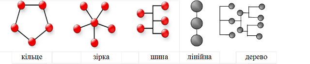

[Промислові мережі та інтеграційні технології в автоматизованих системах](README.md). [2. ЗАГАЛЬНА ХАРАКТЕРИСТИКА ПРОМИСЛОВИХ МЕРЕЖ](2.md) 2.4.[Основні робочі характеристики промислових мереж](2_4.md)

### 2.4.4. Топологія мережі та сегментація

Канальний рівень оперує кадрами як готовими байтовими структурами. Передачею кадрів по фізичному середовищу займається фізичний рівень. В системах що використовують в якості середовища передачі металевий провід, важливою характеристикою є топологія мережі.  

Мережна топологія визначає фізичну структуру мережі. Вона накладає обмеження на розташування ліній зв’язку та впливає на функціонування сервісів канального рівня. Базовими топологіями є: кільце, зірка й шина (рис. 2.11). 

Рис. 2.11. Базові топології мереж

#### 2.4.4.1. Топологія "кільце" (ring). 

У кільцевій структурі вузли попарно з’єднані між собою таким чином, що створюється кільце. Тобто кожен вузол має два канали  для зв’язку з двома сусідніми вузлами. Зв’язок з іншими вузлами мережі може проходити тільки через ці два вузли. Враховуючи можливість створення дуплексного каналу між вузлами, можна побудувати високошвидкісну систему, в якій всі вузли рівноцінно будуть доступатися до мережних змінних. Разом з кільцевою фізичною топологією, на канальному рівні як правило використовується логічне маркерне кільце. 

Відмова в роботі хоча б одного вузлів приводить до порушення роботи кільця, а, отже, і до зупинки всіх передач. Щоб цього уникнути, необхідно включати в мережу автоматичні перемикачі, які замикають мережне кільце в тому місці де пристрій вийшов з режиму нормальної роботи. Тобто вони дозволяють включати/виключати окремі вузли без переривання нормальної роботи. 

Серед промислових мереж, які базуються на цій топології можна виділити мережі "Транзит" (ПЛК - РЕМІКОНТ Р-130) та INTERBUS . Крім того промислові та комп’ютерні мережі, що використовують оптоволоконний кабель теж часто базуються на цій топології. 

#### 2.4.4.2. Топологія "зірка" (star). 

У даній топології вся інформація передається через виділений центральний вузол. Кожна периферійна станція підключається до цього вузла окремим фізичним каналом (променем), і може обмінюватись з іншою станцією тільки через центральний вузол. По суті зірка – це з’єднання типу точка-точка багатоканального вузла з іншими вузлами. 

На канальному рівні немає необхідності в організації доступу до середовища передачі, оскільки воно використовується для дуплексного обміну тільки між двома вузлами. Центральний вузол повинен бути винятково надійним пристроєм. Крім того підключення нових вузлів вимагає наявність каналів на центральному вузлі, а також окремих кабельних ліній. Топологія зірка дозволяє істотно оптимізувати трафік, передаючи пакети тільки в ті промені, де перебувають їхні одержувачі.

Класичний Ethernet на коаксіальному кабелі базується на топології шина, однак Ethernet на базі витої пари має топологію зірка. Слід зазначити, що для Ethernet на базі концентраторів, фізично всі канали зв’язані між собою через один концентратор, який виконує функції багатоканального репітера і поєднує між собою канали загальною шиною. Внаслідок шинного зв’язку необхідно організовувати на канальному рівні порядок доступу до цієї шини. Для комутованого дуплексного Ethernet, комутатор забезпечує також маршрутизацію кадрів по каналам, тому метод CSMA/CD не являється для цього рішення актуальним.  

#### 2.4.4.3. Топологія "шина" (bus). 

Найпоширеніший тип мережної топології. Всі пристрої підключаються до загальної лінії зв’язку, тим самим використовуючи одне й те саме середовище як для передачі так для прийому. Основна її перевага полягає в простоті, дешевині й легкості переконфігурування. Добре підходить для розподілених об'єктів. Має ряд недоліків: присутність у кожному вузлі мережі загального трафіка, небезпека втрати зв'язку при одиночному обриві каналу зв'язку. 

У будь-якій шинній структурі всі пристрої приєднані до загального середовища передачі даних, або шини. Таким чином всі вузли прослуховують шину, що з одного боку дає змогу відправляти широкомовні повідомлення, а з іншого – вимагає визначення методу доступу до середовища задля передачі. 

На відміну від топології кільце, адресат одержує свій інформаційний пакет без посередників. Процес підключення додаткових вузлів до шини не вимагає додаткових каналів з боку вже працюючих вузлів мережі, як це має місце у випадку топології зірка. 

Слід відмітити, що в шинній топології не дозволяються великі відгалуження від магістрального кабелю. Максимальна їх довжина регламентується правилами побудови мережі. 

#### 2.4.4.4. Лінійна топологія (linear). 

В лінійній топології вузли з’єднуються один з одним створюючи лінію. 

#### 2.4.4.5. Топологія "дерево" (tree). 

Це гібридна топологія, яка базується на поєднанні шинної та зіркоподібної топології. Зовні це ієрархічна структура, в якій на верхньому рівні елементи поєднуються у шину, від вузлів якої можуть йти зіркоподібні відгалуження. В таких системах як правило використовується середовище з загальним доступом (аналогічно шині).  

#### 2.4.4.5. Сегментація.

Крім обмеження на територіальне розміщення кабелів зв’язку, топологія також впливає на максимальну швидкість передачі даних, правила термінування, можливість і правила фізичної сегментації. Під фізичним сегментом мережі розуміють фізичну частину мережі, відокремленою спеціальним мережним пристроєм:

-  на фізичному рівні моделі OSI репітером (повторювачем) або концентратором (hub);

-  на канальному рівні моделі OSI комутатором (switch) або мостом (bridge);

-  на мережному рівні моделі OSI – маршрутизатором (gateway).

Репітери забезпечують підсилення сигналу, що дозволяє на фізичному рівні збільшити кількість вузлів в мережі, максимальну довжину ліній зв’язку, однак обмежує швидкісні характеристики передачі. Концентратори використовуються для об’єднання декількох пристроїв в мережу, а також можуть виконувати функції репітерів, за рахунок чого територіальна "зірка" реалізовується в фізичну "шину".  З точки зору засобів канального рівня мережа поєднана репітером або концентратором являється одним цілим.

Міст (bridge) забезпечує пересилку кадрів між сегментами по їх MAC-адресам. Тобто міст забезпечує фільтрацію кадрів, що циркулюють між сегментами по їх MAC-адресам, що значно зменшує завантаження цих сегментів. Комутатор – це багатопортовий міст, що забезпечує фільтрацію кадрів між сегментами, підключеними до його портів.

Маршрутизатор забезпечує пересилку даних між сегментами мережі, які архітектурно можуть відрізнятися між собою. Більш детально принципи функціонування маршрутизаторів описані в 2.4.6.  

<-- 2.4.3. [Формування кадру та контроль за помилками](2_4_3.md)

--> 2.4.5. [Фізичні інтерфейси передачі даних](2_4_5.md)