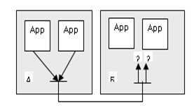

[Промислові мережі та інтеграційні технології в автоматизованих системах](README.md). [2. ЗАГАЛЬНА ХАРАКТЕРИСТИКА ПРОМИСЛОВИХ МЕРЕЖ](2.md) 2.4.[Основні робочі характеристики промислових мереж](2_4.md)

### 2.4.7. Транспортування даних

При доставлені пакетів на вузол, необхідно щоб ці дані потрапили до конкретної прикладної сутності (Процесу, прикладної програми). Коли на вузлі виконується тільки одна прикладна програма (наприклад, у контролері) дані передаються їй, або системі. Однак сучасні ПТЗ можуть підтримувати одночасне виконання декількох Процесів. Тому необхідно реалізувати доступ до конкретного Процесу. Для цього виділимо такі типи сервісів: 

-  доступ до операційної системи;

-  доступ до прикладного сервісу;

-  доступ до програми користувача;

-  доступ до окремої програмної складової;

Розглянемо приклад. Припустимо в мережі є два вузли, які представлені двома комп’ютерами (рис.2.14). Клієнтський Процес App1 хоче передати певні дані Процесу App3, а App2 - App4. Якщо дані будуть вставлятися безпосередньо в пакети/кадри і передаватись з вузла А на вузол Б, то мережна/канальна сутність не зможе визначити якому з Процесів призначені дані в пакеті/кадрі. Адже на канальному та мережному рівні вирішується питання доставки даних вузлу, а не конкретній прикладній сутності. Ця задача покладається на сутність транспортного рівня. Як і на попередніх двох рівнях вона вирішується за допомогою адресації. В даному випадку  адресуються не вузли і не повідомлення, а прикладні сутності, тобто Процеси-отримувачі та Процеси-відправники. Ці адреси (точки доступу TPDU) прийнято називати TSAP\ (Transport Service Access Point – точки доступу транспортного сервісу), а в ряді протоколів портами\ (port\). Надалі в даному посібнику буде вживатися термін "порт". 

Рис.2.15. Вибір маршруту для даних

Кожній прикладній сутності назначається свій порт, за допомогою якого до неї можна звернутися (серверний порт). У нашому прикладі App3 і App4 можна б було призначити серверні порти відповідно 3 і 4. Таблиця відповідності портів прикладним сутностям повинна зберігатися як на вузлі А, так і на вузлі Б. Клієнтам теж повинні бути призначені порти. У протоколах UDP і TCP клієнтські порти назначаються динамічно, оскільки сервер буде відповідати тому клієнту, який до нього звернувся. 

Транспортні протоколи, як і мережні, можуть надавати декілька типів сервісів: з установкою або без установки з’єднання, з підтвердженням або без підтверджень. Ці типи сервісів будуть прокоментовані при розгляді протоколів TCP та UDP (див. розділ 10). 

<-- 2.4.6. [Маршрутизація](2_4_6.md)

--> 2.4.8. [Підсумкова таблиця з основними робочими характеристиками](2_4_8.md)