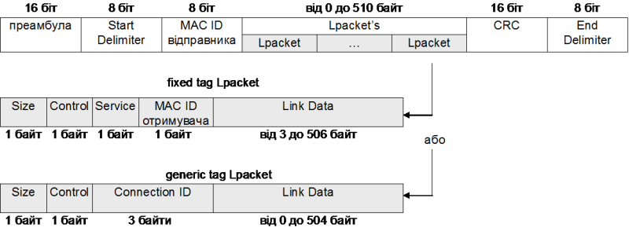

[Промислові мережі та інтеграційні технології в автоматизованих системах](README.md). [2. ЗАГАЛЬНА ХАРАКТЕРИСТИКА ПРОМИСЛОВИХ МЕРЕЖ](2.md) 2.5. [Короткий огляд промислових мереж](2_5.md)

### 2.5.10. Мережі CIP: DeviceNet, ControlNet, Ethernet/IP та CompoNet

#### 2.5.10.1. Походження. 

В 1994 році компанією Allen-Bradley був розроблений та опублікований  CAN-сумісний протокол мережі DeviceNet. Пізніше була заснована організація для підтримки та розвитку даного протоколу – ODVA (Open DeviceNet Vendor Organization, http://www.odva.org). В 1997 році, той самий протокол прикладного рівня що і в DeviceNet був доповнений новими протоколами канального та фізичного рівня, які дозволяли обмінюватися на більш високих швидкостях з забезпеченням повного детермінізму. Мережа отримала назву ControlNet, яка на сьогоднішній день підтримується організацією CI (ControlNet International, [http://www.controlnet.org](http://www.controlnet.org/)). В 2000 році ODVA  та CI адаптувала цей же протокол прикладного рівня до Ethernet TCP/IP під назвою Ethernet/IP ("IP" – Industrial Protocol).   

Таким чином на сьогоднішній день мережі DeviceNet, ControlNet, Ethernet/IP та  CompoNET (мережа рівня датчиків, розроблена ODVA в 2006 році) використовують спільний протокол верхнього рівня (над мережним), який отримав назву CIP (Common Industrial Protocol). Для взаємної сумісності CIP мереж, організації ODVA та CI розглядають їх в контексті єдиної структури (рис.2.38).  Мережі СІР стандартизовані в стандартах МЕК.

 

Рис.2.38. Мережі СІР в контексті моделі OSI.

Загальна структура опису CIP мереж представляється декількома томами, з яких в 1-му томі описаний протокол СІР, а в інших адаптація конкретної мережі до даного протоколу.

#### 2.5.10.2. Протокол прикладного рівня CIP.

Для опису доступних комунікаційних сервісів, поведінки вузла СІР, взаємодії між вузлами СІР використовується абстрактна об’єктна модель. Модель вузла CIP представляє собою колекцію об’єктів, які надають доступ до певних компонентів вузла. Структурування об’єктів проходить через визначення класу, екземпляру та атрибуту, які використовуються в класичному об’єктно-орієнтованому підході. На основі класу об’єкту (class), що представляє собою опис об’єкту (об’єктний тип), створюються екземпляри об’єктів (instances), які характеризуються набором атрибутів (attribute) що визначені даним класом. Через атрибути екземпляр надає доступ до власних даних, за винятком атрибутів класу, через які надається доступ до даних класу або всіх екземплярів класу. 

Для доступу до об’єктів використовується універсальна система адресації, яка включає (див. рис.2.39):

-    Адресу вузла (Node Address): ціле число, назначене для кожного вузла мережі СІР; для DeviceNet, ControlNet та CompoNet називається також МАС ID і являється номером пристрою в мережі; для EtherNet/IP це ІР адреса. 

-    Ідентифікатор класу(Class ID): ціле число, яке назначене кожному класу;

-    Ідентифікатор екземпляру (Instance ID): ціле число, яким ідентифікується екземпляр серед всіх екземплярів того ж класу;

-    Ідентифікатор атрибуту (Attribute ID): ціле число, номер атрибуту в опису класу;

-    Код сервісу Service Code (для атрибутів класу): ціле число, яке визначає номер служби, тобто дію, яку необхідно зробити через явні повідомлення для класу або для екземпляру.

Таким чином при доступі до об’єкту шляхом обміну повідомленнями, вказується послідовність "вузол: клас: екземпляр: атрибут: сервіс", в якій тип дії вказується в полі сервіс. 

 

Рис.2.39. Адресація об’єктів в вузлі СІР 

 Зв’язок даних між прикладними Процесами функціонує на основі явних (Explicit Message) та неявних (Implicit  Message або I/O Message) повідомлень. Ці повідомлення можуть бути реалізовані через з’єднання (connections) між СІР об’єктами (між їх атрибутами). Кожне з’єднання однонаправлене, тому для реалізації двохстороннього обміну між об’єктами (наприклад читання/запис) необхідно використати два з’єднання. З’єднання нумеруються ідентифікатором з’єднання CID, формат яких залежить від типу мережі. Для DeviceNet, наприклад, CID буде вказувати на ідентифікатор CAN.

Крім функцій орієнтованих на з’єднання, СІР підтримує функції обміну явними повідомленнями, що не потребують з’єднань - Unconnected Explicit Messaging (менеджера  UCMM - Unconnected Message Manager). Крім того вони використовуються для побудови самих з’єднань. Зокрема функція Forward_Open забезпечує створення СІР з’єднань між об’єктами. При цьому вказується:  адреса атрибуту вузла, періодичність відновлення даних (періодично, по зміні, по запиту), обмеження на обсяг даних, CID, тайм-аут відсутності передачі даних, інформація про відправника.

СІР мережі на прикладному рівні надають два типи сервісів, що орієнтовані на з’єднання:

-     I/O Connections - для обміну даними процесу через відправку ідентифікованих даних;

-     Explicit Messaging Connections - для обміну даними процесу та параметричними даними через відправку повідомлень (тип запит-відповідь). 

Ці типи сервісів реалізуються через відповідні Комунікаційні Об’єкти (рис.2.40). Кожний Комунікаційний Об’єкт представляє бік Виробника (Producer) або Споживача (Consumer) або обидва. Для I/O Connections, ідентифіковані дані передаються від Виробника до Споживача. При двосторонньому з’єднані, даний тип об’єкту представляє обидва боки.  Для Explicit messaging connections (типу запит-відповідь), завжди підтримується двосторонній зв’язок, так як на формування запиту очікується відповідь. Тому даний Комунікаційний Об’єкт повинен підтримувати як бік Виробника так і бік Споживача. Об’єкт-запитувач (клієнт) передає дані разом з кодом сервісу, який визначає номер необхідної служби. Відповідно до вказаного номеру, ці дані будуть оброблятися об’єктом-відповідачем (сервером), функції якого накладені на спеціальний об’єкт Message Router. Той в свою чергу, обробивши запит сформує повідомлення-відповідь аналогічним чином, повторивши код сервісу. Об’єкт Message Router є сервером для всіх явних повідомлень, тобто і для сервісів менеджера UCMM. 

 

Рис.2.40. Комунікаційні об’єкти СІР 

Слід зазначити що також доступний обмін даними між вузлами, що знаходяться в різних мережах CIP, і для сервісів що потребують з’єднання (I/O Connections та Explicit messaging connections) і для Unconnected Explicit Messaging. Це забезпечується на прикладному а не на мережному рівні.

####  2.5.10.3. Бібліотека об’єктів CIP.

Об’єкти бібліотеки СІР можна поділити на три типи:

1. General-use - загального призначення, які можуть бути присутні у всіх типах вузлів; це такі об’єкти: Assembly, Acknowledge Handler, Connection, Connection Configuration, Connection Manager, File, Identity, Message Router, Parameter, Parameter Group, Port, Register, Selection;

2. Application-specific - прикладного призначення, їх наявність в вузлах визначається типом вузла; наприклад:  AC/DC Drive , Analog Input Group, Analog Output Group, Discrete Input Group, Discrete Output Group, Motor Data та інші.

3. Network-specific - залежні від мережі, їх наявність в вузлах визначається типом мережі СІР, до яких вони підключені; це такі об’єкти: ControlNet, ControlNet Keeper, ControlNet Scheduling, DeviceNet, Ethernet Link, TCP/IP Interface, CompoNet Link.

На рис.2.41 показана типова об’єктна модель пристрою CIP, який обов’язково повинен включати наступні об’єкти:

-     будь-який Connection або Connection Manager об’єкт;

-     об’єкт Identity;

-     один або декілька об’єктів Network-specific;

-     об’єкт Message Router;

та опціонально об’єкти:

-     Parameter;

-     Assembly;

-     один або декілька об’єктів типу Application-specific;

 

Рис.2.41. Типова об’єктна модель СІР пристрою 

Призначення комунікаційних Об’єктів Connection а також об’єкту Message Router ми розглянули вище. 

Об’єкт класу Identity представлений в пристрої тільки одним екземпляром і призначений для ідентифікації пристрою та його стану. Для цього об’єкту доступні наступні атрибути: Vendor ID (ідентифікатор виробника), Device Type (номер підтримуваного профілю пристроєм), Product Code (ідентифікатор пристрою), Revision (версія), Status (плинний статус пристрою),  Serial Number (серійний номер), Product Name (назва пристрою).

Об’єкт Assembly призначений для відображення (mapping) декількох атрибутів від різних екземплярів в одну структуру, що прискорює їх передачу за допомогою I/O Connections. Розрізняють два типи об’єктів Assembly: 

-     Input Assembly, які збирають дані від атрибутів різних екземплярів та передають їх Producing I/O Connection, для передачі в мережу;

-     Output Assembly, які отримують дані від Consuming I/O Connection, та записують їх значення в атрибути екземплярів, відповідно до схеми відображення;   

Таким чином об’єкт Assembly дозволяє передавати дані декількох атрибутів від різних екземплярів, використовуючи мінімум об’єктів I/O Connection, що значно оптимізує мережний трафік та зменшує час транзакцій.

Для полегшення інтеграції вузлів від різних виробників для СІР визначені профілі пристроїв, та розроблений єдиний формат їх опису у вигляді EDS-файлу.

#### 2.5.10.4. Фізичний рівень DeviceNET.

Фзичний та канальний рівень DeviceNET базується на CAN стандарті ISO11898, з певними доповненнями. На фізичному рівні DeviceNET має наступні характеристики: шинна топологія з можливістю відгалужень з 2-ма термінаторами 121 Ом в кінцях магістрального кабелю; 64 вузла на сегменті; використовується спеціальний 5 жильний кабель (2 сигнальні лінії, 2 живлення, 1 екран (заземляється в одному місці)); бітова швидкість 125 кБіт/с (500 м), 250 кБіт/с (250 м) та 500 кБіт/с (100 м); можливість живлення датчиків по мережі та підключення декількох роздільних джерел живлень до однієї мережі (24 В, <16 А); можливість гарячої заміни модулів; підтримка різних типів конекторів; захист від неправильного підключення; вбудований захист від перевантажень.   

#### 2.5.10.5. Канальний рівень DeviceNET.

Відповідно до специфікацій СІР, для адресації вузлів використовується Node Address, який в DeviceNET також називається MAC-ID. Враховуючи, що на канальному рівні використовується CAN система адресації повідомлень, 6-бітна адреса MAC-ID (0-63) є частиною CAN ідентифікатору. Інші біти CAN-ID використовуються для кодування ідентифікатору повідомлення. Для з’єднань DeviceNET, CAN-ID співпадає з Connection ID (CID). Для виділення пріоритетності повідомлень в єдиній мережі, їх згрупували в 4-ри групи (Message Group), правила формування CAN-ID для яких вказані на рис.2.42. MAC-ID для вузла може виставлятись перемикачами, або змінюватись через Об’єкт DeviceNET. 

 

Рис.2.42. Формування CAN-ID в залежності від Message Group

#### 2.5.10.6. Верхні рівні DeviceNET. 

Для адаптації DeviceNET на прикладному рівні до протоколу CIP добавлений новий об’єкт DeviceNET, а також введені деякі додаткові механізми:

-    невеликі повідомлення (I/O Connections) обмежуються 8 байтами (відповідно до обмеження CAN Кадру Даних), а для великих (всіх Explicit Messaging та деяких I/O Connections) використовується механізм фрагментації;

-    введений комунікаційний профіль типу Ведучий-Ведений для мінімізації комунікаційних витрат на управління мережею.

Ці адаптації дали змогу реалізувати протокол DeviceNET в єдиній недорогій мікросхемі, тобто мінімізувати вартість пристроїв, що дуже принципово для мереж рівня датчиків.     

У вузлі для кожного порту DeviceNET виділяється окремий екземпляр Об’єкту DeviceNET, в якому зберігається бітова швидкість та MAC-ID адреса.

Нагадуємо, що обмін даними в мережах CIP проходить через з’єднання (див. рис.2.41), які необхідно встановити. Встановлення з’єднання можна провести через сервіси Unconnected Explicit Messaging (див. 2.5.10.2). Однак ця процедура дуже складна, і потребує великих затрат на реалізацію з боку пристрою. Для спрощення створення з’єднань в DeviceNET використовується механізм наперед визначених з’єднань (Predefined Master-Slave Connection Set), який базується на наступних принципах. 

Всі вузли в мережі поділяються на Ведучі (контролери) та Ведені (засоби вводу виводу). Слід зазначити, що дана схема не передбачає контроль доступу до шини типу Ведучий-Ведений. Ведучих в мережі DeviceNET може бути декілька, однак Ведені логічно прив’язані тільки до одного Ведучого. Для цього, в кожному Вузлі закладений наперед визначений набір доступних CAN-ID з області "Message Group 1" та "Message Group 2" (див.рис.2.43). Враховуючи, що частина CAN-ID є адресою призначення MAC-ID, яка повинна вказувати на Ведучий вузол, Веденому необхідно цю адресу сповістити. В схемі "Predefined Master-Slave Connection Set" адреса Ведучого оповіщується кожному Веденому через спеціальний зарезервований для цього MAC-ID (порт Group 2 Only Unconnected Request), через який доступаються до Об’єкту DeviceNET . Разом з вказівкою своєї адреси, Ведучий також вказує які з 5-ти наперед визначених з’єднань необхідно активувати. Ці з’єднання забезпечують зв’язок між такими Комунікаційними Об’єктами Ведучого та Веденого:

-    Об’єкти Explicit Messaging Connection:
     - Group 2 Explicit Request/Response Message (Екзмепляр ID 1)

- Об’єкти I/O Messaging Connections:

  - Polled I/O Connection (Екзмепляр ID 2): Ведучий відправляє Веденому вихідні дані (poll Comand) після чого отримує від нього вхдіні дані (poll Responce); 

  - Bit-Strobe I/O Connection (Екзмепляр ID 3): Ведучий відправляє 8-байтну команду (Bit-Strobe command), кожний біт якої вказує на номер Веденого, який відправляє у відповідь вхідні дані (Bit-Strobe Response);

  - Change of State or Cyclic I/O Connection (Екзмепляр ID 4): дані відправляються циклічно(Cyclic) або по зміні (COS) від Ведучого до Веденого або навпаки, в залежності від настройки; 

  - Multicast Polling I/O Connection (Екзмепляр ID 5): подібно до Polled, однак дані адресуються декільком вузлам. 

 

 Рис.2.43. CID для Predefined Master-Slave Connection Set 

Ведені вузли які підтримують тільки механізм Predefined Master-Slave Connection Set називають Group 2 Only Servers, а UCMM-сумісні вузли, тобто які підтримують Unconnected Explicit Messaging називаються Group 2 Servers. Перший тип вузлів може обмінюватися даними тільки з одним Ведучим, тоді як другий тип вузлів, може підтримувати динамічні з’єднання, тобто з’єднуватись з будь-якими вузлами в інтермережі CIP. Таким чином в DeviceNET можна виділені три класи пристроїв: Ведучі, Ведені Group 2 Only Servers та Ведені Group 2 Servers.

#### 2.5.10.7. Фізичний рівень ControlNET.  

На фізичному рівні використовується спеціально розроблений для даної мережі інтерфейс, що має наступні характеристики: шинна топологія на базі 75-омного коаксіального кабелю (типово RG-6) з двома термінаторами 75 Ом в обидвох кінцях магістралі; підключення пристроїв через спеціальні коробки з відгалуженнями (1 м), BNC-конектори або TNC-конектори (IP67); максимальна довжина магістрального кабелю 1000 м при 2-х відгалуженнях, 250 – при 48; максимальна кількість вузлів – 99; можлива сегментація через репітери; бітова швидкість 5 МБіт/с; синхронна передача напругою Манчестерським кодом.

#### 2.5.10.8. Канальний рівень ControlNET. 

На канальному рівні використовується повністю детермінований метод доступу CTDMA (Concurrent Time Domain Multiple Access), з адресацією вузлів через MAC-ID, який базується на наступних приницпах. Весь мережний час ділиться на однакові проміжки, які називаються NUT (Network Update Time). Кожний NUT в свою чергу ділиться на Час Запланованих Сервісів (Scheduled Service Time), Час Незапланованих Сервісів (Unscheduled Service Time) та Захисний Інтервал (Guardband Time). 

В межах Часу Запланованих Повідомлень, кожен вузол в мережі, починаючи від 1-го до SMAX (максимальний номер вузла, що приймає участь в передачі Запланованих Повідомлень) по черзі передають свої заплановані кадри. Якщо вузлу нічого передавати, він передає короткий кадр, що свідчить про його працездатність. Якщо вузол, що має передавати протягом тайм-ауту нічого не передає, він вважається дефектним, і за ним починає передавати вузол з наступним номером.   

 

Рис.2.44. Метод доступу до шини CTDMA в ControlNET 

Після передачі запланованих кадрів усіма вузлами, настає Час Незапланованих Повідомлень, який триває протягом NUT-GuardbandTime. В цей час гарантується відправка свого незапланованого кадру тільки одному вузлу, з номером, для якого прийшла черга (наприклад n). Якщо залишається додатковий час, незапланований кадр може відправити вузол з наступною адресою (n+1) і т.д. В будь якому випадку, на наступний NUT, незапланований кадр буде відправляти вузол з номером n+1. Коли черга незапланованих повідомлень дійде до вузла з номером UMAX (максимальний номер вузла, що приймає участь в передачі Незапланованих Повідомлень), на наступний NUT черга передається до 1-го вузла. 

 Як видно модель CTDMA гарантує рівноцінний розподіл ресурсів між усіма вузлами в мережі, що особливо важливо для мереж рівня контролерів.

Кадри ControlNET (МАС-кадри) включають 8-бітну адресу відправника та декілька Lpacket (LinkPacket), які обмежені 510 байтами (рис.2.44). Кожен  Lpacket являє собою індивідуальне СІР-повідомлення (I/O Message або Explicit Message) або спеціальну службову інформацію для управління мережею. 

 

Рис.2.45. Структура МАС-кадру  

Визначені два формати Lpacket (рис.2.44): fixed tag Lpacket – які використовуються для передачі Unconnected Messaging та generic tag Lpacket – які використовуються для обміну даними через з’єднання.

####  2.5.10.9. Верхні рівні ControlNET. 

Для адаптації ControlNET на прикладному рівні до протоколу CIP добавлені наступні об’єкти: ControlNet Object – на кожний порт свій екземпляр, вміщує МАС-ID, стан пристрою, діагностичний лічильник, часові параметри канального рівня; Keeper Object – об’єкт який зберігає всю інформацію про заплановані з’єднання, з’єднання створюються вузлами, які називаються Connection Originator, Keeper відправляє всю необхідну інформацію Connection Originator; Scheduling Object – об’єкт який розміщується на вузлах типу Connection Originator, через який конфігураційна утиліта може доступитися до всіх запланованих з’єднань.

Обмін повідомленнями (Explicit Message) може проводитись як через Explicit Messaging Connections так і через Unconnected Messaging (функції UCMM). Перші проводяться використовуючи Lpacket формату generic tag, другі - fixed tag. Обидва сервіси використовують Час Незапланованих Повідомлень. Функції UCMM використовуються для побудови з’єднань вузлами Connection Originator. 

Обмін даними через I/O Connections, проходить передачею повідомлень МАС-кадром з Lpacket формату generic tag. Один МАС-кадр може вміщувати дані від декількох об’єктів I/O Connections і завжди передається в Час Запланованих Повідомлень. Таким чином всі вузли на мережі потенційно можуть бути як Connection Consumer. 

В ControlNet виділені 4-ри класи пристроїв: 

- Messaging Server – які підтримують тільки Connected та Unconnected Explicit Messages для загрузки/вигрузик программ, даних, відобарження статусу та діагностики і т.д.;

- I/O Server – які підтримують функції Messaging Server та серверні функції I/O Messaging (пристрої розподіленої периферії);

- Messaging Client - які підтримують функції Messaging Server, а також функції Connection Originator (комп’ютер з комунікаційною картою, ЛМІ);

- I/O Scanner -  підтримує всі функції;

#### 2.5.10.10. Нижні рівні  EtherNET/IP.

Фізичний та канальний рівень EtherNET/IP базуються на Ethernet, мережний та транспортний на стеку TCP/IP. На фізичному та канальному рівні EtherNET/IP ставляться аналогічні вимоги як і до інших промислових мереж, що базуються на Ethernet (див. розділ 10). Зокрема, згідно концепції MICE, для промислових умов експлуатації рекомендується  використовувати екрановану виту пару, промислові роз’єми типу "M12-4 з D-кодуванням" або модифікований герметичний Rj-45. 

В залежності від області використання EtherNET/IP, до інфраструктури Ethernet накладаються різні вимоги. Можливі 4-ри різні типи сценаріїв EtherNET/IP:

1) EtherNET/IP з одним контролером ізольована від мережі підприємства.

2) EtherNET/IP з декількома контролерами ізольована від мережі підприємства. 

3) EtherNET/IP підключена до корпоративної мережі через маршрутизатор (або еквівалентно йому);

4) EtherNET/IP інтегрована в корпоративну мережу.

В залежності від цих типів висуваються загальні рекомендації на використання комутаторів та маршрутизаторів з різними функціональними можливостями, для оптимізації мережного трафіку та досягнення необхідних вимог див. таб.2.20.

Таблиця 2.20.

|                                                         | ізольована з одним контролером | ізольована з декількома контролерами | підключена до корпоративної мережі | інтегрована в корпоративну мережу |
| ------------------------------------------------------- | ------------------------------ | ------------------------------------ | ---------------------------------- | --------------------------------- |
| використання  комутаторів                               | обов’язкове                    | обов’язкове                          | обов’язкове                        | обов’язкове                       |
| підтримка  Auto-MDI/MDX та Auto-negotiation;            | рекоменд.                      | рекоменд                             | рекоменд                           | рекоменд                          |
| промислове виконання комутаторів                        | рекоменд.                      | рекоменд.                            | рекоменд.                          | рекоменд.                         |
| підтримка  комутаторами IGMP snooping                   | -                              | обов’язкове                          | обов’язкове                        | обов’язкове                       |
| підтрикмка  комутаторами WEB/SNMP діагностики           |                                | рекоменд                             | обов’язкове                        | обов’язкове                       |
| підтримка  VLAN                                         | -                              | рекоменд.                            | рекоменд.                          | обов’язкове.                      |
| використання  шлюзів                                    | -                              | -                                    | обов’язкове                        | -                                 |
| використання  маршрутизаторів та комутаторів 3-го рівня | -                              | -                                    | рекоменд                           | обов’язкове                       |

Адресація СІР вузлів в EtherNET/IP проводиться через ІР адресацію, яка може встановлюватися різними методами, в залежності від пристрою та виробника: DHCP, BOOTP, явне повідомлення Set_Attribute, перемикачами і т.д. 

Для обміну даними між прикладними Процесами використовуються як TCP так і UDP протокол. Всі вузли EtherNET/IP підтримують принаймні два ТСР-з’єднання через порт AF1216. Це з’єднання використовується для Explicit Messaging Connections та Unconnected Messaging (функції UCMM). Деякі з команд цих типів сервісів можуть використовувати аналогічний UDP-порт. Однак в основному UDP використовується для I/O Connections (порт 08АЕ16), при якому дані передаються в багатоадресному режимі (декілька адресатів ІР). 

#### 2.5.10.11. Верхні рівні  EtherNET/IP. 

Для адаптації ControlNET на прикладному рівні до протоколу CIP добавлені наступні об’єкти: TCP/IP Object, який призначений для конфігурування відповідних сервісів мережного та транспортного рівня; Ethernet Link Object, який забезпечує доступом до статусної інформації інтерфейсу (кількість екземплярів визначається кількістю портів Ethernet).

Дані, які інкапсулюються в ТСР/UDP-TPDU в EtherNET/IP складаються з заголовка та даних CPF (Common Packet Format). Заголовок необхідний тільки для функціонування сервісів Explicit Messaging Connections та Unconnected Messaging (функції UCMM). 

Для I/O Connections використовується тільки дані  CPF. Вони передаються в багатоадресному режимі UDP-TPDU безпосередньо за його заголовком. Нагадаємо, що з’єднання в мережах СІР між двома Комунікаційними Об’єктами визначається спеціальним ідентифікатором ConnectionID. Однак на відміну від DeviceNET та ControlNET, канальний та мережний рівень не може відфільтрувати I/O Connections повідомлення по їх ідентифікатору. Це значить, що всі UDP-TPDU, що реалізовують даний тип з’єднання повинні розсилатися в IP-датаграмою в широкомовному режимі. При великій кількості вузлів та багаторівневій ієрархії мережі це неприпустимо, оскільки сильно завантажує трафік I/O-повідомленнями. Тому, в таких випадках рекомендується використовувати групову адресацію по протоколу IGMP і відповідно комутатори, що підтримують функцію IGMP snooping (див. розділ 10). Для розділення мережного трафіку та виділення пріоритетності реал-тайм повідомлень (I/O-повідомлень) від не реал-тайм також рекомендується використовувати VLAN (див. розділ 10). Слід зазначити, що  IGMP та VLAN це стандартні механізми, визначені для мереж Ethernet TCP/IP.  

 В Ethernet TCP/IP виділені 4-ри класи пристроїв аналогічно ControlNet.

#### 2.5.10.12. Фізичний рівень CompoNET. 

Фізичний рівень CompoNET розроблений шляхом модифікації стандарту RS-485, а саме використанням манчестерського кодування, імпульсних трансформаторів між трансивером та середовищем передачі, фільтрації вхідних сигналів по спеціальній масці. Це дозволяє  збільшити величину сигналу, покращити завадостійкість, що дає можливість використовувати в якості середовища передачі неекрановані кабелі та збільшити максимальну довжину ліній зв’язку. 

Використовується шинна топологія на базі звичайного 2-х провідного неекранованого кабелю, або 4-х провідного при необхідності живлення пристроїв. Через спеціальні Т-подібні відгалужувачі допускаються відгалуження. Бітова швидкість вибирається з ряду: 4 Мібт/с (відгалуження не допускається), 3 Мбіт/с, 1.5 Мбіт/с, 93.75 Кбіт/с. Максимальна кількість пристроїв на сегменті – 32, довжина сегменту – 500 м (при 93.75 Кбіт/с). Ці параметри можуть бути збільшені при використанні репітерів, які також дають можливість будувати деревовидну топологію. Кількість репітерів може досягати 64, однак між центральним Ведучим вузлом і найвіддаленішим Веденим – не більше 2-х, що обмежує максимальну довжину лінії зв’язку 1500 м.

#### 2.5.10.13. Канальний рівень CompoNET. 

CompoNET на канальному рівні виділяється серед інших промислових мереж тим, що в ньому відсутні проміжки тиші. Кадри розділяються преамбулою, за рахунок якої досягається синхронізація пристроїв та їх трансиверів. Для доступу до шини використовується метод TDMA. Задачею управління кадрами займається центральний вузол (контролер) з правом Ведучого. Ведучий вміщує конфігурацію мережі, включаючи інформацію про наявні репітери, що дозволяє йому визначити часовий інтервал (тайм-слот) для передачі кожним Веденим своїх вхідних даних та статусної інформації. Слід зазначити, що при визначення тайм-слоту для Веденого Ведучий враховує кількість репітерів між ним та Веденим та тип пристрою. Початком відліку свого тайм слоту для отримання вихідних даних Веденого є відправка Ведучим кадру типу OUT. Після закінчення даного кадру починається відлік тайм-слоту для відправки Веденим в мережу своїх вхідних даних.   

Виділяються три типи пристроїв: аналоговий вузол (word node), дискретний вузол  (bit node) та репітер. Всі вузли мають унікальну адресу MAC-ID (0…127-дискретні, 0…63-аналогові) Пристрої різних типів можуть мати однакові адреси. Ведучий CompoNET періодичну отримує статусну інформацію про кожного Веденого і забезпечує гарячу заміну пристроїв.

#### 2.5.10.14. Верхні рівні CompoNET.  

Ведені на мережі можуть бути в двох станах: учасник(participated state) або не-учасник (non-participated state) обміну. Учасник обміну має виділений тайм-слот для відправки вхідних даних та отримання вихідних даних. Не-учасником обміну може бути вузол, який тільки-но з’явився в мережі. Транспортний рівень CompoNET забезпечує зв’язок та конфігурування даного вузлу за допомогою спеціального типу кадру, використовуючи сервіси UCMM. Після конфігурувння вузлу (отримавши тайм-слот), він переходить в режим учасника обміну. Обмін конфігураційними даними через обмін Явними Повідомленнями потребує їх фрагментацію та дефрагменатцію, що теж забезпечується транспортним рівнем.

Ведучий та Ведений в режимі учасника обміну передає свої вхідні та вихідні дані через проміжний буфер (I/O інтерфейс). Цей буфер автоматично оновлюються засобами канального рівня і являється інтерфейсом для з’єднань типу I/O Connections. З’єднання Explicit Messaging Connections в CompoNET недоступні, тому для обміну повідомлень використовується тільки сервіси UCMM. 

Таблиця 2.21. Характеристики мереж CIP.   

 

\+ - розраховані на базі 4-рьох типів I/O Connection: Polled I/O Connection, Bit-Strobe I/O Connection, Change of State or Cyclic I/O Connection, Multicast Polling I/O Connection.  

<-- 2.5.9. [Мережа INTERBUS](2_5_9.md)  

--> 2.5.11. [Мережі CC-Link](2_5_11.md) 