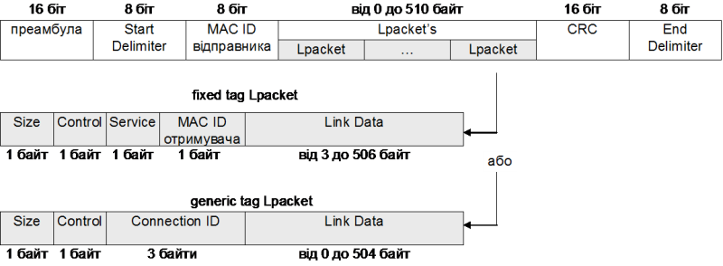
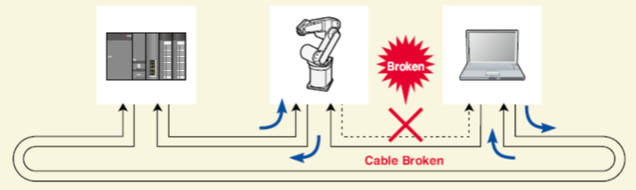
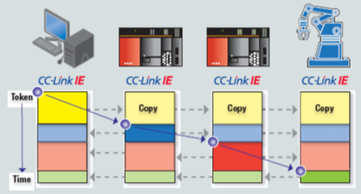
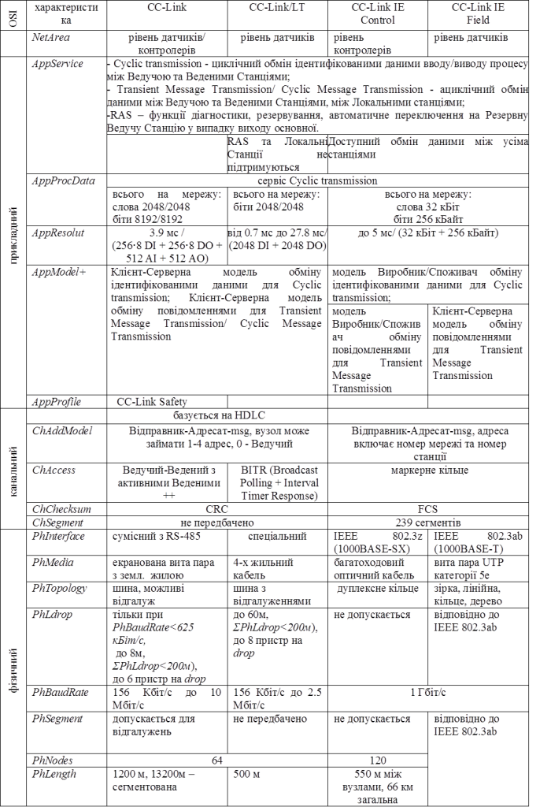

[Промислові мережі та інтеграційні технології в автоматизованих системах](README.md). [2. ЗАГАЛЬНА ХАРАКТЕРИСТИКА ПРОМИСЛОВИХ МЕРЕЖ](2.md) 2.5. [Короткий огляд промислових мереж](2_5.md)

### 2.5.11. Мережі CC-Link 

#### 2.5.11.1. Походження. 

Промислова мережа CC-Link (Control & Communication Link) розроблена Mitsubishi Electric в 1997 році. Для можливості інтеграції CC-Link з пристроями інших виробників в 2000-му році цей протокол став відкритим промисловим рішенням та підтримується організацією CLPA (CC-Link Partner Association). На сьогоднішній день CC-Link представлена в 4-рьох різних варіантів мереж:

-    CC-Link (Версія 1 та 2) для мереж рівня датчиків та контролерів;

-    CC-Link LT – CC-Link протокол адаптований для мереж рівня датчиків (живлення по мережі, метод доступу BITR, збільшена швидкодія, обмежена функціональність);

-    CC-Link Safety - комунікаційний та прикладний профіль для використання мережі CC-Link в функціонально небезпечних процесах;

- CC-Link IE (Industrial Ethernet) – яка базується на технології Gigabit Ethernet, та представлена двома рівнями:

  - CC-Link IE Control – мережа рівня контролерів;

  - CC-Link IE Field  – мережа рівня датчиків; 

Всі мережі об’єднують сервіси, які використовуються на прикладному рівні, що дозволяє будувати на базі CC-Link інтермережні структури (рис.2.45). Після створення CC-Link, виникла необхідність в розробці мережі низового рівня датчиків, що привело до появи CC-Link LT. Стрімкий розвиток Ethernet, а особливо поява Гігабітного Ethernet, дав можливість розробити високошвидкісну мережу CC-Link IE для рівня контролерів. Необхідність в простій інтеграції польового рівня до інформаційного рівня підприємства привела до створення в Mitsubishi Electric напрямку E-factory, результатом роботи якого стало створення CC-Link IE Field.  

CC-Link закріплений в стандарті МЕК.

 

Рис.2.45. Приклад інтермережі на базі CC-Link 

#### 2.5.11.2. Фізичний рівень CC-Link. 

CC-Link  базується на інтерфейсі сумісному з RS-485 та використовує шинну топологію. Метод кодування NRZI, максимальна кількість вузлів – 64, бітова швидкість від 156 Кбіт/с до 10 Мбіт/с, максим. довжина лінії зв’язку – 1200 м (при 156 кБіт/с), в обидвох кінцях лінії ставиться термінатор 110 Ом. Середовище передачі – спеціальний 3-х жильний екранований кабель (2-жил. інформ. вита пара + сигн. земля) з характеристичним хвильовим опором 110 Ом. При швидкостях, менших за 625 кБіт/с допускаються відгалуження від магістрального кабелю через спеціальні Т-подібні відгалужувачі. Максимальна довжина відгалужувачів 8 м, сумарна 200м (при 156 кБіт/с). 

#### 2.5.11.3. Канальний рівень CC-Link. 

Функціонування канального рівня схоже на функціонування Profibus DP. Використовується метод доступу по моделі Ведучий-Ведений з активними Веденими, в якому Ведучим пристроєм є контролер, а Веденими - периферійні пристрої на шині. Кожен вузол в мережі має унікальну адресу від 0 до 64, де 0-ва адреса зарезервована для Ведучого. Ведучий вміщує буфер вводу/виводу, який складається з 4-рьох частин: вхідні бітові дані (RX), вихідні бітові дані (RY), вхідні слова (RWr) та вихідні слова (RWw). Як і в Profibus DP, Ведучий в CC-Link зчитує вхідні дані (RX та RWr) з використанням полінгу, однак на відміну від нього відправляє вихідні дані (RY та RWw) в широкомовному (Broadcast) режимі одним кадром. Такий механізм в CC-Link називається Broadcast Polling.

Структура кадру базується на структурі HDLC. Інформаційна частина кадру може включати три частини: бітові дані, слова, ациклічні повідомлення (Transient Message). Коли кадр відправляє Ведучий, бітові дані та слова є вихідними даними, коли Ведений – вхідні. Обмеження області кадру для Ведучого: RY-256 байт, для RWw – 512 байт; для Веденого RX-16 байт, RWr – 32 байти.  

Для виділення своєї частини вихідних даних з загального кадру, кожному вузлу виділяється параметр - кількість заповнених станцій (Number of Occupied Stations). В залежності від типу та кількості входів/виходів, які використовуються даним вузлом йому виділяються від однієї до 4-рьох заповнених станцій. Сумарна кількість заповнених станцій в мережі не може перевищувати 64.  

#### 2.5.11.4. Прикладний рівень CC-Link. 

В CC-Link, в залежності від особливостей функціонування, всі вузли в мережі діляться на:

-    Ведуча Станція (Master Station);

-    Резервна Ведуча Станція (Standby Master Station);  

- Ведена Станція (Slave Station):

  - Локальна Станція (Local Station);

  - Інтелектуальна Станція (Intelligent Device Station )

  - Віддалена Станція (Remote Station)

- Віддалений пристрій (Remote Device Station, RX/RY+RW)

- Віддалена Станція дискретного вводу/виводу (Remote I/O Station, тільки RX/RY)

Основні Сервіси прикладного рівня забезпечують:

-  Cyclic transmission - автоматичний циклічний обмін ідентифікованими даними вводу/виводу процесу між Ведучою та Веденими Станціями;

- Transient Message Transmission/ Cyclic Message Transmission - ациклічний обмін даними між Ведучою та Веденими Станціями, між Локальними станціями;

- RAS – функції діагностики, резервування, автоматичне переключення на Резервну Ведучу Станцію у випадку виходу основної.   

Циклічний обмін даними процесу забезпечується канальними рівнем, через буфери вводу/виводу. Максимальний обсяг областей кадру визначає обмеження на загальну кількість Входів/Виходів в мережі: 256 вхідних регістрів, 256 вихідних регістрів, 2048 вхідних бітів та 2048 вихідних бітів. Однак в 2-й версії CC-Link став можливим обмін в декілька циклів (Extended Cyclic Transmission). Так дані з пристрою можуть бути фрагментовані і передаватись за 2, 4-ри або 8 циклів. За рахунок такої фрагментації, мережа з Ведучим та Веденими Станціями, що підтримують 2-гу версію протоколу, можуть забезпечити до 8192 RX, 8192 RY, 2048 RWw та 2048 RWr. 

Крім циклічного обміну ідентифікованими даними, CC-Link дає можливість ациклічно передавати повідомлення. Сервіс Cyclic Message Transmission дає можливість Ведучій Станції замість області даних передавати повідомлення іншій Станції по її адресі. Сервіс Transient Message Transmission для передачі повідомлення використовує відповідну виділену область кадру. Даним сервісом можуть користуватися Локальна або Інтелектуальна Станція для генерації запитів до Ведучої Станції. Тобто при полінгу Станції даного типу, в кадрі відповіді крім даних вводу/виводу Станція може передати запит. Можливістю формування запиту в повідомленні до Ведучої Станції Інтелектуальні та Локальні Станції відрізняються від Віддалених станцій. Локальні Станції можуть формувати запити не тільки Ведучій Станції, а і іншим Станціям.

CC-Link дає можливість резервування Ведучої Станції. Резервна Ведуча Станція в нормальному режимі функціонує як Локальна Станція (має адресу від 1 до 64).

#### 2.5.11.5. Фізичний рівень CC-Link IE Control. 

Дана мережа використовує технологію Гігабітного Ethernet. Вона базується на стандарті фізичного рівня IEEE 802.3z (1000BASE-SX), де в якості середовища передачі використовується мультимодовий оптичний кабель. Топологія – кільце: всі вузли послідовно з’єднуються дуплексним зв’язком таким чином, щоб замикалось кільце. Така топологія та інтегровані в вузли функції резервування дають можливість при обриві прямого каналу передачі, замкнути кільце на вузлі, де виявлений дефект.

Максимальна довжина кільця 66 км, в якій максимальна відстань між вузлами може досягати 550 м. Максимальна кількість вузлів на мережу – 120.  

Рис.2.46. Аварійне перемикання на зворотне кільце в CC-Link IE Control  

#### 2.5.11.6. Канальний рівень CC-Link IE Control. 

Для обміну даними між вузлами використовується механізм Загальної Мережної Пам’яті (Network Shared Memory) обсягом 256 Кбайт та маркерний метод доступу. Серед всіх вузлів виділяється Станція Управління (Control Station), яка слідкує за правильним циркулюванням маркеру. В початковому стані Станція Управління відправляє наступному в кільці вузлу кадр з маркером та даними Загальної Мережної Пам’яті, в якій частину даних відновила сама станція. Отримавши маркер, вузол змінює свою частину даних і відправляє кадр з маркером наступному вузлу і так далі. Останній вузол передає маркер Станції Управління тим самим замикаючи логічне кільце. Таким чином кожен вузол в мережі має доступ для читання до всіх даних Мережної Пам’яті та може змінити свою частину. При виходу з ладу Станції Управління, її функції може взяти на себе інший вузол в мережі. 

Рис.2.47. Принципи Обміну Загальною Мережною Пам’ятю в CC-Link IE Control   

#### 2.5.11.7. Прикладний рівень CC-Link IE Control. 

В CC-Link IE Control доступні ті самі сервіси прикладного рівня, що і в CC-Link. Циклічний обмін даними процесу (Cyclic transmission) реалізується через механізм Мережної Пам’яті. Враховуючи, що вихідні дані вузлу доступні всім іншим вузлам, можна вважати що даний сервіс функціонує по моделі Виробник-
 Споживач ідентифікованого обміну. 

Передача ациклічних повідомлень через Transient Message Transmission можлива за рахунок виділення частини Мережної Пам’яті під ациклічні повідомлення. Таким чином отримавши маркер вузол може передати повідомлення іншому вузлу. Формат повідомлення не обговорюється протоколом CC-Link IE, тому може служити в якості транспорту не тільки для прикладних Процесів CC-Link а і для інших протоколів (наприклад TCP/IP). Це дозволяє на базі мережі CC-Link IE Control одночасно з реал-тайм даними процесу функціонувати Intranet-технологіям. Слід зазначити, що ациклічні повідомлення прослухують всі вузли, що робить цей механізм ще гнучкішим. Функціонування даного сервісу можна описати моделлю Виробник-Споживач обміну повідомленнями.

CC-Link IE Control може функціонувати в одномережній або мультимережній архітектурі. В мультимережній архітектурі (до 239 мереж) кожна мережа та вузол в її межах мають унікальну адресу.    

#### 2.5.11.8. Фізичний рівень CC-Link IE Field. 

На фізичному рівні використовується Ethernet з бітовою швидкістю 1Гбіт/с (IEEE 802.3ab (1000BASE-T)) з середовищем передачі вита пара категорії 5е. Може використовуватись лінійна, зіркоподібна, кільцева, деревовидна чи змішана топологія. В якості з’єднувальних пристроїв допускається використання звичайних (некерованих) концентраторів (але не комутаторів 2-го рівня). Максимальна відстань між станціями – 100 м. 

#### 2.5.11.9. Канальний рівень CC-Link IE Field.  

Так саме як в CC-Link IE Control,  в CC-Link IE Field робота канального рівня базується на принципі Загальної Пам’яті та маркерного доступу до середовища. Однак на відміну від першої, в CC-Link IE Field дані Загальної Памя’ті не передається від вузла до вузла, а знаходяться у вхідних буферах всіх вузлів (Розподілена Пам’ять). При отриманні маркеру, вузол публікує свої дані (свою частину Пам’яті) в широкомовному режимі, і вони відновляються у вхідних буферах всіх вузлів.

Максимальна кількість мереж в мультимережній структруі – 239.

####  2.5.11.10. Прикладний рівень CC-Link IE Field.  

В CC-Link IE Field сервіси циклічного обміну даними процесу (Cyclic transmission) функціонують аналогічно CC-Link IE Control, і можуть бути описані моделлю Виробник- Споживач ідентифікованого обміну. 

Передача ациклічних повідомлень через Transient Message Transmission можлива за рахунок додаткового часу, виділеного при отриманні маркеру для ациклічних повідомлень. В цей час, вузол передає повідомлення вузлу-адресату, вказуючи його повну адресу: номер мережі та номер станції. Даний обмін можна описати моделлю Клієнт-Сервер обміну повідомленнями. 

Таблиця 2.22. Характеристики мереж CC-Link.   

 

\+ - моделі умовні

++ - модель умовна, в CC-Link називається Broadcast Polling 

<-- 2.5.10. [Мережі CIP: DeviceNet, ControlNet, Ethernet/IP та CompoNet](2_5_10.md) 

--> 2.6. [Вибір промислової мережі](2_6.md)