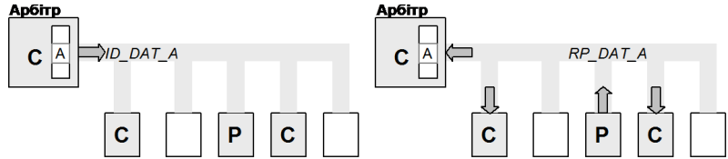
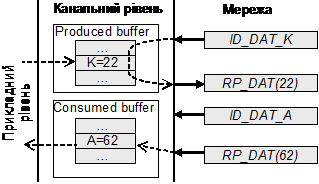
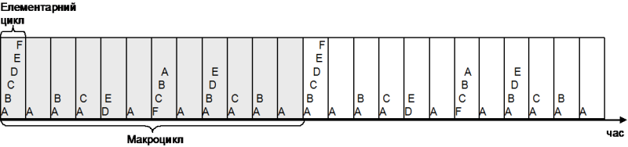
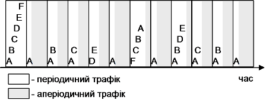

[Промислові мережі та інтеграційні технології в автоматизованих системах](README.md). [2. ЗАГАЛЬНА ХАРАКТЕРИСТИКА ПРОМИСЛОВИХ МЕРЕЖ](2.md) 2.5. [Короткий огляд промислових мереж](2_5.md)

### 2.5.2. Мережа World-FIP

#### 2.5.2.1. Походження. 

Протокол FIP (The Factory Information Protocol) є результатом колективних зусиль ряду європейських компаній (в основному, Франції, Бельгії й Італії) як альтернативне рішення до запропонованих американським ринком промислових мереж. Цей протокол націлений на високі швидкості передачі у чітко визначені інтервали відновлення даних. В 1986 році стандарт підтримується організацією із більш, ніж 100 членів, яка мала назву Club FIP. В 1993 році була створена організація WorldFIP, яка об’єднує великих світових виробників контролерів та мережного обладнання. Однойменний протокол внесений до стандартів МЕК.

#### 2.5.2.2. Фізичний рівень. 

На фізичному рівні для з’єднання використовується вита пара, або оптоволокно. Бітова швидкість вибирається з ряду: 31.25 кБіт/сек – мінімальна; 1 Мбіт/сек – стандартна; 2.5 Мбіт/сек – максимальна; 5 Мбіт/сек – при оптоволоконному з’єднанні. Топологія мережі – шина. Використовується синхронний інтерфейс з диференційною передачею по напрузі та манчестерським кодуванням.

#### 2.5.2.3. Канальний рівень. 

Як і в більшості мереж, для обміну даними в мережі WorldFIP, з точки зору користувача використовуються два типи сервісів:

-  періодичний та аперіодичний обмін даними процесу;

-  аперіодичний обмін параметричними даними;

Суттєва доля функціонування цих сервісів покладена на канальний рівень: прикладний рівень працює через мережний буфер, оновленням якого займається сутність канального рівня. Тому, наведені вище сервіси на канальному рівні підтримуються наступними сервісами:

-  періодичний обмін ідентифікованими змінними (для періодичного обміну даними процесу);

-  обмін ідентифікованими змінними по запиту (для аперіодичного обміну даними процесу по запиту);

-  обмін повідомленнями по запиту (для обміну параметричними даними).

На канальному рівні WorldFIP використовується гібридний метод адресації: для обміну ідентифікованими змінними використовується модель Виробник-Споживач-msg, а для обміну повідомленнями – Відправник-Адресат-msg.

Для доступу до шини використовується централізований метод з Арбітром, який слідкує за оновленням мережних періодичних та аперіодичних змінних а також за обміном повідомленнями. Сукупність періодичних змінних в буферах вузлів формують розподілену базу даних. Арбітр шини вміщує таблицю періодичних змінних у вигляді таб.2.7.

Таблиця 2.7. Приклад таблиці мережних змінних.

| Змінна | Періодичність відновлення (мс) | Тип     | Тривалість відновлення (мкс) |
| ------ | ------------------------------ | ------- | ---------------------------- |
| A      | 5                              | INT_8   | 170                          |
| B      | 10                             | INT_16  | 178                          |
| C      | 15                             | OSTR_32 | 418                          |
| D      | 20                             | SFPOINT | 194                          |
| E      | 20                             | UNS_32  | 194                          |
| F      | 30                             | VSTR_16 | 290                          |

На кожну змінну в цій таблиці підписуються Виробники (С - Consumer), які будуть відновлювати цю змінну, та Споживачі (Р - Producer), які будуть зчитувати її значення.Коли приходить час на відновлення даної змінної Арбітр відправляє широкомовний запит на відновлення цієї змінної: „ID\_DAT\_A”. Після цього канальний рівень Виробника (на рис.2.16 позначений як P) видасть з буферу значення змінної А в широкомовному режимі „RP\_DAT\_A”. Всі вузли, які підписані на цю змінну як Споживачі (на рис.2.16 позначені як C) відновлять її у своїх буферах обміну. 

Рис.2.16. Відновлення змінної А

Мережний буфер канального рівня кожного вузла складається з двох частин (рис.2.17): 

-     змінні, які виробляються: при запиті арбітра на одну з цих змін, станція передає її значення в мережу в широкомовному режимі;

-     змінні, які споживаються: відновлюються в буфері, коли виробники цих змінних передають їх значення.

Рис.2.17. Реалізація мережного буферу

З буфера в прикладну програму змінні зчитуються незалежно від роботи мережі.

Для різного часу відновлення періодичних змінних робота мережі ділиться на Макроцикли, які в свою чергу діляться на Елементарні цикли. Кожний елементарний цикл триває певний період часу. За цей період повинні відновитися всі періодичні змінні, в яких наступив період відновлення. За весь Макроцикл, будь яка змінна повинна бути відновлена як мінімум 1 раз (найповільніша). 

Наприклад, для змінних з таб.2.7. Макроцикл буде мати вигляд як на рис.2.18, тривати 60 мс і складатися з 12 Елементарних циклів. Змінна А буде відновлюватися з кожним Елементарним циклом (кожні 5 мс) а F – з кожним шостим Елементарним циклом. 

Рис.2.18. Організація Макроциклу

Час, який залишається до іншого елементарного циклу використовується для аперіодичних повідомлень (рис.2.19). Відновлення аперіодичних змінних та передача повідомлень забезпечується наступним чином. Коли прикладний рівень замовляє даний сервіс у канального рівня, при відновленні будь якої періодичної змінної даним вузлом (як Виробника), в кадрі буде передана мітка про замовлення аперіодичного трафіку, яку Арбітр помістить в чергу замовлень. При закінченні оновлення всіх змінних в Елементарному циклі, Арбітр з черги вибирає замовлення і надає право конкретному вузлу на формування запиту. Нагадаємо, що для обміну повідомленнями використовується модель адресації Відправник-Адресат-msg. 

Рис.2.19. Виділення аперіодичного трафіку 

#### 2.5.2.4.Прикладний рівень. 

Сервіси прикладного рівня діляться на три групи:

- ABAS (прикладні сервіси Арбітра шини)

- MPS (періодичні/аперіодичні сервіси виробництва)

- subMMS (піднабір сервісів повідомлень)

Сервіси ABAS забезпечують зв’язок з відповідними сервісами канального рівня. MPS забезпечує обмін значеннями періодичних змінних з буфером, та активації запиту для оновлення аперіодичної ідентифікованої змінної канальним рівнем при необхідності. Сервіси subMMS забезпечують передачу та активацію аперіодичних повідомлень іншому прикладному Процесу в мережі по адресі його вузла. 

Основні характеристики WorldFIP зведені в таб.2.8.

Таблиця 2.8. Характеристики WorldFIP.

| OSI        | характери-тика | WorldFIP                                                     |
| ---------- | -------------- | ------------------------------------------------------------ |
|            | NetArea        | рівень датчиків/контролерів                                  |
| прикладний | AppService     | MPS -періодичний та аперіодичний(по запиту) обмін даними процесу через мережнізмінні (через буфери пристроїв);  subMMS- аперіодичний обмін параметричними даними; управління станом вузлів;діагностичні сервіси;  ABAS - управління та резервування функцій Арбітру,функції резервування ліній зв’язку; |
| прикладний | AppModel       | - pull модель ідентифікованого обміну Виробник -Споживач для оновлення мережних змінних(обмін даними процесу)+;  - клієнт-серверна модель обміну повідомленнями для передачі аперіодичних повідомлень (обмін параметричними даними)++; |
| прикладний | AppProfile     | різні типи пристроїв (DeviceWorldFIP - DWF), визначені в AFNOR та CENELEC  різні профілі мереж (особливості фізичного рівня) |
| прикладний | AppProcData    | сервіс MPS циклічних змінних: залежить від реалізації        |
| прикладний | AppResolut     | для профілю FIPIO: 10 мс / 100 word+++;  для FIPWAY50 мс/128 word++++ |
| канальний  | ChAddMode      | - Виробник-Споживач-msg для мережних змінних - Відправник-Адресат-msg для аперіодичних повідомлень |
| канальний  | ChAccess       | централізований з Арбітром шини                              |
| канальний  | ChChecksum     | контрольна сума FCS                                          |
| фізичний   | PhInterface    | синхронний інтерфейс з манчестерським кодуванням по напрузі (IEC 61158-2) |
| фізичний   | PhMedia        | екранована вита пара хвил. опір 150 Ом;  оптоволокно;   |
| фізичний   | PhTopology     | шина;                                                        |
| фізичний   | PhLdrop        | враховується в PhLength= 3+PhLdrop+Ltrunk                    |
| фізичний   | PhBaudRate     | -31.25 кБіт/сек; 1 Мбіт/сек (стандартна); 2.5 Мбіт/сек;  -5 Мбіт/сек (оптоволокно); |
| фізичний   | PhSegment      | максимум 5 сегментів з’єднані репітерами                     |
| фізичний   | PhNodes        | 32 (96 на3-х сегментах)                                      |
| фізичний   | PhLength       | залежить від профілю мережі; <10000м (при 31.25 кБіт/с); загальна – до 50 км; термінатори 150 Ом на кінцях лінії; |
| фізичний   | PhSupply       | допускається< 35 В по окремій парі проводів                  |

\+ - умовна модель, в WorldFIP реалізовано через буфер канального рівня на базі моделі Producer-Consumer-msg

++ - умовна модель, в документації WorldFIP називається передачею повідомлень

+++ - дані орієнтовні, зроблені на базі розрахункових формул Шнейдер Електрик для 12 8-какнальних аналогових вхідних модулів Momentum; FIPIO враховує виділення невеликого трафіку на аперіодичні повідомленння

++++ - дані взяті з документів Шнейдер Електрик для розподіленої таблиці 128 слів на 32 пристрої; FIPWAY враховує виділення значного трафіку на аперіодичні повідомлення

<-- 2.5.1. [Мережа MODBUS RTU/ASCII та MODBUS TCP/IP](2_5_1.md). 

--> 2.5.3. [Мережа Foundation Fieldbus (FF)](2_5_3.md) 