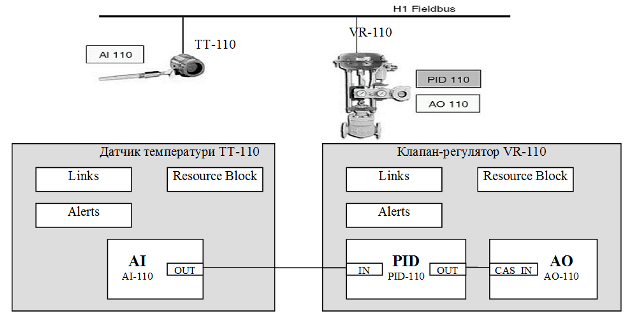
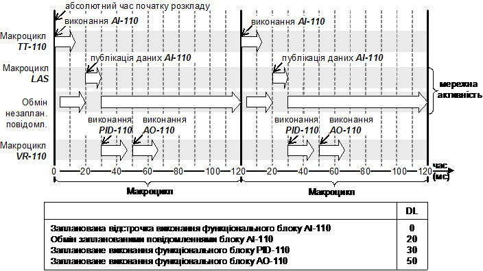

[Промислові мережі та інтеграційні технології в автоматизованих системах](README.md). [2. ЗАГАЛЬНА ХАРАКТЕРИСТИКА ПРОМИСЛОВИХ МЕРЕЖ](2.md) 2.5. [Короткий огляд промислових мереж](2_5.md)

### 2.5.3. Мережа Foundation Fieldbus (FF)

#### 2.5.3.1. Походження 

В другій половині 90-х років ряд компаній об’єднали свої зусилля для розробки єдиного стандарту промислової мережі, яка б вирішувала більшість типових задач, покладених на цифрові комунікації в області промислової автоматики. Так була створена організація Fieldbus Foundation, яка в рамках американської організації по стандартизації ISA розробила стандарт промислової мережі під назвою Foundation Fieldbus (FF). Організація Fieldbus Foundation створилась на базі двох груп InterOperable Systems Project (ISP) та WorldFIP North America, тому їх стандарт увібрав в себе елементи мереж WorldFIP та PROFIBUS. 

Технологія FF базується на 3-х рівнях моделі OSI: фізичний, канальний та прикладний. На сьогоднішній день FF представляє два типи мереж: H1 – мережа рівня датчиків на базі синхронного інтерфейсу зі швидкістю 31,25 КБіт/с, та HSE (High Speed Ethernet) – промислова мережа контролерного рівня на базі Ethernet. Мережі FF входять до стандарту МЕК.

#### 2.5.3.2. Фізичний рівень FF H1.

На фізичному рівні FF H1 використовується синхронна передача даних з використанням манчестерського коду. Для синхронізації використовується преамбула. Передавачі вузлів подають сигнал 10 мА з швидкістю передачі 31,25 КБіт/с на еквівалентне навантаження 50 Ом для створення амплітуди сигналу 1 Вольт, яке модульоване в верхній частині постійної напруги. Постійна напруга може приймати значення в діапазоні від 9 до 32 вольт. Однак для іскробезпечних застосувань допустима напруга живлення залежить від бар’єра іскрозахисту. Вузли на H1 можуть живитись від загальної шини. Крім того H1 при цьому може забезпечувати іскробезпечність, якщо в небезпечній зоні встановлюються бар’єри іскрозахисту.  

Топологія FF H1 може бути шинною або деревовидною. Сумарна довжина ліній зв’язку визначається швидкістю обміну, типом кабелю, перерізом проводу, енергоспоживанням пристроїв та необхідністю іскрозахисту. В кінцях лінії встановлюються термінатори з комбінації резистору та конденсатору.

#### 2.5.3.3. Канальний рівень FF H1.

Аналогічно більшості промислових мережі FF H1 забезпечує два типи обміну даними – періодичний обмін даними процесу та аперіодичний обмін параметричними даними. На підрівні доступу до середовища періодичне оновлення даних процесу забезпечується за рахунок організації доступу до шини вузлів згідно часового графіку, аперіодичний обмін повідомленнями – за рахунок періодичного полінгу вузлів. Для цього в FF Н1 виділяється вузол з правами Активного Планувальника Зв’язків (LAS), який забезпечує:

-     доступ вузлів до фізичного середовища на базі запланованих повідомлень (scheduled communication);

-     циркуляцію маркеру при необхідності обміну незапланованими повідомленнями (unscheduled communication); 

Пристрої які підтримують тільки базові функції FF Н1 (Basic Device) не можуть бути Активними Планувальниками Зв’язків. Ці функції доступні тільки для пристроїв типу Link Master.

LAS вміщує розклад передач вихідних буферів для всіх вузлів в мережі, місткість яких повинна передаватись періодично. Коли для пристрою настає час передачі вихідного буферу, LAS відсилає в цей пристрій повідомлення, яке називається Примусовою Розсилкою Даних (Compel Data - CD). Після отримання цього повідомлення пристрій публікує дані з буферу на шину в широкомовному режимі. Вузли з підпискою на ці дані, відновлюють їх в своєму буфері. 

Для виявлення дефектного вузлу, або добавлення нового LAS вміщує список активних вузлів на шині і періодично перевіряє їх наявність. Для цього LAS в час відсутності запланованих повідомлень, відправляє на кожний вузол повідомлення-маркер (Pass Token - PT). Якщо вузол відповідає, він залишається в списку активних вузлів (Live List). В момент отримання PT вузол може скористатися передачею "незапланованого" повідомлення або відповіді на повідомлення від іншого вузла. Для запобігання зависання маркеру на вузлі, для нього визначається таймаут. LAS також бере на себе функції публікування часу для синхронізації годинників вузлів. FF H1 дозволяє дублювати функцію LAS на іншому вузлі, у випадку виходу з ладу основного.

Як видно, функції вузла з правами LAS аналогічні функціям Арбітра шини в WorldFIP, особливо це характерно для періодичного оновлення даних. Однак для аперіодичного обміну повідомленнями на відміну від WorldFIP в FF H1 використовується механізм полінгу, який називається Live List. 

Всі вузи в мережі FF H1 повинні мати унікальну мережну адресу та тег пристрою. Адреси та теги кожному вузлу назначаються автоматично конфігураційною утилітою. При підключенні нового пристрою він отримує тимчасову адресу (248-251), після ідентифікації йому назначається нова адреса (16-247). Адреси з діапазону 252-255 використовуються для вузлів-програматорів.  Крім того, кожному пристрою в момент виготовлення надається унікальний 32-байтний ідентифікатор, який являється його апаратною адресою, аналогічною адресації МАС, і складається з коду виробника (6 байт), коду типу пристрою(4 байти), серійного номеру (22 байти). Цей ідентифікатор являється тегом пристрою по замовченню.

#### 2.5.3.4. Прикладний рівень FF H1

Прикладний рівень FF Н1 складається з двох підрівнів FAS (Fieldbus Access Sublayer) та FMS (Fieldbus Message Specification). Сервіси FAS (нижній підрівень) забезпечують функціонування сервісів FMS. Сервіси FAS визначені зв’язками VCR (Virtual Communication Relationship), які визначають тип обміну між прикладними Процесами, адресу даних джерела та даних адресату, спосіб та час їх відновлення. VCR налаштовується в момент конфігурування системи, і можуть бути одним із 3-х типів:

1. Клієнт-Сервер (Client-Server), які передаються від одного прикладного Процесу до іншого, як незаплановані повідомлення в черзі їх находження в буфері; коли вузол отримує маркер PT, він може відправити незаплановане повідомлення-запит або повідомлення-відповідь, яке адресується прикладному Процесу іншого вузла; 

2. Розсилка Звітів (Report Distribution), які ініціюються пристроями для передачі широкомовних повідомлень (наприклад аларми) по груповій адресі; ці VCR відновлюються як незаплановані повідомлення;

3. Видавець-Підписувач (Publisher-Subscriber), для оновлення буферизованих даних на пристроях; обмін цими VCR проводиться після отримання повідомлення CD, яке може розсилатися вузлом LAS, або відправитися підписувачами як незаплановане повідомлення.  

Сервіси FMS дозволяють програмам користувача обмінюватись між собою повідомленнями по промисловій мережі. FMS описує комунікаційні сервіси, формати повідомлень та протокол, необхідні для створення повідомлень для прикладного рівня. Дані, обмін якими проводиться через промислову мережу описуються за допомогою Описувача Об’єктів (Object Description), які об’єднані в структуру, що називається Словник Об’єктів (Object Dictionary). Кожен Описувач Об’єкту ідентифікується унікальним індексом в Словнику. 0-й індекс ("Заголовок Словнику") вказує на номер першого індексу Описувачів Об’єкту Прикладного Рівня (див. рівень користувача FF H1), який може починатися з 256-го. 

Для віддаленого доступу до даних конкретного пристрою, що описуються Описувачем Об’єктів, використовуються Віртуальні Польові Пристрої VFD (Virtual Field Device). Кожний фізичний пристрій включає як мінімум два VFD: Network and System Management VFD (дані NMIB та SMIB) та User Application VFD (дані FBAP). Комунікаційні дані NMIB включають VCR, розклад LAS. Системні дані  NMIB включають інформацію про тег пристрою, його адресу, розклад виконання функціональних блоків (див. рівень коритсувача). FBAP надає доступ до даних функціональних блоків. 

Таким чином маніпуляція даними кожного вузла проходить з використанням сервісів FMS, які підтримуються зв’язками VCR. Ряд зв’язків VCR типу Клієнт-Сервер зарезервовано для доступу з боку конфігуратора. Використовуючи різні сервіси FMS для цих VCR, конфігуратор доступається до даних NMIB, SMIB та FBAP, тим самим конфігуруючи функціонування кожного вузлу, включаючи добавлення нових VCR. До базових функцій сервісів FMS відносяться: управління VCR; доступ до словнику об’єктів; доступ до змінних; обробка подій; вигрузка/загрузка даних та програм; дистанційне управління роботою програми/

Опис FF H1 не закінчується на сервісах прикладного рівня. Його родзинкою є опис рівня користувача, який уніфікує і значно спрощує інтеграцію різних пристроїв на Н1.   

#### 2.5.3.5. Рівень користувача FF H1 та FF HSE. 

В мережній моделі FF на відміну від OSI, над прикладним рівнем існує прикладний рівень користувача (User Application), який дозволяє уніфікувати процес інтеграції засобів від різних виробників, використовуючи однаковий інтерфейс для користувача. Даний інтерфейс є графічним і представляє собою організацію процесу управління всією системою з використанням так званих блоків. Пристрої конфігуруються за допомогою блоків ресурсів та блоків перетворювача, а стратегія управління формується за допомогою функціональних блоків. Дані про ці блоки розміщуються в FBAP, які разом з описувачами розміщуються в User Application VFD. 

Блок ресурсу (Resource Block) вміщує характеристики польового пристрою, такі як ім’я пристрою, ім’я виробника та серійний номер. В кожному пристрої є тільки один блок ресурсу. Функціональні блоки (Function Block) забезпечують поведінку системи управління. Параметри входів та виходів функціональних блоків можуть бути зв’язані по промисловій мережі за допомогою VCR типу Видавець-Підписувач. Для кожного функціонального блоку запланований точний час його виконання. В одній прикладній програмі користувача може бути декілька функціональних блоків. Організацією Fieldbus Foundation визначений набір стандартних функціональних блоків. Перелік цих функціональних блоків наведений в табл.2.9.

Таблиця 2.9 Перелік функціональних блоків

| Символ | Ім’я                             | Призначення                | Символ | Ім’я                     | Призначення                                                  |
| ------ | -------------------------------- | -------------------------- | ------ | ------------------------ | ------------------------------------------------------------ |
| AI     | Analog Input                     | Аналоговий ввід            | LL     | Lead Lag                 | Випередження/запізнювання                                    |
| AO     | Analog Output                    | Аналоговий вивід           | DT     | Deadtime                 | Час нечутливості                                             |
| BG     | Bias/Gain                        | Зміщення/Підсилення        | IT     | Integrator (Totalizer)   | Інтегратор (тоталізатор)                                     |
| CS     | Control Selector                 | Селектор входів управління | SPG    | Setpoint  Ramp Generator | Генератор уставок                                            |
| DI     | Discrete Input                   | Дискретний вхід            | IS     | Input  Selector          | Селектор входів                                              |
| DO     | Discrete Output                  | Дискретних вихід           | AR     | Arithmetic               | Арифметичний                                                 |
| ML     | Manual Loader                    | Операторський ввід         | TMR    | Timer                    | Таймер                                                       |
| PD     | Proportional/Derivative          | ПД регулювання             | AAL    | Analog Alarm             | Аналоговий сигнал тривоги                                    |
| PID    | Proportional/Integral/Derivative | ПІД регулювання            | MAI    | Multiple Analog Input    | Багатоканальний аналоговий вхід                              |
| RA     | Ratio                            | Відноешння                 | MAO    | Multiple Analog Output   | Багатоканальний аналоговий вихід                             |
| DC     | Device Control                   | Управління пристроєм       | MDI    | Multiple Discrete Input  | Багатоканальний дискретний вхід                              |
| OS     | Output Splitter                  | Розгалуджувач виходів      | MDO    | Multiple Discrete Output | Багатоканальний дискретний вихід                             |
| SC     | Signal  Characterizer            | Характеризація сигналу     | FFB    | Flexible  Function Block | гнучкий функціональний блок для написання прикладної  програми |

Блоки перетворювача. Блоки перетворювача (Transducer Blocks) перетворювачів вміщують таку інформацію, як дата калі бровки, тип та параметри датчику. Тобто саме через ці блоки проводиться параметризація, калібровка та діагностика пристрою.

Крім описаних блоків, на прикладному рівні визначені наступні об’єкти:

-     зв’язок (Link), які визначають зв’язки між входами та виходами функціональних блоків всередині пристроїв та через промислову мережу;

-     тренд (Trend), які дозволяють локально накопичувати значення параметрів функціональних блоків для передачі їх на верхній рівень управління, чи іншим пристроям;

-     тривога (Alert), які дозволяють виводити повідомлення про тривоги та події на промисловій мережі;

-     контейнер множини змінних (Multi-Variable container, MVC), які дозволяють накопичувати множину параметрів функціональних блоків для оптимізації зв’язку, виконання транзакцій "Видавець-Підписувач" та "розсилання звітів"; він включає сконфігурований користувачем список для визначення необхідних параметрів, значення яких наведені в списку змінних;

-     вид (View), які представляють собою попередньо визначені групи наборів параметрів блоків, які можуть використовуватися людино-машинним інтерфейсом; специфікація визначає чотири види кожного типу блоку, а саме: оперативні динамічні дані (VIEW_1), оперативні статичні дані (VIEW_2), всі динамічні дані (VIEW_3), інші статичні дані (VIEW_4);

Процес конфігурування системи на рівні користувача зводиться до створення стратегії управління за допомогою мови програмування графічної блок-схеми FOUNDATION. Тобто це визначення функціональних блоків та зв’язків між ними, аналогічно мові FBD з МЕК 61131-3. За допомогою спеціального програмного забезпечення - конфігруатора FF, ці функціональні блоки проектуються на конкретні пристрої (рис.2.20). Так, наприклад, простий датчик температури з підтримкою FF може вміщувати функціональний блок аналогового вводу (AI), а позиціонер регулюючого клапану може вміщувати функціональний блок ПІД-регулятору (PID) та блок аналогового виводу (AO). Таким чином, функціонально закінчений контур регулювання може бути побудований з використанням одного датчику та одного клапану. Слід зазначити, що при проектуванні системи необхідно врахувати наявність конкретного функціонального блоку в польових пристроях FF. Доступ до ресурсів конкретного вузла проводиться через Словник Об’єктів User Application VFD. 

Рис.2.20. Приклад програми на графічній блок-схемі FOUNDATION.

Кожний блок в створеній програмі повинен виконуватися в чітко заданий момент часу. Для цього пристрої в мережі починають обробляти кожний функціональний блок в чітко визначені моменти зсуву відносно часу початку розкладу, який для всіх вузлів однаковий. Для циклічності функціонування програм, всі прикалдні Процеси функціонують в контексті так званих Макроциклів, які починаються з початком розкладу. В межах Макроциклу необхідно вчасно відновлювати значення для входів функціональних блоків. Якщо входи пов’язані з виходами функціональних блоків інших вузлів, ці значення повинні бути відновлені мережними засобами. Тому всі мережні інформаційні зв’язки функціональних блоків організовані через VCR типу Видавець-Підписувач, які відновлюються за розкладом в межах того ж Макроциклу. За обробкою функціональних блоків слідкує пристрій, а за відновленням мережних даних тобто за відновлення VCR слідкує LAS.

На рис.2.21 показане функціонування мережі з рис.2.20 на базі Макроциклів. В таблиці під рисунком вказані зміщення часу запуску виконання функціональних блоків (DL) відносно абсолютного часу початку розкладу.  Управління в датчику ініціює виконання функціонального блоку AI-110 з зсувом по часу DL=0. З зсувом DL=20, LAS відправляє повідомлення про примусову розсилку даних (CD) блоку АІ-110, які публікуються на шину. Ці дані будуть відновлені у вхідному буфері підписаного на них PID-110. З зсувом DL=30 управління системою в клапані ініціює виконання функціонального блоку PID-110, після якого з зсувом DL=50 виконується функціональний блок АО-110. Потім ця послідовність повторюється, забезпечуючи тим самим постійну динаміку контуру регулювання. Для роботи системи по загальному запланованому часу, в FF періодично проводиться синхронізація по часу, яка відбувається з використанням публікування часу одним вузлом. 

Рис.2.21. Функціонування FF на базі Макроциклів

Протягом всього часу, окрім інтервалу часу між зсувом 20 та 30, по мережі може проводитися обмін незапланованими повідомленнями. Слід зазначити, що наявність вузла з функціями LAS характерна для FF H1, для FF HSE передача по мережі проходить відразу по необхідності, а не по запланованій основі, однак виконання функціональних блоків проходить таким же чином.  

#### 2.5.3.6. Функціонування FF HSE.

FF HSE (High Speed Ethernet) представляє собою промислову мережу, що базується на стеку протколів Ethernet TCP/IP, яка використовується для високошвидкісних систем управління, або для поєднання декількох сегментів FF H1. В HSE використовується такий саме рівень користувача, як і в Н1. На прикладному рівні використовується протокол FDA (Field Device Access).

В структурі HSE можуть функціонувати чотири категорії пристроїв: 

-     пристрої зв’язку (LD - Link Device), які служать для з’єднання мереж FF HSE з FF H1; вони передбачають наявність шлюзових служб, які передають повідомлення FDA (SM та FMS) в їх прототипи H1;

-     пристрої Ethernet (ED - Ethernet Device), які можуть виконувати функціональні блоки та можуть мати декілька типових пристроїв вводу/виводу;

-     шлюзові пристрої (GD - Gateway Device), які забезпечують інтерфейс FF HSE до інших протоколів мереж (Modbus, DeviceNet, Profibus);

-     головні пристрої (HD - Host Device), до яких відносяться конфігуратори, операторські робочі станції, які не відносяться до рівня HSE, але вміють зв’язуватися з пристроями HSE. 

Основні характеристики FF H1 та FF HSE зведені в таб.2.10.

Таблиця 2.10 Характеристики FF H1 та FF HSE.

| OSI        | Характери-тика | FF H1                                                        | FF HSE                                                       |
| ---------- | -------------- | ------------------------------------------------------------ | ------------------------------------------------------------ |
|            | NetArea        | рівень датчиків                                              | рівень контролерів                                           |
| прикладний | AppProfile     | визначений через  рівень користувача, типові функціональні блоки; функціонування алгоритмів  управління процесом через інтелектуальні функції вузлів; | визначений через  рівень користувача, типові функціональні блоки; функціонування алгоритмів  управління процесом через інтелектуальні функції вузлів; |
| прикладний | AppService     | сервіси підрівня FMS:   періодичний та  аперіодичний(по запиту) обмін даними процесу між функціональними блоками  вузлів через Словник Об’єктів; програмування та конфігурування вузла;  управління станом вузлів; діагностичні сервіси; функції резервування; | сервіси підрівня FMS:   періодичний та  аперіодичний(по запиту) обмін даними процесу між функціональними блоками  вузлів через Словник Об’єктів; програмування та конфігурування вузла;  управління станом вузлів; діагностичні сервіси; функції резервування; |
| прикладний | AppService     |                                                              | доступ до FF H1 через шлюзові пристрої                       |
| прикладний | AppModel+      | реалізовані через різні  типи VCR    - pull Видавець-Підписувач  ідентифікованого обміну (VCR  Publisher-Subscriber)   - push Видавець-Підписувач  обміну повідомленнями (VCR розсилка  звітів)   - клієнт-серверний  обмін повідомленнями (VCR  Client/server) | - push Видавець-Підписувач ідентифікованого обміну для періодичного/  аперіодичного обміну даними процесу   - клієнт-серверний  обмін повідомл для параметричних даних |
| прикладний | AppProcData    | VCR Publisher-Subscriber: обмежується  кількістю VCR на кожен пристрій в мережі | VCR Publisher-Subscriber: обмежується  кількістю VCR на кожен пристрій в мережі |
| прикладний | AppResolut     | залежить від конфігурації системи та пристроїв;  типовий час Макроциклу 250мс -2с+++ | залежить від конфігурації системи та пристроїв;  типовий час Макроциклу 250мс -2с+++ |
|            | TpService      | не  визначений                                               | визначені протоколом TCP                                     |
|            | NtService      | не  визначений                                               | визначені протоколом IP                                      |
| канальний  | ChAddMode  ++  | Відправник-Адресат-msg (VCR Client/Server);  Виробник-Споживач-msg (VCR Publish/Subscribe, VCR Report/Distribution) | Відповідно до протоколу EthernetІІ/IEEE 802.2/3              |
| канальний  | ChAccess       | з Арбітром (Активний Планувальник Зв’язків - LAS)            | Відповідно до протоколу EthernetІІ/IEEE 802.3                |
| фізичний   | PhInterface    | синхронний інтерфейс, модуляція постійної напруги,  манчестерське кодування | Відповідно до протоколу EthernetІІ/IEEE 802.3                |
| фізичний   | PhMedia        | екранована вита пара                                         | Відповідно до протоколу EthernetІІ/IEEE 802.3                |
| фізичний   | PhTopology     | шина/дерево                                                  | Відповідно до протоколу EthernetІІ/IEEE 802.3                |
| фізичний   | PhLdrop        | <120 м (при PhNodes<12), <1 м (при PhNodes>25), PhLength= Σ PhLdrop+Ltrunk | Відповідно до протоколу EthernetІІ/IEEE 802.3                |
| фізичний   | PhBaudRate     | 31.25 кБіт/с                                                 | Відповідно до протоколу EthernetІІ/IEEE 802.3                |
| фізичний   | PhSegment      | 5 сегментів, термінатори в кінцях лінії (100 Ом +  1мкФ)     | Відповідно до протоколу EthernetІІ/IEEE 802.3                |
| фізичний   | PhNodes        | 32 (12 – при подачі  живлення, 6 – при подачі живлення для функц. небезпечних застосув.) | Відповідно до протоколу EthernetІІ/IEEE 802.3                |
| фізичний   | PhLength       | 1900 м (кабель типу А),  9600 м сегментована                 | Відповідно до протоколу EthernetІІ/IEEE 802.3                |
| фізичний   | PhSupply       | до  30 В по інформаційній парі проводів                      | Відповідно до протоколу EthernetІІ/IEEE 802.3                |

\+ - умовна модель, в дужках вказана назва відповідно до документів FF 

++ - умовна модель, в документах FF назви моделей відсутні

+++ - враховується час трафіку, час виконання FB, 50% виділяється для незапланованих повідомлень

<-- 2.5.2. [Мережа World-FIP](2_5_2.md) 

--> 2.5.4. [CAN та CANOpen](2_5_4.md) 