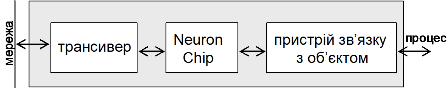
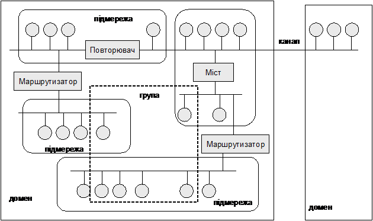
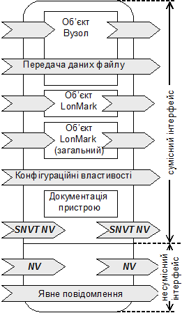
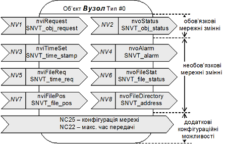
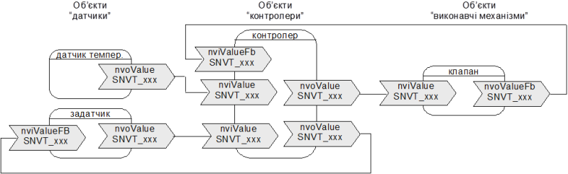

[Промислові мережі та інтеграційні технології в автоматизованих системах](README.md). [2. ЗАГАЛЬНА ХАРАКТЕРИСТИКА ПРОМИСЛОВИХ МЕРЕЖ](2.md) 2.5. [Короткий огляд промислових мереж](2_5.md)

### 2.5.5. Мережа LonWorks

#### 2.5.5.1. Походження. 

Ідея рішення LonWorks (“Local Operating Network Technology” або просто "LON") заключається в тому, що всі абоненти мережі мають в своєму розпорядженні власні інтелектуальні пристрої управління і можуть приймати рішення по місцю, без використання центрального контролеру. Вузлами мережі можуть бути регулюючі пристрої, датчики, комп’ютери, комунікаційні пристрої і т.п. Технологія LonWorks належить американській фірмі “Echelon Corporation”, яка була заснована в 1986 році. На сьогоднішній день LON підтримують: в США – асоціація “LONMARK Interoperability Association”, в Німеччині  - “LON Nutzer Organisation e.V.”  (LNO).

#### 2.5.5.2. Структура LON-вузла. 

В кожен вузол LON-мережі вбудований чіп "Neuron-Chip", який спеціально розроблений для технології LonWorks (рис.2.22). В цей чіп закладені програмні засоби: програма застосування, що забезпечує функціонування вузла в процесі застосування; операційна система, яка формує та реалізує комунікаційні функції. Для зв’язку між мережними вузлами застосовується протокол LonTalk, який теж прописаний в чіпі. Протокол LonTalk описаний на всіх 7-мих рівнях моделі OSI.

 Для конфігурування мережних вузлів та їх взаємодії використовуються спеціалізовані програмні засоби, які через LON-мережу доступаються до операційної системи кожного Neuron-Chip. 

Рис.2.22. Структура LON-вузла

#### 2.5.5.3. Фізичний рівень. 

На фізичному рівні протокол LonTalk базується на мережах з сегментами, які підтримують різні середовища передачі. Сегмент, що побудований на одному середовищі в LON називається Каналом. В якості середовища передачі можуть виступати: вита пара, силова проводка, радіочастота, інфракрасні трансивери, коаксіальний кабель, оптоволокно. Канали в мережі об’єднуються за допомогою маршрутизаторів. 

LON підтримує декілька різних типів трансиверів та відповідних методів функціонування Neuron-Chip та кодування даних, що залежать від середовища передачі: 

-    вбудований в Neuron-Chip трансивер з безпосереднім диференційним режимом функціонування Neuron-Chip (Differential Direct Mode) призначений для використання його при підключенні по витій парі без необхідності зовнішнього трансиверу; в даному режимі теж використовується диференційне манчестерське кодування;

-    зовнішній неінтелектуальний трансивер з безпосереднім уніполярним режимом функціонування Neuron-Chip (Single-ended Direct Mode) використовується при роботі через радіоканал, інфрачервоний порт, з оптоволокном, коаксіальним кабелем або іншими типами кабелів; в даному режимі використовується диференційний манчестерський код;

-    зовнішній інтелектуальний трансивер зі спеціальним режимом функціонування Neuron-Chip (Special Purpose Mode), призначений для роботи з такими типами середовища передачі, що потребує особливого перетворення або модуляції, наприклад при підключенні до силової проводки; в даному режимі використовується прямий метод кодування NRZ;

Використання диференційного манчестерського коду разом з витою парою дає можливість не враховувати полярність при підключенні.

Топологія мережі, швидкість передачі даних, довжина ліній зв’язку, максимальна кількість вузлів, схеми термінування, споживаний мережею струм залежать від трансивера та середовища передачі. При передачі по витій парі, ці параметри зведені в табл. 2.13. Шинна топологія потребує двох термінуючих резисторів в кінці, вільна топологія – одного. 

Таблиця 2.13. Параметри передачі

| Продукт    | Швидкість передачі | Топологія | Вузлів | Відстань,  м | Тип                   |
| ---------- | ------------------ | --------- | ------ | ------------ | --------------------- |
| TP/XF-78   | 78 кБіт/с          | Шинна     | 64     | 1400         | Ізольований трансивер |
| TP/XF-1250 | 1,25 Mбіт/с        | Шинна     | 64     | 130          | Ізольований трансивер |
| FTT-10A    | 78 кБіт/с          | Шинна     | 64     | 2700         | Ізольований трансивер |
| FTT-10A    | 78 кБіт/с          | Вільна    | 64     | 500          | Ізольований трансивер |
| LPT-10     | 78 кБіт/с          | Шинна     | 128    | 2200         | Для силової мережі    |
| LPT-10     | 78 кБіт/с          | Вільна    | 128    | 500          | Для силової мережі    |

#### 2.5.5.4. Канальний рівень.  

MAC-процесор, що вбудований в Neuron-Chip, забезпечує управління доступом до середовища передачі. В протоколі LonTalk використовується алгоритм доступу до середовища predictive p-persistent CSMA, який розглянутий вище. Доставка даних проходить в широкомовному режимі, визначення вузла призначення визначається на мережному рівні.

#### 2.5.5.5. Мережний рівень. 

Кожен вузол в мережі при конфігурації отримує свій унікальний ідентифікатор – адресу LonTalk, що складається з адреси домену, підмережі та вузла. Домен – це логічний набір вузлів, що може включати декілька каналів (сегментів). Обмін даними між вузлами різних доменів неможливий. Якщо на одному каналі є вузли з різними доменними адресами, вони знаходяться в різних віртуальних мережах. Адреса домену може складатися з 0,1,3 або 6 байтів. Підмережа – це логічне об’єднання до 127 вузлів і вважається логічним каналом. В одному домені може бути до 255 підмереж. Обмін даними між вузлами підмереж проводиться за допомогою маршрутизаторів LON.  Адреса вузла – це унікальний номер вузла в підмережі. Коли вузол логічно присутній в декількох підмережах, він має ту саму адресу в усіх підмережах. Для можливості групової адресації, вузли можуть об’єднуватися в логічні групи, незалежно від їх фізичного розташування. Один вузол може бути членом до 15 груп. В одному домені маже бути до 256 груп.

Рисунок 2.23 показує приклад логічної адресації та фізичної топології в мережі LON. Як видно, маршрутизатори не являються членами підмережі. Мости з’єднують канали та підмережі.

 

Рис.2.23. Фізична топологія та логічна адресація в мережі LONWorks

Повна адреса вміщує і адресу відправника, і адресу отримувача в одному з п’яти адресних форматів (таб.2.14). Він є частиною пакету мережного рівня.  

Для адресації вузлів може використовуватися NeuronID – унікальний 48-бітний ідентифікатор, що назначається вузлу на етапі виробництва. Як правило ця адреса використовується при першому використанні даного вузла, наприклад для його конфігурування. Тим не менше цей ідентифікатор може використовуватись при адресації вузла разом з адресою домену та підмережі.

Таблиця 2.14. Формат адреси

| №    | Формат адреси                                   | Розмір адреси | Пункт призначення                                  |
| ---- | ----------------------------------------------- | ------------- | -------------------------------------------------- |
| 0    | Домен (під  мережа=0)                           | 3             | Всі вузли в  домені                                |
| 0    | Домен – підмережа                               | 3             | Всі вузли в  підмережі                             |
| 1    | Домен – група                                   | 3             | Всі вузли в групі                                  |
| 2а   | Домен – підмережа  - вузол                      | 4             | Один вузол в  підмережі                            |
| 2b   | Домен – підмережа  – вузол – група – член групи | 6             | Всі вузли групи  (повинні відіслати підтвердження) |
| 3    | Домен – Neuron-ID                               | 9             | Конкретний вузол  з Neuron-ID                      |

#### 2.5.5.6. Транспортний рівень. 

Протокол LonTalk надає 4-ри типи сервісів доставки даних:

1. сервіс з підтвердженням - забезпечує зв’язок між транспортними сутностями двох або більше вузлів, який вимагає підтвердження про отримання даних від кожного вузла-отримувача (надійний, гарантує доставку даних); 

2. сервіс без підтвердження - дані відправляються на декілька вузлів один раз, отримання даних транспортною сутністю вузла-отимувача не контролюється (ненадійний, для швидкої передачі великих обсягів даних, не критичних до надійності доставки);

3. сервіс без підтвердження з повтореннями – дані відправляються на декілька вузлів декілька раз, без очікування підтвердження про доставку (ненадійний, для доставки даних великій кількості вузлів);

4. сервіс запит/відповідь – забезпечує взаємодію прикладних Процесів вузлів по моделі Клієнт-Сервер; дані відправляються на один або декілька вузлів (повідомлення-запит), обробляються там, повертається підтвердження (повідомлення-відповідь) (надійний, гарантує доставку даних та повертає відповідь);

Функціонування перших трьох типів сервісів – задача транспортного рівня, сервісу "запит-відповідь" – сеансового. 

Для слідкування за послідовністю та кількістю TPDU пакетів, в їх заголовку вказується ідентифікатор транзакцій, який з кожною відправкою збільшується на одиницю.

#### 2.5.5.7. Сеансовий рівень. 

На даному рівні визначаються такі задачі: реалізація сервісу "запит-відповідь"; авторизація (захист від несанкціонованого доступу); сервіси мережного менеджменту та мережного інтерфейсу. 

#### 2.5.5.8. Рівень представлення даних. 

В кожному заголовку APDU вміщується інформація про інтерпретацію повідомлень, які надсилаються. Доступні наступні типи повідомлень:

- вхідна мережна змінна;

- вихідна мережна змінна;

- явне повідомлення;

- зовнішнє повідомлення (використовується для шлюзів LonWorks);

- повідомлення мережної діагностики;

- повідомлення мережного менеджменту;

- повідомлення для сервісів "запит-відповідь". 

#### 2.5.5.9. Прикладний рівень. 

Разом з рівнем представлення даних прикладний рівень забезпечує функціонування 5-ти сервісів:

1. Обмін мережними змінними. Функціонування даного сервісу базується на концепції загальних мережних змінних (NV). Кожний вузол може використати вхідні для нього мережні змінні для керування прив’язаним для нього процесом управління. Значення кожної мережної змінної може змінити тільки один вузол, для якого ця мережна змінна є вихідною. Так, наприклад, датчик температури може змінювати значення вихідної для нього мережної змінної, записуючи туди плинне значення температури. Виконавчий механізм, що регулює подачу теплоагенту, приймає цю змінну в якості вхідної, і подає її значення на вимірювальний вхід вбудованого ПІ-регулятору, що забезпечує стабілізацію цієї температури. За допомогою програмного LON конфігуратору розробник системи забезпечить зв’язок вихідних змінних одних вузлів з вхідними інших.

2. Обмін явними повідомленнями. Цей тип сервісу забезпечує передачу повідомлень які мають вільний формат, відмінний від формату мережних змінних NV. Він передбачає обробку повідомлень по програмі користувача, що не прописано в протоколі прикладного рівня і може бути використаний для аперіодичного/періодичного обміну даними процесу.

3. Обмін зовнішніми повідомленнями. Використовується для шлюзу LonTalk при передачі даних між двома зовнішніми вузлами.

4. Сервіси мережного менеджменту. Забезпечують інсталяцію, конфігурування вузлів, загрузку прикладних програм, управління станом вузла. 

5. Сервіс мережної діагностики. Сервіс використовується для тестування вузлів.     

Процес зв’язку мережних змінних забезпечується при конфігуруванні системи. В кожному NeuronChip є таблиця конфігурацій мережних змінних, яка може вміщувати до 62 записів. Кожен запис характеризує конкретну мережну змінну вузла: тип, вхідна/вихідна, пріоритет, служба, селектор змінної (умовний ідентифікатор зв’язку) та адреса вузла з яким зв’язана дана змінна. Таким чином, кожен вузол може мати до 62 мережних змінних. 

####  2.5.5.10. Інтерфейс прикладного рівня. 

Зв’язок між прикладними Процесами вузлів та їх конфігурування забезпечується через два типи інтерфейсів прикладного рівня: сумісний та несумісний інтерфейс (рис.2.24).

Сумісний інтерфейс дещо схожий на інтерфейс прикладного рівня FF. Він базується на стандартизованих LonMark об’єктах, які надають вузлу певну функціональність. З одного боку, сумісний інтерфейс використовується для обміну даними між цими об’єктами на різних вузлах, через стандартні типи мережних змінних (SNVT). З іншого боку, цей же інтерфейс надає можливість використання визначеного механізму конфігурування вузла через набір стандартних типів конфігураційних параметрів (SCPT). Передача конфігураційних параметрів а також програми проводиться за допомогою механізму передачі файлових даних, що використовує сервіси мережного менеджменту. 

Рис.2.24. Інтерфейс прикладного рівня LONWorks

Поряд з сумісним інтерфейсом вузол може підтримувати несумісний інтерфейс, який дозволяє визначати специфічну поведінку вузла. Обмін між прикладними Процесами вузлів через несумісний інтерфейс проводиться через явні повідомлення (Explicit Exchange) або мережні змінні типу користувача.    

В сумісному інтерфейсі всі об’єкти LonMark діляться на: об’єкти загального призначення, що використовуються в широкому спектрі задач (наприклад об’єкт "датчик з відкритим циклом"), та спеціалізовані об’єкти (наприклад об’єкт "датчик температури", "датчик тиску"). В будь якому випадку об’єкт LonMark визначається набором мережних змінних SNVT та конфігураційних параметрів SCPT. Кожна мережна змінна SNVT має функціональне текстове ім’я, яке не може перевищувати 11 символів. Перші три символи тобто префікс назви змінної вказують на клас та напрямок мережної змінної: nvi – вхідна мережна змінна, запам’ятовується в RAM;  nvo – вихідна мережна змінна, запам’ятовується в RAM; nci – вхідна конфігураційна мережна змінна, запам’ятовується в EEPROM; nro – вихідна мережна змінна, запам’ятовується в ROM. При конфігуруванні системи, мережні змінні "поєднують", що приводить до появи нових записів в таблиці конфігурацій мережних змінних. Слід зазначити, що мережні змінні об’єктів не обов’язково повинні бути використані.

Розглянемо декілька об’єктів сумісного інтерфейсу. Для управління вузлом в цілому використовується спеціальний тип об’єкту "Вузол" (Node тип#0), наявність якого є обов’язковою для всіх вузлів що мають сумісний інтерфейс. В склад об’єкту входять дві обов’язкові мережні змінні (nviRequest та nvoStatus) та декілька опціональних (рис.2.26). Змінна nviRequest дозволяє управляти станом об’єктів вузла та робити запит на отримання статусної інформації про них, яка передається через вихідну змінну nvoStatus.   

Рис.2.26. Графічне представлення об’єкту "Node"

Об’єкт "датчик" призначений для отримання інформації з вузлів, які мають в своєму складі аналоговий або дискретний датчик. Через вихідну змінну nvoValue інформація про вимірювальну величину попадає в мережу. Об’єкт "виконавчий механізм" має вхід nviValue, який може управлятися такими об’єктами як "датчик" або "контролер". Об’єкти "датчик" та "виконавчий механізм" можуть бути двох типів: з відкритим або закритим циклом. "Датчики" з закритим циклом (тип#2) мають в своєму складі входи nviValueFB для підключення зворотного зв’язку від "виконавчого механізму". "Виконавчі механізми" з закритим циклом (тип#4) мають виходи nvoValueFB для зворотного зв’язку з "датчиками". "Датчик" з відкритим циклом (тип#1) не має вхідної мережної змінної для зворотного зв’язку, а "виконавчий механізм" з відкритим циклом (тип#3) – вихідної мережної змінної. 

Об’єкт "контролер" (тип#5) дозволяє реалізовувати необхідні алгоритми управління, які вставляються між об’єктами "датчик" та "виконавчий механізм". Тип алгоритму, що прописаний в даному типі об’єкту визначається його функціональним профілем. Наприклад в функціональному профілі PID визначений алгоритм ПІД-закону регулювання, який потребує відповідних наборів конфігураційних параметрів. Приклад відкритої системи побудованої на базі LonMark об’єктів показаний на рис.2.27. 

 

Рис.2.27. Приклад реалізації системи для управління навколишнім середовищем

Таблиця 2.15. Характеристики LON Works.

| OSI                                  | характеритика | LON Works                                                    |
| ------------------------------------ | ------------- | ------------------------------------------------------------ |
|                                      | NetArea       | -    рівень датчиків  -    контролерний  рівень              |
| Приклад-ний+представлення+сеансо-вий | AppService    | NV/SNVT - періодичний/аперіодичний  обмін даними процесу між об’єктами вузлів;  явні повідомлення - аперіодичний обмін  повідомленнями; управління станом вузлів; діагностичні сервіси; SCPT/файлові_дані - програмування або конфігурування вузла (параметричні  дані); авторизація; |
| Приклад-ний+представлення+сеансо-вий | AppModel+     | Видавець-Підписувач ідентифікованого обміну для для NV/ SNVT/SCPT;   Видавець-Підписувач обміну повідомленнями для явних  повідомлень, зовнішніх повідомлень;   клієнт-серверна модель обміну повідомленнями для  конфігураційних сервісів (файлові_дані),  сервісів мережної діагностики; |
| Приклад-ний+представлення+сеансо-вий | AppProfile    | використання LonMark об’єктів зі стандартного  набору; функціонування алгоритмів  управління процесом через інтелектуальні функції вузлів; файл зовнішнього  інтерфейсу вузла +.XIF |
| Приклад-ний+представлення+сеансо-вий | AppProcData   | NV/SNVT: <63 мережних змінних на Вузол;  загальна кількість не обмежена |
| Приклад-ний+представлення+сеансо-вий | AppResolut    | залежить від конфігурації мережі, точно не  визначається із-за CSMA |
| транспортний                         | TpService     | доступ до об’єктів;  доступ до операційної системи;          |
| транспортний                         | TpModel       | надійні з підтвердженням;  надійні "запит-відповідь"; ненадійні без підтвердження; ненадійні  без підтвердження з повторенням; слідкування за транзакціями |
| мережний                             | NtService     | 5-рівнева  адресація вузлів; див. таб 2.9                    |
| канальний                            | ChAddModel    | широкомовна  адресація, ідентифікація вузлів через мережний рівень |
| канальний                            | ChAccess      | predective p-persistent CSMA                                 |
| канальний                            | ChChecksum    | CRC16                                                        |
| канальний                            | ChSegment     | кількість  сегментів не обмежена                             |
| фізичний                             | PhInterface   | з вбудованим трансивером Differential Direct Mode -  диференційний манчестерський код; зовнішній трансивер Single-ended  Direct Mode - RS-485, інші  інтерфейси; зовнішній трансивер Special Purpose Mode – використання модемів; |
| фізичний                             | PhMedia       | залежить від PhInterface: вита пара; коаксіальний кабель; оптоволокно;  радіохвилі; інфрачервоні хвилі; силова проводка; |
| фізичний                             | PhTopology    | залежить  від PhInterface; для вбудованого трансиверу див.таб.2.8 |
| фізичний                             | PhLdrop       | залежить від PhInterface;                                    |
| фізичний                             | PhBaudRate    | залежить  від PhInterface; для вбудованого трансиверу див.таб.2.8 |
| фізичний                             | PhSegment     | залежить від PhInterface;                                    |
| фізичний                             | PhNodes       | залежить від PhInterface;  для вбудованого трансиверу див.таб.2.8 |
| фізичний                             | PhLength      | залежить від PhInterface;  для вбудованого трансиверу див.таб.2.8 |

\+ - модель умовна, в LONTalk визначається сервісами, що використовуються на транспортному рівні 

<-- 2.5.4. [CAN та CANOpen](2_5_4.md) 

--> 2.5.6. [Мережі PROFIBUS](2_5_6.md) 