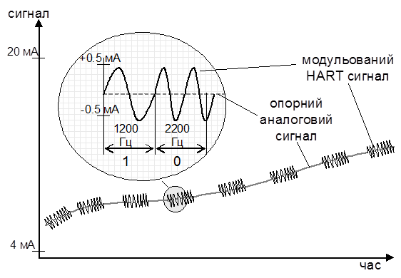
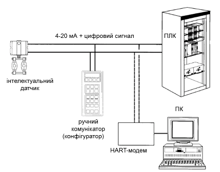

[Промислові мережі та інтеграційні технології в автоматизованих системах](README.md). [2. ЗАГАЛЬНА ХАРАКТЕРИСТИКА ПРОМИСЛОВИХ МЕРЕЖ](2.md) 2.5. [Короткий огляд промислових мереж](2_5.md)

### 2.5.7. HART-протокол

#### 2.5.7.1. Походження.

Походження. HART-протокол (Highway Addressable Remote Transducer) розроблений фірмою Rosemount Inc. у середині 80-х років, реалізує стандарт BELL 202 FSK (Frequency Shift Keying) для організації цифрової передачі, заснованої на технології 4-20 мА. HART це - відкритий стандарт, що працює з будь-якою системою управління й підтримується усіма провідними виробниками устаткування й програмного забезпечення в області автоматизації. HART-протокол по суті доповнює технологію 4-20 мА цифровими можливостями, а саме:

-  дозволяє передавати одночасно аналоговий і цифровий сигнал по одній витій парі, при чому зберігається повна сумісність і надійність існуючих аналогових ліній 4-20 мА;

-  дає можливість дистанційно здійснювати діагностику й настроювання польових приладів, використовуючи для цього HART-комунікатор або комп'ютер з відповідним ПЗ; це особливо зручно, коли датчики розташовані у важкодоступних місцях, на великих відстанях один від одного, а також в умовах шкідливих або небезпечних виробництв.

-  скорочує затрати на кабельну продукцію, установку, налагодження й на поточне технічне обслуговування;

-  дає зручність при роботі з багатопараметричними приладами, тому що можна одержувати інформацію про декілька змінних процесу по одній парі проводів;

-  прилади, що підтримують HART-протокол, можуть встановлюватись у вибухонебезпечних зонах класу 0, класу 1 і класу 2;

-  неперервна самодіагностика забезпечує високу надійність устаткування; інформація про стан приладу передається у кожному повідомленні від пристрою;

-  користувач має можливість прочитати будь-які параметри датчика: значення змінних, одиниці й діапазон вимірювання, індивідуальні параметри приладу.

На сьогоднішній день доступна також HART-сумісна технологія Wireless HART, яка в декількох словах описана в розділі 4. 

#### 2.5.7.2. Фізичний рівень.

Існує два режими роботи датчиків, що підтримують HART протокол:

1. режим точка-точка, коли передача цифрової інформації проходить одночасно з аналоговим сигналом; при цьому можна на відстані (до 3000 м) здійснювати настроювання й конфігурування датчика й операторові немає необхідності обходити всі датчики - їх можна настроїти зі свого робочого місця;

2. у багатоточковому режимі датчик передає й одержує інформацію тільки в цифровому вигляді, а аналоговий сигнал датчиків виставляється рівним 4-мА; інформація про змінні процесу зчитуються по HART-протоколу; до однієї пари проводів може бути підключено до 15 датчиків, їхня кількість визначається довжиною і якістю лінії, а також потужністю блоку живлення датчиків.

В HART мережі по двох проводах здійснюється живлення датчика, прийом від нього сигналу про значення параметра і здійснюється настроювання датчика за допомогою HART-модему. 

В основі HART-протоколу використовується принцип частотної модуляції (ЧМ). Частотно-модульований сигнал є двополярним і при застосуванні відповідної фільтрації не впливає на основний аналоговий сигнал 4-20 мА. Відповідно до HART-протоколу цифровий сигнал малої амплітуди (±0.5 мА) накладається на аналоговий сигнал 4-20 мА (рис.2.27). У відповідності зі стандартом Bell 202 для передачі логічної "1" HART використовує один повний період частоти 1200 Гц, а для передачі логічного "0" - два неповних періоди 2200 Гц. Оскільки такий Чм-сигнал має нульове середнє значення й фаза сигналу безперервна, то на аналоговий сигнал 4-20 мА він ніяк не впливає. Чм-складова накладається на струмову петлю 4-20 ма. Бітова швидкість - 1200 біт/с.

Рис.2.27. Діаграма накладання цифрового частотно-модульованого сигналу малої амплітуди (±0.5 мА) на аналоговий сигнал 4-20 мА

Стандартна топологія – зірка (декілька променів до ведучого пристрою), при багато точковому з’єднанні - шина, коли 15 вузлів підключені до однієї витої пари.  

Прилади з HART-інтерфейсом можуть підключатися за допомогою таких способів (рис.2.28):

-     через спеціалізовані модулі HART;

-     через HART-Модем, за допомогою якого встановлюється з'єднання «точка-точка» між комп'ютером і HART-пристроєм;

-     через HART-мультиплексори.

Найбільш прийнятим засобом для підключення декількох ведених пристроїв в єдину систему є мультиплексор, що забезпечує доступ до них через інтерфейс RS-485, RS-232 і Ethernet.

#### 2.5.7.3. Канальний рівень. 

На канальному рівні використовується метод доступу Ведучий-Ведений з можливістю 2-х Ведучих вузлів. Ведучий формує запити для Веденого, який на них відповідає. При з’єднанні точка-точка, Ведучий вузол може замовити так званий пакетний режим передачі, при якому Ведений сам відправляє повідомлення з даними з певною періодичністю.   

#### 2.5.7.4. Прикладний рівень.

Для передачі даних в шинній топології використовується класична схема Клієнт-Сервер. Ведучий завжди являється Клієнтом і генерує запити до Веденого на отримання певних величин, реальних даних і будь-яких інших параметрів, наявних у пристрої.  Ведений пристрій інтерпретує ці команди відповідно до HART-протоколу. У відповідь Ведучому пристрою передається інформація про статус і значення параметрів Веденого пристрою.  За одну посилку один вузол може передати іншому до 4 технологічних змінних, а кожний HART-пристрій може мати до 256 змінних, що описують його стан. Контроль коректності переданих даних заснований на одержанні підтвердження. При пакетному режимі (тільки в режимі точка-точка) після запиту Клієнта, Сервер Веденого періодично формує повідомлення.

Рис.2.28. Приклад системи з використанням HART в режимі точка-точка

Весь набір команд, реалізованих в HART-протоколі, умовно можна розділити на три групи. 

1. Універсальні – основні команди, які підтримуються усіма типами ведених пристроїв: зчитування інформації про тип засобу, фірми виготовлювача; зчитування вимірювального параметру (PV) та одиниці виміру; зчитування струмового виходу та проценту діапазону; зчитування наперед визначених динамічних змінних; зчитування символьних змінних, дати; зчитування/запис 32-символьного повідомлення; зчитування діапазону датчику, одиниць виміру та константу часу демпфування; зчитування серійного номеру чутливого елементу та обмеження; зчитування/запис номеру останньої зборки; запис адреси для багатоточковго режиму.  

2. Стандартні (для груп пристроїв) –  команди, які використовуються практично у всіх HART-пристроях. 

3. Специфічні ( що залежать від пристрою) – команди настроювання специфічних, індивідуальних параметрів якого-небудь пристрою.

Таблиця 2.17. Характеристики HART-протоколу.

| OSI        | характеристика | HART   "точка-точка"                                         | HART   багатоточкове з’єднання                               |
| ---------- | -------------- | ------------------------------------------------------------ | ------------------------------------------------------------ |
|            | NetArea        | рівень  датчиків                                             | рівень  датчиків                                             |
| прикладний | AppService     | періодичний/аперіодичний  обмін вимірювальними даними пристрою (дані процесу); управління станом вузла;  діагностичні сервіси; конфігурування вузла (параметричні дані); | періодичний/аперіодичний  обмін вимірювальними даними пристрою (дані процесу); управління станом вузла;  діагностичні сервіси; конфігурування вузла (параметричні дані); |
| прикладний | AppModel       | клієнт-серверна модель обміну  повідомленнями;  модель клієнт -сервер  з пакетним режимом; | клієнт-серверна  модель обміну повідомленнями;               |
| прикладний | AppProcData    | до 256 змінних на пристрій, до 4  змінних за посилку         | до 256 змінних на пристрій, до 4  змінних за посилку         |
| прикладний | AppResolut     | пакетний режим: 1 с/ 3  транзакції+                          | 1 с / 2 транзакції+                                          |
| канальний  | ChAddModel     | Відправник-Аресат-msg:  короткий формат адреси (0-15), де 1 – Ведучий-контролер; 0-Ведучий-  комунікатор; довгий формат (>=V4) + 4 байти на  унікальний ідентифікатор пристрою |                                                              |
| канальний  | ChAccess       | Ведучий-Ведений,  дозволяється два Ведучі (контролер+комунікатор) | Ведучий-Ведений,  дозволяється два Ведучі (контролер+комунікатор) |
| канальний  | ChChecksum     | XOR                                                          | XOR                                                          |
| фізичний   | PhInterface    | BELL 202 FSK  (Frequency Shift Keying) модуляція несучої  4-20 мА. | BELL 202 FSK  (Frequency Shift Keying) модуляція несучої  4-20 мА. |
| фізичний   | PhMedia        | вита пара                                                    | вита пара                                                    |
| фізичний   | PhTopology     | точка-точка, зірка                                           | шина                                                         |
| фізичний   | PhLdrop        |                                                              | приймаються в  розрахунок PhLength                           |
| фізичний   | PhBaudRate     | 1200 біт/с                                                   | 1200 біт/с                                                   |
| фізичний   | PhNodes        | 3                                                            | 15 (для V<5); 38-разр. адреса (для V >=5)                    |
| фізичний   | PhLength       | 1500 м                                                       | 1500 м                                                       |
| фізичний   | PhSupply       | по інформаційній  парі проводів                              | по інформаційній  парі проводів                              |

\+ - 1 транзакція вміщує до 25 байт, до 4 змінних

<-- 2.5.6. [Мережі PROFIBUS](2_5_6.md) 

--> 2.5.8. [Мережа AS-і](2_5_8.md)  