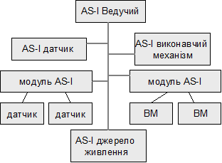

[Промислові мережі та інтеграційні технології в автоматизованих системах](README.md). [2. ЗАГАЛЬНА ХАРАКТЕРИСТИКА ПРОМИСЛОВИХ МЕРЕЖ](2.md) 2.5. [Короткий огляд промислових мереж](2_5.md)

### 2.5.8. Мережа AS-і

Детальніше з AS-i ви можете познайомитись в розділі 5. 

#### 2.5.8.1. Походження. 

Назва мережі розкриває її призначення: AS-I (Actuator Sensor Interface) - інтерфейс із датчиками й виконавчими механізмами. Уперше ASI-мережа вийшла на ринок наприкінці 1989 року, а сьогодні підтримана рядом відомих фірм. Існує й однойменна асоціація по підтримці цієї мережі, ASI. 

#### 2.5.8.2. Фізичний рівень. 

ASI-інтерфейс перш за все призначений для підключення дискретних датчиків та виконавчих механізмів до контролеру (Ведучого вузла). По інформаційній шині передається  живлення, що особливо зручно при підключенні великої кількості фотоелектричних й індуктивних датчиків. Спрощено ASI-мережа може виглядати, як на рис.2.29. В якості середовища передачі використається пара звичайних провідників, або спеціальний ASі-кабель ("жовтий кабель"), у якому обидва провідника упаковані в спеціальну м'яку гумову оболонку, що робить цей кабель гнучким і стійким до багаторазових вигинів. Цей кабель використається для приєднання датчиків, установлюваних на рухливих частинах механізмів. Топологією ASI-мережі може бути шина, зірка або дерево. Довжина сегмента мережі до 100м. За рахунок репітерів довжину мережі можна збільшувати до 300м.  

Для кодування даних використається Манчестерский код. Такий тип кодування знижує вплив на AS-і-кабель зовнішніх збурень. Бітова швидкість фіксована і рівна 167 кБіт/с. 

#### 2.5.8.3. Канальний рівень.

Рис.2.29. Приклад ASI-структури

Для доступу до шини використовується метод Ведучий-Ведений, де Ведучим виступає контролер, а Веденими можуть бути інтелектуальні AS-I датчики або виконавчі механізми. До шини також можна підключати звичайні датчики та виконавчі механізми через спеціальні AS-I модулі. Кожен Ведений може обслужити до 4-х дискретних входів та 4-х дискретних виходів. Максимальна кількість Ведених, підключених до одного Ведучого вузла – 31 (для версії 1) або 62 (для версій 2 та 3). Таким чином до однієї мережі AS-i може бути підключено одночасно до 124 дискретних входів та 124 дискретних виходів  (для версії 1), та в два рази більше дискретних датчиків та виконавчих механізмів для версій 2 та 3. 

Короткий ASі-цикл забезпечується за рахунок компактного формату телеграми. Цикл опитування Ведучим 31-го Веденого укладається в 5 мс. 

В старших версіях протоколу AS-i значно збільшились його можливості, що дозволяють підключати до мережі аналогові датчики та ВМ. Адреса кожного мережного пристрою записується в його постійній пам'яті. AS-і Ведучий може бути організований як у вигляді шлюзу в іншу промислову мережу, так і у вигляді окремої плати/модуля контролера або комп'ютера. 

Таблиця 2.18. Характеристики мережі AS-i.

| OSI         | Характери-тика | AS-i                                                         |
| ----------- | -------------- | ------------------------------------------------------------ |
|             | NetArea        | рівень датчиків                                              |
| прикладний+ | AppService+    | Data  Exchnage - циклічне зчитування/запис даних процесу  (входи/виходи); конфігурування та управління станом вузлів (параметричні  дані); діагностичні сервіси; |
| прикладний  | AppModel+      | клієнт-серверна модель ідентифікованого  обміну (Polling) для Data Exchange;   клієнт-серверна модель обміну повідомленнями  для параметричних даних; |
| прикладний  | AppProfile     | профілі віддалених  дискретних входів/виходів, аналогових засобів вводу/виводу (>=V2.0), специфічні профілі |
| прикладний  | AppProcData    | 124 дискр.вх., до  124 дискр. вих. (248/248 для V2.0, V3.0)  |
| прикладний  | AppResolut     | 5 мс / 31 + (4 DI + 4 DO)                                    |
| канальний   | ChAddModel     | Відправник-Адресат-msg; адресуються тільки  Ведені: 1-31 (V1), 1-62 (V2/3) |
| канальний   | ChAccess       | Ведучий-Ведений                                              |
| канальний   | ChChecksum     | біт паритету                                                 |
| фізичний    | PhInterface    | асинхронний інтерфейс, модуляція постійної напруги,  манчестерське кодування |
| фізичний    | PhMedia        | пара проводів, "жовтий кабель"                               |
| фізичний    | PhTopology     | шина, зірка, дерево                                          |
| фізичний    | PhLdrop        | будь яке відгалуження, PhLength= Σ PhLdrop+Ltrunk            |
| фізичний    | PhBaudRate     | 167  КБіт/с                                                  |
| фізичний    | PhSegment      | 3 сегменти з 2 репітерами, термінування не потрібне          |
| фізичний    | PhNodes        | 31 без Ведучог (V1), 62 (V2/3) без Ведучого                  |
| фізичний    | PhLength       | 100 м , 300 м з  репітерами; термінування не потрібне        |
| фізичний    | PhSupply       | до  30 В по інформаційній парі проводів (до 2А), можливе живлення по окремій парі  проводів |

\+ - модель умовна, в AS-і відсутній прикладний рівень, прикладні сервіси та їх функціонування визначаються профілем пристрою; 

<-- 2.5.7. [HART-протокол](2_5_7.md) 

--> 2.5.9. [Мережа INTERBUS](2_5_9.md)  