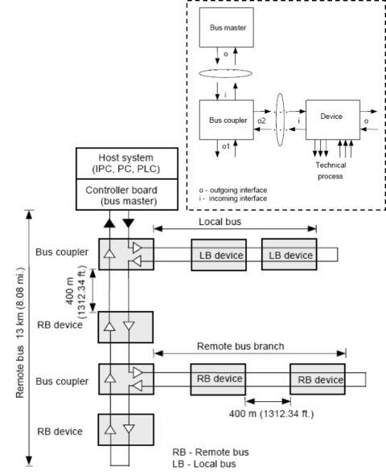
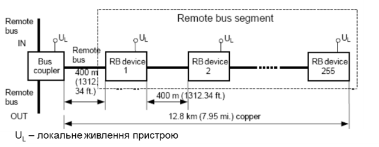
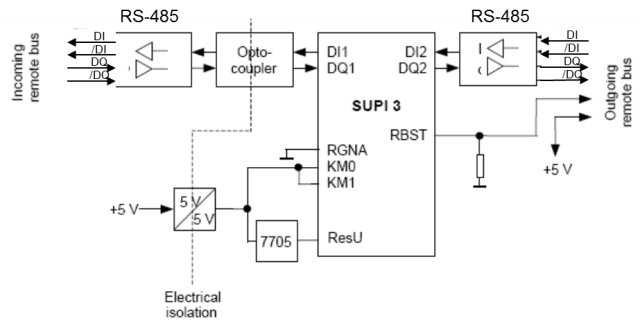
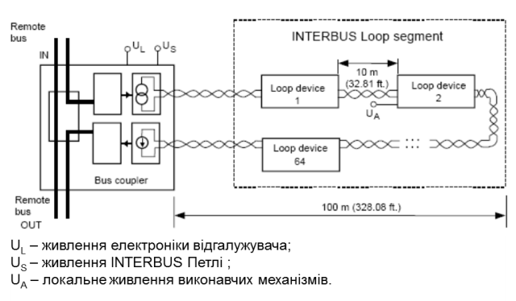
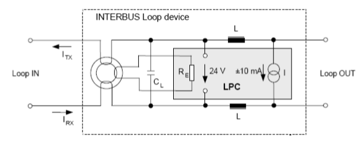
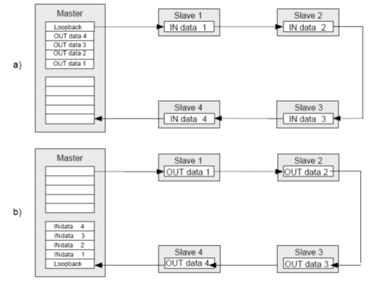
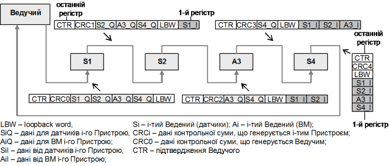
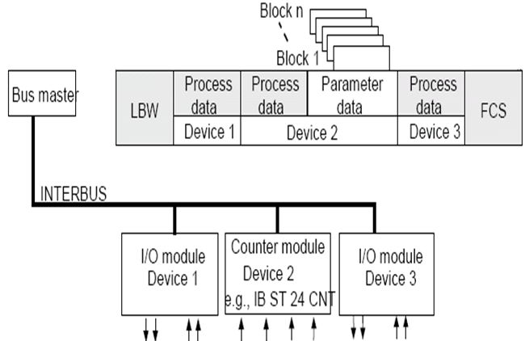

[Промислові мережі та інтеграційні технології в автоматизованих системах](README.md). [2. ЗАГАЛЬНА ХАРАКТЕРИСТИКА ПРОМИСЛОВИХ МЕРЕЖ](2.md) 2.5. [Короткий огляд промислових мереж](2_5.md)

### 2.5.9. Мережа INTERBUS

#### 2.5.9.1. Походження. 

Робота над створенням INTERBUS почалася ще в 1983 році відомою німецькою організацією Phoenix Contact, а в 1987 результати були представлені на Гановерській Ярмарці. Початкова область застосування даної мережі, яка називалась Interbus-S, це високошвидкісний детермінований обмін даними з датчиками та виконавчими механізмами. З розвитком РС-сумісних рішень в області промислової автоматизації, функціональність мережі доповнювалась, область її призначення розширилась на розподілені комунікаційні структури, що базуються на стандартних РС технологіях, а сама промислова мережна система стала називатись INTERBUS. На сьогоднішній день рішення INTERBUS підтримують та розвивають організації INTERBUS Club ([www.interbusclub.com](http://www.interbusclub.com/)) та Open Control Foundation. Мережі закріплені в німецькому стандарті DIN 19258, європейському - EN 50254, та міжнародному - IEC 61158.

INTERBUS є мережею рівня датчиків. Вона має кільцеву топологію, в якій обмін даними організовується шляхом передачі полів кадру від пристрою до пристрою по кільцю. В голові мережної системи знаходиться Ведучий, який виконує функції контролера, або забезпечує зв’язок INTERBUS з верхніми рівнями управління. Всі інші вузли системи є Веденими пристроями, які разом з Ведучим організовують фізичне кільце. 

#### 2.5.9.2. Фізична структура. 

Всі пристрої мережі підключаються один до одного через дуплексний зв’язок, організовуючи тим самим прямий та зворотній канали кільця (рис.2.30). Тобто кожний вузол, окрім вузла Ведучого, має два дуплексні канали – Вхідний Інтерфейс (incoming interface) та Вихідний Інтерфейс (outgoing interface), і при відсутності відгалужувачів, кабельний зв’язок утворює видиму лінійну топологію, в якій кінцевий пристрій в мережі всередині замикає кільце. 

Фізична структура мережі INTERBUS складається з таких елементів:

1) Мережний Ведучий (Bus Master), який управляє мережею та виконує функції контролера;

2) Мережні Пристрої (Bus Devices), які виконують функції засобів вводу/виводу, і в залежності від підтримуваних вхідних/вихідних інтерфейсів можуть бути таких типів:

- a.   Віддалений Пристрій (Remote Device);

- b.   Локальний Пристрій (Local Device);

- c.   Пристрій Петлі (Loop Device);

3) Мережні Відгалужувачі (Bus Couplers), інша назва мережні термінальні модулі (Bus Terminal Module), які забезпечують сегментацію мережі, тобто відгалуження від основної гілки;

4) Мережні кабелі.

Рис.2.30. Загальна структура мережі INTERBUS 

Всі  елементи поєднуються між собою через Вхідні та Вихідні Інтерфейси, фізична реалізація яких може бути різною: дуплексний варіант RS-485; з’єднання по TTL; модуляція струму живлення 24 В; оптичне кільце. Незалежно від структури мережі, бітова швидкість є постійною 500 кБіт/с, сумарна максимальна довжина лінії зв’язку - 13 км, максимальна кількість пристроїв - 512, максимальна кількість точок вводу/виводу – 4096. 

Декілька Пристроїв та мережних з’єднувачів, які починаються з Мережного Ведучого або Мережного Відгалужувача та закінчуються наступним Мережним Відгалужувачем або кінцевим пристроєм (без підключеного Вихідного Інтерфейсу) називається Мережним Сегментом (Bus Segment).

В структурі мережі INTERBUS, в залежності від типу Інтерфейсів можуть використовуватись такі основні типи Сегментів:

-    Віддалений Сегмент (Remote bus segment), на базі RS-485 або оптоволокні ;

-    Локальний Сегмент (Local bus segment) або I/O Шина (I/O Bus) на базі TTL;

-    Сегмент INTERBUS Петлі (INTERBUS Loop segment), на базі модуляції струму живлення 24 В;   

Структура мережі дозволяє ієрархію Сегментів до 16 рівнів. Тобто сегмент може включати декілька Відгалужувачів, Сегменти яких в свою чергу можуть також включати відгалужувачі. Сегментація INTERBUS дає зручний та прозорий механізм для довільного територіального розміщення пристроїв по всій території ділянки процесу. Крім того сегментація дозволяє використовувати в одній і тій же мережі різні середовища передачі в залежності від умов експлуатації.  

#### 2.5.9.3. Віддалений Сегмент. 

Мережний Ведучий підключається до наступного Віддаленого Пристрою, або Мережного Відгалужувача через дуплексний варіант інтерфейсу RS-485. Таким чином основним сегментом INTERBUS є Віддалений Сегмент (рис.2.30). Від нього можуть іти відгалуження на інші сегменти такого ж, або іншого типу. Слід зазначити, що відгалуження буде тільки з точки зору кабельних відводів, але топологія залишиться кільцевою. Передача бітів проводиться методом NRZ. 

До Віддаленого Сегменту накладаються наступні вимоги (рис.2.31): максимальна кількість Пристроїв на сегмент – 256, максимальна дистанція між Пристроями – 400 м для RS-485 та 3600 м для оптоволокна, максимальна довжина сегменту – 12.8 км, живлення мережних засобів – локальне, стандартний з’єднувач - 9-піновий SUB-D вилка для Вхідного Інтерфейсу(піни: DO – 1; /DO – 6; DI – 2; /DI – 7; GND – 4), та 9-піновий SUB-D розетка для Вихідного (піни: DO – 1; /DO – 6; DI – 2; /DI – 7; GND – 4, RBST – 9; +5V- 5).

Внутрішня структура Віддаленого Пристрою показана на рис.2.32. Як видно Вхідний та Вихідний Інтерфейс реалізований за допомогою RS-485 інтерфейсу, в якого вхідні та вихідні сигнали А,В,А',В' позначені як /DI, DI, /DO та DO. Сигнал RBST на Вихідному Інтерфейсі повинен бути підключений до 5В (перемичка між 9-тим та 5-тим піном), що повідомляє даному пристрою, що він не являється кінцевим в ланцюгу. Перемичка виставляється безпосередньо на конекторі самого кабелю, щоб при підключені наступного вузла, Пристрій ставав проміжним в ланцюгу, при відключенні – кінцевим, тобто замикав ланцюг. Обов’язковою є вимога підключення сигнальної землі (пін 4). Таким чином для з’єднання Віддалених Пристроїв необхідно використати кабель з 3-ма витими парами.     

Рис.2.31. Структура Віддаленого Сегменту.UL – локальне живлення пристрою 

Віддалений Сегмент не живить пристрої по мережному кабелю. Така можливість доступна для рішення з назвою Installation Remote Bus. В цьому випадку використовується 9-жильний кабель (3 витих пари + 3 проводи на живлення), а  максимальна довжина сегменту обмежується 50 м.  

Рис.2.32 Структура Віддаленого Пристрою  

#### 2.5.9.4. Локальний Сегмент. 

Локальний Сегмент, який також називається I/O Шиною, призначений для об’єднання між собою Локальних Пристроїв на невеликих відстанях (наприклад модульні острова вводу/виводу). Внаслідок цього немає необхідності у використанні інтерфейсу RS-485, а використовується TTL рівні сигналів (5В), які застосовуються в обчислювальній техніці. Локальний Сегмент починається зі спеціального Мережного Відгалужувача, до якого один за одним підключається Локальні Пристрої. Максимальна відстань між Локальними пристроями – 1.5 м, максимальна довжина сегменту – 10 м. Окрім сигналів DI, /DI, DO та /DO додатково до Локальних Пристроїв з Мережного Відгалужувача підводиться живлення. Локальні Сегменти доступні в декількох конструктивних варіантах: Локальний Сегмент з ST-шиною; Локальний Сегмент з вбудованою станцією (INLINE Station); Локальний Сегмент на оптоволоконному з’єднані. Для Локального Сегменту максимальна кількість Локальних Пристроїв – 63 (8 для Сегменту з ST-шиною).

#### 2.5.9.5. Сегмент INTERBUS Петлі.  

Даний тип сегменту, який також називається Петля Датчиків (Sensor loop, IP65 local bus), використовує 2-провідну лінію передачі, яка в поєднанні з Пристроями Петлі організовує кільце (рис.2.33). По даній витій парі передається живлення для Пристроїв Петлі напругою 24 В постійного струму, яке модулюється манчестерським кодом, тим самим забезпечуючи передачу цифрових даних. Основна область застосування Сегменту – безпосереднє підключення датчиків та виконавчих механізмів в промислових умовах експлуатації (виконання IP 65 та IP 54).    

Рис.2.33. Структура Сегменту INTERBUS Петлі

Сегмент INTERBUS Петлі має наступні характеристики: максимальна довжина Сегменту – 100 м; максимальна відстань між Пристроями – 10 м, максимальна кількість Пристроїв – 32, максимальний струм споживання – 1.5 А; середовище передачі – неекранований двопровідний кабель 2х1.5 мм2 (16 AWG).  

  

Рис.2.34. Структура Пристрою INTERBUS Петлі.

#### 2.5.9.6. Канальний рівень. 

На фізичному рівні дані передаються символьним способом послідовно по кільцю, починаючи від Мережного Ведучого та ним же закінчуючи. Виділяються два типи символів: статусна телеграма (5 статусних біт) та телеграма даних (5 статусних біт + 8 бітів даних). Символи – є складовими кадрів INTERBUS.

Ключовою особливістю реалізації мережі INTERBUS на канальному рівні є використання Summation-Frame протоколу з безколізійною процедурою доступу до середовища TDMA. Для обміну даними використовується Сумарний Кадр, який об’єднує вхідні та вихідні дані для всіх Пристроїв в мережі та відправляється їм однією посилкою. Це значно економить ресурси мережі, оскільки не витрачаються додаткові ресурси на роботу з окремим пристроєм. Тобто передачею одного кадру, Ведучий запише дані в усі засоби виводу, а прийомом одного кадру отримає значення з усіх засобів вводу. Для запису вхідних даних, згідно TDMA, кожному вузлу виділяється часовий інтервал (тайм-слот). Враховуючи, що Ведучий має інформацію про кількість вузлів в мережі, він визначає тривалість всього кадру як суму всіх тайм-слотів. Можуть бути виділені додаткові тайм-слоти, для передачі ациклічних повідомлень.

Враховуючи фізичну та логічну кільцеву топологію INTERBUS, Summaation-Frame процедура в ній реалізована через так звані здвигові регістри. Кожний Мережний Пристрій "приєднується" до логічного кільця здвиговим регістром, довжина якого (кількість символів) залежить від кількості точок вводу/виводу даного Пристрою (від 4 до 64 бітів). Об’єднуючи всі Пристрої разом в логічне кільце вони створюють структуру, яка по суті являється Сумарним Кадром. 

Вихідні дані процесу розміщуються у вихідному буфері Ведучого в порядку фізичного розміщення в кільці Пристроїв, для яких вони призначені (див.рис.2.35 а). Цикл передачі (data cycle) починається з послідовної передачі даних, які починаються службовим 16-бітним loopback словом (LBW) та продовжуються вихідними даними буферу (здвиговими регістрами). Передаючи цю послідовність, з першого Пристрою "виштовхуються" його вхідні дані, які в свою чергу приводять в рух все логічне кільце, що приводить до появи у вхідному буфері Ведучого вхідних даних від останнього Пристрою в кільці. Після "виштовхування" останніх даних з вихідного буферу Ведучого, вони попадають в перший Пристрій в кільці, для якого ці дані і були призначені. Всі інші вихідні дані теж знаходяться в Пристроях відповідно до їх призначення. В цей момент вхідний буфер Ведучого повністю заповнений вхідними даними Пристроїв (рис.2.35 б). 

 Рис.2.35. Принцип передачі даних в INTERBUS: розподіл даних а - перед циклом передачі, б – після 

На рис.2.36 показано яку послідовність здвигових регістрів передає кожен з вузлів системи, якщо вона складається з 4-рьох пристроїв. Додатково до даних входів/виходів, ця Сумарний Кадр вміщує також дані про контрольну суму (CRC). Контроль за правильністю отримання даних відбувається між суміжними парами вузлів, що приводить до генерації контрольної суми в момент передачі поля CRC кожним вузлом. В кінці кінців про виявлення помилки контрольної суми дізнається Ведучий, отримавши кінцевий CRC (CRC4 на рис.2.36).     

Рис.2.36. Послідовність передачі даних від Пристрою до Пристрою.

Наведена вища схема функціонування INTERBUS не потребує адресації Пристроїв, так як дані для них розміщуються відповідно до фізичного розташування в кільці. Крім того, вона ефективна з точки зору використання мережного трафіку (приблизно 60% корисних даних для 32 Пристроїв на 8 I/O).

#### 2.5.9.7. Прикладний рівень. 

На прикладному рівні INTERBUS використовуються два різні типи сервісів:

-     process data channel (PDC) – забезпечує циклічно-періодичним обміном даними процесу з Пристроями вводу/виводу (клієнт-серверна модель ідентифікованого обміну);

-     parameter channel (PC) – забезпечує обмін параметричними даними двох Пристроїв між собою на основі Клієнт-Серверної моделі (клієнт серверна модель обміну повідомленнями);   

Доступ з програми користувача до даних Пристроїв через сервіс PDC відбувається через образ вводу/виводу, який циклічно-періодично оновлюється, як це було описано вище. Послідовність розміщення даних в образі співпадає з фізичною послідовністю Пристроїв в кільці.

Параметричний канал РС використовується для обміну комплексними даними між двома Пристроями для використання функцій конфігурування, програмування, відображення даних, управління, тощо. Для передачі параметричних даних використовується ациклічний обмін повідомленнями на базі моделі Клієнт-Сервер. Для цього додатково для Пристроїв, які приймають участь в обміні додатково виділяються тайм-слоти. Загальна картина  обміну параметричними даними показана на рис.2.37.  

Рис.2.37. Використання параметричного каналу РС. 

Таблиця 2.19. Характеристики мережі .    

| OSI        | характеристика | INTERBUS                                                     |
| ---------- | -------------- | ------------------------------------------------------------ |
| прикладний | NetArea        | рівень датчиків                                              |
| прикладний | AppService     | PDC – циклічно-періодичний обмін Ведучого вузла даними  вводу/виводу; PC - ациклічний обмін  параметричними даними між двома вузлами; діагностичні сервіси; |
| прикладний | AppModel       | клієнт-серверна модель ідентифікованого обміну для PDC;+   клієнт-серверна модель обміну повідомленнями для PC; |
| прикладний | AppProfile     | профілі по області застосування; великий перелік профілів пристроїв: PDS(DRIVECOM), ЛМІ (MMICOM),  енкодери, контролери, датчики/ВМ |
| прикладний | AppProcData    | PDC: всього на мережу до 2048 вх.слів , 2048 вих.слів;       |
| прикладний | AppResolut     |                                                              |
| канальний  | ChAddModel     | Сумарний Кадр + регістровий здвиг, орієнтований на фізичне розміщення  Пристроїв в кільці; |
| канальний  | ChAccess       | Ведучий-Ведений + TDMA: Ведучий ініціює обмін, Ведені добавляють свої  дані в певний момент часу |
| канальний  | ChChecksum     | CRC, змінюється та контролюється  від вузла до вузла         |
| канальний  | PhBaudRate     | 500  кБіт/с                                                  |
| канальний  | PhSegmen.      | до  16 рівнів сегментації                                    |

| канальний | назва сегм | Remote  Bus| Installation  Remote Bus       | Local  Bus (I/O Bus) | INTERBUS  Loop |
| ------------------------------ | ---------------------------------------- | ------------------------------------------------------------ | ------------------------------------------------------------ | ------------------------------------------------------------ | ------------------------------------ |
| фізичний  | PhMedia    | екранований кабель на  3 витих пари++ | екранований кабель на  3 витих пари + 3 провода живлення | 5-провідний плоский  кабель або з’єднувач ++ | неекранований  2-провідн кабель |
| фізичний | PhInterface                            | RS-485 | RS-485 | TTL   | модуляція несучої 24 В, мначест. код |
| фізичний                       | PhMedia                                | екранований кабель на 3 витих пари++                         | екранований кабель на 3 витих пари + 3 провода  живлення     | 5-провідний плоский кабель або з’єднувач ++                  | неекранований 2-провідн кабель       |
| фізичний                       | PhTopology                             | фізичне кільце, видима по кабелю – лінійна, орагнізовується  дуплексним зв’язком між суміжними засобами, кінцевий Пристрій замикає кільце | фізичне кільце, видима по кабелю – лінійна, орагнізовується  дуплексним зв’язком між суміжними засобами, кінцевий Пристрій замикає кільце | фізичне кільце, видима по кабелю – лінійна, орагнізовується  дуплексним зв’язком між суміжними засобами, кінцевий Пристрій замикає кільце | кільце                               |
| фізичний                       | PhNodes                                | всього в мережі 512                                          | всього в мережі 512                                          | всього в мережі 512                                          | всього в мережі 512                  |
| фізичний                    | PhNodes | 256                                            | обмеження  по струму живлення, Макс. 256                   | 63  (8 для ST) | 32 |
| фізичний                       | PhLength                               | сумарна 13 км                                                | сумарна 13 км                                                | сумарна 13 км                                                | сумарна 13 км                        |
| фізичний | PhLength       | 12.8 км, між пристроями  400 м    | 50 м, між пристроями  50 м        | 10 м, між пристроями  1.5 м | 100 м, між  пристроями 10 м |
| фізичний                       | PhSupply                               | ні                                                           | 24 В по виділеним  проводам кабелю                           | 24 В по виділеним  проводам                                  | 24 В по  інформаційним прводам       |

\+ - умовна модель, в офіційних документах INTERBUS модель немає назви

++ -можливе оптоволокно

<-- 2.5.8. [Мережа AS-і](2_5_8.md)  

--> 2.5.10. [Мережі CIP: DeviceNet, ControlNet, Ethernet/IP та CompoNet](2_5_10.md) 