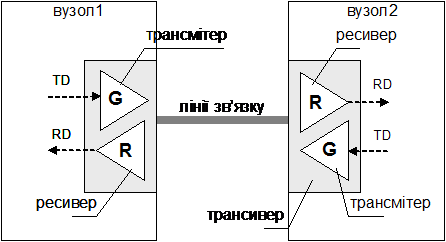
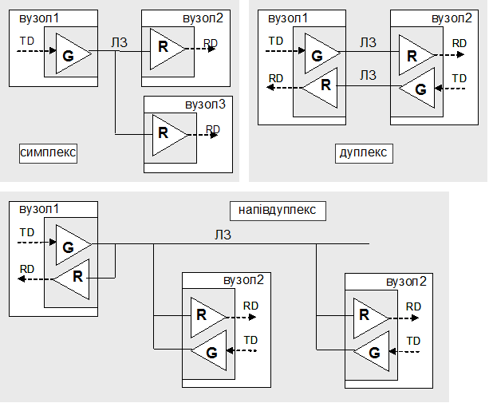

[Промислові мережі та інтеграційні технології в автоматизованих системах](README.md). 3. [РЕАЛІЗАЦІЯ ФІЗИЧНОГО РІВНЯ](3.md).

## 3.1.Організація каналу зв’язку

Інформаційний обмін даними між прикладними програмами на всіх рівнях OSI-моделі відбувається у вигляді послідовностей логічних бітів. Канальний рівень передає цю послідовність фізичному рівню, задачею якого є перетворення її в послідовність фізичних сигналів, яка відповідає логічній «1» і «0» та передачі її по фізичному каналу фізичним рівням всіх вузлів, які підключені до його середовища передачі. Тобто фізичний рівень повинен забезпечити фізичну передачу послідовності бітів між канальними рівнями вузлів, пов’язаних між собою. 

На фізичному рівні (з точки зору OSI-моделі) описуються механічні, електричні та функціональні характеристики, а також фізичне середовище передачі даних для конкретної мережі.  

Фізичним середовищем передачі даних можуть бути: металевий провід (кабель), оптоволоконний кабель, радіохвилі або лазерний промінь, причому деякі мережі можуть базуватися на їх комбінації. 

Фізичне середовище, що призначене для переносу інформації між одиницями обладнання, які приймають участь в інформаційному обміні, будемо називати лініями зв’язку (Interchange Circuit).

На мережевому вузлі безпосередньою передачею даних до лінії зв’язку займається трансмітер або передавач (transmitter), а прийомом ресивер або приймач (receiver). Трансмітери та ресивери на принципових схемах, як правило позначають трикутниками з літерами відповідно "G" (або "T") та "R"(рис. 3.1). Пристрій, який об´єднує функції передавача і приймача називають трансивером або приймач-передавач (transceiver), який як правило реалізується у  вигляді окремого чіпсету. Трансиверу надходить логічний сигнал "0" або "1" (по рівню TTL), які він перетворює у певний фізичний сигнал і передає по лінії зв’язку. З іншого боку другий трансивер робить зворотне перетворення. Логічний сигнал який подається на трансмітер для передачі його по фізичному каналу, як правило позначається TD (Transmit Data) або Tx, а отриманий від ресивера – RD (Receive Data) або Rx. 

 

Рис. 3.1. Організація фізичного каналу передачі даних

Основним параметром, який характеризує лінію зв’язку, є пропускна здатність (channel capacity) - максимальна кількість інформації, яку можна передати за одиницю часу (наприклад в біт/с). Пропускна здатність фізичної лінії зв’язку (електричного, оптичного чи радіоканалу) тісно пов’язана з смугою пропускання, потужністю сигналу і рівнем шуму. Смуга пропускання (bandwidth) середовища визначається як діапазон частот, які лінія може передавати з затуханням менш ніж 3 дБ (що відповідає 50% падінню потужності) і вимірюється в герцах (Гц).

Перенос даних в мережі по лініям зв’язку може проходити в трьох режимах: симплексно (simplex), дуплексно (full duplex) та – напівдуплексно (half duplex). 

У випадку симплексної передачі (рис.3.2) дані передаються тільки в одному напрямку У цьому випадку на одному з вузлів мережі підключений тільки один передавач, а на всіх інших вузлах підключені тільки приймачі. 

Рис. 3.2. Режими передачі даних

При дуплексному з’єднанні дані одночасно передаються в прямому і зворотному напрямку, тобто в мережі трансивери вузлів одночасно працюють як на прийом так на передачу. У цьому випадку виникає необхідність у розділенні фізичних ліній зв’язку, або їх ресурсів. Для дуплексного з’єднання двох пристроїв можна використати дві різні лінії, одна з яких працює на прийом, а інша - на передачу. Можна також використати різні частоти для передачі по одній і тій самій лінії зв’язку. Це дозволяє з’єднувати по дуплексному зв’язку декілька вузлів між собою.

У напівдуплексному з´єднанні дані передаються в прямому і зворотному напрямку, але в різний час. Для цього типу з’єднання характерно розділення однієї лінії зв’язку для передачі від декількох передавачів. В певний момент часу працює тільки один передавач, а трансивери всіх інших вузлів можуть працювати в режимі прийому. В інший момент часу активним стає інший передавач. Напівдуплексний спосіб обміну більш економічний порівняно з дуплексним, оскільки використовує тільки одну лінію і не потребує частотного розділення. Однак він потребує визначення порядку доступу до лінії зв’язку всіх передавачів в мережі.

Приклад 3.1. Реалізація фізичного рівня. Напрямки переносу даних. 

Завдання. Класифікуйте технічні засоби комунікації по типу зв’язку: гучномовець, телебачення, радіо, військова рація (для передачі азбукою Морзе), телефон, міліцейська рація.

Рішення. Симплексний: гучномовець, телебачення, радіо, військова рація (для передачі азбукою Морзе).

Дуплексний: телефон (можна говорити і слухати одночасно).

Напівдуплексний: міліцейська рація (натискаєш – говориш, відпускаєш – слухаєш).

Канал зв’язку може бути реалізований різними середовищами:

-     металевим кабелем, по якому передається електричний сигнал;

-     оптичним кабелем, по якому передається світловий сигнал;

-     по ефіру, з використанням радіохвиль різної частоти.

Задача трансміттерів перетворити логічні сигнали "0" та "1" в фізичні електричні, світлові або радіо сигнали, а задача ресиверів – зробити зворотне перетворення. Тип каналу зв’язку вибирається в залежності від обмежень та вимог, покладених на промислову мережу. Нижче розглянуті характеристики кожного із типів каналів та особливості, які необхідно врахувати при їх виборі.   

<-- 3. [РЕАЛІЗАЦІЯ ФІЗИЧНОГО РІВНЯ](3.md).

--> 3.2. [Використання металевих кабелів](3_2.md) 