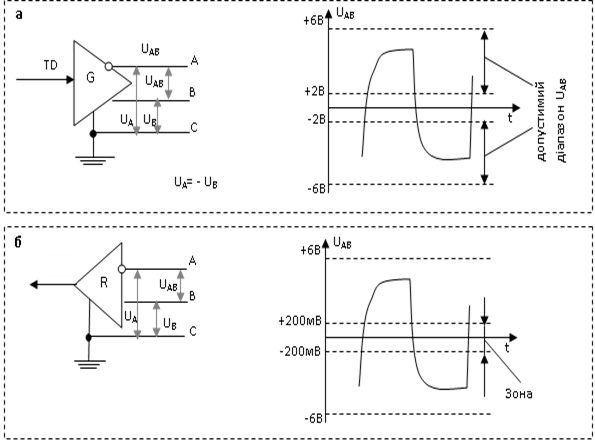
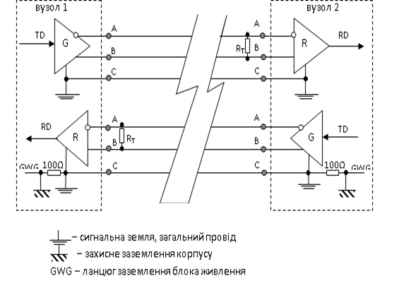

[Промислові мережі та інтеграційні технології в автоматизованих системах](README.md). 3. [РЕАЛІЗАЦІЯ ФІЗИЧНОГО РІВНЯ](3.md).

## 3.10. Інтерфейс RS-422A (EIA-422A)

Інтерфейс RS-232 має ряд недоліків, які обмежують область його використання в промислових умовах. Насамперед це пов’язано з чутливістю до електромагнітних завад, малою довжиною кабелю з’єднання і малою бітовою швидкісью. Організація EIA випустила ряд нових стандартів, один з яких RS-422A\, під назвою „Electrical Characteristics of Balanced Voltage Digital Interface Circuits” (Електричні характеристики ланцюгів цифрових інтерфейсів з симетричною напругою”).

Даний стандарт описує (рекомендує) тільки електричні характеристики інтерфейсу, тобто вимоги до передавачів (драйверів - drivers) та приймачів і не визначає параметри сигналів, типи роз’ємів, тип та довжину кабелів та ін. Інтерфейс базується на збалансованих (симетричних) лініях передавачів та приймачів, тобто напруга передається по трьом проводам - два сигнальних та сигнальна земля. 

Рис. 3.30. Функціональна схема передавача (а) та приймача (б) в інтерфейсі RS-422A

На рис.3.30 показаний принцип функціонування збалансованого передавача (а) та приймача (б) лінії. Збалансований передавач лінії при передачі на TD логічної „1”, формує напругу між сигнальним проводом „A” і землею „C” – UA) та протилежну за знаком напругу між проводами „B” і „C” –UВ  (на рис.3.30 показаний знак інверсії). При передачі логічного „0” передавач інвертує знак сигналу. Приймач вимірює напругу між „А” і „В” і якщо різниця буде більше ніж +200 мВ то приймач буде розпізнавати його як певний логічний стан лінії. Якщо різниця змінить свій знак і стане менше ніж -200 мВ, приймач змінить логічний стан на протилежний.

Якщо на проводі „А” передавача в інтерфейсі RS-422А по відношенню до проводу „В” від’ємна напруга, лінія перебуває в стані логічної „1”, якщо додатна – логічного „0”. Позначення проводу „А” як правило еквівалентне „─„, а позначення „В” - „+” (інколи приймають навпаки). RS-422А витримує синфазну напругу ±7В (середня напруга на виходах А і В відносно землі).

Диференційний спосіб передачі зменшує вплив синфазної завади на лінію передачі, оскільки вимірюється не сигнал між сигнальним проводом і землею, а різниця потенціалів між двома сигнальними лініями. Навіть якщо на обох проводах будуть наведені паразитні струми, диференційна напруга практично не зміниться. 

Стандарт також описує електричні вимоги до передавачів та приймачів. Зокрема, один передавач повинен бути розрахований на 10 приймачів. Інтерфейс працює в дуплексному режимі. Тому можливі два варіанти з’єднання: передавачі та приймачі двох вузлів з’єднуються перехресно (точка –точка); передавач одного вузла обслуговує до 10 приймачів інших вузлів.

На основі даного стандарту з’явилися деякі рекомендації по його використанню. Це схеми підключення, способи заземлення, максимальні відстані, використання резисторів-термінаторів, максимальні бітові швидкості і т.д. Так встановлено, що максимальна бітова швидкість – становить біля 10 Мбіт/с, максимальна відстань (при невеликих швидкостях) – біля 1200 м. Ці величини залежать від багатьох параметрів: типу кабелю, рівня завад, типу роз’ємів і т.д. В якості середовища передачі на великі відстані рекомендують використовувати виту пару, бажано екрановану. На рис.3.31 показаний один із способів реалізації дуплексного з’єднання двох пристроїв по RS-422А.   

Рис. 3.31. Функціональна схема 5 – провідного дуплексного з’єднання двох вузлів по RS-422A 

Інтерфейс RS-422А має один значний недолік – на ньому не можна побудувати мережі з шинною топологією, тому він не знайшов такого широкого застосування як RS-485.  Чому ж інтерфейс, в якому передавач може забезпечити струмом 10 приймачів не може працювати на шині разом з іншими передавачами? Проблема в тому, що передача інформації забезпечується логічними "0" та "1" які мають відповідний рівень фізичного сигналу по напрузі. Наприклад в символьному режимі, при відсутності передачі на лінії приймача повинна бути присутня логічна "1", яку передає трансмітер. Тобто в кожен момент часу трансмітер буде прикладати напругу певного рівня. Якщо декілька передавачів буде підключено до однієї лінії зв’язку – це може привести до виходу з ладу трансиверів, оскільки кожен з передавачів буде генерувати свої сигнали. Цей недолік відсутній у інтерфейса RS-485.

<-- 3.9. [Інтерфейс RS-232](3_9.md) 

--> 3.11. [Інтерфейс RS-485 (EIA/TIA-485)](3_11.md) 