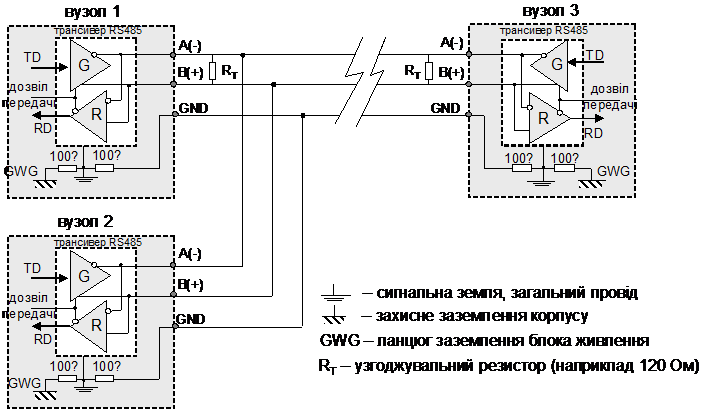
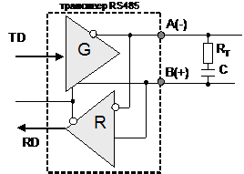
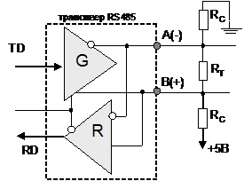

[Промислові мережі та інтеграційні технології в автоматизованих системах](README.md). 3. [РЕАЛІЗАЦІЯ ФІЗИЧНОГО РІВНЯ](3.md).

## 3.11. Інтерфейс RS-485 (EIA/TIA-485)

Даний стандарт був сумісно розроблений двома асоціаціями EIA і TIA. Оскільки всі свої стандарти EIA маркувала як RS, то популярна назва стандарту RS-485, однак офіційна - EIA/TIA-485, що ідентифікує дійсне походження даного стандарту. На сьогоднішній день різноманітні розширення стандарту RS-485 (надалі будемо називати його так) охоплює широку різноманітність доповнень.

Все що стосується електричних характеристик стандарту RS-422A справедливо і для RS-485: використовується збалансована система зв’язку з тими ж рівнями сигналу, за винятком синфазної напруги, яку витримує інтерфейс – від +12В до -7В. Тому даний інтерфейс сумісний зі своїм попередником (зворотна сумісність не підтримується).

На відміну від свого попередника RS-422А, інтерфейс RS-485 розрахований на багатоточкове з’єднання, тобто на побудову шинних топологій. Перш за все на трансиверах крім інформаційних сигналів RD та TD з’явився додатковий сигнал управління передачі/прийому (рис.3.32). Тепер, при закінченні передачі пристрій може відключити свій передавач (перевести його в високоімпедансний стан), і надати можливість іншим трансмітерам підключатися для передачі. Іншими словами сигнал дозволу передачі переводить траснмітер з активного стану в пасивний, тобто передавач може генерувати логічну „1”, логічний „0” або знаходитись в пасивному стані. В який час і в якому порядку передавачі вузлів будуть доступатися до шини стандарт не оговорює, дане питання повинне вирішуватись на канальному рівні (організація доступу до шини). Реалізація інтерфейсу повинна забезпечити працездатність обладнання при короткочасних колізіях (коли два передавача займають одночасно шину), що, до речі, теж не описано в стандарті.

При розробленні даного стандарту розраховували на більшу кількість можливих приймачів. Один трансмітер розрахований на 32 одиниці наванта-ження, які в свою чергу, визначаються як вхідний імпеданс (опір) одного стандартного приймача (12 кОм). Таким чином стандартний передавач може обслуговувати 32 приймача з опором 12 кОм, які підключені до загальної шини паралельно. Якщо приймачі мають більш високий опір, наприклад 48 кОм (4  12 кОм), то до однієї шини можна підключити відразу 128 таких приймачів, при збільшенні опору до 96 кОм – 256 приймачів і т.д. Слід розуміти, що збільшення імпедансу приймача робить систему чутливою до завад. 

### 3.11.1. Схеми з’єднання

На рис.3.32 показана функціональна схема з’єднання 3-х пристроїв до загальної шини через RS-485 інтерфейс. Напівдуплексна система дозволяє в один момент часу вузлу передавати інформацію, а в інший приймати. Передавач та приймач кожного вузла підключається до єдиної шини, тобто контакт „А” кожного передавача та контакт „А’ ” кожного приймача (штрихом позначені контакти приймачів) підключаються до загального лінії „А”, так само і контакти „В” та „В’ ” підключаються до лінії „В”. Таким чином, коли передавач одного вузла передає послідовність бітів, всі приймачі інших вузлів їх приймають. В один момент часу тільки один передавач може бути активним, його стан управляється з боку самого пристрою дозволом передачі. 

RS-485 не визначає вимоги до середовища передачі. Як правило використовують екрановану виту пару. На рис.3.32 показана 3-х провідна схема, однак на практиці нерідко використовують 2-х провідну (без сигнальної землі). 

 

Рис. 3.32. Функціональна схема трьохпровідного пів-дуплексного з’єднання вузлів по RS-485

Таке з’єднання дозволяється, якщо різниця потенціалів між „землями” вузлів не перевищує певний діапазон. Для реалізації 2-х провідної схеми з’єднання достатньо однієї витої пари, трьох-провідної – подвійної витої пари (пара сигнальних проводів, пара земляних). 

Швидкість передачі даних вибирається в залежності від сумарної довжини лінії, характеристик кабелю, і, як правило, приводиться в документації до обладнання у вигляді номограм.   

### 3.11.2. Схеми узгодження

При великих швидкостях і при значних відстанях необхідно вирішити проблему відбиття сигналу на кінцях лінії. Нагадаємо, що основою для мінімізації відбиття є використання узгоджуючих резисторів з номіналами, які відповідають хвильовому опору кабелю. Як правило в промислових мережах використовують кабель з характеристичним імпедансом 120 Ом, тому на схемі на рис.3.32 на обох кінцях шини між лініями „А” і „В” підключений узгоджувальний резистор (термінатор) з відповідним опором. 

На практиці виникає необхідність паралельного підключення до шини джерела постійного струму (розглянуто нижче). Резистори представляють активний опір, тому розсіють певну потужність, що вимагає використання більш потужних джерел струму. Це спонукає до використання альтернативних схем узгодження. 

Добавлення конденсатора послідовно з резистором виключає протікання постійного струму, і не створює бар’єру для високочастотного сигналу (рис.3.33.а). Такий спосіб вимагає клопіткого підбору ємності для забезпечення уникнення ефекту відбиття. Альтернативний варіант зменшення споживаної потужності - використання діодів Шотки (рис.3.33.б).

Рис. 3.33. Альтернативна схема RC узгодження 

### 3.11.3. Забезпечення захисного зміщення

 Реалізація інтерфейсу передбачає, що при відсутності бітів для передачі трансмітер переходить у високоімпедансний стан. При сигнальній "тиші" всі трансивери на шині будуть працювати в режимі прийому. Оскільки жоден трансмітер не буде генерувати сигнал, на шині буде 0 В. Для більшості мереж, зокрема для тих, які працюють в символьному режимі, відсутність передачі обов’язково позначається певним рівнем сигналу, наприклад логічною "1". Однак при напрузі на входах приймачів від  -200мВ до 200мВ, вихідний стан залишається невизначеним, іншими словами це означає обрив зв’язку. У цьому випадку логічна „1” або „0” на виході RD приймачів рівноймовірні (або запам’ятовують попередній стан). 

Така ситуація неприпустима. В момент інформаційної тиші необхідно тримати сигнал напруги певної величини за допомогою зовнішнього джерела постійного струму, який підключається між сигнальними проводами A та B, тобто необхідно забезпечити зміщення потенціалу відносно нуля.

  Всю лінію можна представити як замкнутий ланцюг із опорів ресиверів та двох термінаторів, що підключені паралельно. Задача захисного зміщення зводиться до забезпечення цього ланцюгу таким струмом, щоб напруга на ній була в межах, що відповідає логічній "1", тобто >200мВ. В більшості випадків підключають джерело напруги 5 В, і підбирають такі шунтуючі опори, щоб забезпечити ланцюг необхідним струмом. Ці опори отримали назву резисторів захисного зміщення (bias resistors): резистор завдання початкового високого рівня (pullup) – на одній лінії, наприклад „В”, і низького рівня (pulldown) – на другій лінії, наприклад „А” (рис.3.34). Значення опору резистора зміщення залежить від виду узгодження (термінування) і кількості вузлів тобто приймачів, підключених до шини. Номінали опорів зміщення розраховують виходячи з необхідного мінімального струму зміщення в мережі для забезпечення різниці потенціалів між А і В >200мВ у такій послідовності:

1. Розраховується загальний опір лінії, який складається з опору всіх приймачів (як правило 12 кОм кожний) та опору термінаторів (як правило 120 Ом).

2. Розраховується мінімальний струм для 200 мВ: Iзм=Uзм/Rл (Uзм=200 мВ, Rл – обрахований в п.1.);

3. Розраховується необхідний сумарний опір лінії: Rлн=Uж/I, де Uж – напруга живлення зміщення (як правило 5В), Iзм – мінімальний струм з п.2;

4. Визначається номінал резисторів зміщення: Rзм= (Rлн-Rл)/2.

 Рис. 3.34. Використання резисторів захисного (RC) зміщення разом з узгоджувальними резисторами (RT)

Приклад 3.3. Реалізація фізичного рівня. Розрахунок номіналів резисторів зміщення. 

Завдання. Розрахувати номінал резисторів захисного зміщення для мережі на основі RS-485 яка має 10 вузлів на шині (по 12 кОм кожний приймач) і 2 узгоджувальні резистори по 120 Ом. 

Рішення.  

1) 10 приймачів опором 12 кОм, з’єднаних паралельно та 2 термінатора дають сумарний опір:

загальна провідність = 1/12000  10 + 1/120  2 = 21/1200 См; 

загальний опір = 57 Ом 

2) Мінімальний необхідний струм:

   Iзм=200мВ/57 Ом ≈ 3.5 мА. 

3) Необхідний опір лінії не повинен перевищувати 

   Rлн=5В2/3.5 мА≈1428 Ом. 

4) Віднімемо 57 Ом, які вже в нас є і отримаємо: 

  1371Ом / 2 = 685 Ом для кожного резистора.    

Резистори захисного зміщення можуть бути встановлені на будь-якому вузлі мережі або бути розподіленими між декількома вузлами. Опір всіх резисторів захисного зміщення в системі повинен бути меншим чи дорівнювати розрахованому значенню. Надмірно високий їх опір приводить до недостатнього зміщення, а отже до неправильної роботи системи, малий – приводить до підвищення навантаження на передавачі.

<-- 3.10. [Інтерфейс RS-422A (EIA-422A)](3_10.md) 

--> 3.12. [Інтерфейс „струмова петля” 20 мА (Current Loop, ИРПС)](3_12.md) 