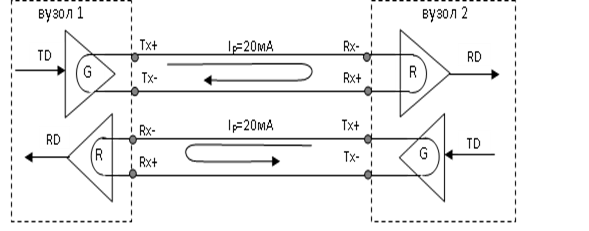
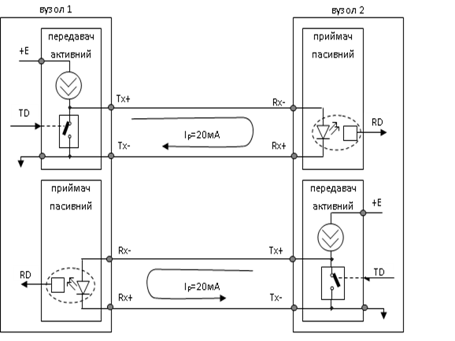
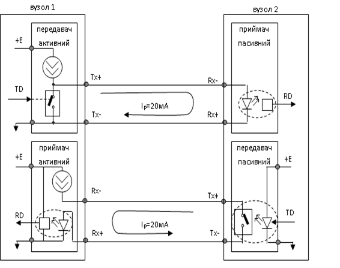

[Промислові мережі та інтеграційні технології в автоматизованих системах](README.md). 3. [РЕАЛІЗАЦІЯ ФІЗИЧНОГО РІВНЯ](3.md).

## 3.12. Інтерфейс „струмова петля” 20 мА (Current Loop, ИРПС)

Вище були розглянуті інтерфейси, які використовували в якості носія інформації напругу. При великих відстанях краще використовувати струм. Коротко зупинимося ще на одному популярному інтерфейсі, який носить назви: 20mА Current Loop (CL, струмова петля) і ИРПС 20мА (Интерфейс Радиальный ПоСледовательный). 

Для передачі логічного „0” в інтерфейсі використовують струм 0мА, логічної „1” – 20мА, тому в назву інтерфейсу добавляють „20мА”. Оскільки передача ведеться по символам, то коли передавач мовчить, він виставляє на лінію логічну „1”. Таким чином довготривалий сигнал 0мА ідентифікується як розрив.

 

Рис. 3.35. Функціональна схема дуплексного з’єднання двох вузлів по струмовій петлі

Струмова петля передбачає дуплексне з’єднання. На рис.3.35 умовно зображена функціональна схема такого з’єднання в тому форматі, в якому були приведені до цих пір всі інтерфейси.

Насправді існують схеми використання даного інтерфейсу для побудови шинних топологій. Причому максимальна довжина лінії зв’язку *збільшується* при збільшенні кількості вузлів в мережі. 

Використовують дві схеми з’єднання пристроїв: 

-          з активним передавачем та пасивним приймачем;

-          з активним передавачем та активним приймачем.

Відрізняють ці схеми способом живлення ліній зв’язку. Розглянемо першу схему, зображену на рис.3.36, де генератор струму знаходиться в приймачах. 

Сигналом TD управляється умовний контакт, який замикає або розмикає лінію. Оскільки струм йде по шляху найменшого опору, то при замиканні лінії він не буде циркулювати через приймач іншого вузла. В протилежному випадку, якщо контакт розімкнений, по лінії піде струм 20мА, який пройде через світлодіод приймача. Останній використаний разом з світлочутливим елементом (скажімо фотодіодом) в якості гальванічної розв’язки і називається **оптопарою**. Таким чином, якщо контакт вузла 1 розімкнений - в світлочутливому елементі вузла 2 наведеться струм, і приймач видасть на RD логічну „1”. Принцип передачі в зворотному напрямку аналогічний.

 

Рис. 3.36. Використання схеми типу активний передавач – пасивний приймач.

В іншій схемі з’єднання, яка показана на рис.3.37, відмінність полягає в реалізації схеми приймача вузла 1 і передавача вузла 2. Як бачимо вузол 1 має активний передавач і активний приймач, тобто обидва живлять лінії зв’язку. 

 Рис. 3.37. Використання схеми типу активний передавач – активний приймач.

В табл.3.3 наведена залежність максимальні відстані при певній бітовій швидкості для обох наведених вище схем. Як бачимо при швидкості 9600 біт/с, яка найбільш часто зустрічається в промислових мережах реалізованих на стандартних послідовних інтерфейсах, можна досягнути відстані декількох кілометрів (правильніше сказати навпаки: при значній відстані можна досягнути великих швидкостей).

*Таблиця 3.3*  Залежність максимальної довжини лінії від швидкості передачі

| Швидкість  біт/с                     | Максимальна відстань (м)             |       |
| ------------------------------------ | ------------------------------------ | ----- |
| Активний передавач/ пасивний приймач | Активний передавач/ активний приймач |       |
| 1 152 000                            | 150                                  | 50    |
| 230 400                              | 300                                  | 150   |
| 115 200                              | 600                                  | 300   |
| 57 600                               | 800                                  | 400   |
| 38 400                               | 1100                                 | 550   |
| 19 200                               | 2000                                 | 1000  |
| 14 400                               | 2600                                 | 1300  |
| 9 600                                | 3400                                 | 1700  |
| 300                                  | >3400                                | >1700 |

 

<-- 3.11. [Інтерфейс RS-485 (EIA/TIA-485)](3_11.md) 

--> 3.13. [Порівняльна характеристика стандартних послідовних інтерфейсів](3_13.md) 