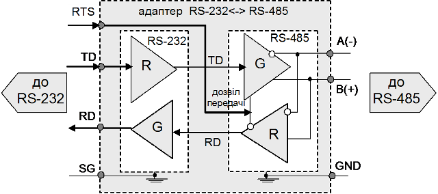
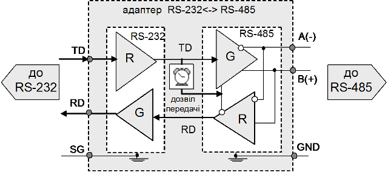

[Промислові мережі та інтеграційні технології в автоматизованих системах](README.md). 3. [РЕАЛІЗАЦІЯ ФІЗИЧНОГО РІВНЯ](3.md).

## 3.14. Використання адаптерів-перетворювачів інтерфейсів

### 3.14.1. Типи адаптерів-перетворювачів

Однією з проблем в області промислових мереж є апаратна несумісність її складових. Розглянемо це питання більш детально. 

Описані вище послідовні інтерфейси складають далеко не повний перелік інтерфейсів фізичного рівня. На фізичному рівні нерідко використовуються унікальні інтерфейси. Однак навіть для мереж, які базуються на стандартних послідовних інтерфейсах, нерідко виникає задача в об’єднані пристроїв з різними реалізаціями фізичного рівня. Для вирішення такої задачі існують адаптери-перетворювачі (конвертери) інтерфейсів. Адаптер можна представити у вигляді пристрою, що має два різні інтерфейси. Задача даного пристрою електрично перетворити вхідні сигнали RD одного інтерфейсу у вихідні TD іншого. 

Розглянемо можливі випадки з’єднань пристроїв з різними інтерфейсами:

- RS-422A <–> RS-485 – оскільки інтерфейси сумісні, то RS-485 може працювати в режимі RS-422A, але не навпаки. Для зворотного режиму необхідно допоміжні схемні рішення;

- RS-232 <–> Current Loop 20 mA – необхідний адаптер-перетворювач. Схемні рішення доволі прості в реалізації, виконуються або у вигляді окремого пристрою або плати в ПК;

- RS-232 <-> RS-485. Оскільки RS-485 не описує спосіб передачі даних то в даному випадку можливі дві ситуації: перетворювач для побітової та посимвольної передачі. У першому випадку реалізувати схему перетворення доволі складно і дорого. Як правило в RS-232 передача йде по символам, управління якою займається UART, а в побітовій передачі – все залежить від реалізації протоколу фізичного рівня. В посимвольній передачі використовується адаптер-перетворювач RS-232С <-> RS-485.

Зупинимося на принципах роботи адаптерів RS-232С <-> RS-485 більш детально, оскільки вони одні з найбільш поширених в промисловості. Нагадаємо, що передавачі в системі RS-485 повинні підтримувати можливість відключення від лінії зв’язку, якщо трансивер не передає дані. Однак передавачі RS-232 разом з UART при відсутності передачі видають логічну "1". Тобто, при звичайному схемному рішенні електричного перетворення сигналу з  RS-232 в RS-485, передавач RS-485 ніколи не відключиться, що недопустимо в шинних топологіях.

Таким чином в конвертері повинно бути забезпечене переключення передавача RS-485 зі сторони RS-232 в активний чи пасивний (високоімпедансний) стан. Виробники адаптерів вирішують цю проблему по різному. Розглянемо декілька способів.

### 3.14.2. Управління адаптером RS-232<->RS-485 зі сторони RS-232

Один із варіантів вирішення проблеми управління станом трансмітера RS-485 є використання одного з сигналів управління потоком зі сторони інтерфейсу RS-232C: RTS або DTR. 

На рис.3.38 показана модель перетворювача, який управляється сигналом RTS. На рисунку перетворювач умовно поділений на 2 частини з відповідними інтерфейсами. Коли пристрій з RS-232C має передавати дані, він активує передавач адаптера за допомогою RTS, виставляючи на цій лінії логічну „1”. Далі він надсилає послідовність бітів в символьному вигляді по лінії TD. Перетворювач за допомогою схемних рішень відсилає цей сигнал на передавач адаптера зі сторони RS-485. Оскільки той вже активований, цю ж послідовність він видає на лінію RS-485 інтерфейсу. Так буде тривати, поки пристрій зі сторони RS-232С не зніме „1” з RTS, що приведе до переключення передавача в високоімпедансний (неактивний) стан.

Рис. 3.38. Управління передавачем адаптера RS-232<->RS-485 сигналом RTS 

Алгоритм управління сигналом RTS для RS-232C може бути різним. Для комп’ю-терів, як правило, налаштову-ють роботу СОМ-порту так, щоб сигнал RTS виставлявся автоматично в „1”, коли буфер передачі заповнений байтами, і „0”, коли він пустий. Для СОМ-порту це нормальний режим роботи з апаратним управлінням потоком. Рідше використовується сигнал DTR.

При наведеному способі реалізації перетворювача можлива ситуація передчасного відключення сигналу RTS до передачі трансмітером RS-485  останнього біту. Такі проблеми повинні вирішуватись на пристрої зі сторони інтерфейсу RS-232C. Ще одна з проблем заключається в тому, що не всі пристрої вміють управляти сигналом RTS. У цьому випадку існує інший, більш універсальний спосіб управління передавачем адаптера.

3.14.3. Автоматичне управління адаптером RS-232<->RS-485

Цей метод у різних фірм називається по різному: Automatic Send Data Control (ASDC), Automatic Data Direction Control (ADDC), Automatic RTS Signal Control (ARSC), але всі вони базуються на принципі управління по сигналу даних, які передаються (рис.3.39). Тобто адаптер сам відслідковує, коли включати і коли відключати передавач по даним, які надходять зі сторони RS-232. Один з варіантів такої реалізації – відслідковування приймального буферу. Як тільки адаптер з боку RS-232 отримав перший біт символу (стартовий біт) − відразу активує передавач. Оскільки біт в стані логічної „1” не може триматися більше часу одного символу, то після паузи відсутності логічного „0” протягом певного часу (не менше тривалості одного символу), конвертер буде ще тримати передавач в активному стані, після чого переведе його в високоімпедансний стан. Якщо затягнути цю паузу, може виникнути ситуація, коли інший передавач в системі зі сторони RS-485 захоче передати дані (адже лінія вже звільнилася) і виникне колізія. 

Рис. 3.39. Управління передавачем адаптера за сигналом даних, що передаються

Адаптери з управлінням по сигналу даних по приймальному буферу користуються більшою популярністю ніж адаптери з управлінням сигналами RTS чи DTR. 

Ще один з методів управління передавачем, який не знайшов широкого використання, по сигналу зі сторони пристрою з інтерфейсом RS-485. Останній для цього повинен мати спеціальну сигнальну лінію (аналогія з RTS), яка передбачена саме для цього. Коли пристрій з RS-485 планує передавати дані, він переводить перетворювач в стан прийому, тобто вимикає передавач. Специфіка таких перетворювачів заключається в тому, що використати їх можна тільки в режимі точка-точка, що сильно звужує коло їх використання. Такий перетворювач не накладає ніяких вимог по управлінню на пристрій з RS-232C, що звісно ж таки повинно компенсуватись зі сторони RS-485.  

<-- 3.13. [Порівняльна характеристика стандартних послідовних інтерфейсів](3_13.md) 

--> 4.[ТЕХНОЛОГІЇ МОДЕМНОГО ТА БЕЗПРОВОДНОГО ЗВ’ЯЗКУ](4.md)

## Контрольні запитання до розділу 3

1. Які задачі накладені на фізичний рівень промислової мережі?

2.        З яких основних складових складається фізичний канал передачі даних:

3.        В яких режимах може проходити перенос даних через лінію зв’язку? Поясніть принципи роботи цих режимів.

4.        Які характеристики кабелю враховують при його виборі для промислової мережі?

5.        З чого складається еквівалентна схема кабельної лінії передачі? Чим зумовлена наявність комплексного опору та комплексної провідності і від чого вони залежать?

6.        Розкажіть про природу явищ погонного опору, поверхневого ефекту, ефекту близькості та реактивної ємності при передачі високочастотного сигналу.

7.        В яких робочих областях може знаходитись режим роботи кабелю при різних частотах? Чим вони характеризуються і від чого залежить знаходження в робочій області?

8.        Дайте визначення хвильовому опору, характеристичному хвильовому опору, коефіцієнту затухання.

9.        Назвіть причини ефекту відбиття сигналу. Як цей ефект впливає на передачу сигналу, які способи боротьби з ним?

10.      Які типи електричних кабелів використовуються в промисловій автоматизації?

11.      Наведіть приклади типових джерел електромагнітних завад для передачі сигналу по електричним кабелям в промислових умовах експлуатації? Які типи дій вони проводять на лінії передачі?

12.      Яким чином можна зменшити дію різних типів електромагнітних завад?

13.      Як враховується типи кабелів при їх прокладці?

14.      Розкажіть про необхідність заземлення екрану кабелів? Які схеми заземлення використовують для кабелів промислових мереж? Розкажіть про переваги та недоліки кожного способу.

15.      Поясніть про необхідність еквіпотенціального з’єднання. Яким чином воно реалізовується в межах будівлі та між будівлями?

16.      Розкажіть про правила заземлення екрану мережного кабелю при підводу до щита, до клемної колодки та про заземлення екрану роз’ємів.

17.      Які способи передачі сигналу електричними сигналами Ви знаєте? В чому особливості передачі сигналу по напрузі збалансованим та незбалансованим способом?

18.      Яким чином передається сигнал по оптоволоконному кабелю? Які типи оптоволоконних кабелів ви знаєте? Які переваги та недоліки використання оптоволоконного середовища порівняно з електричними кабелями?

19.      Коли необхідно використовувати бездротовий зв’язок? В чому його переваги та недоліки?

20.      Яке кодування використовують при безпосередньому способі передачі бітів? В чому переваги та недоліки цих методів порівняно один з одним?

21.      Які способи модуляції використовуються в цифрових мережах?

22.      Поясніть в чому необхідність синхронізації. Що таке синхронна та  асинхронна передача на фізичному рівні?

23.      Яке призначення всіх службових бітів при символьній передачі?

24.      Що таке схеми UART і яке місце вони займають в процесі зв’язку на фізичному рівні?

25.      Які способи з’єднання між пристроями доступні при використанні інтерфейсу RS-232? Що таке нуль-модемне з’єднання?

26.      Перерахуйте електричні характеристики інтерфейсу RS-232. Які основні недоліки даного інтерфейсу?

27.      Які типи роз’ємів визначені інтерфейсом RS-232? Розкажіть про призначення всіх контактів 9-пінового роз’єму.

28.      Яким чином організовується управління потоком даних при символьному способі передачі по RS-232?

29.      Перерахуйте електричні характеристики RS-422. Які основні переваги даного інтерфейсу порівняно з RS-232?

30.      Перерахуйте електричні характеристики RS-485. Які основні переваги даного інтерфейсу порівняно з RS-422?

31.      Які схеми з’єднання використовуються з інтерфейсом RS-485? 

32.      Які схеми терімнування використовуються з інтерфейсом RS-485?

33.      Розкажіть про призначення захисного зміщення при використанні шинних топологій на базі інтерфейсу RS-485. Як розраховуються резистори захисного зміщення?

34.      Перерахуйте електричні характеристики інтерфейсу "струмова петля". Які переваги та недоліки даного інтерфейсу порівняно з іншими?

35.      В яких випадках необхідно використовувати адаптери-перетворювачі інтерфейсів? Які адаптери найчастіше використовуються?

36.      Поясніть про необхідність в управлінні передавачем RS-485 в адаптері RS-232<->RS-485. Якими способами вирішується дана проблема.