[Промислові мережі та інтеграційні технології в автоматизованих системах](README.md). 3. [РЕАЛІЗАЦІЯ ФІЗИЧНОГО РІВНЯ](3.md).

## 3.2. Використання металевих кабелів

Найбільш дешевий і надійний спосіб передачі – з’єднання передавачів та приймачів металевим кабелем. Носієм сигналу по проводу може бути струм, або напруга. Пропускна здатність металевого кабелю залежить від його характеристик, пов’язаних з фізичними особливостями самого кабелю та середовища в якому він знаходиться. При виборі металевого кабелю для конкретної промислової мережі враховують наступні характеристики:

-    тип (вита пара, коаксіальний);

-    основні електричні характеристики:
     - хвильовий опір (Ом);

     - погонний опір (Ом/км);   

     - погонна ємність (Гн/км);

-    додаткові електричні характеристики:

     - коефіцієнт затухання (Дб/км);

     - погонний опір екрану (Ом/км);

-    оболонка (матеріал, діаметр, колір)

-    діапазон температур (робочий, збереження, транспортування);

-    радіус ізгину (однократний, багатократний);

-    наявність галогену в ізоляції;

-    пожежобезпечність;

-    стійкість до агресивних середовищ;

-    інші додаткові характеристики.

Дані характеристики а також ціна являються критеріями вибору для конкретного кабелю. В більшості випадків основні характеристики конкретного типу кабелю вказують та рекомендують самі розробники технічних засобів для промислової мережі. Однак в ряді випадків, проектанту приходиться зустрітися з ситуаціями, що ускладнюють правильний вибір рішення. Наведемо декілька випадків. 

1) Виробники технічних засобів для промислових мереж не вказують необхідні характеристики кабельної продукції. У цьому випадку необхідно підібрати кабель по характеристикам сигналів, властивостям трансиверів, зовнішнього середовища які повинні бути відомі. 

2) На підприємстві  є в наявності кабель і необхідно прийняти рішення про можливість його використання у даній мережі. Необхідно визначити обмеження на використання даного кабелю для вибраної промислової мережі, в дійсних умовах експлуатації.

3) Необхідно зростити декілька різних кабелів. Задача вирішується аналогічно попередній, з вибором необхідних додаткових матеріалів та способів зрощення.

Задача вирішення даних проблем виходить за рамки даного посібника. Ми зупинимося тільки на більш загальних характеристиках кабелів та правилах їх монтажу. 

### 3.2.1. Фізичні властивості кабельної лінії передачі

#### 3.2.1.1. Модель кабельної лінії передачі.

Канал зв’язку з використанням металевого кабелю можна представити у вигляді джерела живлення та лампи, які з’єднані між собою двома провідниками (рис.3.3). Тоді трансмітер представляється як джерело живлення з контактом, який управляється логічним станом TD, а ресивер – лампою, світло якої визначає логічний стан RD. Таким чином при замиканні контакту TD коло замкнеться, і по лінії зв’язку пройде струм, який приведе до загорання лампи, тобто зміни логічного стану RD. Таке представлення дуже спрощене і не однозначне, однак дає можливість просто перейти до детального розгляду явищ, які проходять по всій довжині каналу зв’язку.      

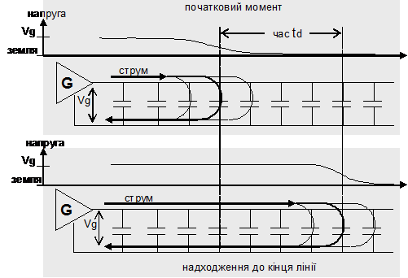  

Рис. 3.3. Еквівалентна схема кабельної лінії передачі

На рис. 3.3 трансмітер і ресивер з’єднуються прямим (інформаційним) та зворотнім проводом (землею). Таке з’єднання типове для багатьох промислових мереж. Провідники, якими з’єднують трансмітери вузлів об’єднуються в кабелі, конструкція та параметри яких значно впливають на передачу електричних сигналів. Для розуміння фізичних процесів, які проходять в кабелі, еквівалентну електричну схему двохпровідного кабелю, показаного на рис. 3.3, представимо як послідовно з’єднані між собою ланки, кожна з яких являє собою комбінацію двох величин (рис.3.4.):

-     комплексного опору (імпедансу) z, який увімкнено послідовно в ланцюг (Ом/м);

-     комплексної провідності (провідності ізоляції), яка з’єднує два проводи між собою (у См/м - Сіменс/метр, 1 Сіменс=1/Ом).

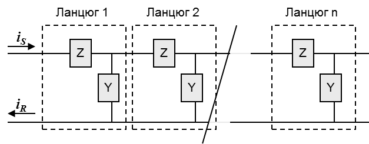

Рис. 3.4. Еквівалентна електрична схема кабельної лінії передачі

#### 3.2.1.2. Комплексний опір. 

Комплексний опір кабелю визначається послідовним активним опором провідників та реактивною складовою. Активний опір провідників це опір постійному струму, який залежить від форми, діаметру та матеріалу провідника. В специфікаціях для кабелю вказується його погонний опір RDC, тобто опір на одинцю довжини (наприклад Ом/км). Він є сумою опорів по постійному струму прямого та зворотного провідників. 
Природа реактивного опору має індуктивний характер. На рис.3.5. провідник показаний з умовним розрізом по якому тече струм I. 

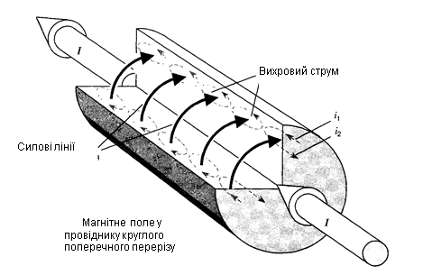

Рис. 3.5. Явище поверхневого ефекту

Об’ємною стрілкою на провіднику показаний напрямок струму. Змінний струм породжує змінне магнітне поле, силові лінії якого проходять через об’єм провідника і створюють в ньому замкнуті вихрові індукційні струми. Збільшення частоти струму приводить до пропорційного збільшення магнітного поля. Як видно з рис.3.5 напрямок вихрових струмів всередині провідника протилежний напряму основного струму, а напрямок вихрових струмів у зовнішній частині провідника співпадає з напрямом основного струму. Зі збільшенням частоти струму індуктивні струми будуть зростати, що приведе до зменшення сили струму всередині провідника і збільшення сили струму біля поверхні. Розглянуте явище носить назву поверхневого ефекту. На дуже високих частотах струм, внаслідок поверхневого ефекту, взагалі витісниться в тонкий приповерхневий шар провідника. 

Інша складова індуктивного опору пов’язана з взаємним впливом провідників з високочастотним струмом, які знаходяться один біля одного (рис.3.6). Змінні магнітні поля цих провідників наводять індукційні струми один в одному. Цей ефект має назву ефекту близькості. При дії ефекту близькості на поверхнях провідників, які повернуті один до одного густина струму збільшується, а на інших сторонах навпаки зменшується. 

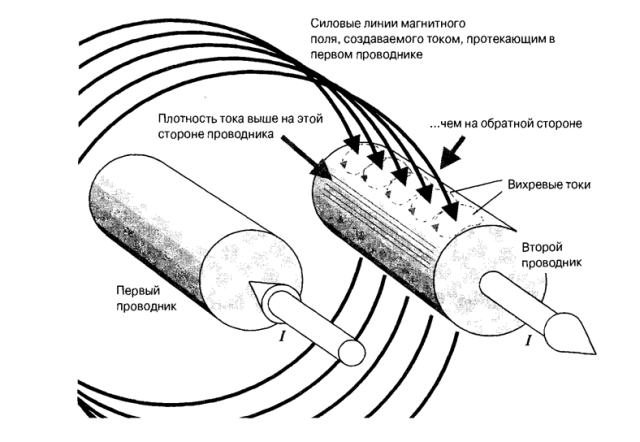

 Рис. 3.6. Взаємний вплив індуктивностей провідників

Таким чином послідовний комплексний опір враховує послідовний опір сигнального проводу, послідовний опір шляху, по якому проходить зворотній струм та індуктивність витка струму, який створений прямим та зворотними струмами.

#### 3.2.1.3. Комплексна провідність.

Комплексна провідність теж складається з двох складових: активної провідності, яка обумовлена витоком струму через ізоляцію, та реактивної ємності. Ємність виникає внаслідок близького розміщення двох ізольованих провідників, по яким тече струм. 

Ємність лінії значно впливає на тривалість фронтів сигналів. Якщо представити ідеалізовану лінію зв’язку з нульовим комплексним опором, по якому передається сигнал, то з моменту виникнення переднього фронту біта до моменту його надходження до кінця лінії, розподіл струмів та напруг вздовж лінії буде мати вигляд вказаний на (рис.3.7). За час td хвиля збудження переміститься на відстань vtd. Біля переднього фронту струм тече через місцеву паразитну ємність лінії, змінюючи її стан, і по зворотному провіднику повертається до джерела імпульсу. В кожен момент часу струм йде на зарядку паразитної ємності тієї ділянки лінії, де знаходиться передній фронт. Струм тече через ємності тільки в момент появи фронту, оскільки тут змінюється напруга. Тобто з першого моменту виникнення напруги на лінії виникає струм, який заряджає першу ємність і повертається до джерела. Потім те саме відбувається з іншими ємностями. Звичайно, вхідні та вихідні струми ємності рівні за величиною. Це значить, що з самого початку струм не тече по сигнальному провіднику до самого кінця лінії, щоб потім вернутись назад. Навпаки, з самого початку вхідний та вихідний струм завжди пов’язані один з одним (нерозривність потоку). Коли фронт імпульсу досягає кінця лінії, прямий та зворотній струми вздовж всієї лінії вже мають усталене значення.  

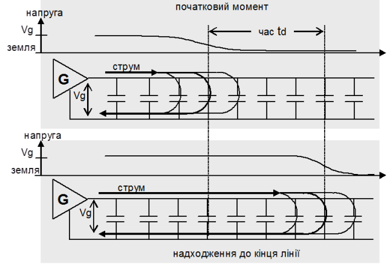

Рис. 3.7. Ємнісний ефект лінії зв’язку 

Розглянемо ідеалізовану лінію, по якій передається короткий імпульс (рис.3.8). Проходження переднього фронту сигналу продемонстровано вище. При проходженні заднього фронту, що аналогічно падінню напруги на відповідних ємностях, ємності будуть розряджатись, а їх струми йти на зарядку ємностей по передньому фронту. Таким чином загальна картина розподілу струмів буде нагадувати гусеницю танку, яка рухається зі сторони трансмітера до кінця лінії.  

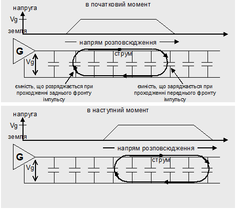

Рис. 3.8. Розподіл струму при короткому імпульсі 

#### 3.2.1.4. Розкрита еквівалентна схема кабельної лінії передачі. 

Кожна ланка являє собою одиничну довжину лінії, яка для кабельних з’єднань може представлятися в кілометрах або метрах. Тоді для кожного одиничної дільниці кабелю:

-     z визначається послідовним з’єднанням активного опору (R) та індуктивності (L);

-     y визначається паралельним з’єднанням активної провідності (G) та ємності (C).

Розкрита еквівалентна схема кабельної лінії представлена на рис.3.9.  

При відомих z та y рівняння для еквівалентної схеми дозволяють визначити вхідний імпеданс (опір) та частотну характеристику всієї структури. По цим величинам можна розрахувати реакцію системи на будь-який цифровий вхідний сигнал. 

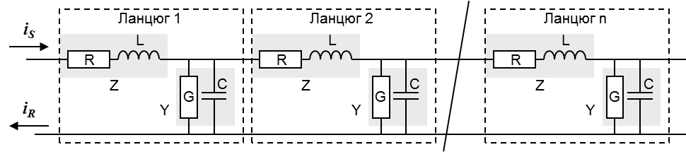

 Рис. 3.9. Розкрита еквівалентна схема кабельної лінії передачі

### 3.2.2. Електричні характеристики кабельної лінії передачі

#### 3.2.2.1. Робочі області кабельної лінії передачі. 

В різних областях частот кабель проявляє різні характеристики. Як видно з рис.3.10 діапазони областей розміщуються в такому порядку:

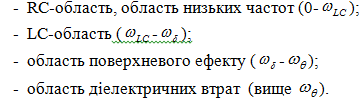

На достатньо низьких частотах, тобто в LC-області, величина індуктивного опору дуже мала порівняно з активним опором по постійному струму. Тому все, що проходить нижче цієї межі визначається опором лінії та її ємністю.

Збільшення частоти призводить до збільшення індуктивного опору кабелю, і в кінці кінців перевищує омічний опір лінії. Лінія переходить в робочу область LC. 

При наступному збільшенні частоти внутрішня індуктивність провідників стає значною, порівняно з їх активним опором. Це викликає зміну розподілу струму по об’єму провідників, що є ознакою області поверхневого ефекту.

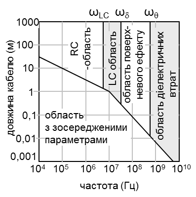

Рис. 3.10. Робочі області в залежності від частоти

При значній частоті, лінія зв’язку переходить в область діелектричних втрат, в якій проявляються значні діелектричні втрати, сумірні з резистивними втратами. 

Розподіл частот у робочій області дозволяє для конкретного випадку використовувати конкретну модель розрахунку для кабелю. Промислові мережі в більшості випадків працюють в області частот 10 кбіт/с – 10 Мбіт/с, що при методі передачі NRZ еквівалентна приблизно 5 кГц -5 МГц. Це значить що промислові мережі при лініях зв’язку порядку 10-1000 м попадають в RC, частково в діапазон переходу з RC в LC область. 

В зв’язку з тим, що значення деяких еквівалентних параметрів для кожного кабелю залежить від частоти, їх можуть не приводити у специфікації. Для більшості кабелів в технічній документації приводять такі характеристики:

-    характеристичний хвильовий опір (Ом);

-    коефіцієнт затухання (дБ/км);

-    погонний опір (Ом/км);

-    погонна ємність (Гн/км);

#### 3.2.2.2. Хвильовий опір. 

Хвильовий опір ZC – це опір лінії зв’язку електромагнітній хвилі при відсутності відбиття від кінців лінії. В кожній точці хвилі, яка поширюється з одного кінця лінії зв’язку в інший, напруга та струм змінюються, однак відношення між ними залишаються постійними. Це відношення напруги до струму і є хвильовим опором. Хвильовий опір визначається для всієї лінії, в будь якій точці, якщо її параметри незмінні по довжини лінії.

Доведено, що хвильовий опір можна визначити за наступним відношенням:

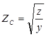       або   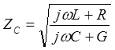  (3.1)

З (3.1) та рис.3.11 видно, що хвильовий опір лінії залежить від всіх її електричних параметрів та частоти. 

#### 3.2.2.3. Характеристичний хвильовий опір. 

На високих частотах величинами R та G можна знехтувати, тоді відношення в (3.1) буде прямувати до відношення індуктивності та ємності, тобто:

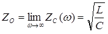               (3.2)

Величину Z0 називають номінальним або характеристичним хвильовим опором (Characteristic impedance). В характеристиках кабелю зв’язку вказують саме це значення хвильового опору. 

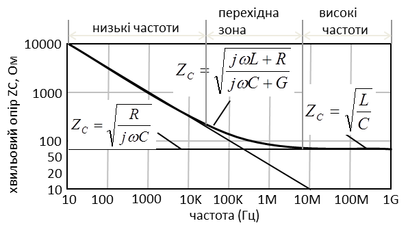

Рис. 3.11. Залежність хвильового опору кабелю від частоти сигналу.

3.2.2.4. Коефіцієнт затухання. По мірі розповсюдження сигналу по лінії він послаблюється в декілька разів на кожній одиниці довжини. При незмінних параметрах кабелю по всій його довжині, коефіцієнт затухання залишається незмінним на кожній ділянці лінії, однак він залежить від частоти. Коефіцієнт затухання приймають на певну одиницю довжини, наприклад (дБ/км). Для сигналу по напрузі коефіцієнт затухання розраховується за формулою:

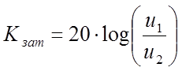, дБ               (3.3)

де u1 та u2 - напруга сигналу відповідно на вході та виході кабелю.

В каталогах на кабельну продукцію коефіцієнт затухання можуть приводити для різних частот. 

Приклад 3.2. Реалізація фізичного рівня. Розрахунок необхідного коефіцієнта затухання. 

Завдання. Розрахуйте необхідний коефіцієнт затухання для кабелю, призначеного для з’єднання трансмітера та ресивера двох вузлів, при наступних умовах: 

-    швидкість передачі даних 19200 біт/с;

-    використовується пряме кодування бітів NRZ; 

-    відстань – 1200 м;

-    при мінімальній напрузі на виході трансмітера 1,5 В, мінімальна напруга на вході приймача повинна складати не менше 0,2 В.

Рішення. Розрахунок коефіцієнта затухання кабелю:  

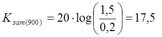дБ на 1200 м

Коефіцієнт затухання на 1 км буде:

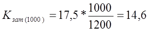дБ/км

При прямому кодуванні, швидкість 19200 біт/с приводить до максимальної частоти 10 кГц (9600 Гц). Для більшості кабелів типу вита пара коефіцієнт затухання при такій частоті нижче вказаної, а отже більшість кабелів підходять для даного з’єднання. 

#### 3.2.3. Відбиття сигналу та способи їх подолання

На рис.3.12. показана загальна еквівалентна схема передачі сигналу. Вона складається з вихідного імпедансу джерела ZS, вхідного імпедансу лінії зв’язку (кабелю) Z0 та імпедансу навантаження ZL. Еквівалентна схема кабелю зв’язку показана на рис.3.9. Як видно з цієї схеми вона являє собою коливальний контур. Отже при подачі одиничного імпульсу по кабелю будуть йти коливання, спричинені наявною ємністю та індуктивністю даного кабелю. Тобто струм, дійшовши до кінця лінії частково розсіється на навантаженні, а інша частина повернеться назад. Відбитий сигнал повертається до джерела, частково розсіюється на ньому, після чого повторно відбивається. Сигнал буде "гуляти" з одного кінця в інший до тих пір, поки повністю не розсіється імпедансами передавача та приймача. Ефект відбиття негативно впливає на передачу, оскільки відбитий сигнал буде спотворювати корисний сигнал. 

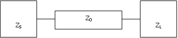

Рис. 3.12. Загальна еквівалентна схема передачі сигналу

Розглянемо, яким чином можна подолати дану проблему. Відносна амплітуда сигналу, яка відбивається по напрямку джерела сигналу, описується наступною функцією:

​                     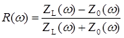                     (3.4)

Як видно із (3.8) сигнал відбиття можна повністю погасити, зробивши опір приймачів ZL рівним хвильовому опору кабелю Z0.  

В шинних топологіях приймачі розміщені по всій довжині лінії. Тому для усунення ефекту відбиття в кінці лінії ставлять резистори з номіналом, рівним характеристичному хвильовому опору кабелю. Якщо трансмітери знаходяться в різних ділянках кабелю (не на одному кінці) то необхідно ставити резистори в обох кінцях кабелю. Для боротьби з відбиттям сигналів можуть використовуватися і інші схемні рішення. Загальна назва цих засобів – термінатори лінії. Слід зазначити, що хвильовий опір лінії зв’язку залежить від частоти (3.1), тому для роботи в широкому діапазоні частот задача розрахунку термінатора стає не такою тривіальною.

Для коротких ліній зв’язку термінатори не потрібні, оскільки ефект відбиття не відчутний. Лінія може вважатися короткою, якщо дотримується нерівність:

​                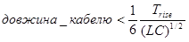 ,                     (3.5)

 де Trise - довжина фронту сигналу (с), L,C - відповідно погонна індуктивність (Гн/м) та погонна ємність (Ф/м). 

#### 3.2.4. Типи електричних кабелів

В промислових мережах як правило використовують два типи електричних кабелів: вита пара та коаксіальний кабель.

Вита пара – пара проводів, які ізольовані один від одного, мають однакову довжину і звиті разом. При використанні напруги в якості передаючого сигналу, використання витої пари, порівняно зі звичайним кабелем, зменшує випромінюючі та індукуючі електромагнітні завади за рахунок скручування (два паралельних проводи створюють просту антену або конденсатор, а скручені - ні). 

Виті пари існують в декількох варіантах і поділяються на категорії. Вони відрізняються по діаметру проводів, характеристичному хвильовому опору, кількості витків на метр. В комп’ютерних мережах знайшли популярність кабелі UTP (unshielded twisted pair – неекранована вита пара). В промислових мережах як правило використовують екрановану виту пару для зменшення впливу зовнішніх завад. При частотах в декілька мегагерц та вище кабель з одинарним екраном може збільшити захист в 100 раз при умові, якщо екран під’єднаний вірно. В залежності від виконання екранів, екрановані виті пари можна поділити на два типи: 

-                екран з фольги: недорогий, простий в установці, однак хрупкий, при деформації сильно зменшує свої захисні властивості;

-                екран з оплітки: не втрачає свої властивості при деформації, ізгинах і т.ін. 

Коаксіальний кабель складається із покритого ізоляцією твердого мідного проводу, розміщеного в центрі кабелю. Поверх ізоляції натягнутий циліндричний провідник, який виконаний у вигляді мілкої мідної сітки. Він покритий зовнішнім захисним шаром ізоляції. 

Конструкція і спеціальний тип екранування коаксіального кабелю забезпечує високу пропускну здатність і відмінний захист від завад. Максимальна пропускна здатність залежить від якості, довжини і співвідношення сигнал/шум лінії. Сучасні кабелі мають смугу пропускання біля 1 ГГц. Для передачі цифрових даних використовують як правило 50-омний кабель. 

Крім електричних характеристик кабелю, не менш важливими є додаткові характеристики, пов’язані з матеріалом оболонки. Зокрема це радіус ізгину, діапазон робочих температур, наявність галогену в ізоляції, пожежобезпечність, стійкість до ультрафіолету та до дії агресивних середовищ. Пожежобезпечність кабелю визначається його ступеню горіння, наявність галогену вказує на ядовитий склад диму при горінні, чутливість до ультрафіолету визначає негативний вплив відповідних променів на фізичні властивості оболонки.    

### 3.2.5. Електричні шуми, завади та боротьба з ними. 

В промислових умовах експлуатації сигнал, що проходить по електричним кабелям може бути спотворений паразитними струмами, які виникають в результаті електричних наводок різної природи. Типовими джерелами електричних завад є пристрої, що генерують імпульси напруги або струму: великі електродвигуни в момент включення/виключення; флуоресцентні освітлювальні лампи; високовольтні імпульси напруги, що викликаються несправностями електричного обладнання (пробої); зварювальне обладнання; інший провідник з високочастотним сигналом; інші джерела електромагнітних завад.

 Можна виділити чотири типи дії електричних завад на лінії передачі даних:

-    імпедансний зв’язок;

-    електростатичний зв’язок;

-    магнітний або індуктивний зв’язок;

-    радіочастотне випромінювання (електростатичний + магнітний зв’язок);

####  3.2.5.1. Імпедансний зв’язок. 

В тих випадках, коли ланцюги зв’язку розділяють між собою загальні проводи (загальна земля), струм одного ланцюга проходить по загальному провіднику всіх зв’язаних ланцюгів і приводить до виникнення на цьому загальному провіднику напруги похибки, яка впливає на інші сигнали. Напруга похибки обумовлена ємністю, індуктивністю та опором зворотного проводу. Тобто в результаті наявності імпедансного зв’язку, на лінію зв’язку може вливати інший ланцюг, в якому використовується та сама сигнальна земля. Одне з вирішень цієї проблеми – це використання окремих зворотних провідників для кожного сигналу, а для промислових мереж – це використання симетричного способу передачі сигналу, який розглянутий нижче.

#### 3.2.5.2. Електростатичний зв’язок. 

Рівень завад при електростатичному (ємнісному) зв’язку пропорційний ємності між джерелом завад та сигнальними проводами. Інтенсивність завади залежить від швидкості зміни напруги завади і від ємності між ланцюгом завади та сигнальним ланцюгом. Величина напруги завад в сигнальних проводах обернено пропорційна: відстані від джерела шумів до сигнальних проводів; довжині (і, відповідно імпедансу) сигнальних проводів, на які наводяться завади; амплітуді (величині) напруги завад; частоті напруги шумів.

Для зменшення рівня завад, які викликаються електростатичним зв’язком можна зробити наступні дії: екранування сигнальних проводів (екрановані кабелі); відокремлення від джерела завад; зменшення амплітуди напруги і частоти завад; скручування сигнальних провідників (кабелі виті пари). 

При екрануванні провідників, електростатичний зв’язок замкнеться через екран на землю, з якою він обов’язково повинен бути з’єднаний. Опір екрану повинен бути якнайменший.  

Скручування провідників забезпечить взаємне гасіння паразитних струмів наведених на обох провідниках, оскільки ці струми будуть направлені в різні боки.

#### 3.2.5.3. Магнітний або індуктивний зв’язок.  

Цей тип зв’язку залежить від зміни струму завади і взаємоіндукції між джерелом завад та сигнальними проводами. Рівень завад, що викликаються магнітним зв’язком, обернено пропорційний відстані від джерела завад до сигнальних проводів і залежить від: амплітуди струму завади; частоти струму завади; площі, через яку проходить магнітний потік струму завади з сигнальними проводами; відстані від джерела до сигнальних проводів.

Один з варіантів зменшення рівня завад, викликаних магнітним або індуктивним зв’язком, є скручування сигнальних проводів. Це приводить до зменшення наводок внаслідок зменшення площі кожної петлі, що значить зменшення магнітного потоку, що проходить через петлю і, відповідно зменшення напруги що індукується. Крім того, напруга завад, яка індукується в кожній петлі, має тенденцію компенсувати напругу завад від наступної сусідньої петлі. Таким чином парна кількість петель буде мати тенденцію взаємної компенсації напруги завад окремими петлями. Іншим способом є використання навколо сигнальних проводів екрану з високою магнітною проникністю (наприклад залізо). Магнітний потік, що генерується струмами завади, індукує в магнітному екрані невеликі вихрові струми. Далі ці струми створюють магнітний потік, обернений до вихідного потоку, що приводить до його зменшення. Слід зазначити, що для боротьби з даним типом завад немає необхідності в заземленні екрану. Прокладка кабелів в металічних каналах також зменшує дію завади.

#### 3.2.5.4. Радіочастотне випромінювання. 

Напруга завад, що індукується наявністю електростатичного та індуктивного зв’язку проявляється у вигляді ефекту поля в ближній зоні – чим являється електромагнітне випромінювання біля джерела завад. Цього типу завад часто важко позбавитись і він потребує акуратного заземлення сусідніх електричних ланцюгів. З’єднання з землею часто являється єдиним ефективним засобом для цілей, які знаходяться в безпосередній близькості до електромагнітного випромінювання. Частіше всього використовують два наступних способи зменшення електромагнітного випромінювання: відповідне екранування; встановлення конденсаторів, які забезпечують стік напруги завад на землю. 

Однак будь який не повністю екранований провідник буде працювати для радіосигналу як приймальна антена і, відповідно, необхідно забезпечити хороше екранування будь якого відкритого проводу.

#### 3.2.5.5. Рекомендації до зменшення дії завад.

 Таким чином, зменшення дії всіх типів завад можна такими способами:

1. Використання кабелю типа вита пара замість звичайного (не скрученого) кабелю;

2. Використання екранованих кабелів;

3. Зменшення відстані до джерела завад;

4. Використання кабельних каналів та коробів зі спеціального матеріалу;

5. Рознесення кабелів різного рівня на відстані;

6. Встановлення фільтрів.

При прокладці кабелів необхідно враховувати їх взаємне розміщення. Для тих ситуацій, коли є велика кількість кабелів з різними рівнями напруг та струмів, був розроблений стандарт IEEE 518-1982, що представляє корисний набір таблиць рекомендованого взаємного віддалення для різних типів кабелів. Можна виділити три рівня категорії кабелів:

1. До 1-го рівня (висока сприйнятливість) відносяться аналогові сигнали нижче 50В та цифрові сигнали з амплітудами менше 15 В. Сюди входять цифрові логічні шини та телефонні лінії а також комунікаційні кабелі для передачі даних.

2. До 2-го рівня (середня сприйнятливість) відносяться аналогові сигнали з напругою більше 50В та комутаційні ланцюги.

3. До 3-го рівня (низька сприйнятливість) відносяться комутаційні сигнали та аналогові сигнали з напругою більше 50 В зі струмами менше 20А

4. До 4-го рівня (силовий рівень) відносяться напруги в діапазоні до 100В та струмами в діапазоні від 20 А до 800 А. Це справедливо як для змінного так і постійного струму. 

Під сприйнятливістю в даному контексті розуміється те, наскільки добре сигнальний ланцюг може відокремлювати паразитну заваду від корисного сигналу. Із цього слідує, що промислові мережі мають високу сприйнятливість, а 100-вольтові 200-амперні кабелі змінного струму мають низьку сприйнятливість. 

Необхідна відстань між кабелями 1-го рівня до інших визначається згідно табл.3.1.

Таблиця 3.1. Взаємне розміщення кабелів різного рівня категорії.

| розміщення кабелів                         | до кабелю рівня 2 | до кабелю рівня 3 | до кабелю рівня 4 |
| ------------------------------------------ | ----------------- | ----------------- | ----------------- |
| обидва в лотку                             | 30 мм             | 160 мм            | 670 мм            |
| один в лотку, а  інший в кабельному каналі | 30 мм             | 110 мм            | 460 мм            |
| обидва в окремих кабельних  каналах        | 30 мм             | 80 мм             | 310 мм            |

### 3.2.6. Заземлення екранів кабелів.

#### 3.2.6.1. Необхідність заземлення. 

Екранування використовується для захисту провідників або обладнання від завад, що викликані електромагнітним випромінюванням інших провідників або обладнання. Екранований кабель повинен застосовуватись, якщо потрібно обмежити дію зовнішніх збурень, здатних вплинути на "чутливий" кабель, або навпаки – щоб обмежити дію самого кабелю на зовнішнє середовище. 

Нагадаємо, що обов’язковою умовою використання екранованого кабелю є його заземлення. Взагалі система заземлення на будь якому об’єкті повинна: відводити струми замикання на корпус обладнання і струми утічки в землю; відводити синфазні струми зовнішніх кабелів в землю; відводити струми блискавок в землю; задовольняти вимогам забезпечення електробезпеки людей (<25 В змінного струму або <50 В постійного) 

З’єднання між собою різних відкритих електропровідних частин обладнання провідниками заземлень (зелено-жовтим або PE) створює ланцюг низького опору на низьких частотах. В результаті цього забезпечується вирівнювання потенціалів між двома відкритими електропровідними частинами, які небезпечні для людини. Це заземлення задовольняє вимогам забезпечення електробезпеки людей. Для кожної будівлі такий ланцюг низького опору з’єднується в одному місці з землею і по ній відводяться виникаючі синфазні струми. Однак таке з’єднання різних відкритих провідних частин заземляючими провідниками на забезпечує еквіпотенціальності на високих частотах, яка необхідна для ефективного захисту від дії електромагнітних завад, оскільки повний опір PE провідників є сильно великим (1мкГн/м). 

Виходячи з цих обставин, правила заземлення кабелю для конкретної промислової мережі диктуються стандартами для неї, виробниками технічного забезпечення вузлів мережі., та конкретними умовами експлуатації обладнання.  Нажаль ці правила не завжди виявляються ефективними. 

#### 3.2.6.2. Різні підходи до заземлення. 

На сьогоднішній день існують два кардинально протилежні підходи до заземлення екрану кабелів:

- заземлення екрану з одного кінця кабелю (з боку вводу кабелю в щит);

- заземлення екрану на обох кінцях кабелю;    

Заземлення екрану тільки з одного кінця кабелю пояснюється тим, що декілька точок заземлення створюють паразитні земляні контури. Тобто, якщо "землі" в кінцях кабелю будуть мати різні потенціали, то по екрану потече струм, викликаний цією різницею. 

Однак при частотах сигналу більше 1 Мгц збільшується індуктивний опір екрану, і струми ємнісної наводки створюють на ньому велике падіння напруги, яке може передаватися на внутрішні жили через ємність між екраном та жилами. Крім того при дожині кабелю, яка співрозмірна з довжиною хвилі (довжина хвилі на 1 Мгц дорівнює 300 м, 10 Мгц – 30 м), збільшується опір екрану. Тому на високих частотах екран кабелю необхідно заземляти з обох кінців. При цьому по екрану кабелю буде протікати низькочастотна частина струму, викликана різницями потенціалів земель та ємнісним зв’язком, яка буде наводити шум на інформаційних проводах з частотою, що дорівнює частоті живлення, тобто 50 Гц. Однак для високочастотного цифрового сигналу даний шум не буде спотворювати інформаційні біти. Для виключення можливості протікання низькочастотного струму викликаного різницею потенціалів земель, на одному з кінців кабелю між екраном і землею, можна поставити фільтр, наприклад конденсатор, який для високочастотної складової буде мати низький імпеданс.  

#### 3.2.6.3. Забезпечення еквіпотенціальності. 

Для ефективного захисту високочастотних ланцюгів вимагається спеціальне еквіпотенціальне з’єднання. З’єднання між собою всіх металічних частин представляє для частот ланцюг низького опору. Досягнуте в результаті цього вирівнювання потенціалів в мережі електропровідних частин забезпечує ефективний захист від електромагнітних завад завдяки зниженню рівня всіх високочастотних напруг, які інакше могли б існувати між одиницями обладнання. Металічні частини повинні бути з’єднані між собою гвинтами, гайками та болтами або короткими широкими металічними оплітками (перерізом 25 мм2 та довжиною менше 30 см) або еквівалентною металічною частиною. Захисні РЕ провідники не можна застосовувати для еквіпотенціального з’єднання. Тим не менше, система еквіпотенціальних з’єднань повинна бути обов’язково заземлена з загальною земелею. 

Оскільки відкриті електропровідні частини забезпечують опорний потенціал для електронного обладнання та зворотній контур для синфазних струмів, будь який струм, що попадає по кабелю в обладнання, ізольоване відносно відкритих провідних частин, виходить через інші кабелі. Тому, якщо якість системи еквіпотенціальних з’єднань незадовільна, то кабель, по якому протікає синфазний струм створює завади для всіх інших пристроїв. Ефективне еквіпотенціальне з’єднання знижує небезпеку цього явища. 

Для забезпечення еквіпотенціальності між електропровідними частинами різних будівель, або з віддаленим обладнанням, необхідно їх об’єднати одним із наступних типів кабелів (кабель еквіпотенціального з’єднання):

1. мідний провід з мінімальним перерізом 6 мм2;

2. алюмінієвий провід з мінімальним перерізом 16 мм2, 

3. стальний провід з мінімальним перерізом 50 мм2;

#### 3.2.6.4. Правила монтажу заземлення екрану. 

Для ефективного функціонування екрану, необхідно правильно проводити монтаж його заземлення (рис.3.13). Найкращим варіантом є надійне з’єднання екрану з кабельним вводом в стінці корпусу при умові, що для отримання хорошого електричного контакту на корпусі в місті з’єднання видаляється фарба. 

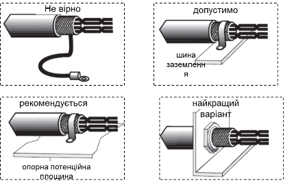

 Рис. 3.13. Правила заземлення екрану.

Якщо при підключенні кабелю використовується роз’єм, він повинен забезпечити круговий неперервний електричний контакт між екраном кабелю та корпусом обладнання (рис.3.14). 

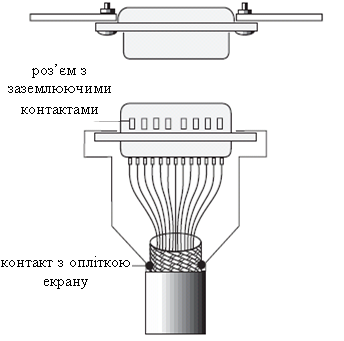

Рис. 3.14. Правила заземлення екрану роз’ємів з заземлюючими контактами

Якщо для заземлення екрану при приєднанні до зажиму під гвинт не можна використати U-подібний хомут, провід заземлення повинен бути як можна коротше (рис.3.15). Однак такого типу з’єднання краще уникати. 

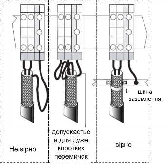

 Рис. 3.15. Правила заземлення екрану з вузлами кріплення на DIN-рейку

### 3.2.7. Основні рекомендації до вибору, прокладки та монтажу електричних кабелів для промислових мереж

Отже, при проектуванні промислових мереж, необхідно звернути увагу на такі рекомендації.

1) При виборі, прокладці та монтажу кабелів необхідно дотримуватись правил, визначених виробниками обладнання, стандартів до вибраної мережної технології (особливо апаратного інтерфейсу), і тільки у випадку відсутності такої інформації – рекомендацій даного посібнику.

2) В якості електричного середовища передачі рекомендується використовувати екрановану виту пару, або виту пару з подвійним екраном, або коаксіальний кабель, для яких характеристики відповідають заданим:

- a.   для витих пар – необхідній кількості витих пар (подвійна, три і т.д.); 

- b.   для коаксіального кабель – тип кабелю: вузькополосний чи широкополосний;  

- c.   заданому характеристичному хвильовому опору, якщо він відомий;

- d.   менше заданого коефіцієнта затухання в кабелі, при відомій частоті сигналу, максимально-мажливому падінню напруги; 

- e.   менше заданого погонного опору, розрахованого по довжині необхідної лінії зв’язку;

- f.    необхідного матеріалу, кольору, діаметру оболонки: по діапазону робочих температур; по необхідній гнучкості - радіус ізгину; по вимогам до пожежобезпеки; по стійкості до кислоти, лугу, масла, топлива і т.д.; по отруйності диму при згоранні

3) При шинній топології в крайніх кінцях кабелю сегменту (з боку ресиверів) виставляти термінатори ліній з опором, рівним хвильовому опору кабелю.

4) Забезпечити еквіпотенціальність ділянок, пов’язаних кабелями промислових мереж;

- a.   всі металічні конструкції в межах будівлі необхідно з’єднати між собою металічними балками, гвинтами, болтами, кабельними каналами, зварювальними поверхнями і т.д., з якнайменшим опором та найкоротшими з’єднувльними ділянками;

- b.   лінії функціонального заземлення мережного обладнання необхідно під’єднати до еквіпотенціального контуру за правилами аналогічним попередній рекомендації;

- c.   для еквіпотенціального з’єднання фарбованих поверхонь необхідно обов’язково видалити фарбу в місцях з’єднання;

- d.   контактуючу поверхню необхідно обробити антикорозійним електропровідним матеріалом (наприклад оцинковка);

- e.   кінці кабелів, що забезпечують еквіпотенціальність необхідно залудити або обжати відповідним типом наконечника;

- f.    частини кабельних каналів, необхідно об’єднати між собою та еквіпотенціальною системою зваркою або металічним з’єднувачем з того самого матеріалу;

- g.   при з’єднанні кабелів з іншими будівлями або частинами будівель, необхідно паралельно з інформаційним кабелем прокласти кабель еквіпотенціального з’єднання: мідний провід з мінімальним перерізом 6 мм2; алюмінієвий провід з мінімальним перерізом 16 мм2,  стальний провід з мінімальним перерізом 50 мм2.

5) При використанні невеликих бітових швидкостей (порядку 100 Кбіт/с), екрани необхідно заземляти тільки в місцях підводу кабелю до шита, для запобігання паразитних земляних струмів.

6) При використанні швидкостей більше 100 Кбіт/с, екрани необхідно заземляти в обох кінцях кабелю, з використанням конденсатору в одному з кінців.

7) При прокладці кабелю всередині будівлі необхідно користуватися такими правилами:

- a.   для забезпечення захисту від високочастотних завад всі кабелі повинні бути прикріплені до конструкцій системи еквіпотенціальних з’єднань; для цього найкраще використати електропровідні кабельні канали, виконані за правилами еквіпотенціального заземлення; 

- b.   кабелі необхідно регулярно прикріпляти до металічних конструкцій; 

- c.   тільки пари, які передають аналогові, цифрові або телекомунікаційні сигнали, можуть прокладатися близько один до одного в одній зв’язці або в одній групі;

- d.   всі вільні провідники кабелю повинні бути заземлені разом з екраном;

- e.   при використанні кабельних каналів неекрановані кабелі необхідно розмістити в кутках кабельних лотків;

- f.    при використанні кабельних каналів для недопущення сумісного розміщення несумісних кабелів (силові та інформаційні), необхідно використовувати кабельні перегородки ;

- g.   при використанні кабельних каналів частина кабельного лотка з інформаційними кабелями (і тільки вона) повинна бути закрита металевою кришкою;

- h.   при прокладці інформаційних кабелів разом з силовими, останні необхідно екранувати;

- i.    кабелі можуть пересікатися тільки під прямим кутом;

- j.    кабелі різного рівня категорії повинні бути по можливості в різних лотках, або один від одного на відстані, згідно таб.3.1;

8) При прокладці мережного кабелю між будівлями необхідно користуватися такими правилами:

- a.   кабель мережі повинен знаходитись максимально близько до кабелю еквіпотенціального заземлення;

- b.   з’єднання зовнішнього кабелю з внутрішнім проводити в спеціально зробленій для цього металічній коробці з реалізацією захисних схем від високої напруги та заземленої; 

- c.   зовнішній кабель промислової мережі необхідно прокладати під землею на глибині не менше 50 см;

- d.   кабель еквіпотенціального заземлення необхідно прокладати вище на 20 см від кабелю мережі;

- e.   між кабелями різної категорії прокладають металеві перегородки;    

<-- 3.1.[Організація каналу зв’язку](3_1.md) 

--> 3.3. [Передача напругою та струмом](3_3.md) 