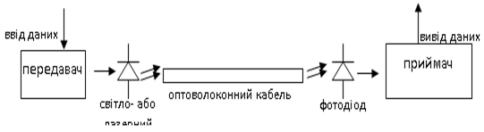

[Промислові мережі та інтеграційні технології в автоматизованих системах](README.md). 3. [РЕАЛІЗАЦІЯ ФІЗИЧНОГО РІВНЯ](3.md).

## 3.4.Використання оптоволоконного кабелю

При передачі на значні відстані (більше кількох кілометрів) великих об’ємів даних використання металевого дроту в якості носія стає проблематичним. Як альтернативу можна використати оптоволоконну систему. Вона складається з оптоволоконного кабелю, генератора світлових сигналів (передавача), детектора (приймача), обладнання для обробки сигналу на обох кінцях кабелю і допоміжних елементів (рис.3.17).

Рис.3.17. Принцип роботи оптоволоконної системи зв’язку

Ширина смуги пропускання каналу і припустима довжина лінії визначаються затуханням і спектральною дисперсією оптоволоконного кабелю, вихідною потужністю генератора і чутливістю світлового датчика на прийомному кінці. Оптичний кабель описується параметром, який характеризує ширину смуги пропускання і відповідну їй максимальну відстань, які обернено пропорційні один одному. Цей параметр вимірюється в МГц*км і визначає межу працездатності кабелю. Для будь-якого оптичного кабелю – чим більша довжина, тим вужче смуга пропускання. Оскільки шум практично не впливає на оптоволоконні канали, смугу пропускання можна використовувати в повному об’ємі.

Оптичні провідники представляють собою надзвичайно тонкі (діаметром в долі міліметрів) і легкі волокна, виготовлені із прозорої речовини – кварцу, скла або пластмаси. Волокно складається із серцевини (core) і зовнішньої оболонки (cladding), які захищені зовнішнім пластиковим кожухом (sheath). Показник заломлення серцевини більш високий ніж у зовнішньої оболонки, тому світлові промені відбиваються від оболонки і розповсюджуються по волокну. Оптоволоконні жили зазвичай групуються в пучки, які захищені зовнішньою оболонкою (футляр). 

Кожен світловий промінь, який рухаються по оптоволоконній жилі, має певну довжину хвилі, або ще кажуть – має певну моду (mode). Оптичне волокно, яке має властивість передавати відразу декілька променів (з різною довжиною хвиль) називається багатомодовим\ (multimode fiber). Волокна з товщиною до декількох довжин світла дозволяють передавати промінь практично по прямій лінії без відбиття від стінок волокна. Такі волокна називають одномодовими\ (single mode fiber). Багатомодові волокна в свою чергу діляться на:

-     багатомодові зі стрибком показника заломлення (step index multimode fiber): недорогі волокна зі співвідношенням смуги пропускання, довжина приблизно 35 МГцкм, використовуються на незначних відстанях;

-     багатомодові з плавною зміною показника заломлення (graded index multimode fiber): з відповідним співвідношенням 500 МГцкм дозволяють передавати світловий сигнал на більші відстані ніж попередні.

Товщина серцевини одномодового волокна зі стрибком показника заломлення (step index single mode fiber) біля 10 мікрон, що дозволяє пропускати тільки одну довжину хвилі. Таке волокно виробляється з кварцу і має низький коефіцієнт затухання і дуже широку смугу пропускання порядку 10ГГцкм. Це найдорожче волокно, яке використовується при передачі на значні відстані.     

Джерелом світла (передавачем), яке перетворює цифрові електричні сигнали в світлові імпульси, в оптичній системі зв’язку є або світло-випромінюючий або лазерний діод. Світло-випромінюючий діод (light-emitting diode - LED) – має обмежену вихідну потужність до 0.1 мВт і максимальну ШПД ≈ 8 Мбіт/с. Більш дорогі лазерні діоди (laser diode) мають вихідну потужність до 10 МВт і можуть забезпечувати ШПД більше 10Гбіт/с. Тільки останні можуть генерувати світло у вузькій смузі довжин (порядку 5 нм) і тому використовуються при одномодовій передачі. Недоліки лазерних діодів проявляються в чутливості до температури, короткому терміну служби та високій ціні.

Детектором (приймачем) є фотодіод, який перетворює світлові імпульси в електричні сигнали. Якщо необхідно забезпечити високу чутливість, використовуються лавинні фотодіоди (photoavalanche diode). 

Основні переваги оптичної передачі:

-          забезпечення великих швидкостей передач даних;

-          практично не підвладна діям зовнішніх завад;

-          можлива передача на дуже значні відстані;

-          надзвичайно легкі та тонкі кабелі (в одному кабелі може вміститись велика кількість жил);

-          хімічна нейтральність і відсутність можливості корозії.

Рядом з цим існує ряд недоліків:

-          дороговизна;

-          складність в спаї двох волокон;

-          чутливий до механічний дій, крихкий;

-          однонаправлена передача (для двохсторонньої передачі необхідно виділяти окрему жилу, або окрему частотну смугу). 

<-- 3.3. [Передача напругою та струмом](3_3.md) 

--> 3.5. [Використання бездротового зв’язку](3_5.md) 