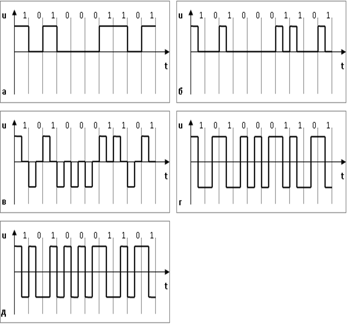

[Промислові мережі та інтеграційні технології в автоматизованих системах](README.md). 3. [РЕАЛІЗАЦІЯ ФІЗИЧНОГО РІВНЯ](3.md).

## 3.6. Кодування інформації

У промислових мережах використовують послідовний спосіб передачі даних. Існує два способи передачі бітової послідовності по фізичному каналу:

-    посилка біт в лінію в безпосередньому або закодованому вигляді при збереженні цифрового характеру даних;

-    модуляція несучої по амплітуді/частоті/фазі і передача модульованого сигналу.

### 3.6.1. Безпосередній спосіб передачі цифрових даних

 При безпосередньому кодуванні, низький рівень сигналу (наприклад 0 В чи 0 мА) може відповідати логічному "0"  тобто space  (спокій),  а високий (наприклад 10 В чи 20 мА) – логічній "1" тобто mark\ (відправка) (рис.3.18.а). Такий спосіб називається прямим кодуванням\. 

Часто користуються зворотнім кодуванням, – коли логічний "0" передається високим рівнем сигналу, а "1" – низьким, а також полярним кодуванням – коли сигнали "0" і "1" протилежні за знаком по напрузі відносно загальної точки. Пряме, зворотнє і полярне кодування називаються кодуванням без повернення до нуля NRZ (Non-Return to Zero), так як в них відсутній обов’язковий перехід до нульового рівня. 

Цей метод простий в реалізації, але чутливий до завад і спотворень. Крім того, приймач не може розрізнити, де закінчується і починається кожний окремий біт а також налаштуватися на необхідну швидкість. Це значить, що він не зможе відрізнити відсутність сигналу від послідовності бітів (представлених низьким рівнем сигналу) та працювати при динамічно змінюваних швидкостях без допоміжної синхронізації.

Вказані вище проблеми вирішуються при кодуванні з поверненням до нуля RZ (Return to Zero) (рис.3.18б). У даному випадку вихідні дані для передачі комбінуються з сигналом синхронізації. Кожний біт, як і в попередньому випадку, починається з визначеного для нього рівня сигналу, а в середині кожного імпульсу відбувається перехід на нульовий рівень, по фронту якого приймач синхронізується з передавачем. Може також використовуватись RZ- кодування з сигналами різної полярності (рис.3.18в). Ці переваги над NRZ- кодуванням досягаються шляхом виділення в два рази більш широкої смуги пропускання, а також більш складною реалізацією.

Рис.3.18. Способи цифрового кодування:  а – пряме двійкове без повернення в нуль (NRZ); б – пряме двійкове з поверненням в нуль  (RZ); в – трирівневе з поверненням в нуль;  г – манчестерське; д – диференційне манчестерське.

Манчестерське або двохфазне кодування Bi-phase Level (BiФ-L) – використовує два рівня напруги з переходом в середині кожного імпульсу (біта). При прямому манчестерському кодуванні "0" представлений переходом від низької напруги до високої (передній фронт), а "1" - від високої до низької (задній фронт) (рис.3.18г). При диференційному манчестерському\ кодуванні, як і в попередньому способі кожен біт являє собою зміну напруги, але сигнал передається не типом фронту, а наявності чи відсутності його зміни:"0" – фронт сигналу не змінюється, "1" – фронт сигналу змінюєьться з "переднього" на "задній", або навпаки (рис.3.18д). Можна сказати по іншому: якщо рівень сигналу (напруги) не змінюється при зміні періоду передачі одного біта, то наступний біт – логічна "1".

Манчестерський та диференційний манчестерський є кодами з вбудованою синронізацією (дозволяють прередавачу налаштуватися на приймач без допоміжних синхросигналів) і мають більш високий захист від шуму ніж RZ-кодування при використанні такої самої ширини пропускання. Крім того використовуються два рівні сигналів замість 3-х, що робить реалізацію більш простішою ніж при RZ-кодуванні.

### 3.6.2. Модуляція несучої (carrier modulation)

Модуляція несучої представляє собою зміну деяких параметрів (амплітуди, частоти, фази) високочастотної несучої як функції вихідного інформаційного сигналу. В якості несучої використовується високочастотний синусоїдальний або імпульсний сигнал. Різні типи модуляції визначаються типом несучої і процедурою модуляції. Розрізняють:

-     амплітудну модуляцію АМ (AM - Amplitude Modulation), коли змінюють амплітуду несучої;

-     частотну модуляцію ЧМ (FM - Frequency Modulation), при якій змінюється частота несучої, як функція від вхідного сигналу;

-     фазову модуляцію ФМ (PM – Phase Modulation), коли змінюється фазовий зсув несучої. 

У випадку модуляції несучої цифровим сигналом розрізняють:

-     амплітудну маніпуляцію АМн (ASK – Amplitude Shift Keying) (рис.3.19б);

-     частотну маніпуляцію ЧМн (FSK - Frequency Shift Keying) (рис.3.19в);

-     фазову маніпуляцію ФМн (PSK - Phase Shift Keying) (рис.3.19г).

Серед трьох вказаних методів фазова маніпуляція найбільш стійка до завад. На сьогоднішній день як правило використовують маніпуляцію несучої не як функцію від двох станів ("1" або "0"), а як функцію від комбінації бітів. Наприклад, послідовності 00, 01, 10, 11 можуть кодуватися фазовим зсувом відповідно 0º, 90º, 180º і 270º відповідно, при цьому об’єм даних збільшується у два рази. Більш складнішими маніпуляціями, при яких для передачі декількох біт об’єднуються амплітудна і фазова модуляція, є:

-     квадратурно-фазова маніпуляція (QPSK – Quadrature Phase Shift Keying);

-     квадратурно-амплітудна модуляція (QUAM-16, QUAM-64 – Quadrature Amplitude Modulation. 

Рис. 3.19. Модуляція несучої: а – двійковий сигнал; б – амплітудна модуляція; в – частотна модуляція; г – фазова модуляція

Число змін одного з параметрів несучої називається сигнальною швидкістю\, або швидкістю передачі в\ бодах (Baud rate\) і вимірюється в бодах. За кожний бод передається один символ, який складається з декількох бітів, що визначається методом модуляції. Бітовою швидкістю\ називається об’єм бітів, яка передається по каналу за 1 сек, включаючи службові біти та біти синхронізації і вимірюється в біт/с. При модуляції вона дорівнює добутку сигнальної швидкості і кількості біт на символ. 

<-- 3.5. [Використання бездротового зв’язку](3_5.md) 

--> 3.7. [Синхронна та асинхронна передача](3_7.md) 