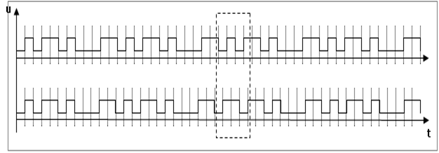

[Промислові мережі та інтеграційні технології в автоматизованих системах](README.md). 3. [РЕАЛІЗАЦІЯ ФІЗИЧНОГО РІВНЯ](3.md).

## 3.7. Синхронна та асинхронна передача

### 3.7.1. Необхідність синхронізації 

При обміні даними між вузлами необхідно щоб передавач і приймач використовували одне і те саме джерело часу, тобто щоб вони були синхронізовані. В протилежному випадку, приймач не зможе визначити, коли надходить перший біт, тобто розпізнати початок посилки. Але навіть при початковій синхронізації джерела тактів передавача і приймача, а також домовленості про час початку відправки, при передачі великих послідовностей бітів, може виникнути розсинхронізація. 

На рис.3.20. показана послідовність бітів, яку передає трансмітер і розпізнає ресивер. Пунктирними лініями показані такти кожного з пристроїв. Оскільки неможливо фізично організувати абсолютно однакові часові інтервали тактів в пристроях, то в певний інтервал часу передачі – біти  будуть зміщені, отже посилка неправильно сприйнята (на рисунку виділено штриховою лінією).

При синхронній передачі приймач і передавач постійно синхронізуються під час передачі. Синхронізація проходить через певні проміжки часу або даних за допомогою синхронізуючої посилки, яка представляє собою імпульсний сигнал (набір імпульсів) певної частоти. Цей сигнал генерується або передавачем, або приймачем, або окремим пристроєм. Синхронізуючий сигнал може передаватися по спеціальному проводу (каналу), або разом з цифровими даними (наприклад RZ-кодування, манчестерське кодування), або перед ними (наприклад у вигляді преамбули). В першому випадку необхідний допоміжний провід (канал), в другому – допоміжна смуга пропускання, в третьому – допоміжні біти.

 

Рис. 3.20. Обмін інформацією між пристроями без синхронізації: зверху – передавач, знизу – приймач.

При асинхронній передачі, обмін даними може проходити і без визначеного джерела часу. Передача починається в будь який момент часу з сигналу початку передачі – стартового біта. В цей час приймач синхронізується з передавачем. Обмін проходить короткими наборами бітів (символами), що дозволяє не робити додаткову синхронізацію під час передачі. При асинхронній передачі приймач повинен наперед знати всі параметри зв’язку, в першу чергу – швидкість, щоб правильно ідентифікувати сигнали які поступають.

### 3.7.2. Символьна передача 

Один з асинхронних способів передачі є символьна передача. При такому способі, дані які передаються діляться на символи по декілька біт (як правило по 8 або 7) і обрамляються службовими бітами. На рис. 3.21 графічно представлено передачу двох байт D816(110110002) та C416(110001002) при наступних настройках: біт парності – «непарний», 1 стоповий біт, ШПД 9600 біт/с. При відсутності передачі на лінії утримується логічна "1". При передачі символу передавач скидає сигнал на "0" і тримає його протягом 1-го біту, який називають стартовим бітом. За цей час приймач синхронізується з передавачем і готовиться до прийому бітів даних, які передаються відразу після стартового біту. Потім передається біт парності (біт паритету – parity bit), якщо він використовується при обміні. Даний біт призначений для контролю за правильністю передачі даних і вибирається з ряду: парний (even), непарний (odd), відсутній (none). При виборі останнього на фізичному рівні не проводиться контроль помилок. Якщо використовується парний (even) біт паритету, то при передачі підраховується кількість одиничних бітів даних, і якщо їхня кількість непарна, то добавляється біт паритету рівним логічній "1", в протилежному випадку добавляється логічний "0". При непарному (odd) паритеті – навпаки, передавач буде добавляти до бітів даних логічну "1" або "0" так, щоб сума одиничних бітів в бітах даних разом паритетним була непарною. Приймач перевіряє суму прийнятих одиничних бітів даних та паритету і якщо не вона не співпадає з типом наперед визначеного біта паритету, сигналізує про це верхнім рівням, які вирішують можливість повторного запиту.

 

Рис. 3.21. Передача двох символів: 1-й – 11011000; 2-й – 00100011. Біт паритету – непарний; 1 стоповий біт
За бітом паритету, йдуть стопові біти, призначення яких витримати мінімальну паузу між символами. Кількість стопових бітів як правило вибирається 1, 1.5 або 2. За стоповими бітами може відразу йти наступний символ, тобто стартовий біт наступного символу. 

### 3.7.3. Використання схем UART 

Символьну передачу просто і недорого реалізувати завдяки існуванню спеціальної мікросхеми – універсального асинхронного приймача-передавача УАПП (UART – Universal Asynchronous Receiver Transmitter), яка застосовується в багатьох пристроях. UART являється частиною інтерфейсу між шиною мікропроцесора і трансивером каналу зв’язку. Тобто вихід UART безпосередньо не підключається до каналу зв’язку, а видає біти на рівні ТТЛ на вхід трансивера. Для прикладу на рис.3.22 показаний приклад використання UART разом з трансивером RS-232. 

Рис. 3.22. Приклад використання UART з трансивером RS-232

Різні схеми по типу UART використовуються також в синхронній передачі даних і називаються USRT, а їх комбінація USART. 

При передачі UART послідовно виконує наступні дії: встановлює для трансивера бітову швидкість; приймає від мікропроцесору біти даних символу через паралельну шину; генерує для трансиверу стартовий біт; послідовно передає трансиверу біти даних; визначає та передає трансиверу біт парності; передає трансиверу стопові біти; сигналізує процесору про готовність до наступного символу; при необхідності координує квітування;    

При прийомі від трансиверу UART послідовно виконує наступні дії: встановлює для трансиверу бітову швидкість; розпізнає стартовий біт; зчитує біти даних, що поступають від трансиверу у вигляді послідовності бітів; зчитує біт парності і робить перевірку на парність; передає символ в паралельному вигляді мікропроцесору; при необхідності координує квітування; перевіряє дані на наявність помилки і при її знаходженні мітить в регістрі станів біт помилки.  

Крім сигналів передачі (TD), прийому (RD) та шини даних в схемі UART також визначені додаткові управляючі сигнали для синхронізації як з мікропроцесором так і з трансивером. 

<-- 3.6. [Кодування інформації](3_6.md) 

--> 3.8. [Стандартні послідовні інтерфейси](3_8.md) 