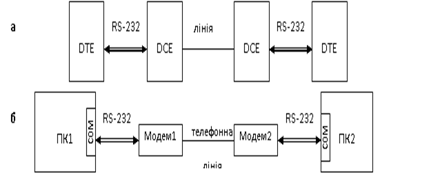
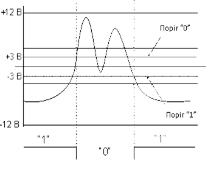
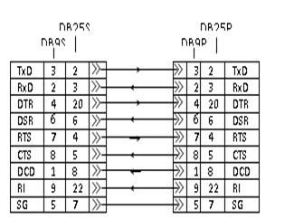
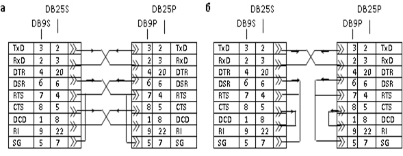
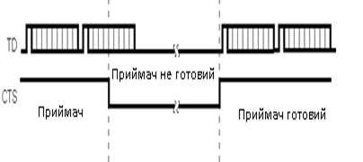
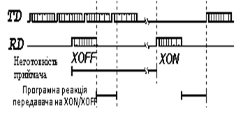
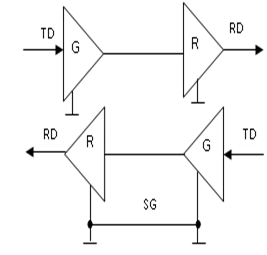

[Промислові мережі та інтеграційні технології в автоматизованих системах](README.md). 3. [РЕАЛІЗАЦІЯ ФІЗИЧНОГО РІВНЯ](3.md).

## 3.9. Інтерфейс RS-232

Стандарт інтерфейсу RS-232C розроблений в 1969 році і опублікований асоціацією EIA як варіант "С" рекомендованого стандарту (RS -Recommended Standard) номер 232. Інтерфейс призначений для підключення апаратури, яка передає або приймає дані АПД (DTE — Data Terminal Equipment) до апаратури каналів даних АКД (DCE — Data Communication Equipment). Кінцева мета – це з’єднання двох DTE (рис.3.23.а). Найпростіший приклад такої системи, коли в ролі DTE виступає комп’ютер, в якому RS-232 реалізований в якості COM-портів, а в ролі DCE – модем (рис.3.23.б). 

Рис.3.23. З’єднання за допомогою RS-232: а – схема з’єднання DTE з використанням DCE; б – приклад з’єднання двох ПК (як DTE) через модем (як DCE); в – схема з’єднання двох DTE без DCE (нуль-модемний зв’язок)

На практиці великої популярності набув спосіб з’єднання через RS-232 двох DTE без DCE, який отримав назву нуль-модемного з’єднання\ (Zero-modem або Z-modem). 

Стандарт описує управляючі сигнали інтерфейсу, обмін даними, електричний інтерфейс і типи роз’ємів. Передбачені синхронний та асинхронний режими обміну (в комп’ютері COM-порт підтримує тільки асинхронний режим). Функціонально RS-232C еквівалентний стандарту МККТТ V.24 і V.28. 

### 3.9.1. Електричні характеристики

Стандарт RS-232C описує несиметричні (незбалансовані) передавачі та приймачі, тобто сигнал передається відносно загального проводу – схемної землі за допомогою напруги. Для передачі використовується сигнальна лінія TD – Transmit Data (інколи позначається TxD), а для прийому – RD – Receive Data (інколи позначається RxD), загальний провід SG (Signal Ground). Логічній "1" на вході відповідає діапазон напруги від –12В до –3В; логічному "0" – від +3В до +12В. Діапазон від –3В до +3В – зона нечутливості, яка обумовлює гістерезис приймача: логічний стан лінії поміняється тільки після переходу через поріг (рис.3.24). Рівні сигналів "1" і "0" на виходах передавачів повинні лежати в межах відповідно від -5В до -12В і від +5В до +12В. Інтерфейс не забезпечує гальванічної розв’язки пристроїв. 

Рис. 3.24. Прийом сигналів в RS-232C

Різниця потенціалів між схемними землями SG пристроїв, що з’єднуються, не повинна бути більше 2В. Підключення і відключення інтерфейсних кабелів пристроїв з автономним живленням повинно проводитись при відключеному живленні. Інакше в момент підключення пристроїв можуть вийти з ладу мікросхеми в результаті дії на них різниці потенціалів.

Стандартні трансивери RS-232 повинні забезпечити передачу та прийом бітів з швидкістю до 115200 біт/с на відстані до 20 м.

### 3.9.2. Типи роз’ємів

На обладнанні DTE прийнято встановлювати вилки типу DB-9P (9 штиркові) або DB-25P (25 штиркові). Останні як правило використовуються для синхронних режимів, оскільки мають допоміжні штирки. На пристроях DCE використовуються розетки DB-9S та DB-25S. Це значить, що при такому з’єднанні пристрої DTE (наприклад ПК) та DCE (наприклад модем) можна підключати безпосередньо один до одного, або через "прямий" кабель з вилкою з одного боку та розеткою з іншого (рис.3.25).

Рис. 3.25. Підключення DTE (зліва) до DCE (справа)

В системах автоматизації частіше використовується нуль-модемне з’єднання, для якого використовується нуль-модемні кабелі. Якщо при з’єднанні використовуються тільки інформаційні сигнальні лінії (TxD, RxD, SG), то з’єднання проводиться мінімальним нуль-модемним кабелем (рис.3.26.б), в протилежному випадку – повним (рис.3.26.а). 

 Рис. 3.26. Нуль-модемне підключення, за допомогою нуль-модемного кабелю: а – повного, б – мінімального

### 3.9.3. Призначення ліній інтерфейсу RS-232C

На практиці інтерфейс RS-232 використовується як правило в асинхронному режимі, тому розглянемо сигнальні лінії, призначені тільки для цього режиму. Для кращого розуміння, при розгляді ліній інтерфейсу, DCE будемо називати модемом, а DTE – комп’ютером.

В табл. 3.2 наведені сигнальні лінії RS-232C та їх призначення. В другій та третій колонці вказані відповідні контакти роз’ємів, а в четвертій колонці також вказана додаткова інформація, яка вказує напрямок передачі даних по лінії: IN – в комп’ютер, OUT – з комп’ютера. 

Таблиця 3.2. Сигнальні лінії інтерфейсу RS-232C

| Сигнал  | DB-25S | DB-9S | Призначення                                                  |
| ------- | ------ | ----- | ------------------------------------------------------------ |
| PG      | 1      | -     | Захисна земля (Protected Ground). З’єднується з корпусом пристрою і екраном кабелю. |
| SG      | 7      | 5     | Сигнальна земля (Signal Ground), відносно неї діють лінії сигналів. |
| TD(TxD) | 2      | 3     | OUT Вихід передавача (Transmit Data).                        |
| RD(RxD) | 3      | 2     | IN Вхід приймача (Receive Data).                             |
| RTS     | 4      | 7     | OUT Запит дозволу на передачу (Request To Send). "Вкл" означає наявність даних у  комп’ютера для передачі. При напівдуплексі – перемикання модему в режим  передачі. |
| CTS     | 5      | 8     | IN Готовність передачі (Clear To Send). "Відкл" - модем забороняє комп’ютеру  передавати йому дані. |
| DTR     | 20     | 4     | OUT Готовність DTE (Data Set Ready). "Вкл" - комп’ютер готовий до роботи з  модемом. |
| DSR     | 6      | 6     | IN Готовність DCE (Data Terminal Ready). "Вкл" - модем готовий до роботи з комп’ютером. |
| DCD     | 8      | 1     | IN Виявлення несучої (Data Carried  Detected). "Відкл" модем  сигналізує про сигнал поганої якості |
| RI      | 22     | 9     | IN Сигнал виклику (Ring Indicator). "Вкл" – модем отримав сигнал виклику  (дзвінок на телефонній лінії) |

### 3.9.4. Управління потоком даних 

При асинхронному режимі, в поєднанні з трансивером RS-232 використовується стандартні схеми UART з символьним способом передачі. Бітова швидкість при цьому вибирається з ряду: 50, 75, 110, 150, 300, 600, 1200, 2400, 4800, 9600, 19200, 38400, 57600 і 115200 біт/с. Кількість біт даних може складати 5, 6, 7 або 8 (5- і 6-бітні формати практично не використовуються). Кількість стопових бітів може бути 1, 1.5 або 2. Для управління потоком даних (Flow Control) можуть використовуватися два варіанти протоколу – апаратний та програмний. 

Апаратний протокол управління потоком\ (hardware\ flow\ control\) RTS/CTS використовує сигнал RTS, який подається на CTS, що дозволяє зупинити передачу даних, якщо приймач не готовий до прийому (рис.3.27). Передавач видає черговий байт тільки при увімкненій лінії CTS. Але байт, який вже почав передаватися затримуватися не буде – це гарантує цілісність посилки. Апаратний протокол забезпечує найшвидшу реакцію передавача на стан приймача. При зв’язку двох пристроїв DTE повним нуль-модемним кабелем (рис.3.26.а) необхідно перехресно з’єднати RTS передавача та CTS приймача, а при мінімальному (рис.3.26.б) RTS та CTS перемикаються на тому ж пристрої. В протилежному випадку, при налаштуванні апаратного управління потоком, деякі типи передавачів будуть мовчати, оскільки на CTS не буде дозволу передачі. Апаратний протокол DTR/DSR аналогічний попередньому, але використовує другу пару сигналів.

 

Рис. 3.27. Апаратне управління потоком даних RTS/CTS

Програмний протокол управління потоком\ (software\ flow\ control\) XON/XOFF передбачає наявність дуплексного каналу передачі даних (рис.3.28). Працює він наступним чином: якщо пристрій, який приймає дані, по якимось причинам не може їх більше приймати, він відсилає передавачу байт-символ XOFF (ASCII код 1316), по отриманню якого останній припиняє передачу. Коли приймаючий пристрій знову стає готовим до приймання даних, він відправляє символ XON (ASCII код 1316), прийнявши який протилежний пристрій продовжує передавати дані. Час реакції передавача на зміну стану приймача, порівняно з апаратним протоколом, збільшується за рахунок часу передачі символу та часу реакції програми передавача на прийом символу. Перевагою програмного протоколу є відсутність необхідності передачі управляючих сигналів інтерфейсу, тобто мінімальний кабель для двостороннього обміну може мати тільки 3 проводи (рис.3.26.б) навіть без перемикання управляючих проводів на пристроях. Недоліком, окрім часових запізнень та наявності допоміжного буферу, являється складність реалізації дуплексного режиму обміну, тому що при зворотній передачі даних повинні виділятися і оброблятися управляючі символи, що обмежує набір символів, які можуть передаватися.

Рис. 3.28. Програмне управління потоком даних XON/XOFF

Функціонально нуль-модемне з’єднання двох трансиверів можна показати у вигляді, представленому на рис.3.29. На схемі показані тільки сигнальні лінії для передачі даних (без синхронізуючих і управляючих ліній). Дані, які надходять для передачі позначені як TD, для прийому – як RD, сигнальна земля (загальний) – як SG. 

Рис. 3.29. Функціональна схема нуль-модемного з’єднання

Апаратно один передавач даного інтерфейсу може забезпечити необхідним рівнем сигналу тільки одного приймача. Таким чином інтерфейс RS-232 дозволяє об’єднати між собою тільки два пристрої з одним передавачем і одним приймачем на максимальній відстані 20 м. 

<-- 3.8. [Стандартні послідовні інтерфейси](3_8.md) 

--> 3.10. [Інтерфейс RS-422A (EIA-422A)](3_10.md) 