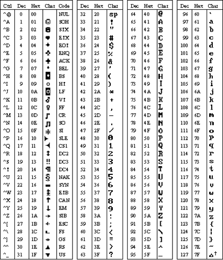
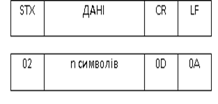
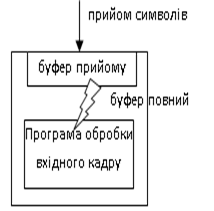
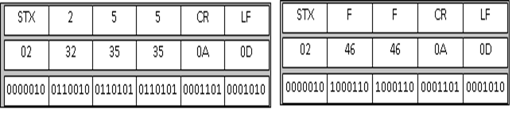

[Промислові мережі та інтеграційні технології в автоматизованих системах](README.md). 4. [ТЕХНОЛОГІЇ МОДЕМНОГО ТА БЕЗПРОВОДНОГО ЗВ’ЯЗКУ](4.md)

## 4.1. Символьний спосіб обміну

Під символьним способом обміну розуміють асинхронний обмін між пристроями за допомогою послідовностей старт-стопових символів, протокол якого на канальному та прикладному рівнях не визначений і не реалізований вбудованими апаратними та програмними засобами. Простіше кажучи, якщо пристрій має асинхронний канал зв’язку, і по ньому дозволяється передавати та приймати символи визначені користувачем - то можна організувати символьний спосіб обміну. 

Символьний спосіб використовують в тих випадках, коли два пристрої не підтримують спільного протоколу мережі, але мають можливість роботи в символьному режимі. Як правило це такі пристрої, як символьний принтер з послідовним інтерфейсом, операторська панель, відео-термінал і т.п. Застосування такого зв’язку передбачає створення власноруч нового або існуючого протоколу обміну. Тобто, якщо необхідно підключити принтер до контролера, треба визначити набір управляючих символів, послідовність їх посилки і т.д., і відповідно програмно реалізувати алгоритм управління друком на принтері. Якщо необхідно організувати таким способом обмін між двома контролерами, або контролером і ПК – необхідно реалізувати свій протокол на обох пристроях. В будь якому випадку задачею формування кадру і його розшифруванням займається розробник програми користувача, а передачею та прийомом – обладнання.

Символьний спосіб передбачає наявність послідовного інтерфейсу з можливістю асинхронного режиму роботи (наприклад, з мікросхемою UART). Цей інтерфейс налаштовується на необхідні параметри зв’язку: ШПД, кількість бітів даних, паритет, кількість стопових бітів, сигнали управління потоком; інколи тайм-аути, символи кінця і початку посилки. Як правило для обміну вибирають 7 або 8 бітів даних. 7-бітний режим обміну ще називають режимом ASCII, оскільки використовується обмін даними в ASCII-кодуванні. Для початку розглянемо способи кодування символів, а потім опишемо символьний режим обміну.

### 4.1.1. Способи кодування символів

Символьний код – це відображення множини чисел на множину символів, тобто числове позначення конкретного символу. 

ASCII кодування – Американський стандарт на кодування символів для обміну інформацією (ASCII-American Standard Code for Information Interchange). Перша таблиця кодів ASCII складалася із 128 символів, включаючи букви латинського алфавіту, арабські цифри і різноманітні знаки пунктуації (рис.4.1). У відповідності до цих символів були поставлені перші 128 додатних цілих числа. Таким чином достатньо було 7 біт для їх кодування, однак символи кодувалися у вигляді 8-розрядних двійкових чисел. В 1981 році, після випуску першого персонального комп’ютеру, IBM розширила початковий код ASCII, доповнивши його ще 128 символами, включаючи деякі символи із алфавітів інших мов, невелику кількість математичних символів і деякі графічні символи для малювання рамок, фона та інших елементів псевдографіки в символьному режимі дисплея. Цей код, який складається з 256 символів, відомий як розширений код ASCII (extended ASCII). 

 Рис.4.1. Таблиця кодів ASCII основних символів (0-127) 

ASCII знайшов своє застосування в старому ПЗ, зокрема написаному під DOS. Однак, до сих пір цей спосіб кодування використовується в мережах з символьним способом передачі даних. 

В 1987 році Microsoft запропонувала ідею створення кодової сторінки (code page), яка являється відображенням чисел на символи, в залежності від кодової сторінки. Вихідний розширений символьний код ASCII, введений IBM, носить назву кодової сторінки 437, або MS-DOS Latin US. Перші 128 символів у всіх кодових сторінках повністю співпадають, але відображення наступних 128 кодів залежить від номеру сторінки. 

Хоч кількість кодових сторінок швидко збільшувалась, вони не вирішували проблему недостатності 256 кодів (1 байта) для кодування всіх національних символів (літер). В якості прикладу можна привести китайську, або японську мови, кожна з яких складає більше 20000 символів. Тому  в 1988 році був створений проект Unicode, який повинен був вирішити дану проблему. Unicode – це двобайтний символьний код, який дозволяє представити 65536 різних символів. Версія 2.0 даного стандарту включає 38885 символів. Microsoft використовує термін „широкий” символ (wide character) як синонім слова Unicode, хоча інші використовують термін „широкий”, для позначення будь-якого двохбайтного символьного коду. Перші 256 символів Unicode ті ж, що у розширеного символьного коду ASCII, для цього старший байт кожного символу встановлений в нуль. За розвиток Unicode і надання технічної інформації по ньому відповідає консорціум Unicode (Unicode Consortium), який був створений в 1991 році.

Треба відмітити, що в ОС Windows NT, 2000 – Unicode основний символьний код, хоч підтримується для сумісності ANSI. В Windows XP, Vista, 7 та Windows CE – ANSI не підтримується. В Windows 9х – навпаки, Unicode не використовується, за деяким винятком. А всі функції потребують ANSI-формат символьних строк. 

### 4.1.2. Принципи символьного обміну ASCII

Як правило при побудові кадру в символьному обміні, перші 32 символи ASCII-таблиці використовуються в якості символів керування. Для символів даних використовуються символи, які являють собою латинські букви зі знаками пунктуації та арабські цифри. Таким чином, якщо початок та кінець посилки позначаються службовими символами, то це виключає ситуацію (за винятком спотворення кадру на лінії) співпадання одного із символів даних з позначенням кінця кадру. 

Для прикладу розглянемо формування кадру в ASCII режимі, який показаний на рисунку 4.2. Зверху зображено позначення полів кадру, а знизу символьне представлення в 16-ковому форматі. Для позначення початку кадру використовується символ STX з 16-ковим кодом 02. Далі йдуть дані у вигляді рядку букво-цифрових символів, які закінчуються стартовою послідовністю CR LF (0D 0A). Зокрема, CR означає перевід каретки, тобто принтер при зустрічі такого символу почне друкувати з нового абзацу. 

Рис.4.2. Приклад кадру для ASCII режиму обміну

Як правило, приймачі можуть бути налаштовані на приймання рядку символів (наприклад кадру) через буфер прийому, який заповнюється символами до тих пір, поки не спрацює умова заповнення буферу (рис.4.3). Після заповнення буферу його вміст доступний програмі користувача. Умовою заповнення буферу може бути один із декількох варіантів розмежування кадрів: обмеження по кількості прийнятих символів, зустріч стопової послідовності символів або тайм-аут після останнього прийнятого символу. В ASCII-режимі дуже зручно користуватися саме другим типом розмежування. В наведеному прикладі приймач налаштований на стопову послідовність CR LF, після якої він припинить приймати символи, поки його не попросить прикладна програма.

Рис.4.3. Робота з буфером прийому

Передача текстової послідовності проводиться шляхом кодування літер ASCII-кодами. Для передачі числових даних використовуються принаймні два способи. 

При першому способі, числові дані при передачі на принтер, дисплей панель оператора чи відео-термінал кодуються по кожній десятковій цифрі, як текст. Тобто число 25510 передається трьома символами, як „2”, „5” та „5”, відповідно в ASCII 3216, 3516 та 3516. Такий спосіб зручний, але потребує значну кількість символів при передачі багато розрядних чисел (з великою кількістю цифр). Окрім того, при реалізації протоколу на обидвох пристроях, програма ускладнюється для передачі дробових чисел (чисел з плаваючою комою).

Другий спосіб – використання шістнадцяткового кодування. Тобто кожне число передається як набір символів його шістнадцяткового представлення. Наприклад число 25510 , що в 16-ковому представлені відповідає FF16, передається двома символами: „F” (4616) та „F” (4616).   
На рисунку 4.4 показано порівняння двох способів кодування чисел в ASCII режимі при формуванні кадру. Кожний кадр представлений відповідно зверху-вниз: в символьному, шістнадцятковому і бінарному форматах. Зліва зображений кадр при кодуванні десяткового представлення, з права – шістнадцяткового.

Рис.4.4. Порівняння кодування чисел: зліва – десяткового представлення, з права - шістнадцяткового

Слід зазначити, що в даному прикладі не враховані деякі особливості, пов’язані з адресацією, контролем за правильністю доставки кадру і т.д. Для всіх цих функцій необхідно вводити допоміжні поля.  

ASCII-режим є досить популярним для символьного способу зв’язку. Його перевага в простоті реалізації. Одним з основних недоліків такого способу є значні затрати ресурсів мережі. Адже на 7 бітів даних приходиться як мінімум 2 службові біти (1 стартовий, 1 стоповий), а числові дані передаються ASCII-кодами їх символьного представлення. Для підвищення кількості корисних даних переданих за одиницю часу, краще використовувати 8 бітів даних. В цьому випадку використання буферу прийому може бути налаштований на кількість прийнятих байт, тайм-аути між символами чи на стопову послідовність. Приклад останнього може бути так само представлений як і в ASCII режимі (рис.4.2). При розмежуванні між кадрами службовими символами, в сформованому кадрі кодування числових даних може співпасти зі стартовою або стоповою послідовністю. Тобто, якщо в наведеному прикладі (рис.4.2.) в полі даних будуть передаватися два числа (по байту кожний) 1310 та 1010, то ця послідовність буде прийнята як кінець кадру. Одним із способів вирішення цієї проблеми є добавлення спеціального escape-символу (ESC, знак переключення коду) між байтами, які визначають стопову послідовність (Byte–Stuffing - символьне начинення). Таким чином, при передачі в полі даних стопової послідовності, необхідно між ними вставити escape-символ, який при прийомі попередньо вилучити. Якщо в полі даних зустрінеться байт даних, який рівний ESC, але не являється службовим, то перед цим байтом вставляється ще один байт ESC, тобто в полі даних буде вже два підряд байти з кодом ESC.

<-- 4. [ТЕХНОЛОГІЇ МОДЕМНОГО ТА БЕЗПРОВОДНОГО ЗВ’ЯЗКУ](4.md)

--> 4.2. [Модемний обмін](4_2.md) 