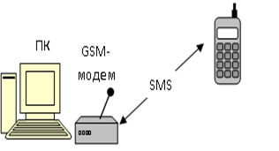

[Промислові мережі та інтеграційні технології в автоматизованих системах](README.md). 4. [ТЕХНОЛОГІЇ МОДЕМНОГО ТА БЕЗПРОВОДНОГО ЗВ’ЯЗКУ](4.md)

## 4.3. Бездротовий спосіб обміну

Не завжди в системах управління в якості фізичного носія можна використати кабель (металевий чи оптоволоконний). Розглянемо декілька прикладів, коли виникає необхідність в бездротовому зв’язку:

-    контроль та управління мобільними (пересувними) системами;

-    віддалений моніторинг стану системи;

-    управління „розумними” будинками;

-    відсутність можливості прокладки кабелів.

В першому випадку ситуація очевидна – використання кабелів для зв’язку з мобільною системою (об’єктом управління) обмежує її рух. Крім того, навіть при великій гнучкості кабелів, термін їх служби зменшується за рахунок втоми металу або фізичного ушкодження.

Віддалений моніторинг необхідний операторам або технологам для отримання аварійних повідомлень з контролюючої системи (скажімо SCADA), знаходячись при цьому в будь якій точці підприємства. Така система також зручна при аналізі працездатності системи, перевіряючи її складові, які територіально розподілені.

Все більш перспективним напрямком стає автоматизація в багатоповерхових та приватних житлових будинках, що включає в себе управляння електро-, тепло- та водопостачанням, пожежну та охоронну сигналізацію і т.д. Альтернативою провідникам для підключення датчиків, виконавчих механізмів, контролерів може служити радіосигнал, а в якості панелі оператора може бути звичайний мобільний телефон.

Звісно при відсутності можливості прокладки кабелів, або дороговизною такого рішення, альтернативи бездротовому зв’язку немає.   

### 4.3.1. Питання стандартизації

Питаннями міжнародної стандартизації промислових мереж займаються МЕК і національні комітети при підтримці незалежних професійних товариств (наприклад, HCF (Hart Communication Foundation), FF (Fieldbus Foundation), PNO (Profibus & Profinet Organization), ODVА (Open Device Vendor Association - Асоціація виробників пристроїв для відкритих систем)). Провідна роль при розробці бездротових стандартів для мереж промислової автоматики належить ISA і WCT (Wireless Cooperation Team - спілка промисловців з бездротових технологій). WCT - це зовсім нова спілка з товариств HCF, FF, PNO, ODVА, яка була утворена у вересні 2007 р. з метою створення бездротової інфраструктури на польовому рівні АСУ ТП. У комітеті ISA і WCT ведеться подальша робота по створенню цілого сімейства бездротових стандартів для промислової автоматики, а також вирішується завдання щодо створення єдиної бездротової інфраструктури для підприємств і великих промислових комплексів. 

Також варто відзначити відділ ITU-R, який відповідає за питання частотного регулювання та розподілу частот для бездротових мереж в світовому масштабі, що спирається на національні міністерства і відомства. наприклад FCC (Federal Communication Commission - Федеральна комісія США із зв'язку) і CFR47 країн Америки, ФДУП «ГКРЧ» Росії, а також на такі організації і комітети Європи як ETSI (European Telecommunication Standardization Institute - Європейський Інститут з стандартизації), комітет ECC (Electronic Communications Committee - Комітет з електронних засобів зв'язку). 
 Так, у розділах регулювання частот ITU-R по регіонах світу була виділена єдина (за деяким винятком) безліцензійна радіочастотна смуга ISM (Industrial, Scientific and Medical) - 6,765 МГц ... 246 ГГц.

В Україні виділяються смуги робочих частот відповідно до виду пристроїв, що їх використовують. Використання бездротових промислових мереж відносяться постановою Кабінету Міністрів України від 15 грудня 2005 р. № 1208 до «промислових пристроїв», «наукових пристроїв», «медичних пристроїв», «побутових пристроїв».

При впровадженні бездротових мереж в промисловій автоматиці крім стандартних вимог до промислових мереж необхідно враховувати:

-    інтенсивність обміну даними;

-    можливість використання автономних джерел живлення великої ємності;

-    топологію радіомережі, яка повинна передбачити надлишковість зв’язку та самоорганізацію мережі, що дасть змогу підвищити надійність мережі.

### 4.3.2. Класифікація бездротових способів обміну

Умовно бездротові способи обміну можна поділити як на рис.4.4. Відмітимо, що подана класифікація умовна, тому що на сьогодні засоби стільникового зв’язку 3G, 4G підтримують (інтегруються) з пакетними та локальними радіомережами стандарту 802.11 та 802.16.

Рис.4.4. До класифікації бездротових мереж

Наведемо класифікацію бездротових мереж за територіальним розподілом:

- WPAN ([wireless](http://en.wikipedia.org/wiki/Wireless) personal area network) – персональні мережі, що базуються на стандарті 802.15. Прикладом можуть бути мережі [IrDA](http://en.wikipedia.org/wiki/Infrared_Data_Association), [Bluetooth](http://en.wikipedia.org/wiki/Bluetooth), а також промислові - [UWB](http://en.wikipedia.org/wiki/Ultra-wideband), [Z-Wave](http://en.wikipedia.org/wiki/Z-Wave), [ZigBee](http://en.wikipedia.org/wiki/ZigBee), Wireless Hart. Даний стандарт поділяється на наступні:

  - 802.15.1, що базується на специфікації Bluetooth; 

  - 802.15.2, що застосовується для взаємодії пристроїв 802.11 и 802.15; 

  - 802.15.3, що розроблений для високошвидкісної передачі даних; 

  - 802.15.4, що визначає низькошвидкісну передачу даних. 

- WLAN ([wireless](http://en.wikipedia.org/wiki/Wireless_network) [local area network](http://en.wikipedia.org/wiki/Local_area_network)) – локальні мережі, що базуються на стандарті 802.11. прикладом таких мереж є [Wi-Fi](http://ru.wikipedia.org/wiki/Wi-Fi), HyperLAN.

- WMAN (Wireless Metropolitan Area Networks) – регіональні мережі, що базуються на стандарті 802.16. Найпопулярніша мережа цього стандарту є мережа [WiMAX](http://ru.wikipedia.org/wiki/WiMAX).

Нагадаємо, що кожен з наведених стандартів, що розроблений комітетом ІЕЕЕ описує фізичний рівень та підрівень MAC канального рівня. 

### 4.3.3. Стандарт IEEE 802.15

Основним поняттям цього стандарту є пікомережа (piconet), що складається з головного вузла та декількох підпорядкованих в радіусі 10 м. пікомережі можуть об’єднуватися через спеціальні мости. Головний вузол крім активних вузлів може підтримувати пасивні вузли (з пониженим енергоспоживанням). А взагалі, вузол даної мережі може підтримувати ще два види зниженого енергоспоживання – зупинений та аналізуючий. Завдяки цьому подовжується ресурс їх джерел живлення. Опишемо коротко кожен з сімейства стандартів 802.15:

#### 4.3.3.1. IEEE 802.15.1

Це стандарт для мереж WPAN, який був створений IEEE 802.15 Task Group 1 спільно з Bluetooth SIG (технологія Bluetooth з’явилася раніше 802.15). Базується на специфікації Bluetooth v.1.1, що передбачає радіус дії близько 10м. Рівень радіозв’язку переносить інформацію від головного вузла до підлеглих і навпаки. Мережа працює в неліцензійному діапазоні 2,4 ГГц, що розділений на 79 каналів по 1 МГц в кожному. Метод модуляції – частотна маніпуляція з 1 бітом на герц, що визначає сумарну швидкість 1 Мбіт/с. Використовується стрибкоподібна перебудова частоти, послідовність якої генерується головним вузлом.  

#### 4.3.3.2. IEEE 802.15.3

Група IEEE 802.15 Task Group 3 розробляє цей високошвидкісний стандарт та обіцяє надати недорогу мережу з низьким споживанням енергії, призначену для потреб споживчої електроніки. Стандарт передбачає використання смуги 2,4 GHz, а для модуляції застосовується квадратурна маніпуляція фазовим зрушенням зі зміщенням (Offset Quadrature Phase Shift Keying - OQPSK), за допомогою якої досягається швидкість передачі від 11 до 55 Мбіт/с.

#### 4.3.3.3. IEEE 802.15.4 

Специфікація призначається для низькошвидкісних WPAN. Над нею працювала, IEEE 802.15 Task Group 4. Очікується, що стандарт забезпечить низьке споживання енергії і простоту розробки пристроїв. Передбачуваною областю застосування є сенсори, інтерактивні іграшки, віддалене управління, домашня автоматика. Стандарт використовує 16 каналів в діапазоні 2,4 ГГц, 10 каналів в діапазоні 915 MГц і один канал у смузі 868 MГц, що прийнято в Європі. Цей стандарт описує фізичний і канальний рівні зі швидкістю обміну даними до 250 Кбіт/с і топології побудови радіомережі "зірка", "точка-точка", mesh. Він є основою побудови більшості бездротових сенсорних мереж з пересилкою даних. І в першу чергу цей стандарт може бути затребуваний в мережах промислової автоматики, оскільки польові шини АСУ ТП, як правило, є низькошвидкісними.

### 4.3.4. Стандарт IEEE 802.11

Стандарт IEEE 802.11 є базовим стандартом і визначає протоколи, необхідні для організації бездротових локальних мереж (WLAN). Основні з них - протокол управління доступом до середовища MAC і протокол PHY передачі сигналів у фізичному середовищі. Як останній допускається використання радіохвиль та інфрачервоного випромінювання. Стандартом 802.11 визначений єдиний підрівень MAC, взаємодіючий з трьома типами протоколів фізичного рівня, що відповідають різним технологіями передачі сигналів - по радіоканалах у діапазоні 2,4 Ггц із широкосмугового модуляцією з прямим розширенням спектру (DSSS) та з перебудовою частоти (FHSS), а також за допомогою інфрачервоного випромінювання. Специфікаціями стандарту передбачені два значення швидкості передачі даних - 1 і 2 Мбіт/с. У порівнянні з дротяними Ethernet можливості підрівня MAC розширені за рахунок включення в нього ряду функцій, що зазвичай виконуються протоколами більш високого рівня, зокрема, процедур фрагментації і ретрансляції пакетів. Це викликано прагненням підвищити ефективну пропускну спроможність системи завдяки зниженню накладних витрат на повторну передачу пакетів. В якості основного методу доступу до середовища стандартом 802.11 визначено механізм CSMA/CA (Carrier Sense Multiple Access with Collision Avoidance - множинний доступ з виявленням несучої та запобіганням колізій). 

Для економії енергоресурсів мобільних робочих станцій, що використовуються в мережі 802.11 передбачений механізм перемикання станцій в так званий пасивний режим з мінімальним споживанням потужності.

В основу стандарту 802.11 покладена стільникова архітектура, причому мережа може складатися як з однієї, так і декількох комірок. Кожна сота управляється базовою станцією (точка доступу - Access Point, АР), яка разом з розташованими в межах радіуса її дії робочими станціями користувачів утворює базову зону обслуговування (Basic Service Set, BSS) Точки доступу багатосотової мережі взаємодіють між собою через розподільну систему (Distribution System, DS), що представляє собою еквівалент магістрального сегменту кабельних локальних мереж. Вся інфраструктура, що включає точки доступу та розподільну систему утворює розширену зону обслуговування (Extended Service Set). 

Стандартом передбачений також односотовий варіант бездротової мережі, який може бути реалізований і без точки доступу, при цьому частина її функцій виконуються безпосередньо робочими станціями. 

Для забезпечення переходу мобільних робочих станцій із зони дії однієї точки доступу до іншої в багатосотових система передбачені спеціальні процедури сканування (активного і пасивного прослуховування ефіру) і приєднання (Association), проте строгих специфікацій по реалізації роумінгу стандарт 802.11 не передбачає. 

Для захисту WLAN стандартом IEEE 802.11 передбачено цілий комплекс заходів безпеки передачі даних під загальною назвою Wired Equivalent Privacy (WEP). Він включає засоби протидії несанкціонованому доступу до мережі (механізми і процедури аутентифікації), а також запобігання перехоплення інформації (шифрування). 

Даний стандарт сумісний зі стандартом Ethernet вище канального рівня, зокрема це стосується можливістю посилання IP-пакетів. 

Основні різновиди стандарту 802.11 та їх характеристики наведені в табл.4.5.

Стандарти 802.11а/g використовують метод модуляції OFDM (ортогональне частотне ущільнення), що передбачає 52 різні робочі частоти, 48 з яких використовується для даних, а 4 – для синхронізації. Розподіл сигналу на багато вузьких діапазонів має переваги перед передачею в одному широкому діапазоні – нищу чутливість до вузькосмугову інтерференції та можливість використання незалежних діапазонів. Система кодування QAM або модуляція з фазовим зміщенням.

Стандарт 802.11b використовує метод високошвидкісної передачі широкосмугового сигналу за методом прямої послідовності, що кодує біти зі швидкістю 11 млн. елементарних сигналів в секунду. Для сумісності з 802.11а/g використовує також модуляцію з фазовим зміщенням. Хоча швидкість 802.11b менша за 802.11а/g, діапазон першого майже в 7 разів ширший, що буває важливо в деяких ситуаціях.

Таблиця 4.5. Основні версії стандарту 802.11

| Версія  802.11                                      | Дата випуску | частота   (ГГц) | Смуга пропускання (MГц) | ШПД на потік (Mбіт/с)                       | Модуляція                                                    |
| --------------------------------------------------- | ------------ | --------------- | ----------------------- | ------------------------------------------- | ------------------------------------------------------------ |
| –                                                   | Jun 1997     | 2.4             | 20                      | 1, 2                                        | [DSSS](http://en.wikipedia.org/wiki/Direct-sequence_spread_spectrum) |
| [a](http://en.wikipedia.org/wiki/IEEE_802.11a-1999) | Sep 1999     | 5               | 20                      | 6, 9, 12, 18, 24, 36, 48, 54                | [OFDM](http://en.wikipedia.org/wiki/Orthogonal_frequency-division_multiplexing) |
|                                                     |              | 3.7             |                         |                                             |                                                              |
| [b](http://en.wikipedia.org/wiki/IEEE_802.11b-1999) | Sep 1999     | 2.4             | 20                      | 1, 2, 5.5, 11                               | [DSSS](http://en.wikipedia.org/wiki/Direct-sequence_spread_spectrum) |
| [g](http://en.wikipedia.org/wiki/IEEE_802.11g-2003) | Jun 2003     | 2.4             | 20                      | 1, 2, 6, 9, 12, 18, 24, 36, 48, 54          | [OFDM](http://en.wikipedia.org/wiki/Orthogonal_frequency-division_multiplexing), [DSSS](http://en.wikipedia.org/wiki/Direct-sequence_spread_spectrum) |
| [n](http://en.wikipedia.org/wiki/IEEE_802.11n-2009) | Oct 2009     | 2.4/5           | 20                      | 7.2, 14.4, 21.7, 28.9, 43.3, 57.8, 65, 72.2 | [OFDM](http://en.wikipedia.org/wiki/Orthogonal_frequency-division_multiplexing) |
|                                                     |              |                 | 40                      | 15, 30, 45, 60, 90, 120, 135, 150           |                                                              |

Пристрої стандарту 802.11n можуть працювати у трьох режимах: успадкованого (Legacy), в якому забезпечується підтримка пристроїв 802.11b/g і 802.11a змішаному (Mixed), в якому підтримуються пристрої 802.11b/g, 802.11a і 802.11n «Чистому» режимі - 802.11n (саме в цьому режимі і можна скористатися перевагами підвищеної швидкості до 600 Мбіт/с і збільшеною дальністю передачі даних, що забезпечує стандарт 802.11n). Ключовий компонент стандарту 802.11n під назвою MIMO (Multiple Input, Multiple Output - багато входів, багато виходів) передбачає застосування просторового мультиплексування з метою одночасної передачі декількох інформаційних потоків по одному каналу, а також багатопроменеве відображення, яке забезпечує доставку кожного біта інформації відповідного одержувачу з невеликою ймовірністю впливу перешкод і втрат даних. Саме можливість одночасної передачі і прийому даних визначає високу пропускну здатність пристроїв 802.11n. 

Слід відмітити, що на практиці, навіть при максимально можливому рівні сигналу продуктивність даних мереж ніколи не досягає зазначеного вище теоретичного максимуму. Наприклад, швидкість мереж, що підтримують стандарт 802.11b, зазвичай складає не більше 50% їх теоретичного максимуму, тобто приблизно 5.5 Мбіт/сек. Відповідно, швидкість мереж, що підтримують стандарт 802.11a або 802.11g, зазвичай складає не більше 20 Мбіт/сек. Причинами невідповідності теорії і практики є надмірність кодування протоколу, перешкоди у сигналі, а також зміна відстані Хеммінга зі зміною відстані між приймачем і передавачем. Крім того, чим більше пристроїв в мережі одночасно беруть участь в обміні даними, тим нижча пропускна здатність мережі. Крім того, швидкість роботи будь-якої пари пристроїв істотно падає зі зменшенням рівня сигналу, тому часто найбільш ефективним засобом підняття швидкості для віддалених пристроїв є застосування антен з великим коефіцієнтом підсилення. 

Стандартом передбачено дві категорії сервісів: сервіси розподілу та станційні сервіси. Перші сервіси пов’язані з управлінням станціями, що знаходять в даному осередку (соті) та взаємодією з зовнішніми станціями. Друга категорія відповідає за управління активністю всередині одного осередку.

### 4.3.5. Стандарт IEEE 802.16

Мережі, що засновані на стандарті IEEE 802.16 складаються з наступних основних частин - базових і абонентських станцій, а також обладнання, що зв'язує базові станції між собою, з постачальником сервісів і з Інтернетом.

Для з'єднання базової станції з абонентською використовується високочастотний діапазон радіохвиль від 1,5 до 11 ГГц. В ідеальних умовах швидкість обміну даними може досягати 70 Мбіт / с, при цьому не вимагається забезпечення прямої видимості між базовою станцією і приймачем. Між базовими станціями встановлюються з'єднання (прямої видимості), що використовують діапазон частот від 10 до 66 ГГц, швидкість обміну даними може досягати 120 Мбіт / c. При цьому, принаймні одна базова станція підключається до мережі провайдера з використанням класичних дротових з’єднань. Однак, чим більше число БС підключено до мереж провайдера, тим вища швидкість передачі даних і надійність мережі в цілому.

802.16 і 802.11 - технології спрямовані на вирішення абсолютно різних завдань. 802.16 – це система далекої дії, що покриває кілометри простору, яка зазвичай використовує ліцензовані спектри частот (хоча можливо і використання неліцензованих частот) для надання з'єднання із інтернетом типу точка-точка провайдером кінцевому користувачеві. Різні стандарти сімейства 802.16 забезпечують різні види доступу, від мобільного (схожий з передачею даних із мобільних телефонів) до фіксованого (альтернатива провідникового доступу, при якому бездротове обладнання користувача прив'язане до розташування). 802.11 - це система більш короткої дії, що зазвичай покриває сотні метрів, яка використовує неліцензовані діапазони частот для забезпечення доступу до мережі. Зазвичай 802.11 використовується користувачами для доступу до їх власної локальної мережі, яка може бути не підключена до Інтернету. 802.16 і 802.11 мають зовсім різний механізм Quality of Service (QoS). 802.16 використовує механізм, заснований на встановленні з'єднання між базовою станцією та пристроєм користувача. Кожне з'єднання базується на спеціальному алгоритмі планування, який може гарантувати параметр QoS для кожного з'єднання. 802.11, в свою чергу, використовує механізм QoS подібний тому, що використовується в Ethernet, при якому пакети отримують різний пріоритет. Такий підхід не гарантує однаковий QoS для кожного з'єднання.

### 4.3.6. Технології бездротового зв’язку в промисловості

Найпопулярніші технології бездротового зв’язку наведені в табл.4.3.

Таблиця 4.3. Порівняльна таблиця стандартів бездротового зв’язку

| Технологія                                  | Стандарт  | Використання                                                 | Пропускна здатність                                          | Радіус дії                               | Частоти                                                      |
| ------------------------------------------- | --------- | ------------------------------------------------------------ | ------------------------------------------------------------ | ---------------------------------------- | ------------------------------------------------------------ |
| [Wi-Fi](http://ru.wikipedia.org/wiki/Wi-Fi) | 802.11a   | [WLAN](http://ru.wikipedia.org/wiki/WLAN)                    | до 54 Мбіт/с                                                 | до 100 метрів                            | 5,0 ГГц                                                      |
| [Wi-Fi](http://ru.wikipedia.org/wiki/Wi-Fi) | 802.11b   | [WLAN](http://ru.wikipedia.org/wiki/WLAN)                    | до 11 Мбіт/с                                                 | до 100 метрів                            | 2,4 ГГц                                                      |
| [Wi-Fi](http://ru.wikipedia.org/wiki/Wi-Fi) | 802.11g   | [WLAN](http://ru.wikipedia.org/wiki/WLAN)                    | до 108 Мбіт/с                                                | до 100 метрів                            | 2,4 ГГц                                                      |
| [Wi-Fi](http://ru.wikipedia.org/wiki/Wi-Fi) | 802.11n   | [WLAN](http://ru.wikipedia.org/wiki/WLAN)                    | до 300 Мбіт/с (в перспективі до 450, а потім до 600  Мбіт/с) | до 100 метрів                            | 2,4 — 2,5 або 5,0 ГГц                                        |
| WiMax                                       | 802.16d   | [WMAN](http://ru.wikipedia.org/wiki/WMAN)                    | до 75 Мбіт/с                                                 | 6-10 км                                  | 1,5-11 ГГц                                                   |
| WiMax                                       | 802.16e   | Mobile WMAN                                                  | до 30 Мбіт/с                                                 | 1-5 км                                   | 2-6 ГГц                                                      |
| Bluetooth v. 1.1.                           | 802.15.1  | [WPAN](http://ru.wikipedia.org/wiki/Беспроводные_персональные_сети_(WPAN)) | до 1 Мбіт/с                                                  | до 10 метрів                             | 2,4 ГГц                                                      |
| Bluetooth v. 1.3.                           | 802.15.3  | [WPAN](http://ru.wikipedia.org/wiki/Беспроводные_персональные_сети_(WPAN)) | від 11 до 55 Мбіт/с                                          | до 100 метрів                            | 2,4 ГГц                                                      |
| UWB                                         | 802.15.3a | [WPAN](http://ru.wikipedia.org/wiki/Беспроводные_персональные_сети_(WPAN)) | 110-480 Мбіт/с                                               | до 10 метрів                             | 7,5 ГГц                                                      |
| ZigBee                                      | 802.15.4  | [WPAN](http://ru.wikipedia.org/wiki/Беспроводные_персональные_сети_(WPAN)) | від 20 до 250 Кбіт/с                                         | 1-100 м                                  | 2,4 ГГц (16 каналів), 915 МГц (10 каналів), 868 МГц  (один канал) |
| Wireless Hart                               | 802.15.4  | [WPAN](http://ru.wikipedia.org/wiki/Беспроводные_персональные_сети_(WPAN)) | 250 Кбіт/с                                                   | до 250 м прямої видимості між пристроями | 2,4 ГГц                                                      |

#### 4.3.6.1. ZigBee. 

Це назва набору протоколів мережного та вище рівнів, що використовують маленькі, малопотужні радіопередавачі, засновані на стандарті IEEE 802.15.4. ZigBee націлена на додатки, яким потрібний більший час автономної роботи від батарей і велика безпека, при менших швидкостях передачі даних. Радіус дії - до 75 м. Мережа здатна підтримувати до 254 клієнтів плюс один повнофункціональний майстер-пристрій (координатор). Основна особливість технології ZigBee полягає в тому, що вона при відносно невисокому енергоспоживанні підтримує не тільки прості топології бездротового зв'язку («точка-точка» і «зірка»), але й складні бездротові мережі з комірчастою топологією з ретрансляцією і маршрутизацією повідомлень (рис. 4.6, а). Області застосування нової технології - це бездротові мережі датчиків, ЖКГ, автоматизація житлових та споруджуваних приміщень, створення індивідуального діагностичного медичного обладнання, промисловий моніторинг і управління, побутова електроніка та периферія персональних комп'ютерів. Але область використання технології ZigBee в АСУ ТП обмежена в силу ряду причин: технологія ZigBee має свій власний стек протоколів верхнього рівня, який суттєво відрізняється від протоколів промислового призначення; ZigBee заснована на базі стандарту IEEE 802.15.4_2003 (метод доступу до середовища СSMA/CA на канальному рівні моделі OSI), який не задовольняє підвищеним вимогам по надійності передачі даних для мереж промислової автоматики; Її можна використовувати для моніторингу та диспетчеризації та не можна використовувати для управління процесами в АСУ ТП. 
 

Рис.4.5. Мережа ZigBee: топологія;

     

Рис.4.6. Мережа ZigBee: приклад використання

#### 4.3.6.2. Wireless HART. 

Цей стандарт створений на базі стандарту 802.15.4_2006. Він має стек протоколів верхнього рівня, який сумісний з промисловими протоколами HART і ModBus-RTU. Завдяки цьому бездротові сенсорні мережі Wireless Hart можна підключати до шин HART і ModBus-RTU, а також до Industrial Ethernet. Важливе значення Wireless HART в тому, що хоч він і заснований на стандарті 802.15.4_2006 (у діапазоні 2400-2483,5 МГц), але має ряд особливостей. Так, арбітраж реалізований не за допомогою механізму CSMA/CA, що передбачений в 802.15.4, а за допомогою множинного доступу з тимчасовим поділом (TDMA). Крім того, Wireless HART використовує механізм швидкого перемикання між 16 частотними каналами 802.15.4 (аналог технології розширення спектру за допомогою швидкої перебудови частот, FHSS). Це істотно підвищує захищеність і надійність передачі даних. Тому в залежності від важливості оброблюваних даних Wireless HART гарантує надійність обміну інформацією, пов'язаної безпосередньо з керуванням технологічним процесом АСУ ТП (рис.4.7). 

Рис.4.7a. Мережа Wireless Hart: топологія; 

б)

Рис.4.7б. Мережа Wireless Hart: приклад використання

#### 4.3.6.3. Bluetooth. 

Радіозв'язок Bluetooth здійснюється в ISM-діапазоні, який використовується в різних побутових приладах і бездротових мережах (вільний від ліцензування діапазон 2,4-2,4835 ГГц). В Bluetooth застосовується метод розширення спектру зі стрибкоподібно перебудовою частоти (англ. Frequency Hopping Spread Spectrum, FHSS). Метод FHSS простий в реалізації, забезпечує стійкість до широкосмугових перешкод, а обладнання коштує недорого. Відповідно до алгоритму FHSS, в Bluetooth несуча частота сигналу стрибкоподібно змінюється 1600 разів за секунду (усього виділяється 79 робочих частот шириною в 1 МГц). Послідовність перемикання між частотами для кожного з'єднання є псевдовипадковою і відома тільки передавачу і приймачу, які кожні 625 мкс (один часовий слот) синхронно перебудовуються з одного несучої частоти на іншу. Таким чином, якщо поряд працюють кілька пар приймач-передавач, то вони не заважають один одному. Цей алгоритм є також складовою частиною системи захисту конфіденційності інформації, що передається: перехід відбувається за псевдовипадковим алгоритмом і визначається окремо для кожного з'єднання. При передачі цифрових даних та аудіосигналу (64 кбіт/с в обох напрямках) використовуються різні схеми кодування: аудіосигнал не повторюється (як правило), а цифрові дані у випадку втрати пакета інформації будуть передані повторно. Без завадостійкого кодування це забезпечує передачу даних зі швидкостями 723,2 кбіт/с зі зворотним каналом 57,6 кбіт/с, або 433,9 кбіт/c в обох напрямках.

В залежності від класу обладнання пристрої Bluetooth працюють на відстанях 1, 10, 100 м, а в залежності від специфікації – на швидкостях 1, 3, 24 Мбіт/с.

Щоб використовувати технологію бездротового зв'язку Bluetooth, пристрій повинен бути в змозі інтерпретувати певні профілі Bluetooth, які визначають можливості додатків і загальні моделі поведінки Bluetooth пристроїв для зв'язку з іншими пристроями Bluetooth. Є широкий асортимент профілів Bluetooth, які описують різні типи їх застосування чи використання, деякі з них, що використовуються в промисловості наведені в табл.4.4.

Таблиця 4.4. Деякі профілі Bluetooth

|                                                              |                                                              |
| ------------------------------------------------------------ | ------------------------------------------------------------ |
| Basic  Imaging Profile (BIP)                                 | Профіль розроблений для пересилання зображень між пристроями і включає  можливість зміни розміру зображення і конвертація в підтримуваний формат  приймаючого пристрою. |
| Common ISDN  Access Profile (CIP)                            | Профіль  для доступу пристроїв до ISDN.                      |
| Device ID  Profile (DID)                                     | Профіль дозволяє ідентифікувати клас пристрою, виробника, версію  продукту. |
| Dial-up  Networking Profile (DUN)                            | Протокол надає стандартний доступ до інтернету або іншого телефонного  сервісу через Bluetooth. Базується на SPP,  включає в себе команди PPP і AT, визначені в специфікації ETSI 07.07. |
| File  Transfer Profile ([FTP_profile](http://ru.wikipedia.org/w/index.php?title=Bluetooth_FTP_Profile&action=edit&redlink=1)) | Профіль  забезпечує доступ до файлової системи пристрою. Включає стандартний набір  команд FTP, що дозволяє отримувати список директорій, зміни директорій,  отримувати, передавати та видаляти файли. Використовується OBEX, базується на  GOEP. |
| General  Audio / Video Distribution Profile ([GAVDP](http://ru.wikipedia.org/w/index.php?title=Bluetooth_GAVDP&action=edit&redlink=1)) | Профіль є базою для A2DP і VDP.                              |
| Generic  Access Profile ([GAP](http://ru.wikipedia.org/w/index.php?title=Bluetooth_GAP&action=edit&redlink=1)) | Профіль є базою для всіх інших профілів.                     |
| Generic  Object Exchange Profile ([GOEP](http://ru.wikipedia.org/w/index.php?title=Bluetooth_GOEP&action=edit&redlink=1)) | Профіль є базою для інших профілів передачі даних, базується на OBEX. |
| Human  Interface Device Profile ([HID](http://ru.wikipedia.org/w/index.php?title=Bluetooth_HID&action=edit&redlink=1)) | Забезпечує підтримку пристроїв з HID (Human Interface Device), таких як  мишки, джойстики, клавіатури та інш. Використовує повільний  канал, працює на зниженій потужності |
| LAN Access  Profile (LAP)                                    | LAN  Access profile забезпечує можливість доступу Bluetooth-пристроїв до  обчислювальних мереж LAN, WAN або Internet за допомогою іншого  Bluetooth-пристрою, який має фізичне підключення до цих мереж.  Bluetooth-пристрій використовує PPP над RFCOMM для встановлення з'єднання.  LAP також допускає створення ad-hoc Bluetooth-мереж. |
| Object Push  Profile (OPP)                                   | Базовий профіль для пересилання «об'єктів», таких як зображення,  віртуальні візитні картки і ін. передачу даних. |
| Personal  Area Networking Profile (PAN)                      | Профіль дозволяє використовувати протокол Bluetooth Network  Encapsulation в якості транспорту через Bluetooth-з'єднання |
| Serial Port  Profile ([SPP](http://ru.wikipedia.org/w/index.php?title=Bluetooth_Serial_Port_Profile&action=edit&redlink=1)) | Профіль  базується на специфікації ETSI TS07.10 і використовує протокол RFCOMM.  Профіль емулює послідовний порт, надаючи можливість заміни стандартного  RS-232 бездротовим з'єднанням. Є базовим для профілів DUN, FAX, HSP і AVRCP. |
| Service  Discovery Application Profile (SDAP)                | Профіль використовується для надання інформації про профілі, які  використовує пристрій-сервер. |
| Wireless  Application Protocol Bearer (WAPB)                 | Протокол для організації P-to-P (Point-to-Point) з'єднання через  Bluetooth. |

Рис.4.8. Приклад використання Bluetooth для конфігурації обладнання за допомогою SPP-профілю

#### 4.3.6.4. Wi-fi

На сьогодні говорячи про промисловий Wi-fi мають на увазі гібридну архітектуру мережі, що складається з дротових та бездротових сегментів мереж, причому в бездротових сегментах на фізичному та MAC рівнях використовується стандарт 802.11. На верхніх рівнях використовуються протоколи дротових промислових мереж. Інтеграція двох сегментів відбувається за допомогою спеціалізованого обладнання – репітерів, мостів, шлюзів.

Використання бездротових мереж WLAN в промисловості забезпечує підвищену гнучкість, мобільність, швидке встановлення системи. Велика перевага інсталяції WLAN полягає у безпосередньому доступі до датчиків на рівні IP. До того ж інтелектуальні регулятори часто пропонують інтегрований сервер Web для визначення параметрів, за допомогою якого стає можливим бездротовий доступ до датчиків за допомогою рішення WLAN. Останні дані про стан і діагностиці можна, наприклад, передавати на ноутбук для аналізу, при цьому сам користувач знаходиться за межами промислового залу. Також промисловість випускає мости доступу до промислових дротових LAN, що дозволяє об’єднати окремі локальні мережі в єдину інфраструктуру підприємства та забезпечити вихід в Інтернет.

Відмітимо, що крім підвищених стандартів захисту (Ingress Protection, IP), промисловість пред'являє особливі вимоги до готовності бездротової мережі - стосовно як доступності мережі для клієнтів, так і відмовостійкості. І те й інше забезпечується лише шляхом проведення попередніх вимірювань ефіру. Тільки так можна гарантувати, що всі клієнти у заздалегідь визначених областях будуть отримувати безперервний доступ до мережі, а мобільні клієнти прозорим чином стануть переміщатися з однієї зони в сусідню (роумінг). Завдяки плануванню відповідних перекриттів радіокомірок навіть у випадку відмови окремих точок доступу бездротова мережа продовжить своє функціонування. Також необхідна підвищена безпека мережі, що гарантується використанням стандарту WPA2 (802.11i), що використовує більш складне шифрування даних ніж WPA.

Рис.4.9. Приклад використання Wi-fi

<-- 4.2. [Модемний обмін](4_2.md) 

--> 4.4. [Особливості бездротових модемів з використанням стільникового зв’язку](4_4.md)