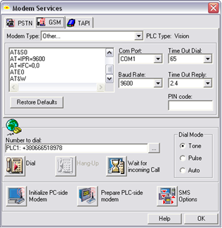

[Промислові мережі та інтеграційні технології в автоматизованих системах](README.md). 4. [ТЕХНОЛОГІЇ МОДЕМНОГО ТА БЕЗПРОВОДНОГО ЗВ’ЯЗКУ](4.md)

## 4.4. Особливості бездротових модемів з використанням стільникового зв’язку

### 4.4.1. Коротка характеристика мобільного зв’язку в Україні

В останній час дуже стрімко розвивається безпровідний спосіб зв’язку з використанням мереж операторів мобільного зв’язку. 

На сьогодні стандартів мобільного зв’язку досить багато, тому зупинимося лише на тих, що діють в Україні та підтримують пакетну передачу даних.

Станом на 2010 рік в Україні працюють наступні оператори:

- Мобільні оператори [GSM](http://uk.wikipedia.org/wiki/GSM) — [Голден Телеком GSM](http://uk.wikipedia.org/w/index.php?title=Голден_Телеком_GSM&action=edit&redlink=1), [life:)](http://uk.wikipedia.org/wiki/Life:)), [Beeline](http://uk.wikipedia.org/wiki/Beeline), [Київстар](http://uk.wikipedia.org/wiki/Київстар), [МТС](http://uk.wikipedia.org/wiki/МТС).
- Мобільні оператори [CDMA](http://uk.wikipedia.org/wiki/CDMA) — [PEOPLEnet](http://uk.wikipedia.org/wiki/PEOPLEnet), [Інтертелеком](http://uk.wikipedia.org/wiki/Інтертелеком), [CDMA  UKRAINE](http://uk.wikipedia.org/wiki/CDMA_UKRAINE), [Velton telecom](http://uk.wikipedia.org/wiki/Velton_telecom).
- Мобільні оператори [UMTS](http://uk.wikipedia.org/wiki/UMTS) — [Utel](http://uk.wikipedia.org/wiki/Utel).
- Віртуальні мобільні оператори [GSM](http://uk.wikipedia.org/wiki/GSM) — [Jeans](http://uk.wikipedia.org/w/index.php?title=Jeans&action=edit&redlink=1), [Djuice](http://uk.wikipedia.org/w/index.php?title=Djuice&action=edit&redlink=1), [Екотел](http://uk.wikipedia.org/w/index.php?title=Екотел&action=edit&redlink=1), [Мобілич](http://uk.wikipedia.org/w/index.php?title=Мобілич&action=edit&redlink=1).

### 4.4.2. Основні стандарти мобільного зв’язку 

#### 4.4.2.1. GSM. 

GSM (Global System for Mobile Communications – глобальна система мобільного зв'язку) — міжнародний стандарт для мобільного цифрового [стільникового зв'язку](http://uk.wikipedia.org/wiki/Стільниковий_зв'язок) з розділенням каналу за принципом [TDMA](http://uk.wikipedia.org/wiki/TDMA) та високим рівнем безпеки за рахунок [шифрування з відкритим ключем](http://uk.wikipedia.org/wiki/Асиметричні_алгоритми_шифрування). Стандарт був розроблений під патронатом Європейського інституту стандартизації електрозв'язку ([ETSI](http://uk.wikipedia.org/wiki/ETSI)) наприкінці 80-х років. Більшість мереж GSM працюють у діапазоні 900 МГц або 1800 МГц.

Послуги, що можуть надаватися мережами GSM:

- Передача голосової інформації. 

- Послуга передачі даних (синхронний та ансинхронний обмін даними, в тому числі пакетна передача даних — [GPRS](http://uk.wikipedia.org/wiki/GPRS)). 

- Передача коротких повідомлень ([SMS](http://uk.wikipedia.org/wiki/SMS)). 

- Передача факсів.

Саме друга та третя послуга використовується в промислових системах зв’язку. 

SMS (Short Message Service – служба коротких повідомлень) — послуга обміну (передачі і прийому) короткими текстовими повідомленнями в телекомунікаційних мережах.

GPRS (General Packet Radio Service - пакетний радіозв'язок загального користування) - надбудова над технологією мобільного зв'язку GSM, що здійснює пакетну передачу даних. GPRS дозволяє користувачеві мережі стільникового зв'язку робити обмін даними з іншими пристроями в мережі GSM і із зовнішніми мережами, в тому числі Інтернет. GPRS передбачає тарифікацію як за обсягом переданої/отриманої інформації, так і за часом, проведеним онлайн. При використанні GPRS інформація збирається в пакети і передається через невикористовувані в цей момент голосові канали, така технологія передбачає більш ефективне використання ресурсів мережі GSM. При цьому, що є пріоритетом передачі - голосовий трафік або передача даних - обирається оператором зв'язку. Існують різні класи GPRS, що розрізняються швидкістю передачі даних і можливістю суміщення передачі даних з одночасним голосовим викликом. Технологія GPRS використовує GMSK-модуляцію. Залежно від якості радіосигналу, дані, що пересилаються по радіоефірі, кодуються за однією з 4-х кодових схем (CS1-CS4). Кожна кодова схема характеризується надмірністю кодування і перешкодостійкістю, і обирається автоматично в залежності від якості радіосигналу. Протокол GPRS прозорий для TCP/IP, тому інтеграція GPRS з Інтернетом непомітна кінцевому користувачеві. Пакети можуть мати формат IP або X.25, при цьому не має значення, які протоколи використовуються поверх IP, тому є можливість використання будь-яких стандартних протоколів транспортного і прикладного рівнів, що застосовуються в Інтернеті (TCP, UDP, HTTP, HTTPS, SSL, POP3, XMPP та ін.) Також при використанні GPRS мобільний телефон виступає як клієнт зовнішньої мережі, і йому присвоюється IP-адреса (постійна або динамічна).

#### 4.4.2.2. CDMA. 

CDMA (Code Division Multiple Access - множинний доступ із кодовим розподілом каналів) — одна з можливих технологій [мультиплексування](http://uk.wikipedia.org/w/index.php?title=Мультиплексування&action=edit&redlink=1), тобто одночасної передачі даних у спільному діапазоні (так званому каналі) радіочастот. Для забезпечення множинного доступу до каналу дані кодуються спеціальним кодом, асоційованим із кожним каналом, і використовуються властивості конструктивної [інтерференції](http://uk.wikipedia.org/wiki/Інтерференція) спеціальних кодів, щоб здійснювати мультиплексування. 

На основі технології CDMA було розроблено стандарт мобільного зв’язку [CDMA2000](http://uk.wikipedia.org/wiki/CDMA2000). Тут історично склалося декілька етапів. При побудові системи мобільного зв'язку на основі технології CDMA2000 1Х перша фаза забезпечує передачу даних зі швидкістю до 153 кбіт/с, що дозволяє надавати послуги голосового зв'язку, передачу коротких повідомлень, роботу з електронною поштою, Інтернетом, базами даних, передачу даних та фотографій. Перехід до наступної фази CDMA2000 1xEV-DO відбувається при використанні тієї ж смуги частот 1,23 МГц, швидкість передачі - до 2,4 Мбіт/с в прямому каналі і до 153 кбіт/с у зворотному, що робить цю систему зв'язку відповідає вимогам 3G і дає можливість надавати самий широкий спектр послуг, аж до передачі відео в режимі реального часу. Наступною фазою розвитку стандарту в напрямку збільшення мережної ємності й передачі даних є 1XEV-DO Rev A: передача даних зі швидкістю до 3,1 Мбіт/с у напрямку до абонента і до 1,8 Мбіт/с - від абонента.

#### 4.4.2.3. UMTS. 

UMTS (Universal Mobile Telecommunications System – універсальна система мобільного зв’язку) — технологія стільникового зв'язку, що відноситься до покоління 3G. Як спосіб передачі даних через повітряний простір використовується технологія [W-CDMA](http://ru.wikipedia.org/wiki/W-CDMA) (Wideband Code Division Multiple Access — широкосмуговий множинний доступ із кодовим розподілом каналів, який використовує дві широкі смуги радіочастот по 5 МГц). Ця технологія використовує протоколи [HSDPA](http://uk.wikipedia.org/wiki/HSDPA) та [HSUPA](http://uk.wikipedia.org/wiki/HSUPA) - протоколи високошвидкісного приймання та передавання пакетних даних, що включають два типи модуляції [QPSK](http://uk.wikipedia.org/wiki/QPSK) та [16QAM](http://uk.wikipedia.org/wiki/16QAM), за рахунок чого підвищується швидкість передачі до 7,2 Мбіт/с

В усіх випадках користування послугами мобільного зв’язку не обходиться без мобільного оператора, а отже передбачає допоміжні фінансові витрати.

Приклад 4.2. Передача SMS-повідомлень. 

Завдання. Передати SMS-повідомлення з контролера Unitronics до мобільного телефону при спрацюванні внутрішнього біту.

Рис.4.10. Структурна схема системи до прикладу 4.2

Рішення. Так як PLC Unitronics має два порти RS-232/RS-485 з роз’ємами RG-11, а перший використовується для програмування, то перемикаємо порт2 в режим RS-232, а схема модемного кабеля має вигляд як на рис.4.11.

Рис.4.11. Схема з’єднань до прикладу 4.2
Попередньо перед підключенням необхідно підготувати модем: для цього з’єднують модем з PC звичайним модемним кабелем та запускають на виконання в програмному забезпеченні VisiLogic Connection/Modem Services, налаштовують відповідні параметри послідовного порту як показано на рис.4.12 та натискують Prepare PLC-side modem (список АТ-команд попередньої підготовки модему користувач може задати самостійно). Далі складають програму посилки SMS-повідомлення (див. рис. 4.13).

Рис.4.12. Попередня підготовка модему

Рис.4.13. Фрагмент програми посилки SMS-повідомлення

<-- 4.3. [Бездротовий спосіб обміну](4_3.md) 

--> 5.[ІНТЕРФЕЙС AS-i](5.md)

### Контрольні запитання до розділу 4

1. Що таке символьний спосіб обміну?

2) Як формується кадр при символьній передачі інформації?

3) Розкажіть про призначення та принцип дії модему.

4) Класифікація модемів.

5) АТ-команди модемів: принципи використання.

6) Використання бездротового способу обміну в промисловості.

7) Основні концепції при бездротовій передачі інформації.

8) Класифікація бездротових мереж за територіальним розподілом.

9) 802.15: топологія, призначення, класифікація, основні концепції.

10) Розкажіть про функціонування мереж на основі стандарту 802.15 в промисловості.

11) 802.11: топологія, призначення, класифікація, основні концепції.

12) Як використовуються мережі на основі стандарту 802.11 в промисловості.

13) 802.16: топологія, призначення, основні концепції.

14) Назвіть особливості бездротових модемів стільникового зв’язку.

15) Назвіть основні послуги GSM-зв’язку, що використовуються в промисловості.

16) Наведіть приклад використання GSM-зв’язку в промисловості.

17) Порівняйте основні бездротові стандарти, що використовуються в промисловості.

