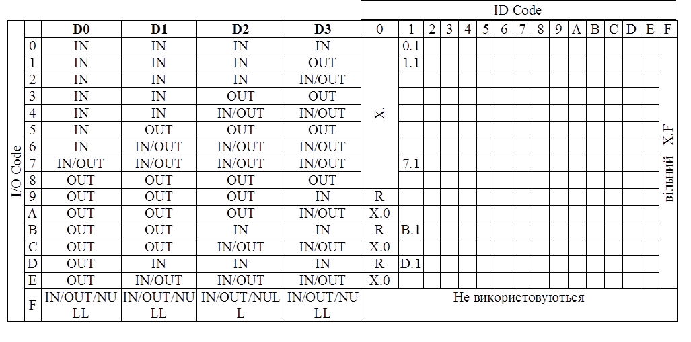

[Промислові мережі та інтеграційні технології в автоматизованих системах](README.md). 5.[ІНТЕРФЕЙС AS-i](5.md)

## 5.10. AS-i профілі

В табл..5.2 наведений діапазон профілів Ведених пристроїв AS-i V2.0. 

Таблиця 5.2 Діапазон профілів Ведених пристроїв AS-i

Колонки DO-D3 вказують використання бітів даних в кадрах типу Data Exchange на етапі обміну даними. Тобто IN вказує на вхідні біти, OUT – на вихідні. Наприклад для I/O Code 4 використовуються всі 4 біти в кадрі від Веденого до Ведучого, а для кадру Ведучого тільки 2-ий та 3-ий. Це може бути скажімо профіль пристрою з 4-ма дискретними входами, та 2-ма дискретними виходами. Літера R вказує на зарезервований профіль.

Профілі X.F (вільні профілі) використовуються у випадку пристроїв з сильно спеціалізованими функціями, які не знаходять широкого використання. Такі профілі також мають пристрої, які очікують стандартизації. 

Профілі X.0 мають Ведені, що не використовують якихось специфічних, наперед визначених функцій. Тобто просто віддалені пристрої Вх./Вих., I/O Code яких визначає кількість дискретних входів та виходів. 

Профіль 0.1 використовується для двох вхідних датчиків (2 канали на кожний датчик), 1.1 - для датчика з функцією тестування, B.1 - для управління двома реверсивними двигунами, D.1 - для управління двигуном з функцією тестування. 

Профіль 7.1 (аналоговий профіль) застосовується для пристроїв з двонаправленим рухом інформації (4 біти туди, 4 в зворотному напрямку) та для аналогових пристроїв. Операцію з аналоговими даними Ведучий проводить за декілька AS-i циклів. Тому для реалізації обміну з даним профілем може знадобитися штучне, тобто програмне оформлення компонування даних, в залежності від специфіки роботи Веденого. В специфікації AS-i V2.1 для роботи з аналоговими пристроями з’явилися профілі 7.3 та 7.4, які спрощують роботу з ними. 

## Контрольні запитання до розділу 5

1.   Яка область призначення мережі AS-і?

2.   Які переваги має AS-і перед іншими промисловими мережами?

3.   Які обмеження має AS-і ?

4.   Які пристрої можна підключати до AS-і?

5.   Які основне обладнання використовується при побудові мережі AS-і ?

6.   Які мережні кабелі можна використовувати при побудові AS-і?

7.   Які переваги має спеціальний "жовтий" AS-і – кабель?

8.   Яку топологію може мати мережі AS-і?

9.   Яка особливість живлення обладнання на AS-і?

10.      Яка максимальна довжина доступна для мережі AS-і? Як можна її збільшити? Яка бітова швидкість використовується? 

11.      Скільки входів виходів може мати Ведений на AS-і V2.0?

12.      Призначення буферів обміну Ведучого і Ведених?

13.      Які процедури відбуваються під час конфігурування шини і окремих її складових?

14.      В яких режимах може працювати Ведучий після активації Ведених?

15.      Поясніть схему обміну даними процесу між Ведучим та Веденими.

16.      Поясніть формат кадру команди від Ведучого.

17.      Поясніть формат кадру відповіді Веденого.

18.      Як можна вирахувати час, за який Ведучий AS-i опитає всіх Ведених на шині?

19.      Поясніть поняття профілювання пристроїв в AS-i. Перерахуйте профілі Ведучих та підтримувані ними функції. 

20.      Які типи профілів використовуються і чим вони відрізняються?

21.      Які особливості нових специфікацій стандарту AS-I V2.1 та V3.0?

22.      Чи можна використовувати на AS-i аналогові Ведені?

 

<-- 5.9. [AS-i V2.1 та V3.0](5_9.md) 

--> 6 [МЕРЕЖІ MODBUS](6.md)