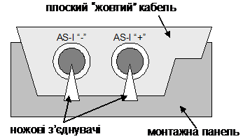
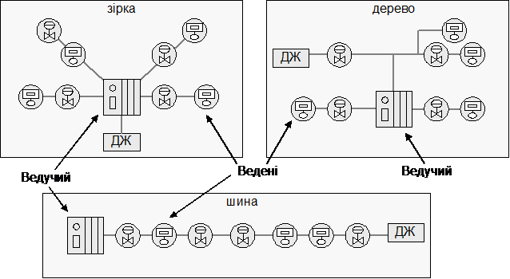
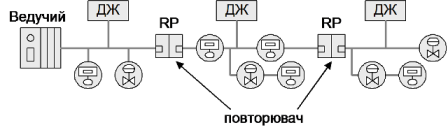
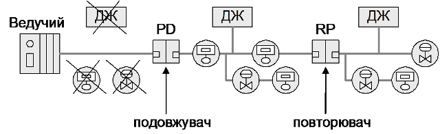
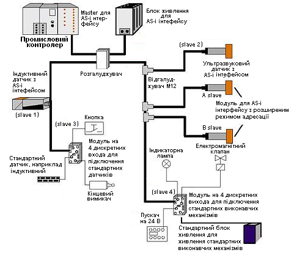

[Промислові мережі та інтеграційні технології в автоматизованих системах](README.md). 5.[ІНТЕРФЕЙС AS-i](5.md)

## 5.2. Реалізація фізичного рівня

Фізичний рівень забезпечує передачу інформації разом з живленням за рахунок спеціального методу кодування біт, яке використовує комбінацію методу диференційного манчестерського кодування та модуляції струму, яка базується на sin2-хвилях. Такий спосіб кодування дозволяє синхронізувати джерело з приймачем та підвищує надійність передачі. 

Для реалізації AS-i шини необхідно використовувати наступне обладнання: 

- Ведучий мережний пристрій (Master);

- Ведені пристрої (Slave), які в залежності від конструкції поділяються на:

а)модулі AS-i інтерфейсу, за допомогою яких до шини підключаються звичайні датчики і виконавчі механізми;

   б) датчики і виконавчі механізми з вбудованим AS-i інтерфейсом.

- джерело живлення;

- мережний кабель;

- повторювачі, підсилювачі, шлюзи і інші додаткові пристрої.

Рис. 5.1. «Жовтий кабель» AS-i шини

Для з’єднання компонентів можна використати будь-який двохжильний кабель, який вибирається в залежності від споживаної потужності. Немає необхідності у використанні екранованого кабелю, чи витої пари. Однак більш просте і швидке виконання монтажу системи можна досягнути за рахунок використання спеціального плоского кабелю AS-i інтерфейсу, який являє собою трапецієвидний двохжильний кабель 2х1,5мм2 з асиметричним профілем („жовтий кабель”) (рис.5.1). Останнє виключає можливість підключення вузлів з неправильною полярністю. Підключення до даного кабелю відбувається методом проколу ізоляції гострими контактами спеціальних контактних пристроїв AS-i (модулі, коробки підключення). Тому немає необхідності в різанні кабелю та зачистки ізоляції в місті установки нового вузла. Окрім того, за рахунок гумової оболонки структура кабелю має особливість самовідновлення. Тобто, якщо контактний пристрій вилучається, прорізані отвори затягуються, що зберігає ступінь захисту ІР67. Зручність монтажу з таким кабелем і зробила AS-i таким популярним, тому його ще називають „жовтим кабелем”. 

AS-i інтерфейс може мати шинну, зіркову або деревовидну топологію. Максимальна довжина всієї мережі – 100м без повторювача, 300м з двома повторювачами. Бітова швидкість фіксована і дорівнює 167 Кбіт/с. 

Рис.5.2. Топологія AS-I мережі (ДЖ- джерело живлення)

Реалізується AS-i інтерфейс за допомогою мікросхем ASIC (Application Specific Integrated Circuits), які інтегруються у пристрої, що підключаються до шини. Але можливе підключення звичайних датчиків і виконавчих механізмів за допомогою спеціальних модулів, які мають мікросхему ASIC.

В мережах AS-і інтерфейсу по одній парі проводів передається інформаційний сигнал і живлення ведених пристроїв. Тому для живлення AS-і шини використовуються спеціальні джерела живлення напругою 30 В різної потужності.

Для збільшення дожини лінії зв’язку можуть використовуватись повторювачі і подовжувачі лінії які дозволяють продовжити довжину лінії зв’язку ще на 100 м. Можливе сполучення двох повторювачів або одного повторювача і одного подовжувача (рис. 5.3, рис.5.4), що забезпечує загальну довжину одного сегменту до 300 м.

Рис.5.3. Топологія AS-i інтерфейсу з двома повторювачами

Рис.5.4. Топологія AS-i інтерфейсу з повторювачем і подовжувачем 

На відміну від інших промислових мереж AS-і інтерфейс не вимагає встановлення термінаторів на кінцях мережі.

Нагадаємо, що у якості Ведених пристроїв мережі AS-і інтерфейсу можуть бути як датчики і виконавчі механізми з вбудованим AS-і інтерфейсом (інтелектуальні пристрої), так і звичайні ведені пристрої. Перші підключаються до мережі безпосередньо, другі – через модулі вводу-виводу (МВВ). Це важливо пам’ятати, особливо на стадії проектування мережі, так як до одного сегменту мережі AS-і інтерфейсу можна підключати менше інтелектуальних ведених пристроїв, але можливості інформаційного обміну з ними більше.

Різновиди МВВ по типу пристроїв які підключаються можуть мати:

- 4 входи;

- 4 виходи;

- 2 входи + 2 виходи;

- 4 входи + 4 виходи (для специфікації 2.0);

- 2 аналогових входи;

- 2 аналогових виходи;

- 4 аналогових входи від термодатчиків Pt 100;

- і інші.

Пристрої випускаються з різними конструкціями монтажу та ступені захисту.

На рис.5.5 наведений приклад AS-i мережі.

Рис.5.5. Приклад AS-i мережі

<-- 5.1. [Загальні відомості](5_1.md) 

--> 5.3. [Принципи функціонування](5_3.md) 