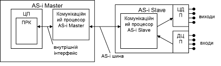

[Промислові мережі та інтеграційні технології в автоматизованих системах](README.md). 5.[ІНТЕРФЕЙС AS-i](5.md)

## 5.3. Принципи функціонування

AS-i інтерфейс – мережа з регламентованим методом доступу Ведучий/Ведений. Ведучий виконує наступні функції:

- ініціалізує систему;

- ідентифікує підключених Ведених;

- забезпечує цілісність нормального циклічного обміну даних;

- забезпечує параметризацію Ведених;

- виконує системну діагностику шини;

- забезпечує переконфігурування адрес Ведених при необхідності.

У режимі нормальної роботи системи Ведучий надсилає кадр з командою кожному Веденому в порядку їх адреси, в якому вказує значення 4-х дискретних виходів Веденого. Той відповідає на нього кадром-відповіддю, в якому надсилає інформацію про стан 4 дискретних входів. Знаючи номери (адреси) всіх присутніх Ведених на шині (до 31), він опитує їх всіх (якщо вони активовані), а потім починає цикл заново. Таким чином до одної шини AS-i можна підключити до 124(31*4) дискретних виходів та до 31\*4(124) дискретних входів одночасно. Оскільки бітова швидкість постійна, а відповідь Веденого не залежить від циклу роботи його програми, то час опитування всіх Ведених (час циклу AS-i) точно вираховується і не перевищує 5мс (для версії V2 - 10 мс).

На рис.5.6 показана спрощена схема обміну даними між Ведучим та Веденим. Комунікаційний процесор Ведучого шини автоматично (без прив’язки до циклу програми користувача) циклічно опитує всіх Ведених. Комунікаційний процесор Веденого займається відновленням вихідних буферів для ЦДП (цифро-дискретних перетворювачів), та відсилає дані з буферів ДЦП (дискретно-цифрових перетворювачів). Програма користувача (ПРК) Ведучого отримує та відсилає дані через буфер, використовуючи внутрішній інтерфейс. Така конструкція дозволяє організувати обмін на шині без участі роботи центрального процесора (ЦП), тобто розпаралелити роботу програми та шини, а також робить прозорою роботу Ведучого з даними Ведених. 

Рис.5.6. Обмін даними між Ведучим та Веденим на шині AS-i.

На рисунку 5.7 більш детально відображена внутрішня структура Ведучого та Веденого, зокрема вказані блоки даних (буфери) та їх типи. У кожного Веденого є буфер для відображення стану входів та виходів (дані процесу), який відображається у відповідному буфері Ведучого. При відправці команди на Ведений, Ведучий роміщує його вихідні дані в полі даних кадру. Ведений отримавши кадр, відновлює вихідні дані свого буферу і відправляє вхідні дані у кадрі-відповіді. Таким чином AS-i функціонує за моделлю Клієнт-Сервер обміну ідентифікованими даними (Polling). 

 

Рис.5.7. Таблиці даних (буфери) в пристроях AS-i.

Окрім буферів відображення входів/виходів (дані процесу) є також інші буфери, які коротко перерахуємо. Ведучий AS-i має наступні блоки даних: 

- образи даних, які можуть змінитися під час роботи:

  - дані Вх./Вих. (дані процесу);

  - поточні параметри – містять образ поточних параметрів AS-i Slave (параметричні дані); 

  - поточні конфігураційні дані – містять конфігурацію входів виходів і ідентифікаційні коди всіх підключених Ведених пристроїв, після їх зчитування з цих пристроїв (параметричні дані);

  - LDS (List of Detected Slaves) – список всіх знайдених Ведених пристроїв на шині;

  - LAS (List of Active Slaves) – список активованих Ведених пристроїв; обмін даними проводиться тільки з активованими Веденими;

- конфігураційні дані (параметричні дані), які вказуються користувачем при конфігурації Веденого в системі; ці дані необхідні для порівняння їх з образами реальних даних знайдених Ведених та їх конфігурації; вони як правило містяться в енергонезалежній пам’яті Ведучого: 

  - конфігураційні параметри

  - очікувані конфігураційні дані

  - LPS (List of Prospective Slaves) – список очікуваних Ведених на шині. В ньому знаходяться номери (адреси) тих Ведених, яких система очікує знайти на шині;

Ведений на шині має наступні буфери:

-  дані Вх./Вих.(дані процесу);

-  параметри (параметричні дані);

-  конфігураційні дані (параметричні дані) – конфігурація входів/виходів та ідентифікаційні коди даного Веденого („I/O Code” та „ID Code”;

-  адреса – адреса Веденого.

<-- 5.2. [Реалізація фізичного рівня](5_2.md) 

--> 5.4. [Етапи роботи шини AS-i](5_4.md) 