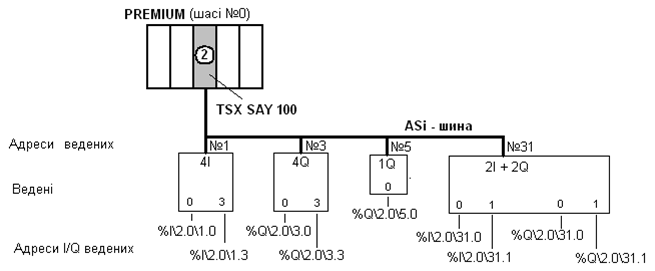

[Промислові мережі та інтеграційні технології в автоматизованих системах](README.md). 5.[ІНТЕРФЕЙС AS-i](5.md)

## 5.5. Формат кадру AS-i

Кадри в AS-i від Ведучого до Веденого мають фіксовану довжину незалежно від типу. Так само не змінюється формат відповіді (рис.5.8).  

 

Рис.5.8. Формат кадру в AS-i: команда від Ведучого – ліворуч; відповідь Веденого – праворуч

Як видно з рисунку, для адреси виділено 5 біт, що дозволяє адресувати 32 пристрої. Адреса 0 зарезервована для механізму автоматичної адресації (розглянуто нижче), тому для Ведених залишається 31 адреса. Системний біт використовується для ідентифікації типу кадру. Для передачі даних використовується 5 інформаційних бітів, у відповіді - 4.  

Для обміну даними процесу використовується формат команди Data Exchnge, який показаний на рис.5.9. 

 

Рис.5.9. Формат команди “Data Exchange”: команда від Ведучого – зліва; відповідь Веденого – з права

Як бачимо 4-ри біти даних призначені для відправки Ведучим вихідних даних, і чотири для отримання вхідних від Веденого. 5-й інформаційний біт (тобто 4-й починаючи з 0) при передачі не використовується і завжди дорівнює нулю. Таким чином, Ведучий може передати значення 4-х дискретних виходів, а Ведений відповісти, передаючи 4 значення дискретних входів, тобто одна шина AS-i може мати одночасно до 124 дискретних входів та 124 дискретних виходів. Можливе використання 4-х бітів даних для кодування аналогової інформації. Тобто з одним кадром можна передати 4-х розрядне число, або 16 (24) різних значень, що дозволяє підключати такі засоби ЛМІ, як цифрова клавіатура. Деякі профілі передбачають підключення аналогових датчиків(виконавчих механізмів) з більшою розрядністю, обслуговуючи їх за декілька шинних циклів.

Для більшості контролерів, як Ведучих шини AS-i, читання входів і оновлення виходів Ведених пристроїв виконується автоматично (неявно) на початку і в кінці кожного циклу задачі. Це може проходити через змінні образу процесу, аналогічно як для локальних входів і виходів.

Приклад 5.1. AS-i. Мережа на базі Ведучого TSX Premium.

Завдання. Наведіть приклад адресації Ведучого AS-i шини на базі TSX Premium для входів і виходів Ведених пристроїв, відповідно схеми мережі наведеної на рис. 5.10.

 

Рис.5.10.    Структура AS-i шини    

Рішення. З рис.5.10 видно, що у контролері TSX Premium в слоті 2, що знаходиться на шасі 0, встановлений модуль, який виступає у ролі Ведучого на AS-i шині (TSX SAY 100). До цієї шини підключені чотири Ведених, які сконфігуровані настпуним чином:

- ведений №1 для роботи з 4 дискретними входами;

- ведений №3 для роботи з 4 дискретними виходами;

- ведений №5 для роботи з 1 дискретним виходом;

- ведений №31 для роботи з 2 дискретними входами 2 дискретними виходами. 

 Відповідно з синтаксисом мови програмування для цього типу контролерів (рис. 5.11) адреси окремих каналів ведених наведені на рис. 5.10.

Рис.5.11. Синтаксис звертання до входів-виходів AS-i шини

Наведена адресація означає що:

- %I\2.0\1.3 – вхід 3 веденого №1, каналу 0 модуля TSX SAY 100, який розміщений у слоті № 2 шасі № 0;

- %Q\2.0\31.3 – вихід 0 веденого №31, каналу 0 модуля TSX SAY 100, який розміщений у слоті № 2 шасі № 0;

- і так далі.

<-- 5.4. [Етапи роботи шини AS-i](5_4.md) 

--> 5.6. [Швидкість відновлення даних](5_6.md) 